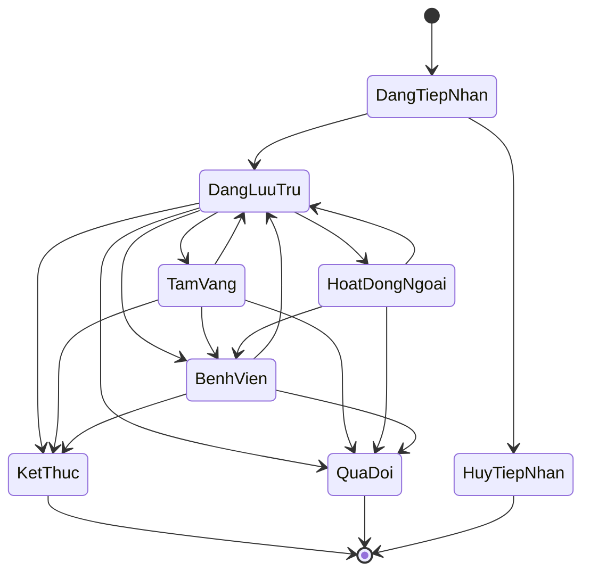
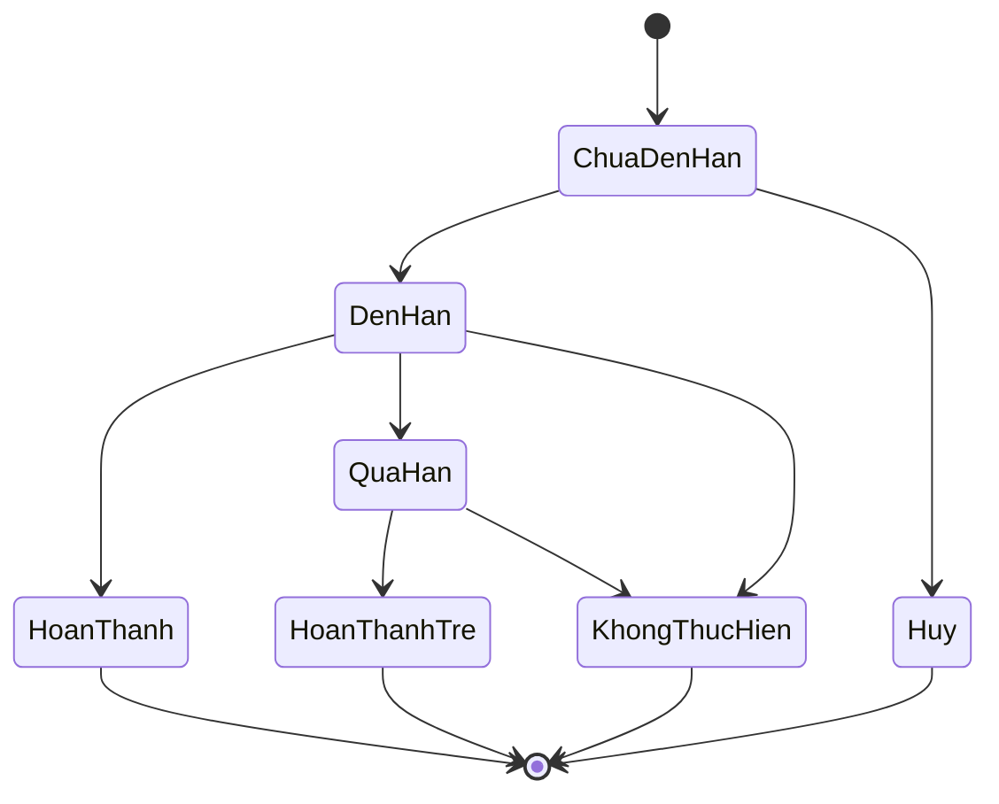
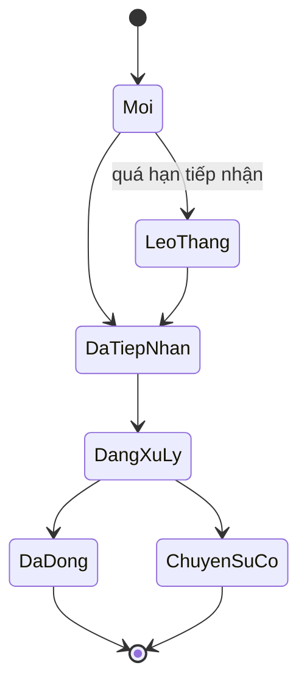
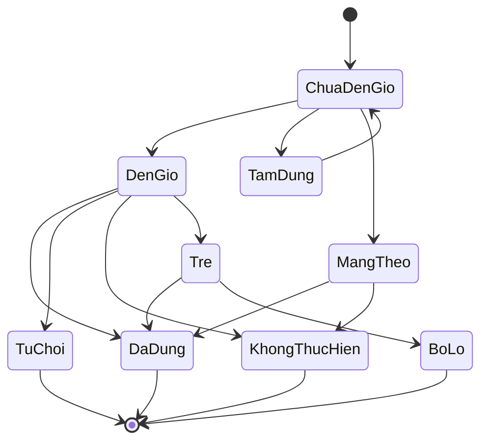
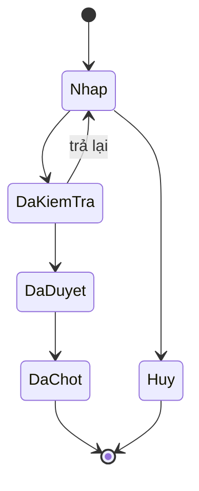
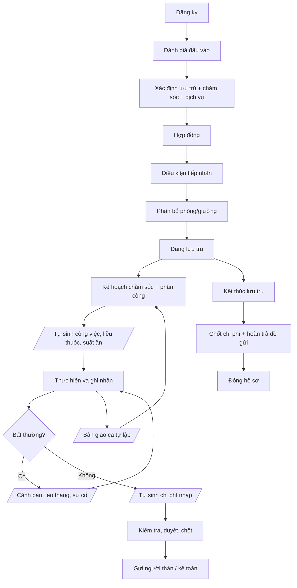

# Nghiệp vụ Hệ thống Quản lý Viện Dưỡng Lão

## 1. Mục tiêu và phạm vi hệ thống

### 1.1. Mục tiêu

Hệ thống hỗ trợ viện dưỡng lão quản lý tập trung toàn bộ quá trình: Tiếp nhận → Đánh giá → Lưu trú → Lập kế hoạch chăm sóc → Phân công → Chăm sóc hằng ngày → Theo dõi sức khỏe → Quản lý thuốc → Dinh dưỡng → Hoạt động → Xử lý sự cố → Ghi nhận chi phí → Tương tác với người thân → Kết thúc lưu trú.

Hệ thống tập trung vào hai nhóm nghiệp vụ chính:

- Quản lý vận hành cơ sở chăm sóc người cao tuổi.
- Quản lý quá trình chăm sóc và theo dõi người cao tuổi trong thời gian lưu trú.

### 1.2. Ranh giới hệ thống

Hệ thống không thay thế:

- hệ thống kế toán chuyên nghiệp;
- hệ thống quản lý kho tổng thể;
- hệ thống bệnh án điện tử chuyên sâu;
- hệ thống quản lý camera chuyên dụng;
- hệ thống quản lý nhân sự/payroll chuyên sâu.

Hệ thống chỉ quản lý những dữ liệu và nghiệp vụ cần thiết để phục vụ vận hành viện, chăm sóc người cao tuổi và truy xuất lịch sử.

### 1.3. Nguyên tắc nghiệp vụ

- Mọi thông tin quan trọng phải gắn với người cao tuổi, thời gian và người thực hiện.
- Mọi thay đổi quan trọng phải có lịch sử và người thực hiện.
- Thông tin y tế phải được quản lý theo phạm vi chuyên môn và quyền được cấp.
- Loại hình lưu trú và mức độ chăm sóc là hai thuộc tính độc lập.
- Trạng thái lưu trú không tự động quyết định cách tính phí; chi phí phải dựa trên hợp đồng và chính sách của cơ sở.
- Chi phí phát sinh phải truy xuất được về hoạt động/dịch vụ/vật phẩm tạo ra chi phí.
- Công việc chăm sóc phải có người thực hiện, thời gian thực hiện và kết quả khi nghiệp vụ yêu cầu.
- Công việc chưa hoàn thành và cảnh báo chưa xử lý phải được đưa vào bàn giao ca.
- Hệ thống phải hỗ trợ nhiều mô hình vận hành khác nhau thay vì hard-code theo một viện cụ thể.
- **(Bổ sung)** Hệ thống chủ động sinh công việc, lịch thuốc, suất ăn, cảnh báo và chi phí từ dữ liệu đã có; nhân viên chủ yếu xác nhận kết quả thay vì nhập lại thông tin.
- **(Bổ sung)** Bản ghi quan trọng đã xác nhận không sửa/xóa trực tiếp; mọi sai sót được xử lý bằng bản ghi đính chính hoặc khoản điều chỉnh có lý do.

### 1.4. Quy ước về quy tắc nghiệp vụ (bổ sung)

- Mỗi module có mục **Quy tắc nghiệp vụ** với mã `BR-Mxx-yy`, viết dạng "Khi… thì hệ thống…".
- Giá trị trong ngoặc vuông, ví dụ \[30 phút\], là **tham số cấu hình** có giá trị mặc định, không phải giá trị cố định của sản phẩm.
- Các quy tắc là cơ sở để viết acceptance criteria và test tự động cho từng module.

### 1.5. Phân loại dữ liệu và thao tác được phép (bổ sung)

Nguyên tắc: **dữ liệu danh mục được CRUD; dữ liệu nghiệp vụ thay đổi bằng lệnh có trạng thái; dữ liệu đã xác nhận chỉ ghi thêm.** Spec và API phải tuân theo bảng dưới đây; đối tượng thuộc nhóm 2 và 3 không có thao tác sửa/xóa trực tiếp.

| Nhóm                       | Ví dụ                                                                                                                                                          | Thao tác được phép                                                                                                                                                                     |
| -------------------------- | -------------------------------------------------------------------------------------------------------------------------------------------------------------- | -------------------------------------------------------------------------------------------------------------------------------------------------------------------------------------- |
| 1. Danh mục                | Dịch vụ, đơn giá, món ăn, phòng/giường, loại công việc, hồ sơ nhân viên, tham số cấu hình                                                                      | Tạo, sửa. Không xóa đối tượng đã được lịch sử tham chiếu, chỉ "Ngừng hiệu lực". Đơn giá thay đổi bằng phiên bản mới (6.4)                                                              |
| 2. Nghiệp vụ có trạng thái | Trạng thái người cao tuổi, hợp đồng, phân bổ giường, kế hoạch chăm sóc, đơn thuốc, chế độ ăn, dị ứng/bệnh nền, danh sách được phép đón, đồng ý chia sẻ dữ liệu | Chỉ thay đổi qua lệnh nghiệp vụ có điều kiện (ví dụ Chuyển giường, Ngừng đơn, Loại trừ dị ứng) hoặc tạo phiên bản mới có ngày hiệu lực; mọi lệnh lưu người thực hiện, thời điểm, lý do |
| 3. Ghi nhận đã xác nhận    | Kết quả công việc, liều thuốc, chỉ số, sự cố, bàn giao, bàn giao đồ gửi, chi phí đã chốt, thông báo đã gửi                                                     | Chỉ ghi thêm. Sai sót xử lý bằng bản ghi đính chính hoặc khoản điều chỉnh, bản gốc vẫn giữ nguyên                                                                                      |

**(Bổ sung, spec 000)** Quy tắc chung cho bảng trên:

- Mọi lệnh nghiệp vụ trên dữ liệu nhóm 2, mọi đính chính, từ chối, hủy và thay đổi tham số bắt buộc có lý do.
- Bản đính chính chỉ được tạo bởi: người đã ghi bản gốc; hoặc người phụ trách ca / trưởng tầng của phạm vi đó (với bản ghi gắn tầng/khu vực). Bản ghi không gắn tầng (chi phí đã chốt, bàn giao đồ gửi, bản ghi của hành chính) thì nhân viên cùng vai trò với người ghi gốc lập yêu cầu phê duyệt loại "Đính chính", chỉ có hiệu lực khi quản lý viện duyệt. Module có thể thu hẹp thêm.
- Bản ghi đính chính loại "Hủy ghi nhận" được dùng cho bản ghi ghi nhầm hoàn toàn; bản gốc vẫn giữ và xem lại được.

Phụ lục mục 25 tập hợp toàn bộ tham số cấu hình được dùng trong các quy tắc nghiệp vụ.

## 2. Quy mô và mô hình vận hành

### 2.1. Quy mô

Hệ thống được thiết kế cho cơ sở tối thiểu 100 người.

### 2.2. Cấu trúc cơ sở

Cấu trúc quản lý: Viện → Khu vực → Tòa nhà/Tầng → Phòng → Giường.

Một khu vực có thể:

- chứa nhiều phòng;
- có nhiều loại phòng;
- phục vụ nhiều mức độ chăm sóc;
- có nhiều nhóm nhân viên phụ trách.

### 2.3. Người dùng và vai trò

| Vai trò                    | Trách nhiệm chính                                                                                                                                           |
| -------------------------- | ----------------------------------------------------------------------------------------------------------------------------------------------------------- |
| Quản lý viện               | Quản lý vận hành, duyệt thay đổi lưu trú, duyệt chi phí, xem báo cáo, cấu hình nghiệp vụ                                                                    |
| Trưởng tầng/Điều phối tầng | Điều phối hoạt động, công việc, nhân viên và tình trạng người cao tuổi trong phạm vi tầng/khu vực                                                           |
| Bác sĩ                     | Đánh giá sức khỏe, khám, chẩn đoán/chỉ định trong phạm vi được phép, thiết lập ngưỡng cảnh báo                                                              |
| Điều dưỡng                 | Theo dõi sức khỏe, thực hiện y lệnh, quản lý việc dùng thuốc, xử lý cảnh báo, bàn giao ca                                                                   |
| Nhân viên chăm sóc         | Chăm sóc sinh hoạt, hỗ trợ ăn uống, vệ sinh, vận động, ghi nhận kết quả                                                                                     |
| Dinh dưỡng viên            | Quản lý nhu cầu dinh dưỡng, chế độ ăn, thực đơn                                                                                                             |
| Nhân viên bếp              | Chuẩn bị và phân phối suất ăn. **(Bổ sung)** Chuẩn bị, dán nhãn và giao suất ăn theo phiếu bữa ăn; xác nhận phát sinh                                       |
| Nhân viên vệ sinh          | Thực hiện vệ sinh phòng/khu vực. **(Bổ sung)** Thực hiện vệ sinh định kỳ, trả giường, khử khuẩn và đột xuất theo phòng/khu vực; ghi nhận kết quả và hư hỏng |
| Nhân viên hành chính       | Tiếp nhận, hợp đồng, người thân, đồ gửi, chi phí phát sinh                                                                                                  |
| Người thân                 | Xem thông tin được phép, đăng ký thăm, đón người cao tuổi, nhận thông báo, xem chi phí và gửi phản hồi                                                      |

### 2.4. Thuật ngữ vai trò và nhiệm vụ (bổ sung)

Vai trò hệ thống là các vai trò ở bảng 2.3, được gán cho tài khoản. Nhiệm vụ là trách nhiệm được gán cho một nhân viên trong một ca hoặc một hoạt động cụ thể; nhiệm vụ không tạo thêm vai trò hệ thống.

| Thuật ngữ            | Loại      | Định nghĩa                                                                                                                                                                                                                                                                                                                                                                                    |
| -------------------- | --------- | --------------------------------------------------------------------------------------------------------------------------------------------------------------------------------------------------------------------------------------------------------------------------------------------------------------------------------------------------------------------------------------------- |
| Người phụ trách ca   | Nhiệm vụ  | Nhân viên được chỉ định phụ trách một ca tại một tầng/khu vực (13.2), thường là trưởng tầng hoặc điều dưỡng. Nhận nhắc việc quá hạn, xác nhận bàn giao. **(Bổ sung, spec 002)** Là ngoại lệ của quy tắc "nhiệm vụ không tạo quyền": trong tầng/khu vực và thời gian của ca, được xử lý việc quá hạn, tạo bản đính chính cho bản ghi gắn tầng và mở khóa sớm tài khoản nhân viên đang khóa tạm. **(Bổ sung, spec 008)** Phải có vai trò Trưởng tầng hoặc Điều dưỡng và có tên trong ca; được ghi nhận vắng ca cho nhân viên trong ca mình phụ trách (Q-80); lập bàn giao cuối ca và tạm nhận cảnh báo, sự cố của ca trước khi bàn giao chưa được xác nhận (Q-78) |
| Bác sĩ trực          | Nhiệm vụ  | Bác sĩ được xếp ca trực tại thời điểm xảy ra sự việc; nhận thông báo khẩn cấp                                                                                                                                                                                                                                                                                                                 |
| Điều dưỡng phụ trách | Nhiệm vụ  | Điều dưỡng được phân công cho người cao tuổi trong ca hiện tại                                                                                                                                                                                                                                                                                                                                |
| Trưởng đoàn          | Nhiệm vụ  | Nhân viên được chỉ định dẫn một chuyến hoạt động ngoài viện (8.9)                                                                                                                                                                                                                                                                                                                             |
| Người đại diện       | Quan hệ   | Người thân có quyền ký hợp đồng, đồng ý chia sẻ dữ liệu và yêu cầu thay đổi dịch vụ                                                                                                                                                                                                                                                                                                           |
| Người liên hệ chính  | Quan hệ   | Người thân nhận thông báo đầu tiên, đặc biệt là thông báo khẩn cấp; mỗi người cao tuổi có đúng một người                                                                                                                                                                                                                                                                                      |
| Lệnh nghiệp vụ       | Khái niệm | Thao tác làm thay đổi trạng thái theo quy tắc (ví dụ Cho tạm vắng), thay cho sửa dữ liệu trực tiếp                                                                                                                                                                                                                                                                                            |
| Đính chính           | Khái niệm | Bản ghi mới sửa sai cho một bản ghi đã xác nhận; bản gốc giữ nguyên                                                                                                                                                                                                                                                                                                                           |
| Phiên bản            | Khái niệm | Một lần thay đổi của dữ liệu có ngày hiệu lực (hợp đồng, kế hoạch, đơn giá, ngưỡng)                                                                                                                                                                                                                                                                                                           |
| Cờ nguy cơ           | Khái niệm | Nhãn ngã / loét / đi lạc gắn cho người cao tuổi từ kết quả đánh giá (5.3)                                                                                                                                                                                                                                                                                                                     |
| BR-Mxx-yy            | Mã        | Quy tắc nghiệp vụ của module xx                                                                                                                                                                                                                                                                                                                                                               |
| CFG-Mxx-yy           | Mã        | Tham số cấu hình (Phụ lục 25)                                                                                                                                                                                                                                                                                                                                                                 |

Quyền **Duyệt kế hoạch chăm sóc** là một quyền trong phân quyền (19.2), mặc định gán cho bác sĩ; cơ sở có thể gán thêm cho điều dưỡng có đủ chuyên môn.

## 3. Loại hình lưu trú

### 3.1. Nội trú dài hạn

- Có hợp đồng dài hạn.
- Có chỗ ở/giường theo chính sách.
- Có dịch vụ đăng ký.
- Có kế hoạch chăm sóc dài hạn.
- Có chính sách giữ giường khi tạm vắng theo hợp đồng.

### 3.2. Nội trú ngắn ngày

- Có ngày bắt đầu.
- Có ngày kết thúc.
- Không tự động gia hạn.
- Có kế hoạch chăm sóc trong thời gian lưu trú.
- Việc giữ giường khi vắng được xác định theo hợp đồng/chính sách.

### 3.3. Bán trú

- Có lịch đến và về trong ngày.
- Điểm danh khi đến và khi về.
- Chỉ phát sinh công việc trong khoảng thời gian người cao tuổi có mặt.
- Không nhất thiết có giường cố định.
- Chi phí có thể tính theo buổi/ngày/dịch vụ tùy hợp đồng.

### 3.4. Trạng thái có mặt theo ngày của bán trú (bổ sung)

Trạng thái "Đang lưu trú" không cho biết người bán trú hôm nay có ở viện hay không, nên mỗi ngày có lịch đến, người bán trú có thêm một trạng thái có mặt:

| Trạng thái có mặt | Ý nghĩa                                                            |
| ----------------- | ------------------------------------------------------------------ |
| Chưa đến          | Có lịch đến hôm nay, chưa điểm danh đến                            |
| Có mặt            | Đã điểm danh đến, chưa điểm danh về                                |
| Đã về             | Đã điểm danh về (qua quy trình đón tại 14.3)                       |
| Vắng có báo       | Gia đình báo vắng trước thời hạn \[24 giờ\]                        |
| Vắng không báo    | Quá giờ đến dự kiến \[2 giờ\] mà chưa điểm danh, không có báo vắng |

Trạng thái có mặt là căn cứ để sinh công việc (BR-M04-02), chốt suất ăn (BR-M08-01) và tính phí buổi (BR-M11-01).

## 4. Mức độ chăm sóc

Mức độ chăm sóc được quản lý độc lập với loại hình lưu trú. Các mức có thể gồm:

- Chăm sóc cơ bản.
- Chăm sóc thường xuyên.
- Chăm sóc đặc biệt.
- Hỗ trợ vận động.
- Theo dõi sức khỏe thường xuyên.
- Phục hồi sau tai biến.
- Phục hồi chức năng khác.

Ví dụ: Nội trú dài hạn + Chăm sóc đặc biệt; Nội trú ngắn ngày + Phục hồi sau tai biến; Bán trú + Hỗ trợ vận động.

Mức độ chăm sóc được xác định từ quá trình đánh giá và có thể thay đổi khi tình trạng người cao tuổi thay đổi.

**(Bổ sung)** Mỗi mức chăm sóc có một **trọng số chăm sóc** (cấu hình, ví dụ cơ bản = 1, đặc biệt = 2,5). Trọng số được dùng để tính tỷ lệ phục vụ khi lập ca (BR-M09-02). **(Làm rõ, spec 003)** Việc kiểm tra loại phòng phù hợp (BR-M03-01) dùng danh sách mức chăm sóc được phép của phòng (7.1), không dùng trọng số.

## 5. Module 01 – Hồ sơ và đánh giá người cao tuổi

### 5.1. Hồ sơ cá nhân

Quản lý: họ tên; ngày sinh; giới tính; CCCD/giấy tờ định danh; ảnh; địa chỉ; thông tin liên hệ; thông tin đặc biệt. Thông tin người thân được quản lý tại Module 10.

**(Bổ sung) Đồng ý xử lý và chia sẻ dữ liệu.** Khi tiếp nhận, hệ thống ghi nhận bản đồng ý gồm: người đồng ý (người cao tuổi, hoặc người đại diện hợp pháp khi người cao tuổi không đủ khả năng); phạm vi (chia sẻ thông tin sức khỏe cho những người thân nào, sử dụng hình ảnh, nhận thông báo); thời điểm; bằng chứng (bản ký được scan); trạng thái Hiệu lực / Đã rút lại. Căn cứ: quy định bảo vệ dữ liệu cá nhân hiện hành (Nghị định 13/2023/NĐ-CP và các văn bản thay thế, cần đối chiếu bản mới nhất khi triển khai).

**(Bổ sung, spec 001)** Chưa có bản đồng ý Hiệu lực không chặn việc tiếp nhận; hệ thống cảnh báo khi Hoàn tất tiếp nhận và nhắc hành chính mỗi \[1 ngày\] (CFG-M01-06) tới khi có bản đồng ý. Người đồng ý được rút lại đồng ý cả khi hồ sơ đã ở trạng thái cuối (BR-M01-05).

**(Bổ sung, Q-12)** Người từng lưu trú (Kết thúc lưu trú hoặc Hủy tiếp nhận) đăng ký lại thì hệ thống tạo **hồ sơ mới** liên kết với hồ sơ cũ; hồ sơ cũ giữ nguyên chỉ đọc; hồ sơ mới không kế thừa tự động trạng thái, bản đồng ý, đánh giá hay cờ nguy cơ. CCCD chỉ phải duy nhất trong các hồ sơ chưa ở trạng thái cuối.

### 5.2. Hồ sơ sức khỏe ban đầu

Quản lý: bệnh nền; tiền sử bệnh; dị ứng; nhóm máu nếu có; khả năng vận động; khả năng tự chăm sóc; khả năng nhận thức; nhu cầu chăm sóc; nhu cầu dinh dưỡng; thuốc đang sử dụng khi tiếp nhận; nhu cầu phục hồi chức năng; thông tin chăm sóc cuối đời nếu có. Thông tin thuốc được sử dụng trong thời gian lưu trú được quản lý tại Module 07.

**(Bổ sung)** Dị ứng, bệnh nền và tiền sử bệnh được lưu thành **từng mục riêng**, không phải một trường văn bản. Mỗi mục có: nội dung; mức độ (với dị ứng); nguồn thông tin; người ghi nhận; ngày ghi nhận; trạng thái Hiệu lực / Đã loại trừ; lý do loại trừ. Mục đã ghi không bị xóa hay sửa nội dung, chỉ được loại trừ (BR-M01-07).

### 5.3. Đánh giá đầu vào

Khi tiếp nhận, bác sĩ thực hiện đánh giá với sự hỗ trợ của điều dưỡng khi cần. Đánh giá nhằm xác định: mức độ chăm sóc + nhu cầu dịch vụ + nhu cầu chăm sóc, và đề xuất loại hình lưu trú phù hợp. Loại hình lưu trú chính thức do gia đình lựa chọn và được xác định trong hợp đồng (6.3).

Kết quả đánh giá: được ghi nhận; có người thực hiện; có thời gian; có kết quả/phân loại; được lưu lịch sử; được sử dụng làm cơ sở lập kế hoạch chăm sóc.

**(Bổ sung)** Đánh giá dùng các thang điểm chuẩn, cấu hình được. Khuyến nghị: Barthel (khả năng tự chăm sóc), MMSE (nhận thức), Morse (nguy cơ ngã), Braden (nguy cơ loét tì đè). Điểm số được dùng để đề xuất mức chăm sóc và sinh sẵn hoạt động chăm sóc tương ứng.

**(Bổ sung) Quy đổi kết quả đánh giá.** Hệ thống tự tính tổng điểm từng thang và áp bảng quy đổi (cấu hình) để đề xuất mức chăm sóc, cờ nguy cơ và hoạt động chăm sóc mẫu. Ngưỡng dưới đây là giá trị tham chiếu phổ biến; cơ sở điều chỉnh được, và bác sĩ là người quyết định cuối cùng.

| Thang   | Kết quả                        | Hệ thống đề xuất                                                                    |
| ------- | ------------------------------ | ----------------------------------------------------------------------------------- |
| Barthel | 0–20 (phụ thuộc hoàn toàn)     | Mức chăm sóc đặc biệt; hỗ trợ toàn bộ vệ sinh, ăn uống, di chuyển                   |
| Barthel | 21–60 (phụ thuộc nặng)         | Mức chăm sóc thường xuyên trở lên                                                   |
| Barthel | 61–100                         | Chăm sóc cơ bản; hỗ trợ theo nhu cầu cụ thể                                         |
| Braden  | ≤ 12 (nguy cơ loét cao)        | Cờ nguy cơ loét; hoạt động "xoay trở 2 giờ/lần" và "kiểm tra da mỗi ca"             |
| Morse   | ≥ 45 (nguy cơ ngã cao)         | Cờ nguy cơ ngã; hoạt động "hỗ trợ khi di chuyển" và "kiểm tra an toàn phòng mỗi ca" |
| MMSE    | ≤ 17 (suy giảm nhận thức nặng) | Cờ nguy cơ đi lạc; bắt buộc người đi kèm khi rời khu vực                            |

### 5.4. Đánh giá lại

Đánh giá lại: theo định kỳ; sau sự cố; sau khi điều trị tại bệnh viện; khi tình trạng thay đổi đáng kể; khi có yêu cầu chuyên môn.

Nếu kết quả đánh giá làm thay đổi mức độ chăm sóc thì phải cập nhật kế hoạch chăm sóc và xem xét thay đổi lưu trú/dịch vụ nếu cần.

### 5.5. Trạng thái người cao tuổi (đã chỉnh sửa)

| Trạng thái             | Có thể chuyển sang                                                                   |
| ---------------------- | ------------------------------------------------------------------------------------ |
| Đang tiếp nhận         | Đang lưu trú / Hủy tiếp nhận                                                         |
| Đang lưu trú           | Tạm vắng / Hoạt động bên ngoài / Điều trị tại bệnh viện / Kết thúc lưu trú / Qua đời |
| Tạm vắng               | Đang lưu trú / Điều trị tại bệnh viện / Kết thúc lưu trú / Qua đời                   |
| Hoạt động bên ngoài    | Đang lưu trú / Điều trị tại bệnh viện / Qua đời                                      |
| Điều trị tại bệnh viện | Đang lưu trú / Kết thúc lưu trú / Qua đời                                            |
| Kết thúc lưu trú       | Trạng thái cuối                                                                      |
| Qua đời                | Trạng thái cuối                                                                      |
| Hủy tiếp nhận          | Trạng thái cuối                                                                      |

Thay đổi so với bản trước:

- Bỏ "Hoạt động bên ngoài → Sự cố", vì sự cố không phải trạng thái. Khi người cao tuổi không trở về đúng kế hoạch, trạng thái giữ nguyên và hệ thống tạo sự cố khẩn cấp (BR-M04-17); trạng thái sau đó chuyển theo kết quả xử lý.
- Thêm "Tạm vắng → Qua đời" (trường hợp mất tại nhà) và "Hoạt động bên ngoài → Điều trị tại bệnh viện / Qua đời".
- Điều trị tại bệnh viện là trạng thái riêng, không phải một lý do tạm vắng (xem 6.7).



Sơ đồ trên thể hiện cùng bảng chuyển trạng thái; hồ sơ ở trạng thái cuối chuyển sang chỉ đọc nhưng vẫn tra cứu được.

### 5.6. Điều kiện và tác động khi chuyển trạng thái (bổ sung)

| Chuyển                                | Điều kiện (chặn nếu không đạt)                                                                                                                                                                                                                     | Hệ thống tự động                                                                                                                                                                   |
| ------------------------------------- | -------------------------------------------------------------------------------------------------------------------------------------------------------------------------------------------------------------------------------------------------- | ---------------------------------------------------------------------------------------------------------------------------------------------------------------------------------- |
| Đang tiếp nhận → Đang lưu trú         | Đánh giá đầu vào hoàn tất và lần đánh giá gần nhất chưa quá \[90 ngày\] (CFG-M01-02); hợp đồng có hiệu lực và thời điểm tiếp nhận không sớm hơn ngày bắt đầu hợp đồng (Q-22); đặt cọc đạt (6.5); nội trú đã có giường. Bản đồng ý không chặn (5.1) | Sinh lịch cá nhân, lịch thuốc, suất ăn từ ngày hiệu lực                                                                                                                            |
| Đang lưu trú → Tạm vắng               | Người đón thuộc danh sách được phép đón (14.3)                                                                                                                                                                                                     | Hủy công việc và suất ăn trong thời gian vắng; liều thuốc chuyển "Mang theo" hoặc "Tạm dừng"; giường chuyển Giữ chỗ hoặc Trống theo chính sách; áp chính sách phí vắng (BR-M02-06) |
| Đang lưu trú → Hoạt động bên ngoài    | Điểm danh rời viện của chuyến đi (8.9)                                                                                                                                                                                                             | Tạm dừng công việc trong khoảng thời gian đi; liều thuốc chuyển "Mang theo"                                                                                                        |
| → Điều trị tại bệnh viện              | Có sự cố hoặc chỉ định chuyển viện                                                                                                                                                                                                                 | Như Tạm vắng; thông báo người liên hệ chính                                                                                                                                        |
| Điều trị tại bệnh viện → Đang lưu trú | —                                                                                                                                                                                                                                                  | Tạm dừng toàn bộ lịch thuốc cũ; tạo yêu cầu đối chiếu thuốc (BR-M07-09) và yêu cầu đánh giá lại (BR-M01-02)                                                                        |
| → Kết thúc lưu trú                    | Không còn đồ gửi/thuốc gửi đang giữ; chi phí kỳ cuối đã chốt theo trình tự 6.8 (Q-21); không còn cảnh báo/sự cố mở — trừ khi quản lý duyệt ngoại lệ; đã bàn giao người cao tuổi                                                                    | Hủy mọi lịch tương lai; giải phóng giường; khóa tài khoản người thân sau \[30 ngày\]                                                                                               |
| → Qua đời                             | Có người xác nhận: bác sĩ khi mất tại viện; khi mất ngoài viện, bác sĩ hoặc hành chính kèm giấy tờ bằng chứng                                                                                                                                      | Như Kết thúc lưu trú; thông báo người liên hệ chính; hồ sơ chỉ đọc                                                                                                                 |
| Đang tiếp nhận → Hủy tiếp nhận        | Có lý do                                                                                                                                                                                                                                           | Hủy giữ chỗ giường nếu có; đóng hồ sơ chờ liên quan                                                                                                                                |

### 5.7. Quy tắc nghiệp vụ Module 01 (bổ sung)

- **BR-M01-01:** Tạm vắng quá thời gian dự kiến trở lại \[2 giờ\] mà chưa điểm danh về thì hệ thống cảnh báo trưởng tầng và hành chính.
- **BR-M01-02:** Hệ thống tự tạo yêu cầu đánh giá lại khi: đến hạn định kỳ \[90 ngày\]; sau sự cố ngã hoặc sự cố mức trung bình trở lên; khi trở về từ bệnh viện. Mỗi yêu cầu có hạn hoàn thành \[48 giờ\]; quá hạn thì cảnh báo bác sĩ.
- **BR-M01-03:** Nếu kết quả đánh giá lại ra mức chăm sóc khác mức hiện tại, hệ thống tạo yêu cầu thay đổi lưu trú (6.6) ở trạng thái Chờ duyệt. Kế hoạch chăm sóc cũ vẫn áp dụng đến ngày hiệu lực của thay đổi. **(Bổ sung)** Nếu đang có yêu cầu đổi mức chăm sóc chưa áp dụng, yêu cầu cũ chuyển "Được thay thế" (6.6). Nếu phòng hiện tại không cho phép mức mới, việc duyệt và áp dụng không bị chặn; hệ thống cảnh báo trên yêu cầu và nhắc trưởng tầng, hành chính chuyển giường mỗi \[1 ngày\] (CFG-M03-02) tới khi xong (Q-19).
- **BR-M01-04:** Hệ thống chỉ cho phép các chuyển trạng thái có trong bảng 5.5; mọi chuyển trạng thái được ghi lịch sử kèm người thực hiện, thời điểm và lý do.
- **BR-M01-05:** Hồ sơ ở trạng thái cuối chỉ được xem; mọi thao tác thay đổi bị chặn. **(Bổ sung, spec 001, 004)** Ngoại lệ: (1) "Rút lại đồng ý" do hành chính thực hiện, có lý do và bằng chứng — quyền của chủ thể dữ liệu; (2) đính chính bản ghi đã xác nhận, chỉ có hiệu lực khi quản lý viện duyệt; (3) hoàn thành danh sách việc sau qua đời và các việc kết thúc trên đối tượng của module khác (đồ gửi, thuốc gửi, chi phí, sự cố); (4) thao tác tự động của hệ thống về lưu giữ và khóa tài khoản người thân.

* **BR-M01-06:** Không có thao tác "sửa trạng thái". Mỗi chuyển trạng thái là một lệnh nghiệp vụ riêng: Hoàn tất tiếp nhận, Hủy tiếp nhận, Cho tạm vắng, Ghi nhận trở về, Chuyển viện, Kết thúc lưu trú, Ghi nhận qua đời; mỗi lệnh kiểm tra điều kiện ở 5.6. **(Bổ sung, spec 001)** Hai chuyển "Đang lưu trú → Hoạt động bên ngoài" và "Hoạt động bên ngoài → Đang lưu trú" do hệ thống thực hiện khi trưởng đoàn điểm danh rời viện và điểm danh về của chuyến đi (8.9). Cho tạm vắng và Ghi nhận trở về do hành chính hoặc trưởng tầng thực hiện trực tiếp, không qua duyệt.
* **BR-M01-07:** Dị ứng và bệnh nền không được xóa; chỉ bác sĩ hoặc điều dưỡng được chuyển một mục sang Đã loại trừ, bắt buộc có lý do. Khi thêm dị ứng mới, hệ thống kiểm tra lại toàn bộ đơn thuốc đang hiệu lực (BR-M07-06) và chế độ ăn, thực đơn đang phân bổ (BR-M08-02), tạo cảnh báo nếu có xung đột.
* **BR-M01-08:** Người thân chỉ xem được thông tin sức khỏe khi có bản đồng ý còn hiệu lực bao gồm người đó. Khi đồng ý bị rút lại, quyền xem sức khỏe tương ứng ở cổng người thân tự động bị tắt (liên kết 14.1).

- **BR-M01-09:** Kết quả quy đổi chỉ là đề xuất. Bác sĩ chấp nhận hoặc điều chỉnh (bắt buộc lý do khi khác đề xuất). Khi chấp nhận, các hoạt động mẫu được chép vào bản nháp phiên bản kế hoạch chăm sóc mới (8.1). **(Bổ sung, Q-13)** Với cờ nguy cơ, bác sĩ không được bỏ cờ đề xuất, chỉ được gắn thêm cờ không có trong đề xuất (bắt buộc lý do).
- **BR-M01-10:** Cờ nguy cơ (ngã, loét, đi lạc) hiển thị trên thẻ người cao tuổi trong checklist và trên thẻ thông tin khẩn cấp (9.5). Cờ chỉ được gỡ qua một lần đánh giá lại cho kết quả không còn nguy cơ.

## 6. Module 02 – Tiếp nhận và lưu trú

### 6.1. Đăng ký tiếp nhận

Quy trình: Đăng ký → Thu thập thông tin → Đánh giá → Xác định lưu trú → Xác định chăm sóc → Xác định dịch vụ → Kiểm tra điều kiện → Tiếp nhận.

### 6.2. Danh sách chờ

Khi chưa thể tiếp nhận: tạo hồ sơ chờ; ghi ngày đăng ký; nhu cầu; loại lưu trú; mức chăm sóc; mức ưu tiên; trạng thái.

Khi có khả năng tiếp nhận, hệ thống hỗ trợ tìm người phù hợp dựa trên: mức ưu tiên; ngày đăng ký; loại lưu trú; mức chăm sóc; điều kiện phòng/giường.

**(Bổ sung)** Trạng thái hồ sơ chờ: Đang chờ → Đã liên hệ (đang giữ chỗ tạm) → Đã tiếp nhận / Từ chối / Hết hạn giữ chỗ (quay lại Đang chờ) / Hủy chờ.

**(Làm rõ, spec 004, Q-29)**

- Gia đình từ chối giường được đề xuất nhưng vẫn muốn chờ: hồ sơ quay lại Đang chờ, giữ nguyên ngày đăng ký và điểm; giường được đề xuất cho người tiếp theo.
- **Từ chối** (gia đình không tiếp tục chờ) và **Hủy chờ** là trạng thái cuối, và kéo theo Hủy tiếp nhận hồ sơ người cao tuổi với cùng lý do, trong cùng một lần thực hiện.
- Hồ sơ chờ chuyển **Đã tiếp nhận** khi người đó được phân bổ giường, không đợi Hoàn tất tiếp nhận.
- Mỗi hồ sơ chờ giữ tối đa một giường tại một thời điểm; chọn người không nằm trong danh sách đề xuất thì bắt buộc lý do.

**(Bổ sung) Điểm ưu tiên.** Mức ưu tiên được hệ thống tính thành điểm thay vì nhập tay: điểm = điểm theo mức độ cần chăm sóc + điểm thời gian chờ (mỗi \[7 ngày\] +1) + điểm tình huống đặc biệt (từng lưu trú tại viện, sống một mình, vừa ra viện…) theo bảng cấu hình. Hành chính có thể cộng/trừ điểm thủ công, bắt buộc có lý do và được quản lý duyệt.

### 6.3. Hợp đồng lưu trú

Hợp đồng xác định: loại lưu trú; thời hạn; mức chăm sóc; dịch vụ; phòng/giường nếu có; người đại diện; chính sách chi phí; điều kiện đặt cọc; chính sách giữ giường; chính sách khi tạm vắng; điều kiện chấm dứt.

**(Bổ sung)** Trạng thái hợp đồng: Nháp → Chờ ký → Hiệu lực → Kết thúc / Chấm dứt. Hợp đồng chỉ sửa được ở trạng thái Nháp. Từ khi Hiệu lực, hợp đồng bị khóa; mọi thay đổi đi qua yêu cầu thay đổi (6.6) và trở thành phụ lục gắn với hợp đồng gốc, có ngày hiệu lực riêng.

**(Bổ sung, spec 004)** Vòng đời hợp đồng được làm rõ:

- Chờ ký có thể **Trả về nháp** (có lý do) để sửa. Hợp đồng Nháp hoặc Chờ ký có thể chuyển **Đã hủy** (có lý do; tự động khi người cao tuổi Hủy tiếp nhận).
- **Ghi nhận đã ký** bắt buộc ngày ký, người đại diện đã ký và bản scan. Với nội trú, chỉ ghi nhận đã ký được khi người cao tuổi đã có phân bổ giường (kể cả phân bổ trước cho ngày vào) bắt đầu không muộn hơn ngày bắt đầu hợp đồng (Q-28).
- **Kết thúc**: lưu trú kết thúc tại hoặc sau ngày kết thúc hợp đồng. **Chấm dứt**: lưu trú kết thúc trước hạn, người cao tuổi qua đời, hoặc Hủy tiếp nhận sau khi hợp đồng đã Hiệu lực; lưu lý do chấm dứt.
- **Điều khoản khác chuẩn** (giá khác phiên bản đơn giá hiện hành, hoặc dòng ghi đè chính sách phí vắng/giữ giường) phải được quản lý viện duyệt trước khi gửi ký; hợp đồng khớp chuẩn gửi ký trực tiếp (Q-23).
- **Đơn giá**: khi Hiệu lực, hợp đồng ghi lại đơn giá của mọi khoản trong hợp đồng; bảng giá mới chỉ áp cho hợp đồng ký sau đó; muốn đổi giá cho hợp đồng đang hiệu lực phải lập phụ lục (Q-25).
- **Mốc tính phí**: phí lưu trú nội trú tính từ ngày bắt đầu hợp đồng, kể cả khi người cao tuổi vào ở muộn hơn; không được tiếp nhận sớm hơn ngày bắt đầu hợp đồng, muốn vào sớm phải có phụ lục đổi ngày (Q-22). Nếu Hủy tiếp nhận sau ngày bắt đầu hợp đồng, phí tới hết ngày hủy được giữ; miễn giảm chỉ qua khoản điều chỉnh có duyệt (Q-27).
- Gia hạn hợp đồng (dài hạn hoặc ngắn ngày) được thực hiện bằng yêu cầu thay đổi thời gian thành phụ lục.

### 6.4. Dịch vụ và đơn giá

Dịch vụ có thể gồm: chăm sóc; phục hồi; hoạt động; đưa đi khám; tiêm; dịch vụ khác.

Mỗi dịch vụ có: tên; đơn vị tính; đơn giá; ngày hiệu lực; trạng thái. Khi thay đổi giá phải tạo phiên bản đơn giá mới, không sửa lịch sử đã áp dụng.

### 6.5. Đặt cọc

Hệ thống không thực hiện nghiệp vụ thu tiền. Hệ thống chỉ ghi nhận: khoản cần đặt cọc; trạng thái đã/chưa đáp ứng; thời điểm xác nhận; người xác nhận; nguồn xác nhận.

Việc chuyển sang trạng thái lưu trú chính thức phải tuân theo điều kiện của cơ sở/hợp đồng (xem 5.6).

### 6.6. Thay đổi lưu trú

Có thể thay đổi: loại lưu trú; mức chăm sóc; dịch vụ; thời gian; phòng/giường. Thay đổi ảnh hưởng đến chi phí hoặc loại lưu trú cần cấp có thẩm quyền phê duyệt.

Mọi thay đổi phải lưu: giá trị trước; giá trị sau; người yêu cầu; người duyệt; thời điểm; ngày hiệu lực; lý do.

**(Bổ sung)** Trạng thái yêu cầu thay đổi: Nháp → Chờ duyệt → Đã duyệt (chờ hiệu lực) → Đã áp dụng / Từ chối / Hủy.

**(Bổ sung, spec 000, 001, 004)** Vòng đời trên là vòng đời chung cho mọi yêu cầu phê duyệt của hệ thống, thêm các quy tắc:

- Thêm hai trạng thái kết thúc: **Áp dụng không thành** khi tới ngày hiệu lực mà điều kiện áp dụng không còn thỏa (không tạo tác động, báo người duyệt và người yêu cầu – Q-11); **Được thay thế** khi một đánh giá lại mới thay cho yêu cầu đổi mức chăm sóc chưa áp dụng.
- Người lập yêu cầu có quyền duyệt loại yêu cầu đó được tự duyệt, bắt buộc lý do, nhật ký đánh dấu "tự duyệt" (Q-10).
- Yêu cầu Chờ duyệt quá \[48 giờ\] (CFG-M15-05) thì nhắc người duyệt; quá \[96 giờ\] (CFG-M15-06) thì báo quản lý viện; không tự hủy.
- Yêu cầu duyệt muộn hơn ngày hiệu lực mong muốn thì tác động tính từ ngày duyệt; không tính lùi. Bộ lập lịch lỡ ngày hiệu lực thì áp dụng bù ở lần chạy kế tiếp.
- **Mọi** thay đổi lưu trú đều phải được quản lý viện duyệt, không chỉ thay đổi ảnh hưởng chi phí hoặc loại lưu trú, vì mọi phụ lục phải gắn với một yêu cầu đã duyệt (DBR-07). Chuyển giường trực tiếp theo 7.4 không phải là thay đổi lưu trú. Người đại diện gửi yêu cầu qua cổng người thân thì yêu cầu được tạo ở Nháp để hành chính hoàn thiện.

### 6.7. Tạm vắng

Các trường hợp: về nhà; đi chơi với gia đình; đi khám trong ngày; lý do khác. Điều trị tại bệnh viện là trạng thái riêng (5.5) nhưng dùng chung cơ chế chính sách phí vắng dưới đây.

Hệ thống ghi nhận: thời gian rời viện; thời gian dự kiến trở lại; lý do; người đón; người bàn giao; tình trạng giường; chính sách tính phí áp dụng.

Tạm vắng không mặc định đồng nghĩa với miễn phí. Cách tính phí dựa trên: loại hình lưu trú + loại vắng mặt + hợp đồng + chính sách cơ sở.

**(Bổ sung) Bảng chính sách phí khi vắng** là cấu hình của cơ sở và có thể được ghi đè theo từng hợp đồng. Ví dụ tham chiếu:

| Loại lưu trú      | Loại vắng                    | Từ ngày thứ | Hệ số phí lưu trú  | Giữ giường         |
| ----------------- | ---------------------------- | ----------- | ------------------ | ------------------ |
| Nội trú dài hạn   | Về nhà, đi chơi              | 1           | 100%               | Có                 |
| Nội trú dài hạn   | Bệnh viện                    | 1–7         | 100%               | Có                 |
| Nội trú dài hạn   | Bệnh viện                    | 8–30        | 70%                | Có                 |
| Nội trú dài hạn   | Bệnh viện                    | từ 31       | Quản lý quyết định | Quản lý quyết định |
| Nội trú ngắn ngày | Mọi loại                     | 1           | Theo hợp đồng      | Theo hợp đồng      |
| Bán trú           | Vắng có báo trước \[24 giờ\] | —           | 0%                 | —                  |
| Bán trú           | Vắng không báo               | —           | 50%                | —                  |

**(Bổ sung, spec 004)** Quy tắc tra bảng:

- Ngày vắng là mỗi ngày dương lịch có một phần thời gian vắng; ngày rời viện là ngày vắng thứ nhất, ngày trở về cũng tính là ngày vắng.
- Loại vắng không có dòng trong bảng (ví dụ "Đi khám trong ngày", "Lý do khác" với nội trú dài hạn): áp 100% và giữ giường, đánh dấu để quản lý viện bổ sung bảng.
- Dòng "Theo hợp đồng" lấy từ dòng ghi đè của hợp đồng; hợp đồng không có dòng tương ứng thì áp như dòng thiếu.
- **Ngưỡng giữ giường** là ngày vắng đầu tiên mà dòng áp dụng ghi giữ giường "Không" hoặc "Quản lý quyết định" trong khi giường đang được giữ.
- Người đang Tạm vắng chuyển sang Điều trị tại bệnh viện: lượt vắng cũ đóng, lượt vắng loại "Bệnh viện" mở và đếm lại từ ngày 1; giường giữ liên tục (Q-24).
- Bảng thay đổi thì áp cho các ngày vắng tính từ thời điểm thay đổi; các ngày đã tính giữ nguyên.

### 6.8. Kết thúc lưu trú

Các trường hợp: hết hợp đồng; xuất viện; chuyển cơ sở; chấm dứt hợp đồng; qua đời.

Trước khi hoàn tất: chốt chi phí; hoàn trả đồ gửi; hoàn trả thuốc gia đình gửi; xử lý hợp đồng; bàn giao người cao tuổi; giải phóng giường nếu có. Các điều kiện này được hệ thống kiểm tra tự động (5.6).

Trường hợp qua đời, ghi nhận: thời điểm; địa điểm; người phát hiện; người xác nhận; thông tin nguyên nhân nếu được xác định; thông báo người liên hệ chính; xử lý đồ gửi; chốt chi phí; chấm dứt hợp đồng; giải phóng giường; chuyển trạng thái.

**(Bổ sung, spec 004, Q-21, Q-26) Trình tự kết thúc lưu trú.**

1. Hành chính (hoặc bác sĩ, với xuất viện/chuyển cơ sở vì lý do y tế) lập **hồ sơ kết thúc lưu trú**: trường hợp, ngày kết thúc dự kiến, lý do, nơi chuyển đến (nếu chuyển cơ sở). Từ lúc này hệ thống dừng sinh chi phí tự động sau ngày kết thúc dự kiến và tạo bảng kỳ cuối nháp.
2. Hệ thống tự kiểm tra danh sách điều kiện: chi phí kỳ cuối đã chốt; không còn đồ gửi; không còn thuốc gia đình gửi; không còn cảnh báo/sự cố mở; đã ghi nhận bàn giao người cao tuổi (người nhận, thời điểm, nhân viên bàn giao). Bốn điều kiện đầu có thể được quản lý viện duyệt ngoại lệ; bàn giao người cao tuổi không có ngoại lệ.
3. Khi mọi điều kiện đạt, lệnh **Kết thúc lưu trú** được thực hiện trong ngày kết thúc dự kiến; hợp đồng chuyển Kết thúc hoặc Chấm dứt, giường được giải phóng, lịch tương lai bị hủy.
4. Đổi ngày kết thúc dự kiến thì kỳ cuối được tính lại. Quá ngày kết thúc dự kiến mà lệnh chưa thực hiện được thì hồ sơ mang dấu "quá ngày dự kiến", hệ thống sinh bù và tiếp tục sinh chi phí, điều kiện chi phí về chưa đạt, hành chính được nhắc hằng ngày đặt ngày mới.

**(Bổ sung, spec 004) Sau khi qua đời.** Lệnh Ghi nhận qua đời không bị chặn bởi đồ gửi, chi phí hay sự cố. Hệ thống chấm dứt hợp đồng, giải phóng giường, hủy lịch tương lai và dừng sinh chi phí ngay; đồng thời mở **danh sách việc sau qua đời** (xử lý đồ gửi, hoàn trả thuốc gia đình gửi, chốt chi phí kỳ cuối, xử lý cảnh báo/sự cố mở) và nhắc hành chính mỗi \[1 ngày\] (CFG-M02-09) tới khi hoàn thành; khi đó hồ sơ lưu trú được đóng. Bổ sung nguyên nhân tử vong về sau được ghi bằng đính chính.

### 6.9. Quy tắc nghiệp vụ Module 02 (bổ sung)

- **BR-M02-01:** Khi một giường chuyển sang Trống, hệ thống lọc hồ sơ chờ ở trạng thái Đang chờ, khớp loại lưu trú, mức chăm sóc phù hợp loại phòng và ràng buộc giới tính của phòng; sắp theo mức ưu tiên rồi ngày đăng ký; đề xuất \[3\] người đầu cho hành chính. **(Bổ sung, spec 004)** Không đề xuất khi giường đã có phân bổ tương lai hoặc phòng đang cách ly/khoanh vùng; đề xuất tự động chỉ áp dụng cho nội trú.
- **BR-M02-02:** Hồ sơ chờ chuyển sang Đã liên hệ thì giường tương ứng chuyển Đang giữ chỗ trong \[48 giờ\]. Hết hạn mà không phản hồi thì trả giường về Trống, hồ sơ về Đang chờ, và hệ thống đề xuất người tiếp theo.
- **BR-M02-03:** Hồ sơ chờ không cập nhật quá \[30 ngày\] thì hệ thống nhắc hành chính xác nhận gia đình còn nhu cầu.
- **BR-M02-04:** Thay đổi lưu trú đã duyệt có ngày hiệu lực trong tương lai được áp dụng tự động vào ngày đó: đổi kế hoạch chăm sóc, đổi đơn giá, chuyển giường. Chi phí trước ngày hiệu lực tính theo giá trị cũ.
- **BR-M02-05:** Hợp đồng dài hạn được nhắc trước khi hết hạn \[30 ngày\]. Hợp đồng ngắn ngày đến ngày kết thúc mà chưa có quyết định thì hệ thống nhắc tạo Kết thúc lưu trú hoặc Thay đổi lưu trú; không tự gia hạn. **(Bổ sung, Q-20)** Hợp đồng (dài hạn hoặc ngắn ngày) đã qua ngày kết thúc mà người cao tuổi vẫn lưu trú và chưa có phụ lục gia hạn hay Kết thúc lưu trú thì vẫn Hiệu lực với ngày kết thúc không đổi, mang dấu "quá hạn hợp đồng"; phí tính theo điều khoản cũ; hành chính được nhắc hằng ngày; quá \[7 ngày\] (CFG-M02-10) thì báo quản lý viện.
- **BR-M02-06:** Mỗi ngày vắng mặt, hệ thống tra bảng chính sách phí khi vắng (6.7) theo loại lưu trú, loại vắng và số ngày đã vắng để xác định hệ số phí và việc giữ giường.
- **BR-M02-07:** Khi thời gian vắng vượt ngưỡng giữ giường, hệ thống tạo yêu cầu để quản lý chọn giữ tiếp (có phí) hoặc giải phóng giường. **(Bổ sung, spec 004)** Chọn giữ tiếp thì quản lý ghi hệ số phí và ngày xem xét lại; chọn giải phóng thì quản lý ghi hệ số phí cho các ngày vắng còn lại. Khi chưa có quyết định, giường vẫn được giữ và các ngày vắng tạm dùng hệ số của dòng liền trước, được tính lại khi có quyết định.
- **BR-M02-08:** Hệ thống không cho tạo hai hợp đồng có hiệu lực chồng thời gian cho cùng một người cao tuổi.

* **BR-M02-09:** Hợp đồng ở trạng thái Hiệu lực không có thao tác sửa. Thông tin hợp đồng hiệu lực tại một ngày bất kỳ = hợp đồng gốc + các phụ lục đã áp dụng có ngày hiệu lực không muộn hơn ngày đó.

- **BR-M02-10:** Điểm ưu tiên của hồ sơ chờ được tính lại mỗi ngày. BR-M02-01 sắp xếp theo điểm, hòa điểm thì theo ngày đăng ký. Mọi điều chỉnh điểm thủ công được lưu lịch sử kèm người duyệt, để bảo đảm công bằng giữa các gia đình.

## 7. Module 03 – Phòng và giường

### 7.1. Cấu trúc

Khu vực → Tòa nhà/Tầng → Phòng → Giường.

**(Bổ sung)** Mỗi phòng có thêm: loại phòng; các mức chăm sóc được phép; chính sách giới tính (nam / nữ / không giới hạn); trạng thái cách ly. Bán trú có khu nghỉ ban ngày với sức chứa theo buổi.

**(Bổ sung, spec 003)** Loại phòng có thêm thuộc tính **loại hình lưu trú được phục vụ** (nội trú dài hạn, nội trú ngắn ngày, hoặc cả hai), là căn cứ cho điều kiện "phù hợp loại lưu trú" ở 7.3 và BR-M03-01. Việc đặt và gỡ cách ly phòng do bác sĩ hoặc quản lý viện thực hiện, bắt buộc lý do.

### 7.2. Trạng thái giường

Trống; Đang sử dụng; Đang bảo trì; Không sử dụng; Đang giữ chỗ.

**(Bổ sung, vệ sinh)** Thêm trạng thái **Chờ vệ sinh**: giường vừa kết thúc phân bổ, chưa được vệ sinh trả giường, và chưa được phân bổ cho người mới (BR-M03-09). Việc phân bổ trước cho người mới khi giường đang Chờ vệ sinh chưa được chốt (Q-40).

**(Bổ sung)** Đang giữ chỗ có hai lý do, mỗi lý do có hạn giữ riêng: giữ cho người đang vắng (BR-M02-06) và giữ tạm cho hồ sơ chờ (BR-M02-02).

**(Bổ sung, Q-18)** Khi giữ giường cho người đang vắng, bản ghi phân bổ của người đó giữ nguyên đang hiệu lực; khi người đó trở về, giường quay lại Đang sử dụng mà không tạo bản ghi mới. Chỉ khi giường được giải phóng (BR-M02-07) hoặc chính sách vắng là không giữ giường thì phân bổ mới được đóng.

### 7.3. Phân bổ giường

Một giường không được đồng thời phân bổ cho hai người. Việc phân bổ phải phù hợp với: loại lưu trú; mức chăm sóc; chính sách phòng; tình trạng người cao tuổi.

**(Bổ sung)** Phân bổ giường được lưu thành **bản ghi phân bổ** gồm: người cao tuổi; giường; thời điểm bắt đầu; thời điểm kết thúc (trống khi đang sử dụng); lý do; người thực hiện. Không sửa giường trực tiếp trên hồ sơ người cao tuổi. Nhờ vậy hệ thống trả lời được "ngày X ai nằm giường nào", dùng cho truy vết lây nhiễm (BR-M05-10).

### 7.4. Chuyển phòng/giường

Ghi nhận: vị trí cũ; vị trí mới; thời gian; lý do; người thực hiện. Sau khi chuyển, hệ thống cập nhật phạm vi phân công theo khu vực mới.

**(Bổ sung, spec 003)** Trưởng tầng, hành chính chuyển giường trực tiếp (hiệu lực ngay) mà không cần duyệt khi giường mới không làm đổi đơn giá theo hợp đồng, hoặc khi lý do thuộc nhóm "y tế/an toàn" do cơ sở cấu hình (khi đó đơn giá giữ theo hợp đồng hiện hành tới khi có phụ lục, và hành chính được nhắc lập yêu cầu). Chuyển giường làm đổi đơn giá vì lý do khác phải qua yêu cầu thay đổi lưu trú (6.6).

### 7.5. Vệ sinh phòng và khu vực (bổ sung)

Đối tượng vệ sinh: phòng; giường; khu vực chung (hành lang, nhà vệ sinh chung, phòng ăn, phòng sinh hoạt, khu nghỉ bán trú).

**Loại vệ sinh:**

| Loại       | Nguồn phát sinh                   | Ví dụ                                                         |
| ---------- | --------------------------------- | ------------------------------------------------------------- |
| Định kỳ    | Lịch vệ sinh của phòng/khu vực    | Lau phòng hằng ngày, thay ga giường hằng tuần                 |
| Trả giường | Kết thúc một phân bổ giường       | Vệ sinh toàn bộ giường, tủ, nệm trước khi đưa vào sử dụng lại |
| Khử khuẩn  | Khoanh vùng lây nhiễm (BR-M05-11) | Khử khuẩn phòng và khu trong vùng                             |
| Đột xuất   | Nhân viên tạo yêu cầu             | Nôn, bài tiết không tự chủ, đổ vỡ                             |

**Lịch vệ sinh.** Mỗi phòng/khu vực có mẫu lịch (CFG-M03-03) gồm: loại vệ sinh; tần suất; ca thực hiện; danh sách hạng mục kiểm tra (sàn, nhà vệ sinh, giường, rác…). Lịch là dữ liệu danh mục (nhóm 1 ở 1.5).

**Công việc vệ sinh** dùng chung vòng đời trạng thái công việc ở 8.3, nhưng gắn với phòng/khu vực thay vì người cao tuổi. Kết quả ghi nhận gồm: từng hạng mục Đạt / Không đạt; hư hỏng phát hiện (nếu có); ghi chú; người thực hiện; thời gian.

**Phân công.** Nhân viên vệ sinh được phân theo khu vực trong ca (13.4). Công việc vệ sinh chưa có người nhận là công việc chung của khu.

### 7.6. Quy tắc nghiệp vụ Module 03 (bổ sung)

- **BR-M03-01:** Khi phân bổ giường, hệ thống kiểm tra: loại phòng có cho phép mức chăm sóc; giới tính phù hợp chính sách phòng; phòng không đang cách ly; giường không đang bảo trì hoặc không sử dụng; thời gian không trùng với phân bổ khác, kể cả phân bổ tương lai. Vi phạm bất kỳ điều kiện nào thì chặn. **(Bổ sung, Q-17)** Người đang ở phòng cách ly hoặc vùng khoanh vùng không được chuyển sang phòng khác; ngoại lệ duy nhất là lệnh chuyển giường theo chỉ định kiểm soát lây nhiễm của bác sĩ (ghi bác sĩ chỉ định và lý do), khi đó giường đích được phép thuộc phòng cách ly.
- **BR-M03-02:** Nếu hai người dùng cùng phân bổ một giường cùng lúc, người thao tác sau nhận thông báo giường đã được phân bổ và phải chọn giường khác.
- **BR-M03-03:** Bán trú có sức chứa theo buổi. Đăng ký lịch đến vượt sức chứa thì hệ thống chặn.
- **BR-M03-04:** Khi chuyển phòng, các công việc chưa thực hiện được gán lại theo phân công của khu mới; công việc đã thực hiện giữ nguyên người thực hiện.
- **BR-M03-05:** Giường có người đang sử dụng không được chuyển sang Đang bảo trì hoặc Không sử dụng; phải chuyển người sang giường khác trước.
- **BR-M03-06:** **(Sửa, vệ sinh)** Khi giường được giải phóng hoặc hết hạn giữ chỗ cho người đang vắng (tức là một phân bổ kết thúc), trạng thái chuyển Chờ vệ sinh (BR-M03-09). Khi giường giữ tạm cho hồ sơ chờ (BR-M02-02) hết hạn hoặc bị hủy, giường chưa có người sử dụng nên chuyển thẳng Trống. Mỗi khi giường chuyển sang Trống thì kích hoạt BR-M02-01. _Trước đây mọi trường hợp đều chuyển thẳng về Trống; thay đổi này ảnh hưởng Module 02 và Module 03._

* **BR-M03-07:** Chuyển giường là một lệnh: đóng bản ghi phân bổ hiện tại tại thời điểm chuyển và mở bản ghi mới, trong cùng một giao dịch. Bản ghi phân bổ đã đóng không sửa được.

**Vệ sinh phòng và khu vực (bổ sung)**

- **BR-M03-08:** Vào thời điểm sinh công việc (CFG-M04-01), hệ thống sinh công việc vệ sinh định kỳ từ lịch vệ sinh của phòng/khu vực (CFG-M03-03). Phòng có toàn bộ giường Không sử dụng thì không sinh.
- **BR-M03-09:** Khi một phân bổ giường kết thúc (chuyển giường, kết thúc lưu trú, qua đời, giải phóng sau giữ chỗ), giường chuyển sang Chờ vệ sinh và hệ thống sinh công việc vệ sinh trả giường, hạn \[4 giờ\] (CFG-M03-04). Chỉ khi công việc này Hoàn thành thì giường mới chuyển Trống.
- **BR-M03-10:** Nếu người vừa rời giường thuộc danh sách nghi nhiễm hoặc tiếp xúc (BR-M05-10), vệ sinh trả giường được thay bằng khử khuẩn, và bắt buộc xác nhận đã dùng đồ bảo hộ.
- **BR-M03-11:** Khi một khu bị khoanh vùng, hệ thống sinh công việc khử khuẩn cho các phòng và khu vực chung trong vùng \[2 lần/ngày\] (CFG-M03-05) đến khi gỡ khoanh vùng. Khi gỡ, hệ thống sinh một lần khử khuẩn kết thúc.
- **BR-M03-12:** Nhân viên chăm sóc, điều dưỡng hoặc trưởng tầng có thể tạo yêu cầu vệ sinh đột xuất, gồm phòng/khu vực, mô tả và mức ưu tiên Thường/Gấp. Yêu cầu Gấp có hạn \[30 phút\] (CFG-M03-06); quá hạn thì cảnh báo trưởng tầng.
- **BR-M03-13:** Hạng mục Không đạt hoặc có hư hỏng thì hệ thống thông báo trưởng tầng. Nếu hư hỏng liên quan đến giường, trưởng tầng quyết định chuyển giường sang Đang bảo trì (áp dụng BR-M03-05).
- **BR-M03-14:** Công việc vệ sinh chưa hoàn thành khi hết ca được chuyển thành công việc chung của khu ở ca sau. Yêu cầu vệ sinh Gấp chưa xong được đưa vào bản nháp bàn giao (BR-M09-06).

## 8. Module 04 – Chăm sóc và sinh hoạt hằng ngày

Đây là module nghiệp vụ trung tâm.

### 8.1. Kế hoạch chăm sóc

Kế hoạch được lập dựa trên kết quả đánh giá. Mỗi hoạt động chăm sóc có: nội dung; tần suất; thời gian; vai trò thực hiện; kết quả cần ghi; ngày hiệu lực.

**(Bổ sung)** Mỗi hoạt động có thêm: khung thời gian cho phép (ví dụ ±\[15 phút\]); mức quan trọng (Thường / Quan trọng / Bắt buộc); có tính phí hay không.

Ví dụ: xoay trở mỗi 2 giờ; hỗ trợ uống nước 3 giờ/lần; thay băng; tập phục hồi; hỗ trợ vệ sinh. Kế hoạch được lưu lịch sử khi thay đổi.

**(Bổ sung)** Kế hoạch chăm sóc được quản lý theo **phiên bản**: Nháp → Hiệu lực từ ngày X → Hết hiệu lực (khi phiên bản mới có hiệu lực). Không sửa phiên bản đang hiệu lực; mọi thay đổi tạo phiên bản mới, kèm người lập, người duyệt và lý do.

### 8.2. Thời khóa biểu cá nhân

Lịch được tổng hợp từ: lịch sinh hoạt; kế hoạch chăm sóc; lịch đo chỉ số; lịch thuốc; lịch ăn; hoạt động; lịch thăm; các công việc phát sinh. Với bán trú, chỉ tạo công việc trong khoảng thời gian có mặt.

### 8.3. Công việc chăm sóc

Bao gồm: vệ sinh; tắm; thay quần áo; hỗ trợ ăn; hỗ trợ uống nước; hỗ trợ đi vệ sinh; vận động; phục hồi; đo chỉ số; uống thuốc; hoạt động; vệ sinh phòng; công việc phát sinh.

**(Làm rõ)** "Uống thuốc" và "đo chỉ số" xuất hiện trong checklist nhưng không sinh công việc trùng lặp: liều thuốc là thực thể của Module 07 và được hiển thị chung trong checklist; đo chỉ số là công việc sinh từ lịch đo, kết quả đo được lưu ở Module 06.

**(Làm rõ, vệ sinh)** "Vệ sinh phòng" là công việc vệ sinh của Module 03 (7.5), gắn với phòng/khu vực, hiển thị chung trong checklist của nhân viên vệ sinh. "Vệ sinh" trong danh sách trên là vệ sinh cá nhân cho người cao tuổi.

**(Bổ sung) Trạng thái công việc:**



Không thực hiện bắt buộc có lý do; Hủy chỉ do hệ thống thực hiện (vắng mặt, thay đổi kế hoạch) hoặc trưởng tầng hủy có lý do.

### 8.4. Phân công

Hệ thống hỗ trợ: nhân viên phụ trách chính; nhân viên hỗ trợ; công việc chung của tầng/khu vực. Một nhân viên có thể phụ trách nhiều người cao tuổi. Một người cao tuổi có thể được nhiều nhân viên cùng chăm sóc. Số lượng người cao tuổi/nhân viên là cấu hình vận hành, không hard-code.

### 8.5. Checklist theo ca

Đầu ca, nhân viên nhận checklist gồm: công việc chăm sóc; công việc chuyên môn; công việc phát sinh; công việc tồn từ ca trước.

Điều dưỡng có thêm: nhận bàn giao; kiểm tra đầu ca; giám sát; xử lý cảnh báo; lập bàn giao cuối ca.

### 8.6. Ghi nhận thực hiện

Quy trình: Mở công việc → Thực hiện → Nhập kết quả → Hoàn thành.

| Công việc             | Kết quả                                  |
| --------------------- | ---------------------------------------- |
| Ăn uống               | Ăn hết/phần lớn/một phần/không ăn/bỏ bữa |
| Uống nước             | Số ml                                    |
| Đo chỉ số             | Giá trị đo                               |
| Uống thuốc            | Đã uống/từ chối/không thực hiện          |
| Vận động              | Tự làm/cần hỗ trợ/không thể              |
| Ngủ                   | Thời gian/chất lượng                     |
| Tâm trạng             | Mức độ/trạng thái                        |
| Thay tã/bỉm (bổ sung) | Số lượng vật phẩm đã dùng                |

Hệ thống lưu: người thực hiện; thời gian; người cao tuổi; công việc; kết quả; ghi chú.

**(Bổ sung – cần xác nhận với cơ sở) Ghi nhận khi mất kết nối.** Đề xuất: ứng dụng nhân viên cho phép ghi nhận tạm trên thiết bị khi mất mạng và tự đồng bộ khi có mạng. Mỗi bản ghi lưu hai mốc: thời điểm ghi trên thiết bị và thời điểm đồng bộ. Ngoại lệ bắt buộc trực tuyến: kích hoạt sự cố khẩn cấp (cần thông báo ngay) và xác nhận liều thuốc có kiểm soát đặc biệt.

### 8.7. Công việc chưa hoàn thành

Nếu quá thời gian: Nhắc người thực hiện → Báo người phụ trách ca → Đưa vào bàn giao.

Nếu là công việc quan trọng: tạo cảnh báo; yêu cầu lý do; theo dõi đến khi xử lý. Mức quan trọng được xác định theo cấu hình ở 8.1 (xem BR-M04-06).

### 8.8. Hoạt động

Hoạt động có thể: giải trí; vận động; phục hồi; giao lưu; xem TV; vui chơi; đi dạo; hoạt động ngoài viện.

Quản lý: tên; loại; thời gian; địa điểm; người phụ trách; số lượng; đối tượng; người tham gia; điểm danh; kết quả. Hoạt động có thu phí có thể tạo chi phí phát sinh.

**(Bổ sung) Hoạt động định kỳ.** Hoạt động lặp lại được khai báo bằng mẫu lặp (ví dụ thể dục 08:00 thứ 2 đến thứ 6) để hệ thống tự sinh từng buổi. Người tham gia thường xuyên được đăng ký sẵn vào các buổi. Hệ thống gợi ý người tham gia dựa trên sở thích (8.10), mức chăm sóc và cờ điều kiện sức khỏe.

### 8.9. Hoạt động ngoài viện

Trước khi đi: đánh giá khả năng tham gia; phân công người đi cùng; điểm danh; kiểm tra thuốc cần mang; ghi nhận thời gian rời viện.

Trong chuyến đi: theo dõi danh sách.

Khi trở về: điểm danh; cập nhật trạng thái; xử lý trường hợp thiếu người như sự cố.

### 8.10. Theo dõi tinh thần

Ghi nhận: tâm trạng; giao tiếp; mức độ tham gia; hành vi bất thường; sở thích. Nếu bất thường kéo dài, có thể tạo cảnh báo và đề xuất hoạt động phù hợp.

### 8.11. Quy tắc nghiệp vụ Module 04 (bổ sung)

**Sinh công việc**

- **BR-M04-01:** Vào thời điểm cấu hình \[00:00, hoặc trước mỗi ca 1 giờ\], hệ thống sinh công việc cho ngày/ca tới từ kế hoạch chăm sóc (phiên bản đang hiệu lực), lịch đo, lịch ăn, hoạt động đã đăng ký và **(bổ sung)** lịch vệ sinh (BR-M03-08) (liều thuốc do Module 07 sinh và chỉ hiển thị chung trong checklist); chỉ sinh cho người đang có mặt hoặc dự kiến có mặt.
- **BR-M04-02:** Với bán trú, công việc được sinh khi điểm danh đến; khi điểm danh về, công việc sau giờ về tự động chuyển Hủy.
- **BR-M04-03:** Khi kế hoạch thay đổi, hệ thống chỉ hủy và sinh lại công việc ở trạng thái Chưa đến hạn, tính từ ngày hiệu lực; công việc đã thực hiện không bị sửa.
- **BR-M04-04:** Khi người cao tuổi chuyển sang Tạm vắng, Điều trị tại bệnh viện hoặc Hoạt động bên ngoài, công việc trong khoảng thời gian vắng tự động chuyển Hủy (lý do: vắng mặt).

**Thời hạn và mức quan trọng**

- **BR-M04-05:** Hết khung thời gian cho phép mà chưa hoàn thành thì công việc chuyển Quá hạn và hệ thống nhắc người thực hiện.
- **BR-M04-06:** Công việc Quan trọng quá hạn thì cảnh báo trưởng tầng. Công việc Bắt buộc (thuốc, đo chỉ số theo chỉ định, xoay trở) quá hạn thì tạo cảnh báo mức trung bình và bắt buộc ghi lý do khi đóng.
- **BR-M04-07:** Công việc chưa đóng khi kết thúc ca được tự động đưa vào bản nháp bàn giao (BR-M09-06).

**Kết quả kích hoạt quy tắc**

- **BR-M04-08:** Đến \[16:00\], nếu tổng lượng nước trong ngày dưới \[60%\] mục tiêu thì hệ thống tạo cảnh báo nhẹ và sinh thêm công việc "hỗ trợ uống nước".
- **BR-M04-09:** \[3\] bữa liên tiếp ở mức "một phần", "không ăn" hoặc "bỏ bữa" thì hệ thống cảnh báo điều dưỡng và nhắc dinh dưỡng viên.
- **BR-M04-10:** Kết quả đo chỉ số được so ngay với ngưỡng ở Module 06.
- **BR-M04-11:** Tâm trạng tiêu cực hoặc hành vi bất thường ghi nhận \[3\] ngày liên tiếp thì hệ thống tạo cảnh báo nhẹ và đề xuất hoạt động theo sở thích đã ghi nhận.

**Thực hiện**

- **BR-M04-12:** Chỉ nhân viên được phân công hoặc trưởng tầng được ghi nhận công việc. Ghi nhận muộn hơn \[2 giờ\] so với thời điểm thực hiện bị gắn nhãn "ghi nhận muộn"; với bản ghi đồng bộ sau khi mất kết nối, hệ thống so theo thời điểm ghi trên thiết bị, không theo thời điểm đồng bộ.
- **BR-M04-13:** Khi nhân viên vắng ca, công việc của họ chuyển thành công việc chung của tầng để trưởng tầng phân lại.
- **BR-M04-14:** Công việc đã Hoàn thành không sửa kết quả trực tiếp; sửa sai bằng bản ghi đính chính có lý do.

**Hoạt động**

- **BR-M04-15:** Hệ thống chặn đăng ký khi hoạt động đã đủ số lượng tối đa, khi người cao tuổi có cờ "không đủ điều kiện" do bác sĩ gắn, hoặc khi khu vực đang bị khoanh vùng (BR-M05-11).
- **BR-M04-16:** Khi điểm danh rời viện cho hoạt động ngoài viện, người tham gia chuyển sang Hoạt động bên ngoài; liều thuốc trong khoảng đi chuyển "Mang theo" và giao cho người đi cùng ghi nhận.
- **BR-M04-17:** Quá giờ về dự kiến \[30 phút\] mà chưa điểm danh về thì cảnh báo trưởng đoàn và trưởng tầng. Khi điểm danh về mà thiếu người thì hệ thống tạo sự cố khẩn cấp.
- **BR-M04-18:** Điểm danh hoạt động có thu phí tự tạo chi phí nháp (BR-M11-01).

**Kế hoạch chăm sóc**

- **BR-M04-19:** Phiên bản kế hoạch đang hiệu lực không sửa được. Phiên bản mới chỉ có hiệu lực khi được người có quyền Duyệt kế hoạch chăm sóc (2.4) duyệt; từ ngày hiệu lực, BR-M04-03 sinh lại công việc.
- **BR-M04-20:** Khi đánh giá lại (BR-M01-03) hoặc sự cố ngã (BR-M05-07) xảy ra, hệ thống tạo yêu cầu xem xét kế hoạch chăm sóc cho điều dưỡng phụ trách, có hạn \[48 giờ\].

**Hoạt động định kỳ và đời sống tinh thần**

- **BR-M04-21:** Mẫu hoạt động định kỳ sinh buổi trước \[7 ngày\]. Thay đổi mẫu chỉ ảnh hưởng các buổi chưa diễn ra; buổi đã điểm danh giữ nguyên.
- **BR-M04-22:** Người cao tuổi không tham gia hoạt động nhóm nào trong \[7 ngày\] (không tính thời gian vắng mặt hoặc có chỉ định hạn chế) thì hệ thống tạo cảnh báo nhẹ "nguy cơ cô lập" cho trưởng tầng, kèm danh sách hoạt động gợi ý.

**Giám sát chất lượng chăm sóc**

- **BR-M04-23:** Mỗi ca, hệ thống chọn ngẫu nhiên \[5%\] công việc đã Hoàn thành để trưởng tầng kiểm tra lại (Đạt / Không đạt + ghi chú). Kết quả Không đạt tạo công việc làm lại cho ca hiện tại và được ghi vào báo cáo chất lượng theo nhân viên (18.2). Bản ghi gốc của công việc không bị sửa. **(Bổ sung, vệ sinh)** Áp dụng cả cho công việc vệ sinh (7.5).

## 9. Module 05 – Sự cố và cảnh báo

### 9.1. Nguồn phát sinh

Sự cố có thể phát sinh từ: chăm sóc; ăn uống; thuốc; vận động; hoạt động; đi lại; điều trị; hoạt động ngoài viện; **(bổ sung)** phục vụ sai suất ăn (BR-M08-14).

Cảnh báo có thể được tạo tự động từ: chỉ số vượt ngưỡng; công việc quá hạn; bỏ ăn; từ chối thuốc; hành vi bất thường.

**(Bổ sung) Phân biệt:** Cảnh báo là tín hiệu do hệ thống hoặc nhân viên phát hiện, cần xem xét. Sự cố là sự việc đã xảy ra cần xử lý và lưu hồ sơ. Một cảnh báo có thể được chuyển thành sự cố; sự cố có thể được tạo trực tiếp.

### 9.2. Ghi nhận

Bao gồm: người cao tuổi; thời gian; địa điểm; hoạt động; người phát hiện; mô tả; mức độ; xử lý ban đầu; người được thông báo.

### 9.3. Mức độ

| Mức độ     | Ví dụ                            | Xử lý                                   | Thời hạn tiếp nhận (bổ sung) |
| ---------- | -------------------------------- | --------------------------------------- | ---------------------------- |
| Nhẹ        | Bỏ bữa, khó ngủ                  | Nhân viên ghi nhận, điều dưỡng theo dõi | Trong ca                     |
| Trung bình | Chỉ số bất thường, từ chối thuốc | Điều dưỡng xử lý, báo bác sĩ khi cần    | \[15 phút\]                  |
| Khẩn cấp   | Ngã, mất ý thức, khó thở         | Kích hoạt quy trình khẩn cấp            | Ngay lập tức                 |

### 9.4. Quy trình

Phát hiện → Ghi nhận → Đánh giá → Xử lý → Thông báo → Theo dõi → Đóng.

**(Bổ sung) Vòng đời cảnh báo:**



Đóng cảnh báo bắt buộc có kết quả xử lý.

### 9.5. Quy trình khẩn cấp

Người phát hiện phải kích hoạt quy trình ngay theo quy định của cơ sở.

Hệ thống ghi nhận: thời gian phát hiện; người xử lý; hành động đã thực hiện; thời gian gọi hỗ trợ/cấp cứu; kết quả; người được thông báo.

Nếu cần chuyển viện: Sự cố → Chuyển viện → Điều trị tại bệnh viện.

**(Bổ sung)** Khi kích hoạt quy trình khẩn cấp, hệ thống hiển thị ngay cho người xử lý một **thẻ thông tin khẩn cấp**: nguyện vọng chăm sóc cuối đời (5.2), dị ứng đang hiệu lực, thuốc đang dùng, bệnh nền, người liên hệ chính và số điện thoại. Người xử lý xác nhận đã xem nguyện vọng cuối đời trước khi ghi nhận các biện pháp hồi sức.

### 9.6. Sự cố lây nhiễm

Khi phát hiện dấu hiệu nghi ngờ: ghi nhận; khoanh vùng theo quy trình của cơ sở; lập danh sách người tiếp xúc; theo dõi; hạn chế hoạt động/thăm nom theo chính sách; thực hiện thông báo theo quy định.

### 9.7. Quy tắc nghiệp vụ Module 05 (bổ sung)

**Cảnh báo**

- **BR-M05-01:** Cảnh báo quá thời hạn tiếp nhận (9.3) thì leo thang theo thứ tự: nhân viên → điều dưỡng → trưởng tầng hoặc bác sĩ → quản lý. Mỗi lần leo thang được ghi lịch sử.
- **BR-M05-02:** Nếu cùng người cao tuổi đã có một cảnh báo cùng loại đang mở, hệ thống gộp vào cảnh báo đó và tăng số lần, không tạo cảnh báo mới.
- **BR-M05-03:** Cảnh báo trung bình lặp lại \[3\] lần trong 24 giờ thì hệ thống đề xuất nâng lên mức khẩn cấp.
- **BR-M05-04:** Quy tắc theo xu hướng (cấu hình được): cân nặng giảm ≥\[5%\] trong \[30\] ngày; bỏ lỡ lần đo theo lịch; từ chối cùng một thuốc \[2\] lần liên tiếp; mất ngủ \[3\] đêm liên tiếp.
- **BR-M05-05:** Cảnh báo và sự cố đang mở khi kết thúc ca được đưa vào bàn giao; sau khi ca sau xác nhận, người phụ trách chuyển sang ca mới. **(Làm rõ, spec 007/008)** Người nhận là Điều dưỡng phụ trách người cao tuổi trong ca mới, nếu không có thì Người phụ trách ca mới; trạng thái, cấp leo thang, hạn tiếp nhận giữ nguyên. Từ giờ bắt đầu ca sau mà bàn giao chưa được xác nhận, Người phụ trách ca sau tạm nhận (Q-78, BR-M09-08).

**Sự cố**

- **BR-M05-06:** Sự cố khẩn cấp tạo từ bất kỳ nguồn nào đều kích hoạt thông báo đồng thời cho bác sĩ trực, trưởng tầng, quản lý và người liên hệ chính (BR-M13-01).
- **BR-M05-07:** Sự cố ngã tự động kéo theo: yêu cầu đánh giá lại (BR-M01-02) và sinh công việc theo dõi sau ngã (đo sinh hiệu mỗi \[4 giờ\] trong \[72 giờ\]).
- **BR-M05-08:** Bản ghi sự cố khẩn cấp không được sửa hoặc xóa. Bổ sung hay sửa sai bằng bản ghi đính chính kèm lý do.
- **BR-M05-09:** Sự cố chỉ được đóng khi có kết quả xử lý và, với mức trung bình trở lên, có xác nhận của điều dưỡng hoặc bác sĩ.

**Lây nhiễm**

- **BR-M05-10:** Hệ thống tự đề xuất danh sách tiếp xúc từ dữ liệu sẵn có: người cùng phòng; người cùng tham gia hoạt động (theo điểm danh) trong \[5\] ngày; nhân viên được phân công chăm sóc; người thân đã đến thăm. Điều dưỡng xác nhận danh sách cuối cùng.
- **BR-M05-11:** Khi một khu bị khoanh vùng, hệ thống chặn đăng ký thăm mới, chặn hoạt động chung và chặn phân bổ giường mới trong khu. Người tiếp xúc được sinh công việc đo nhiệt độ \[2 lần/ngày\] trong thời gian theo dõi \[7 ngày\].
- **BR-M05-12:** Khoanh vùng chỉ được gỡ bởi vai trò có thẩm quyền (bác sĩ hoặc quản lý), có lý do; khi gỡ, các chặn ở BR-M05-11 tự động được bỏ.

**Khẩn cấp**

- **BR-M05-13:** Khi sự cố khẩn cấp được tạo, hệ thống hiển thị thẻ thông tin khẩn cấp (9.5). Nếu người cao tuổi có nguyện vọng cuối đời đã ghi nhận, bản ghi sự cố bắt buộc có xác nhận "đã đối chiếu nguyện vọng" trước khi ghi nhận biện pháp hồi sức.
- **BR-M05-14:** Khi sự cố khẩn cấp dẫn đến chuyển viện, hệ thống tự thực hiện lệnh Chuyển viện (5.6) và tạo bản tóm tắt chuyển viện gồm dị ứng, thuốc đang dùng, chỉ số gần nhất và diễn biến sự cố.

## 10. Module 06 – Sức khỏe

### 10.1. Theo dõi chỉ số

Quản lý: huyết áp; nhịp tim; nhiệt độ; SpO2; đường huyết; chỉ số khác. Bác sĩ có thể thiết lập lịch đo riêng cho từng người; lịch đo sinh công việc đo chỉ số (BR-M04-01).

### 10.2. Khám và điều trị

Có thể ghi nhận: khám; đánh giá; chẩn đoán; chỉ định; điều trị; kết quả; cơ sở thực hiện.

Phạm vi thực hiện tại viện phụ thuộc vào phạm vi hoạt động được cấp phép của cơ sở và phạm vi hành nghề của người hành nghề.

### 10.3. Ngưỡng cảnh báo

Ngưỡng có thể: theo từng người; theo cấu hình mặc định của cơ sở.

Khi vượt ngưỡng: Ghi nhận → Tạo cảnh báo → Phân công xử lý → Theo dõi → Đóng.

**(Bổ sung)** Mỗi chỉ số có hai mức: ngưỡng **cảnh báo** và ngưỡng **nguy hiểm**, mỗi mức có cận dưới và cận trên. Ngưỡng cá nhân có người thiết lập, ngày hiệu lực và được lưu lịch sử.

### 10.4. Phạm vi y tế

Hệ thống phải cấu hình được: cơ sở có/không có phạm vi hoạt động khám bệnh, chữa bệnh; người hành nghề có/không có quyền thực hiện nghiệp vụ tương ứng; phạm vi chuyên môn được phép.

Không được thiết kế mặc định rằng có bác sĩ = cơ sở được thực hiện mọi hoạt động khám chữa bệnh.

**(Bổ sung)** Giấy phép hoạt động của cơ sở (số, cơ quan cấp, ngày cấp, ngày hết hạn, phạm vi) được lưu tại đây làm căn cứ cho BR-M06-05.

### 10.5. Quy tắc nghiệp vụ Module 06 (bổ sung)

- **BR-M06-01:** Khi so ngưỡng, ngưỡng cá nhân còn hiệu lực được ưu tiên hơn ngưỡng mặc định của cơ sở.
- **BR-M06-02:** Người lưu trú quá \[7 ngày\] mà chưa có ngưỡng cá nhân thì hệ thống nhắc bác sĩ.
- **BR-M06-03:** Vượt ngưỡng cảnh báo thì tạo cảnh báo mức trung bình; vượt ngưỡng nguy hiểm thì tạo cảnh báo khẩn cấp.
- **BR-M06-04:** Giá trị ngoài khoảng hợp lệ về mặt vật lý (ví dụ SpO2 > 100, nhiệt độ < 30°C) bị chặn nhập. Giá trị ở mức nguy hiểm thì hệ thống yêu cầu đo lại để xác nhận, trừ khi người đo chọn "xử lý ngay".
- **BR-M06-05:** Quyền chẩn đoán và kê đơn chỉ được bật khi cơ sở có phạm vi khám chữa bệnh còn hiệu lực **và** người hành nghề có giấy phép còn hiệu lực đúng phạm vi. Khi một trong hai hết hạn, quyền tự tắt; hệ thống cảnh báo quản lý trước \[60 ngày\].
- **BR-M06-06:** Bản ghi chỉ số đã lưu không sửa trực tiếp; sửa sai bằng bản ghi đính chính có lý do, giá trị cũ vẫn được giữ.

## 11. Module 07 – Thuốc

Module chỉ quản lý đơn thuốc, lịch thuốc và thực hiện thuốc, không quản lý kho thuốc tổng thể.

### 11.1. Đơn thuốc

Đơn thuốc có: người cao tuổi; thuốc; liều; đường dùng; thời gian; người kê; cơ sở kê; nguồn thuốc; ghi chú. Mọi thay đổi phải lưu lịch sử.

**(Bổ sung)** Đơn thuốc có thêm: hoạt chất; ngày bắt đầu; ngày kết thúc (nếu có); loại đơn (định kỳ / khi cần – PRN); với PRN: khoảng cách tối thiểu giữa hai lần và số lần tối đa mỗi ngày; nguồn thuốc (viện cung cấp / gia đình gửi). Trạng thái đơn: Hiệu lực → Tạm dừng → Hiệu lực / Đã ngừng / Hết hạn.

**(Bổ sung)** Đơn thuốc đã Hiệu lực **không sửa liều, thuốc hay tần suất**. Đổi liều hoặc đổi thuốc = ngừng đơn cũ và tạo đơn thay thế, hai đơn liên kết với nhau ("thay thế cho"). Chỉ được sửa các trường không ảnh hưởng đến việc dùng thuốc, như ghi chú hướng dẫn, và vẫn lưu lịch sử.

### 11.2. Lịch thuốc

Lịch thuốc sinh từ đơn thuốc. Quản lý: thuốc; liều; thời gian; tần suất; hướng dẫn; người thực hiện.

**(Bổ sung)** Lịch thuốc được sinh thành từng **liều** cụ thể. Mỗi liều có cửa sổ thời gian cho phép \[±30 phút\], cấu hình được theo từng thuốc.



Sơ đồ trên là vòng đời của một liều; Tạm dừng do vắng mặt hoặc đang chờ đối chiếu, Mang theo do hoạt động ngoài viện hoặc tạm vắng có mang thuốc.

### 11.3. Thực hiện thuốc

Ghi nhận: đã thực hiện; không thực hiện; từ chối; chưa thực hiện; lý do; phản ứng; ghi chú. Các trường hợp bất thường tạo cảnh báo/sự cố theo chính sách.

### 11.4. Thuốc gia đình gửi

Khi tiếp nhận: tên thuốc; hàm lượng; số lượng; hạn dùng; bao bì; đơn thuốc/toa; người giao; người nhận.

Thuốc gia đình gửi không tự động trở thành lịch thuốc. Phải được đối chiếu với đơn thuốc hiện hành và xác nhận bởi vai trò được cơ sở phân quyền. Nếu không rõ nguồn gốc hoặc không có căn cứ sử dụng: chỉ ghi nhận/giữ hộ, không đưa vào lịch sử dụng.

**(Bổ sung)** Trạng thái thuốc gia đình gửi: Chờ đối chiếu → Được sử dụng (gắn với đơn thuốc) / Chỉ giữ hộ → Đã hoàn trả / Đã hủy theo yêu cầu gia đình.

### 11.5. Đối chiếu thuốc (bổ sung)

Đối chiếu thuốc là bước bắt buộc khi tiếp nhận và khi người cao tuổi trở về từ bệnh viện. Mỗi thuốc trong danh sách hiện có và trong đơn ra viện/thuốc đang dùng khi tiếp nhận được xem xét và chọn một trong: Tiếp tục / Ngừng / Thay đổi liều / Thêm mới. Phiếu đối chiếu có người thực hiện, người xác nhận, thời gian và được lưu lịch sử.

### 11.6. Quy tắc nghiệp vụ Module 07 (bổ sung)

**Sinh liều và thời hạn**

- **BR-M07-01:** Hệ thống sinh liều cụ thể từ các đơn Hiệu lực loại định kỳ, cho \[2 ngày\] tới, và sinh bổ sung mỗi ngày.
- **BR-M07-02:** Quá cửa sổ thời gian mà chưa xác nhận thì liều chuyển Trễ và hệ thống nhắc điều dưỡng. Quá thêm \[30 phút\] thì chuyển Bỏ lỡ và tạo cảnh báo mức trung bình.
- **BR-M07-03:** Khi người cao tuổi vắng mặt (Tạm vắng, Điều trị tại bệnh viện), các liều trong thời gian vắng chuyển Tạm dừng; khi đi hoạt động ngoài viện hoặc tạm vắng có mang thuốc thì chuyển Mang theo.

**Thuốc khi cần (PRN)**

- **BR-M07-04:** Thuốc PRN không sinh lịch. Mỗi lần dùng phải ghi lý do. Hệ thống chặn nếu chưa đủ khoảng cách tối thiểu hoặc đã đạt số lần tối đa trong ngày.

**Kê và thay đổi đơn**

- **BR-M07-05:** Chỉ người có quyền kê đơn hợp lệ (BR-M06-05) mới tạo đơn nội bộ; nếu cơ sở không có phạm vi khám chữa bệnh, đơn chỉ được nhập từ cơ sở kê bên ngoài và bắt buộc có thông tin cơ sở kê.
- **BR-M07-06:** Khi thêm đơn mới (kể cả đơn thay thế), hệ thống kiểm tra trùng hoạt chất với các đơn Hiệu lực và đối chiếu với dị ứng trong hồ sơ. Có vấn đề thì cảnh báo; chỉ được tiếp tục khi người nhập xác nhận lý do.
- **BR-M07-07:** Khi ngừng thuốc hoặc đổi liều (ngừng đơn cũ và tạo đơn thay thế), các liều từ thời điểm hiệu lực trở đi bị hủy và sinh lại; liều đã dùng giữ nguyên.
- **BR-M07-08:** Đơn có ngày kết thúc được nhắc trước \[3 ngày\] để bác sĩ quyết định gia hạn hay ngừng; đến ngày kết thúc thì tự chuyển Hết hạn.

**Đối chiếu thuốc**

- **BR-M07-09:** Khi tiếp nhận hoặc trở về từ bệnh viện, mọi đơn cũ chuyển Tạm dừng và hệ thống tạo phiếu đối chiếu (11.5). Lịch thuốc chỉ chạy lại khi phiếu được xác nhận. Quá \[4 giờ\] chưa đối chiếu thì tạo cảnh báo mức trung bình.

**Thuốc gia đình gửi**

- **BR-M07-10:** Thuốc gia đình gửi ở trạng thái Chờ đối chiếu hoặc Chỉ giữ hộ không được gắn vào lịch dùng.
- **BR-M07-11:** Số lượng thuốc gia đình gửi giảm theo mỗi liều đã dùng từ nguồn này. Khi còn dưới \[5 ngày\] dùng, hệ thống thông báo người thân. Thuốc đã hết hạn dùng bị chặn sử dụng.

**Xác nhận và chi phí**

- **BR-M07-12:** Mỗi liều chỉ được xác nhận một lần; sửa sau khi xác nhận bằng bản ghi đính chính có lý do.
- **BR-M07-13:** Từ chối cùng một thuốc \[2\] lần liên tiếp hoặc ghi nhận phản ứng sau dùng thì tạo cảnh báo mức trung bình trở lên.
- **BR-M07-14:** Liều có nguồn "viện cung cấp" khi được xác nhận Đã dùng tự tạo chi phí nháp (BR-M11-01).

## 12. Module 08 – Dinh dưỡng

### 12.1. Chế độ ăn

Quản lý: nhu cầu dinh dưỡng; dị ứng; hạn chế thực phẩm; chế độ ăn; bệnh lý liên quan đến chế độ ăn; thực đơn; suất ăn.

**(Bổ sung)** Chế độ ăn gán cho người cao tuổi có trạng thái: Đề xuất → Chờ duyệt (với chế độ ăn liên quan điều trị) → Hiệu lực → Ngừng. Mỗi món ăn được gắn thành phần gây dị ứng và các chế độ ăn phù hợp.

### 12.2. Lập thực đơn

Dinh dưỡng viên xây dựng thực đơn dựa trên: nhóm người cao tuổi; chế độ ăn; dị ứng; nhu cầu dinh dưỡng. Chế độ ăn liên quan đến điều trị phải tuân theo quy trình phê duyệt chuyên môn của cơ sở.

**(Bổ sung)** Thực đơn (theo tuần) có vòng đời: Nháp → Chờ duyệt → Công bố → Đã áp dụng. Thực đơn chỉ được công bố khi qua các kiểm tra tự động ở BR-M08-06 và BR-M08-07.

### 12.3. Chuẩn bị suất ăn

Bếp nhận thông tin: thực đơn; số lượng; chế độ ăn; yêu cầu đặc biệt. Số suất được điều chỉnh theo người có mặt và chính sách của cơ sở.

### 12.4. Đồ ăn gia đình mang vào

Hệ thống hỗ trợ ghi nhận: người gửi; người cao tuổi; loại đồ ăn; thời gian; số lượng; tình trạng; ghi chú.

Đồ ăn không được sử dụng nếu vi phạm chính sách của cơ sở hoặc không phù hợp với các hạn chế/dị ứng đã được ghi nhận.

### 12.5. Chuẩn bị và phân phối suất ăn (bổ sung)

**Phiếu bữa ăn.** Sau khi chốt suất (BR-M08-01), hệ thống sinh một phiếu bữa ăn cho mỗi tầng/khu, gồm:

- số suất theo từng chế độ ăn;
- danh sách suất đặc biệt có tên người, gồm: họ tên; phòng; chế độ ăn; món thay thế; kết cấu thức ăn (thường / mềm / xay nhuyễn).

Phiếu không chứa thông tin sức khỏe ngoài những gì bếp cần để chuẩn bị (19.3).

**Trạng thái phiếu bữa ăn:**

| Trạng thái  | Người chuyển | Ý nghĩa                                                  |
| ----------- | ------------ | -------------------------------------------------------- |
| Đã chốt     | Hệ thống     | Phiếu được sinh sau thời điểm chốt suất                  |
| Đã chuẩn bị | Bếp          | Bếp đã chuẩn bị xong các suất trên phiếu                 |
| Đã giao     | Bếp          | Bếp đã giao phiếu và suất ăn tới tầng/khu (BR-M08-10)    |
| Đã nhận     | Tầng         | Người nhận tại tầng đã kiểm đếm và xác nhận (BR-M08-11)  |
| Có sai lệch | Tầng         | Tầng báo thiếu/sai; phiếu quay lại bếp xử lý (BR-M08-11) |

Luồng chính: Đã chốt → Đã chuẩn bị → Đã giao → Đã nhận; hoặc từ Đã giao sang Có sai lệch.

**Nhãn suất đặc biệt.** Mỗi suất đặc biệt được dán nhãn họ tên, phòng và chế độ ăn để nhân viên chăm sóc đối chiếu khi phục vụ.

**(Cần xác nhận với cơ sở, Q-39) Lưu mẫu thức ăn.** Mỗi bữa ghi nhận: món đã lưu mẫu; thời điểm lưu; người lưu; thời điểm hủy mẫu. Mục này tham chiếu quy định kiểm thực ba bước và lưu mẫu thức ăn đối với bếp ăn tập thể của Bộ Y tế; cần đối chiếu văn bản hiện hành khi triển khai.

### 12.6. Quy tắc nghiệp vụ Module 08 (bổ sung)

- **BR-M08-01:** Trước mỗi bữa \[2 giờ\], hệ thống chốt số suất theo từng chế độ ăn = số người dự kiến có mặt trong bữa (đã trừ Tạm vắng, Điều trị tại bệnh viện, Hoạt động bên ngoài, bán trú không có mặt) + người thân ở lại có đăng ký ăn. Thay đổi sau thời điểm chốt được gửi cho bếp dưới dạng phát sinh.
- **BR-M08-02:** Khi lập thực đơn và khi phân bổ, hệ thống cảnh báo nếu món ăn chứa thành phần gây dị ứng hoặc không phù hợp chế độ ăn của người được phân bổ; bếp nhận danh sách người cần món thay thế.
- **BR-M08-03:** Chế độ ăn liên quan điều trị chỉ chuyển Hiệu lực khi bác sĩ duyệt; trong lúc chờ duyệt, người cao tuổi vẫn dùng chế độ ăn đang hiệu lực.
- **BR-M08-04:** Đồ ăn gia đình mang vào được hệ thống đối chiếu với dị ứng và hạn chế đã ghi nhận. Vi phạm thì trạng thái là Không sử dụng; còn nghi vấn thì cần điều dưỡng hoặc dinh dưỡng viên xác nhận trước khi cho dùng.
- **BR-M08-05:** Khi BR-M04-09 kích hoạt (ăn kém kéo dài) hoặc BR-M05-04 phát hiện sụt cân, hệ thống tạo yêu cầu dinh dưỡng viên xem lại chế độ ăn, có hạn xử lý \[48 giờ\].

* **BR-M08-06:** Khi gửi duyệt thực đơn, hệ thống kiểm tra độ phủ: mỗi chế độ ăn đang có người sử dụng phải có món cho mọi bữa trong kỳ. Thiếu thì chặn công bố và chỉ rõ chế độ ăn, bữa bị thiếu.
* **BR-M08-07:** Hệ thống cảnh báo khi một món lặp lại trong \[3 ngày\] liên tiếp, hoặc khi món chứa thành phần gây dị ứng của người thuộc nhóm được phân bổ mà chưa có món thay thế.
* **BR-M08-08:** Thực đơn đã công bố chỉ đổi món qua yêu cầu thay đổi có lý do. Bếp nhận thông báo; thay đổi sau thời điểm chốt suất (BR-M08-01) được đánh dấu phát sinh.

**Chuẩn bị và phân phối suất ăn (bổ sung)**

- **BR-M08-09:** Ngay sau thời điểm chốt suất, hệ thống sinh phiếu bữa ăn theo tầng/khu. Suất của người thân ở lại có đăng ký ăn được tính vào tầng tương ứng.
- **BR-M08-10:** Bếp chỉ chuyển phiếu sang Đã giao khi mọi suất đặc biệt trên phiếu đã được đánh dấu chuẩn bị. Khi giao, hệ thống ghi người giao và thời điểm giao.
- **BR-M08-11:** Người nhận tại tầng kiểm đếm rồi xác nhận Đã nhận, hoặc báo Có sai lệch kèm nội dung. Bếp xử lý bổ sung hoặc đổi suất, và mọi sai lệch được lưu lịch sử.
- **BR-M08-12:** Quá giờ bữa dự kiến \[30 phút\] (CFG-M08-04) mà phiếu chưa ở trạng thái Đã giao thì hệ thống cảnh báo nhẹ cho trưởng tầng và bếp.
- **BR-M08-13:** Thay đổi phát sinh sau thời điểm chốt (BR-M08-01, BR-M08-08) phải được bếp xác nhận đã nhận. Chưa xác nhận trước giờ bữa \[30 phút\] (CFG-M08-05) thì nhắc bếp và dinh dưỡng viên.
- **BR-M08-14:** Khi phục vụ suất đặc biệt, nhân viên chăm sóc xác nhận đúng người, đúng suất trước khi ghi nhận kết quả ăn uống (8.6). Nếu suất có thành phần gây dị ứng với người nhận, hệ thống chặn ghi nhận và tạo sự cố mức trung bình. Nếu người cao tuổi đã ăn, mức sự cố được xác định theo triệu chứng, nguồn sự cố là "ăn uống", và hệ thống thông báo điều dưỡng phụ trách.
- **BR-M08-15 (cần xác nhận, Q-39):** Mỗi bữa phải có bản ghi lưu mẫu trước khi phiếu chuyển Đã giao. Mẫu được nhắc hủy sau \[24 giờ\] (CFG-M08-06).

## 13. Module 09 – Nhân sự và ca trực

### 13.1. Hồ sơ nhân viên

Quản lý: họ tên; chức danh; chuyên môn; trạng thái làm việc; giấy phép hành nghề nếu thuộc đối tượng phải có; phạm vi hành nghề; đào tạo; đào tạo sơ cứu; thời hạn đào tạo; lịch sử. Hệ thống cảnh báo trước thời hạn cần gia hạn.

**(Bổ sung, spec 008)** Trạng thái làm việc: Đang làm việc, Nghỉ việc (lệnh Cho nghỉ việc, Nhận lại làm việc). Giấy phép/đào tạo được ghi theo bản: gia hạn bằng bản mới thay thế bản cũ; giấy phép bị đình chỉ trước hạn được ghi nhận thu hồi kèm lý do và ngày hiệu lực; không xóa. Giấy phép/đào tạo còn hiệu lực tới hết ngày hết hạn.

### 13.2. Ca trực

Ca có: tên ca; thời gian; khu vực; nhân viên; người phụ trách. Thời gian ca phải cấu hình được.

Ví dụ khảo sát: Ca ngày 07:00–18:00; Ca đêm 18:00–07:00 hôm sau. Đây là cấu hình tham chiếu, không phải giá trị cố định của sản phẩm.

**(Bổ sung) Lịch ca xoay vòng.** Lịch ca được sinh theo tháng từ mẫu xoay ca của từng nhóm nhân viên (ví dụ 2 ngày – 2 đêm – 2 nghỉ), không nhập tay từng ô. Mỗi ca có yêu cầu phủ tối thiểu theo vai trò, ví dụ mỗi tầng mỗi ca có ít nhất một điều dưỡng. Lịch có trạng thái Nháp → Đã công bố; sau khi công bố, đổi ca và nghỉ đột xuất đi qua yêu cầu có duyệt, không sửa lịch trực tiếp.

**(Làm rõ, spec 008)**

- Phạm vi của ca là một tầng, một khu vực hoặc toàn viện. Mẫu ca khai báo có yêu cầu bàn giao hay không (mặc định: có với tầng/khu vực, không với toàn viện). Ca toàn viện dùng cho Bác sĩ trực và các vai trò phục vụ toàn viện; lịch toàn viện do Quản lý viện lập và công bố. Ca kéo qua hai tháng thuộc lịch của tháng chứa giờ bắt đầu.
- Ranh giới feature (Q-77): feature 008 sở hữu lịch ca (lập tay, công bố, các lệnh Ghi nhận vắng ca, Bổ sung nhân viên vào ca, Chuyển người phụ trách ca, Hủy ca); feature 015 sở hữu sinh lịch từ mẫu xoay ca, đổi ca, nghỉ đột xuất có duyệt, phủ tối thiểu và gợi ý người thay.
- Trạng thái ca: Nháp → Đã công bố → Đang diễn ra → Chờ bàn giao (tới giờ kết thúc mà bàn giao chưa lập xong) → Đã đóng; ca Đã công bố chưa bắt đầu có thể Hủy (chỉ Quản lý viện, có lý do).
- Lịch không công bố được khi còn ca thiếu người phụ trách, khi tầng/khu vực chưa có Trưởng tầng được giao cho cả tháng (Q-86), hoặc khi còn phân công soạn sẵn không hợp lệ. Người lập tự công bố được, bắt buộc lý do, nhật ký đánh dấu "tự duyệt" (Q-10).
- Ghi nhận vắng ca (Q-81) chỉ thực hiện được từ giờ bắt đầu ca trừ \[2 giờ\] (CFG-M15-07) tới giờ kết thúc ca, do Trưởng tầng hoặc Người phụ trách ca của ca đó (Q-80); vắng biết trước phải đi qua yêu cầu nghỉ đột xuất có duyệt.

### 13.3. Trưởng tầng

Trưởng tầng có thể: xem người cao tuổi trong tầng; điều phối công việc; phân công; theo dõi thuốc; theo dõi cảnh báo; điều phối hoạt động; kiểm tra công việc chưa hoàn thành; tiếp nhận/bàn giao ca. Trưởng tầng không mặc định có quyền thay đổi y lệnh hoặc kê đơn.

**(Bổ sung, spec 008)** Quản lý viện giao Trưởng tầng cho tầng/khu vực theo khoảng thời gian; một người được giao nhiều tầng, nhưng mỗi tầng có tối đa một Trưởng tầng được giao tại một thời điểm; thay tạm bằng giao có thời hạn (Q-84). Khi tầng tạm thời chưa có Trưởng tầng được giao, nhắc việc dành cho Trưởng tầng gửi Quản lý viện, và Quản lý viện được thực hiện thay các lệnh bàn giao của Trưởng tầng, bắt buộc lý do, nhật ký đánh dấu "thay Trưởng tầng" (Q-86).

### 13.4. Phân công

Hỗ trợ: phân công theo tầng; phòng; người cao tuổi; công việc; nhân viên chính; nhân viên hỗ trợ.

**(Bổ sung)** Mỗi loại công việc khai báo vai trò và chứng chỉ/đào tạo yêu cầu, ví dụ phát thuốc yêu cầu điều dưỡng có giấy phép còn hiệu lực.

**(Làm rõ, spec 008)** Mỗi người cao tuổi có tối đa một nhân viên chính cho mỗi vai trò tại mỗi thời điểm; phân công theo người cao tuổi thắng theo phòng, theo phòng thắng theo tầng; cùng mức, phân công giới hạn theo loại công việc thắng phân công không giới hạn. Phân công theo tầng/phòng tự áp cho người đang ở đó. Phân công soạn trên lịch Nháp chỉ có hiệu lực (phạm vi dữ liệu, gán công việc, liều) khi lịch được công bố, lúc đó được kiểm tra lại (Q-82).

### 13.5. Bàn giao ca

Ca trước bàn giao: tình trạng người cao tuổi; thuốc; chỉ số; sự cố; công việc chưa hoàn thành; cảnh báo; vấn đề cần theo dõi.

Quy trình: Lập bàn giao → Ca sau tiếp nhận → Xác nhận → Công việc tồn chuyển sang ca mới. Nội dung bàn giao đã xác nhận phải được lưu lịch sử.

**(Bổ sung)** Trạng thái bàn giao: Bản nháp (hệ thống tự lập) → Đã lập (người bàn giao hoàn tất) → Đã xác nhận (ca sau) — hoặc Có ý kiến (ca sau phản hồi thiếu sót, quay lại người bàn giao).

**(Làm rõ, spec 008)**

- Mỗi ca có yêu cầu bàn giao có đúng một bàn giao. Người bàn giao là Người phụ trách ca; người xác nhận là Người phụ trách ca sau (hoặc Trưởng tầng của phạm vi). "Ca sau" là ca cùng phạm vi bắt đầu sớm nhất trong khoảng ca trước; nếu không có thì ca cùng phạm vi bắt đầu sớm nhất sau giờ kết thúc, trong vòng \[24 giờ\] (CFG-M09-09); nếu vẫn không có thì Trưởng tầng xác nhận.
- Ở Bản nháp, các mục tự lập được cập nhật theo nguồn; mục rời danh sách khi nguồn đã kết thúc (công việc đóng; liều được ghi hoặc đính chính; cảnh báo, sự cố đóng; vệ sinh Gấp Hoàn thành); chỉ số vượt ngưỡng và biến động người cao tuổi trong ca luôn được giữ (Q-88). Khi Đã lập, nội dung được chốt; mục phát sinh sau đó được ghi thêm vào phần "Phát sinh sau khi lập".
- Hoàn tất bàn giao bắt buộc có nhận định chung và ghi chú cho từng mục nghiêm trọng: cảnh báo, sự cố mức Khẩn cấp hoặc Trung bình; liều Bỏ lỡ, Từ chối; công việc Bắt buộc đang Quá hạn (Q-83).
- Bàn giao ở Có ý kiến được coi là chưa lập xong: ca không đóng, nằm ở Chờ bàn giao tới khi người bàn giao bổ sung và gửi lại (Q-87).

### 13.6. Quy tắc nghiệp vụ Module 09 (bổ sung)

**Phân công và ca**

- **BR-M09-01:** Nhân viên có giấy phép hoặc đào tạo bắt buộc đã hết hạn thì không được phân vào loại công việc yêu cầu giấy phép/đào tạo đó.
- **BR-M09-02:** Khi lập ca, hệ thống tính tỷ lệ phục vụ của từng khu theo trọng số mức chăm sóc (mục 4) và cảnh báo khu dưới ngưỡng cấu hình. Quy tắc này chỉ cảnh báo, không chặn. **(Làm rõ, spec 008, Q-79)** Tỷ lệ phục vụ của một ca = tổng trọng số của người cao tuổi dự kiến có mặt ÷ số Điều dưỡng và Nhân viên chăm sóc có ca, không vắng (Trưởng tầng không tính trừ khi kiêm); ngưỡng là trọng số tối đa trên mỗi nhân viên, cấu hình riêng cho từng mẫu ca. Khi lịch đã công bố, cảnh báo gửi Trưởng tầng, và gửi thêm Quản lý viện khi ca bắt đầu trong vòng \[24 giờ\] (CFG-M09-08).
- **BR-M09-03:** Mỗi ca phải có người phụ trách. Hệ thống không cho xếp một nhân viên vào hai ca chồng giờ và cảnh báo khi số giờ làm liên tục vượt \[16 giờ\].
- **BR-M09-04:** Khi nhân viên chuyển trạng thái Nghỉ việc, tài khoản bị khóa ngay và công việc tương lai của họ chuyển về công việc chung của tầng.
- **BR-M09-05:** Hệ thống cảnh báo trước \[60 ngày\] khi giấy phép hành nghề hoặc đào tạo bắt buộc sắp hết hạn.

**Bàn giao tự động**

- **BR-M09-06:** Trước khi kết thúc ca \[30 phút\], hệ thống tự lập bản nháp bàn giao gồm: công việc chưa hoàn thành; liều thuốc Trễ, Bỏ lỡ hoặc Từ chối; chỉ số vượt ngưỡng; cảnh báo và sự cố đang mở; người mới nhập, trở về hoặc tạm vắng trong ca. Người bàn giao chỉ bổ sung ghi chú và nhận định. **(Bổ sung, spec 008)** Bản nháp còn gồm liều Mang theo chờ ghi nhận (feature 006) và yêu cầu vệ sinh Gấp chưa hoàn thành (BR-M03-14); người đang vắng từ trước ca chỉ xuất hiện khi đã quá giờ dự kiến trở về. Hoàn tất bắt buộc ghi chú cho từng mục nghiêm trọng (Q-83); cách xác định mục "đã xử lý xong" theo 13.5 (Q-88).
- **BR-M09-07:** Không thể đóng ca khi chưa lập bàn giao. Ca sau chưa xác nhận sau \[30 phút\] từ đầu ca thì nhắc trưởng tầng. **(Làm rõ, spec 008, Q-87)** Bàn giao ở Có ý kiến được coi là chưa lập xong; ca ở Chờ bàn giao và người phụ trách ca cùng Trưởng tầng được nhắc.
- **BR-M09-08:** Sau khi ca sau xác nhận, công việc tồn chuyển sang checklist ca mới và trách nhiệm với cảnh báo đang mở chuyển sang ca mới: **(làm rõ, spec 007/008)** Điều dưỡng phụ trách người cao tuổi trong ca mới, nếu không có thì Người phụ trách ca mới. Bàn giao đã xác nhận không sửa được. **(Bổ sung, spec 008, Q-78, Q-85)** Từ giờ bắt đầu ca sau, nếu bàn giao chưa được xác nhận: cảnh báo và sự cố đang mở của người ca trước đã hết ca được Người phụ trách ca sau (không có thì Trưởng tầng) tạm nhận; công việc chưa đóng và liều chờ ghi nhận của họ tạm thành công việc chung, liều chung của tầng. Khi xác nhận, việc chuyển chính thức áp như trên.

**Lịch ca**

- **BR-M09-09:** Hệ thống sinh bản nháp lịch ca tháng từ mẫu xoay ca trước \[15 ngày\]; trưởng tầng hoặc quản lý duyệt để công bố.
- **BR-M09-10:** Yêu cầu đổi ca giữa hai nhân viên cần người nhận ca đồng ý và trưởng tầng duyệt. Trước khi duyệt, hệ thống kiểm tra BR-M09-01 (chứng chỉ) và BR-M09-03 (chồng giờ, giờ làm liên tục).
- **BR-M09-11:** Khi nghỉ đột xuất hoặc đổi ca làm một ca không đạt yêu cầu phủ tối thiểu theo vai trò, hệ thống cảnh báo trưởng tầng và gợi ý nhân viên phù hợp đang không có ca, sắp theo số giờ đã làm trong tháng (ít nhất trước).

## 14. Module 10 – Người thân và gia đình

### 14.1. Hồ sơ người thân

Quản lý: họ tên; quan hệ; số liên hệ; người đại diện; người liên hệ chính; người được phép đón; quyền nhận thông tin.

**(Bổ sung)** Quyền được cấp theo từng người thân, gồm: xem sức khỏe; xem chi phí; nhận thông báo khẩn; đăng ký thăm; được phép đón; được yêu cầu thay đổi dịch vụ. Mỗi người cao tuổi có đúng một người liên hệ chính và ít nhất một người đại diện.

**(Bổ sung)** Danh sách người được phép đón và quyền xem sức khỏe là dữ liệu kiểm soát, không sửa tự do: thêm hoặc bỏ một người phải có người đại diện xác nhận (qua cổng hoặc bản ký) hoặc quản lý duyệt, và được ghi lịch sử. Quyền xem sức khỏe chỉ bật được khi bản đồng ý chia sẻ dữ liệu (5.1) bao gồm người thân đó.

### 14.2. Thăm nom

Quản lý: người thăm; người cao tuổi; thời gian; trạng thái; lịch sử vào/ra.

**(Bổ sung)** Trạng thái lượt thăm: Đăng ký → Đã duyệt / Từ chối → Đã vào → Đã ra / Không đến / Hủy.

### 14.3. Đón người cao tuổi

Khi người thân đón: Kiểm tra người được phép đón → Xác nhận danh tính → Ghi nhận thời gian → Ghi nhận người bàn giao. Áp dụng cho: tạm vắng; đi chơi; bán trú về; kết thúc lưu trú.

### 14.4. Người thân ở lại chăm sóc

Hệ thống hỗ trợ ghi nhận trường hợp người thân được phép ở lại: người ở lại; người cao tuổi; thời gian bắt đầu; thời gian kết thúc; vị trí; lý do; trạng thái; chi phí nếu có.

### 14.5. Thông tin cho người thân

Có thể cung cấp: tình trạng chăm sóc; hoạt động; thông báo; thông tin sức khỏe phù hợp; sự cố theo quyền; bảng chi phí.

**(Bổ sung) Bản tin định kỳ.** Bản tin cho người thân được hệ thống tự tổng hợp từ dữ liệu đã ghi nhận thay vì soạn tay: tỷ lệ ăn trung bình, lượng nước trung bình, số hoạt động đã tham gia, cân nặng và xu hướng, các chỉ số chính, sự cố trong kỳ, chi phí tạm tính. Nội dung được lọc theo quyền của từng người thân (14.1) và bản đồng ý chia sẻ dữ liệu (5.1).

### 14.6. Cổng thông tin người thân

Người thân có thể: xem thông tin được cấp quyền; xem lịch sinh hoạt; đăng ký thăm; xem chi phí; nhận thông báo; gửi phản hồi. Camera, nếu có, được xem là tích hợp tùy chọn, không phải nghiệp vụ lõi của hệ thống.

### 14.7. Phản hồi và khiếu nại

Ghi nhận: người gửi; người cao tuổi; nội dung; loại; mức ưu tiên; người phụ trách; hướng xử lý; kết quả; thời gian đóng.

**(Bổ sung)** Trạng thái: Mới → Đang xử lý → Đã phản hồi → Đóng (người thân xác nhận hoặc tự đóng sau \[7 ngày\]) / Mở lại.

### 14.8. Quy tắc nghiệp vụ Module 10 (bổ sung)

- **BR-M10-01:** Cổng người thân chỉ hiển thị dữ liệu theo quyền của từng người thân (14.1). Chỉ người đại diện mới được gửi yêu cầu thay đổi dịch vụ.
- **BR-M10-02:** Khi đăng ký thăm, hệ thống kiểm tra khung giờ thăm, sức chứa theo khung giờ, khu có đang khoanh vùng không (BR-M05-11) và trạng thái người cao tuổi (Điều trị tại bệnh viện hoặc Tạm vắng thì không nhận đăng ký).
- **BR-M10-03:** Người đón không có trong danh sách được phép đón thì bị chặn. Ngoại lệ phải có người đại diện xác nhận qua cổng hoặc quản lý duyệt, và được ghi lịch sử.
- **BR-M10-04:** Người thân ở lại tự tạo chi phí theo đơn giá mỗi ngày và được tính vào số suất ăn nếu có đăng ký ăn (BR-M08-01).
- **BR-M10-05:** Phản hồi có hạn xử lý theo mức ưu tiên (cao \[24 giờ\], thường \[72 giờ\]). Quá hạn thì leo thang lên quản lý.
- **BR-M10-06:** Mỗi thông tin gửi người thân (tổng hợp định kỳ, thông báo sự cố) được ghi nhận thời điểm gửi và thời điểm người thân đã xem.

* **BR-M10-07:** Yêu cầu thêm/bỏ người được phép đón hoặc thay đổi quyền của người thân có trạng thái Chờ xác nhận → Hiệu lực / Từ chối. Trong lúc chờ, quyền cũ vẫn áp dụng; riêng yêu cầu **bỏ** người được phép đón có hiệu lực ngay để bảo đảm an toàn.

- **BR-M10-08:** Theo lịch \[thứ 2 hằng tuần\], hệ thống sinh bản nháp bản tin. Điều dưỡng phụ trách thêm nhận xét và duyệt trong \[48 giờ\] rồi gửi; quá hạn chưa duyệt thì nhắc trưởng tầng. Bản tin đã gửi không sửa.
- **BR-M10-09:** Nếu trong kỳ có sự cố mức trung bình trở lên, bản tin bắt buộc có phần giải thích của điều dưỡng trước khi được duyệt.

## 15. Module 11 – Chi phí phát sinh

### 15.1. Nguyên tắc

Hệ thống: Ghi nhận → Kiểm tra → Duyệt → Chốt → Cung cấp dữ liệu cho kế toán.

Hệ thống kế toán: Thu tiền → Hạch toán → Đối soát → Quyết toán.

**(Bổ sung)** Phần lớn chi phí được **hệ thống tự sinh** từ sự kiện nghiệp vụ ở các module khác; nhân viên chủ yếu kiểm tra, không nhập lại.

### 15.2. Nguồn chi phí

- Dịch vụ: chăm sóc; phục hồi; đưa đi khám; tiêm; hoạt động.
- Thuốc: thuốc sử dụng; thuốc mua hộ.
- Vật phẩm tiêu hao: bỉm; tã; sữa; vật phẩm cá nhân khác.
- Khoản phát sinh khác: khoản ngoài danh mục được cơ sở cho phép.
- **(Bổ sung)** Phí lưu trú định kỳ theo hợp đồng; phí buổi bán trú; phí người thân ở lại.

**(Bổ sung) Bảng sự kiện sinh chi phí tự động:**

| Sự kiện nguồn                                                                    | Module   | Chi phí nháp được tạo                                |
| -------------------------------------------------------------------------------- | -------- | ---------------------------------------------------- |
| Mỗi ngày lưu trú (nội trú)                                                       | M02      | Phí lưu trú ngày × hệ số chính sách vắng (BR-M02-06) |
| Điểm danh đến của bán trú / vắng không báo                                       | M02, M04 | Phí buổi theo hợp đồng / theo chính sách vắng        |
| Công việc dịch vụ có tính phí hoàn thành (đưa đi khám, tiêm, phục hồi ngoài gói) | M04      | Phí dịch vụ theo đơn giá                             |
| Ghi nhận dùng vật phẩm tiêu hao (thay tã/bỉm, sữa)                               | M04      | Số lượng × đơn giá vật phẩm                          |
| Điểm danh hoạt động có thu phí                                                   | M04      | Phí hoạt động                                        |
| Liều thuốc nguồn viện xác nhận Đã dùng                                           | M07      | Số lượng × đơn giá thuốc                             |
| Người thân ở lại (mỗi ngày)                                                      | M10      | Phí ở lại theo đơn giá                               |

### 15.3. Ghi nhận chi phí

Mỗi khoản có: người cao tuổi; hoạt động/dịch vụ/vật phẩm; ngày; số lượng; đơn vị; đơn giá; số tiền; người tạo; ghi chú; trạng thái. **(Bổ sung)** Thêm: nguồn sinh (tự động / nhập tay); tham chiếu đến bản ghi nguồn (công việc, liều thuốc, lượt điểm danh…); kỳ chi phí.

Ví dụ: Đưa cụ A đi khám → 1 lần → 300.000 đồng. Hoặc: Bỉm → 2 gói → 200.000 đồng.

### 15.4. Truy xuất nguồn gốc

Không chỉ lưu "Cụ A phát sinh 500.000 đồng", mà phải truy xuất được 500.000 đồng phát sinh từ những hoạt động, dịch vụ, thuốc hoặc vật phẩm nào. Quy tắc BR-M11-01 bảo đảm mỗi khoản chi phí tự sinh đều trỏ về bản ghi nguồn.

### 15.5. Chính sách tính phí khi vắng

Chi phí căn cứ: loại lưu trú + trạng thái/vắng mặt + hợp đồng + chính sách. Bảng chính sách chi tiết tại mục 6.7.

### 15.6. Chốt kỳ

Quy trình: Chi phí phát sinh → Hành chính kiểm tra → Quản lý duyệt → Chốt → Tổng hợp → Gửi người thân/Kế toán.

Sau khi chốt: không sửa/xóa trực tiếp; sai sót tạo khoản điều chỉnh; khoản điều chỉnh phải có lý do; phải có người duyệt.



Sơ đồ trên là vòng đời của một khoản chi phí; sai sót sau khi Đã chốt được xử lý bằng một khoản Điều chỉnh mới đi lại vòng đời này.

### 15.7. Kết thúc giữa kỳ

Khi người cao tuổi kết thúc lưu trú giữa kỳ: chốt chi phí đến ngày kết thúc; áp dụng chính sách theo hợp đồng; tạo bảng kỳ cuối. **(Làm rõ, Q-21)** Việc chốt kỳ cuối diễn ra **trước** lệnh Kết thúc lưu trú, theo trình tự ở 6.8.

**(Bổ sung) Kỳ chi phí và cách chia phí tháng.** Kỳ chi phí mặc định là tháng dương lịch; ngày chốt kỳ là tham số cấu hình. Với hợp đồng tính giá theo tháng, phí lưu trú mỗi ngày được tính:

```latex
\text{Phí ngày} = \frac{\text{Giá tháng theo hợp đồng}}{\text{Số ngày của tháng}} \times \text{Hệ số chính sách vắng}
```

Tổng phí lưu trú của một tháng không vắng ngày nào bằng đúng giá tháng; tháng có vắng mặt hoặc bắt đầu/kết thúc giữa tháng được tính theo số ngày thực tế.

### 15.8. Quy tắc nghiệp vụ Module 11 (bổ sung)

- **BR-M11-01:** Khi một sự kiện nguồn trong bảng 15.2 xảy ra, hệ thống tự tạo chi phí ở trạng thái Nháp, có tham chiếu đến bản ghi nguồn.
- **BR-M11-02:** Đơn giá lấy theo phiên bản có hiệu lực tại ngày phát sinh (6.4), không phải ngày chốt. **(Làm rõ, Q-25)** Với khoản thuộc hợp đồng (phí lưu trú, dịch vụ đăng ký), đơn giá là đơn giá đã ghi trong nội dung hợp đồng hiệu lực tại ngày phát sinh (hợp đồng gốc hoặc phụ lục, BR-M02-09); quy tắc phiên bản đơn giá chỉ áp cho khoản phát sinh ngoài hợp đồng.
- **BR-M11-03:** Nếu dịch vụ hoặc vật phẩm đã nằm trong gói của hợp đồng, chi phí được ghi với số tiền 0 và vẫn giữ để truy xuất.
- **BR-M11-04:** Chi phí nhập tay chỉ dành cho khoản ngoài danh mục, bắt buộc có lý do và phải được quản lý duyệt.
- **BR-M11-05:** Nếu bản ghi nguồn bị hủy hoặc đính chính trước khi chốt, chi phí nháp tương ứng bị hủy hoặc tính lại theo. Nếu sau khi chốt, hệ thống tạo khoản Điều chỉnh chờ duyệt.
- **BR-M11-06:** Không thể chốt kỳ khi còn chi phí ở trạng thái Nháp hoặc Đã kiểm tra chưa duyệt.
- **BR-M11-07:** Khoản mua hộ vượt \[500.000 đồng\] phải có người đại diện đồng ý qua cổng hoặc quản lý duyệt trước khi mua. Tổng chi phí phát sinh trong kỳ vượt \[30%\] so với kỳ trước thì hệ thống cảnh báo hành chính.
- **BR-M11-08 (đã chỉnh sửa, Q-21, Q-26):** Khi hồ sơ kết thúc lưu trú được lập với ngày kết thúc dự kiến, hệ thống dừng sinh chi phí tự động sau ngày đó và tạo bảng kỳ cuối nháp; hành chính kiểm tra, quản lý duyệt và chốt kỳ cuối trước khi thực hiện lệnh Kết thúc lưu trú. Đổi ngày kết thúc dự kiến thì kỳ cuối được tính lại; quá ngày kết thúc dự kiến mà người cao tuổi vẫn ở viện thì hệ thống sinh bù và tiếp tục sinh chi phí cho tới khi có ngày mới. Khi qua đời, sinh chi phí tự động dừng từ thời điểm qua đời.

* **BR-M11-09:** Phí lưu trú hằng ngày của hợp đồng tính theo tháng được chia theo công thức ở 15.7; hợp đồng tính theo ngày hoặc buổi dùng đơn giá trực tiếp. Chênh lệch làm tròn được dồn vào ngày cuối của kỳ để tổng kỳ khớp giá tháng.

## 16. Module 12 – Đồ dùng và tài sản gửi

Module này quản lý đồ gửi của người cao tuổi, không phải quản lý kho tổng thể.

### 16.1. Loại đồ

Điện thoại; kính; quần áo; xe lăn; giấy tờ; đồ dùng cá nhân; thuốc gia đình gửi (quy tắc sử dụng tại 11.4); tài sản khác.

### 16.2. Tiếp nhận

Ghi nhận: người cao tuổi; vật phẩm; số lượng; tình trạng; người giao; người nhận; thời gian; vị trí lưu giữ; hình ảnh nếu cần.

### 16.3. Bàn giao

Mỗi lần bàn giao phải có: Ai giao → Ai nhận → Khi nào → Vật gì → Số lượng → Tình trạng.

### 16.4. Trả lại

Khi trả: người nhận; người bàn giao; thời gian; tình trạng; trạng thái. Khi kết thúc lưu trú, hệ thống kiểm tra các đồ gửi chưa hoàn trả.

**(Bổ sung)** Trạng thái đồ gửi: Đang giữ → Đang được người cao tuổi sử dụng → Đang giữ (lặp lại) → Đã trả; hoặc Thất lạc / Hư hỏng.

### 16.5. Quy tắc nghiệp vụ Module 12 (bổ sung)

- **BR-M12-01:** Mọi lần chuyển trạng thái đồ gửi phải có người giao, người nhận và thời điểm; bản ghi bàn giao không sửa/xóa được.
- **BR-M12-02:** Đồ gửi chuyển sang Thất lạc hoặc Hư hỏng thì hệ thống tự tạo sự cố mức trung bình và thông báo người liên hệ chính.
- **BR-M12-03:** Kết thúc lưu trú bị chặn nếu còn đồ gửi ở trạng thái Đang giữ hoặc Đang được sử dụng, trừ khi quản lý duyệt ngoại lệ có lý do (5.6).
- **BR-M12-04:** Đồ gửi chỉ được trả cho người thân có quyền đón hoặc người đại diện; người nhận khác cần người đại diện xác nhận.
- **BR-M12-05:** Đồ có giá trị (theo danh mục cấu hình, ví dụ điện thoại, trang sức, tiền mặt) bắt buộc có hình ảnh khi tiếp nhận và khi trả.

## 17. Module 13 – Thông báo

Thông báo là dịch vụ dùng chung, không phải nghiệp vụ độc lập.

Nguồn kích hoạt: sự cố; cảnh báo sức khỏe; thuốc; công việc quá hạn; thay đổi lịch; giấy phép sắp hết hạn; chi phí; thông báo người thân.

Kênh: thông báo nội bộ; cổng người thân; tin nhắn; cuộc gọi theo chính sách; kênh khác được cấu hình.

Mức độ thông báo phụ thuộc vào mức độ nghiệp vụ.

### 17.1. Quy tắc nghiệp vụ Module 13 (bổ sung)

- **BR-M13-01:** Kênh gửi theo mức độ: Nhẹ – chỉ thông báo trong ứng dụng; Trung bình – ứng dụng và tin nhắn; Khẩn cấp – đồng thời mọi kênh, gửi song song cho tất cả người nhận (không tuần tự).
- **BR-M13-02:** Thông báo khẩn cấp không được xác nhận đã xem sau \[5 phút\] thì hệ thống yêu cầu người phụ trách gọi điện và ghi nhận kết quả cuộc gọi.
- **BR-M13-03:** Thông báo không khẩn cho người thân không được gửi trong giờ yên tĩnh \[21:00–07:00\]; được giữ lại và gửi đầu giờ sau đó.
- **BR-M13-04:** Người nhận thông báo được xác định theo phân công hiện tại (ca, tầng, người cao tuổi) và quyền nhận thông tin của người thân (14.1), không cấu hình cứng theo tên người.
- **BR-M13-05:** Mỗi thông báo lưu: nguồn kích hoạt, người nhận, kênh, thời điểm gửi, thời điểm đã xem.

## 18. Module 14 – Báo cáo và thống kê

### 18.1. Báo cáo người cao tuổi

Số lượng; loại lưu trú; mức chăm sóc; trạng thái; phân bố phòng; danh sách chờ.

### 18.2. Báo cáo chăm sóc

Công việc hoàn thành; chưa hoàn thành; quá hạn; theo nhân viên; theo ca; theo tầng; hoạt động; tỷ lệ tham gia. **(Bổ sung)** Tỷ lệ hoàn thành đúng hạn công việc Bắt buộc; số ghi nhận muộn (BR-M04-12); tỷ lệ Đạt của kiểm tra chất lượng ngẫu nhiên theo nhân viên và theo tầng (BR-M04-23); danh sách người cao tuổi có nguy cơ cô lập (BR-M04-22). **(Bổ sung, vệ sinh và suất ăn)** Tỷ lệ vệ sinh đúng hạn theo khu; thời gian giường ở trạng thái Chờ vệ sinh (BR-M03-09); số phiếu bữa ăn giao trễ hoặc có sai lệch (BR-M08-11, BR-M08-12).

### 18.3. Báo cáo sức khỏe

Chỉ số; cảnh báo; sự cố; trường hợp cần theo dõi; tình trạng dùng thuốc. **(Bổ sung)** Thời gian trung bình từ khi tạo cảnh báo đến khi tiếp nhận, theo mức độ; số lần leo thang; tỷ lệ liều Bỏ lỡ/Từ chối theo người cao tuổi và theo ca; yêu cầu đánh giá lại và đối chiếu thuốc quá hạn.

### 18.4. Báo cáo chi phí

Theo người cao tuổi; theo tháng; theo loại; theo dịch vụ; theo hoạt động; theo thuốc; theo vật phẩm. Đây là chi phí phát sinh của người cao tuổi, không phải báo cáo tài chính của viện. **(Bổ sung)** Tỷ lệ chi phí tự sinh so với nhập tay; số khoản điều chỉnh sau chốt.

### 18.5. Dashboard

Dashboard có thể hiển thị: số người đang lưu trú; tình trạng phòng/giường; công việc hôm nay; công việc quá hạn; cảnh báo; sự cố; hoạt động; chi phí; giấy phép sắp hết hạn; giấy phép hành nghề/đào tạo sắp hết hạn. **(Bổ sung)** Tỷ lệ phục vụ theo khu trong ca hiện tại (BR-M09-02); khu đang khoanh vùng; bàn giao chưa xác nhận.

**(Bổ sung)** Báo cáo và dashboard tuân theo phân quyền dữ liệu (19.2): trưởng tầng chỉ thấy tầng mình phụ trách.

## 19. Module 15 – Quản trị hệ thống

### 19.1. Tài khoản

Quản lý: tài khoản; trạng thái; đăng nhập; liên kết nhân viên; liên kết người thân. Tài khoản nhân viên phải bị khóa khi nhân viên không còn được phép sử dụng hệ thống.

**(Bổ sung, Q-16)** Tài khoản nhân viên do Quản lý viện tạo. Tài khoản người thân do Hành chính (hoặc Quản lý viện) tạo, kích hoạt lại và cấp lại mật khẩu, sau khi xác minh danh tính trực tiếp tại viện bằng giấy tờ tùy thân hoặc gọi lại số điện thoại đã đăng ký; cách xác minh được ghi nhật ký. Giai đoạn đầu người thân chưa tự đặt lại mật khẩu (phụ thuộc Q-06).

### 19.2. Vai trò và phân quyền

Phân quyền theo: vai trò; khu vực; tầng; phòng; nhóm người cao tuổi; nghiệp vụ; trạng thái pháp lý; phạm vi chuyên môn.

Quyền được chia thành: xem; tạo; sửa; xác nhận; duyệt; chốt; thực hiện nghiệp vụ chuyên môn.

**(Bổ sung, Q-15)** Permission Matrix (mục 4.4 tab Phân tích yêu cầu) là quyền tối đa của mỗi vai trò. Quản lý viện chỉ được thu hẹp quyền so với ma trận, theo vai trò hoặc theo từng tài khoản; ngoại lệ duy nhất được thêm vượt ma trận là quyền Duyệt kế hoạch chăm sóc cho điều dưỡng (2.4, Q-07). Khi một tài khoản có nhiều vai trò cùng đem lại một quyền, phạm vi của quyền đó là hợp các phạm vi.

### 19.3. Các quyền quan trọng

- Bác sĩ chỉ thực hiện nghiệp vụ chuyên môn trong phạm vi được phép (BR-M06-05).
- Điều dưỡng thực hiện nghiệp vụ theo phân công và phạm vi chuyên môn.
- Nhân viên chăm sóc chỉ xem/thực hiện trên phạm vi được phân công.
- Trưởng tầng chỉ điều phối trong phạm vi được giao.
- Hành chính quản lý hồ sơ, hợp đồng và chi phí theo quyền.
- Quản lý viện phê duyệt các nghiệp vụ được quy định.
- Người thân chỉ xem dữ liệu được cấp quyền.
- **(Bổ sung)** Dinh dưỡng viên xem dị ứng và bệnh lý liên quan chế độ ăn, không xem toàn bộ hồ sơ sức khỏe.
- **(Bổ sung)** Nhân viên bếp chỉ xem số suất và yêu cầu đặc biệt theo chế độ ăn, không xem hồ sơ sức khỏe. **(Làm rõ, suất ăn)** Với suất đặc biệt trên phiếu bữa ăn (12.5), bếp xem họ tên, phòng, chế độ ăn, món thay thế và kết cấu thức ăn; không xem dị ứng, bệnh lý hay thông tin sức khỏe khác ngoài những gì đã thể hiện qua chế độ ăn và món thay thế.
- **(Bổ sung)** Nhân viên vệ sinh chỉ xem công việc vệ sinh phòng/khu vực được phân công.

* **(Bổ sung)** Trưởng tầng xử lý việc quá hạn, kiểm tra chất lượng ngẫu nhiên, tham gia xử lý phản hồi của người thân trong tầng và duyệt yêu cầu đổi ca; không duyệt thay đổi lưu trú hay chi phí.
* **(Bổ sung)** Quản lý viện có thể gỡ khoanh vùng lây nhiễm cùng bác sĩ (BR-M05-12) và là người duyệt các ngoại lệ (kết thúc lưu trú, người đón ngoài danh sách, điều chỉnh điểm ưu tiên).
* **(Bổ sung)** Người thân là người đại diện được gửi yêu cầu thay đổi dịch vụ và xác nhận thay đổi danh sách người được phép đón; người thân khác chỉ xem theo quyền và bản đồng ý.
* **(Bổ sung, spec 002)** Hành chính chỉ xem mức chăm sóc và cờ nguy cơ của người cao tuổi; không xem dị ứng, bệnh nền, tiền sử, chỉ số, thuốc, kết quả đánh giá. Trưởng tầng xem đầy đủ hồ sơ sức khỏe trong phạm vi. Giới hạn này áp dụng cả với giá trị trước/sau trong nhật ký.
* **(Bổ sung, spec 002)** Phạm vi của quyền thực hiện và duyệt theo vai trò: Trưởng tầng, Điều dưỡng, Nhân viên chăm sóc, Nhân viên vệ sinh trong phạm vi phân công; Quản lý viện, Bác sĩ, Hành chính, Dinh dưỡng viên, Nhân viên bếp toàn viện. Dashboard, báo cáo của Bác sĩ và Hành chính là toàn viện, vẫn áp giới hạn trường ở trên.
* **(Bổ sung, spec 002)** Khi không xác định được quyền vì dữ liệu nguồn thiếu hoặc lỗi (phân công, giấy phép, bản đồng ý…), hệ thống từ chối và báo Quản lý viện; riêng ghi nhận sự cố và kích hoạt khẩn cấp vẫn được thực hiện (BR-M15-01).

Ma trận chi tiết theo từng use case và vai trò nằm ở mục 4.4 tab Phân tích yêu cầu; khi hai nơi khác nhau, mục 19.3 này là căn cứ.

### 19.4. Nhật ký hệ thống

Ghi: người thực hiện; thời gian; hành động; đối tượng; dữ liệu trước; dữ liệu sau; lý do. **(Làm rõ, spec 000)** Lý do là bắt buộc với mọi lệnh nghiệp vụ trên dữ liệu nhóm 2, đính chính, từ chối, hủy và thay đổi tham số (mục 1.5); các thao tác khác ghi lý do nếu có.

Đặc biệt quan trọng với: sức khỏe; thuốc; sự cố; chi phí; đồ gửi; phân quyền; hợp đồng; bàn giao. **(Bổ sung, spec 002)** Đăng nhập thành công và thất bại cũng được ghi nhật ký.

**(Bổ sung, spec 000)** Quyền xem nhật ký: Quản lý viện xem toàn bộ; nhân viên xem lịch sử của đối tượng trong phạm vi mình đang được xem, trường không có quyền xem chỉ hiện "đã thay đổi"; người thân không xem nhật ký. Thời hạn lưu giữ theo NFR-07.

Các bản ghi quan trọng như thực hiện thuốc, cấp cứu và chi phí đã chốt phải được bảo vệ khỏi việc sửa/xóa trái phép.

### 19.5. Quy tắc nghiệp vụ Module 15 (bổ sung)

- **BR-M15-01:** Quyền hiệu lực của một người dùng = quyền của vai trò ∩ phạm vi dữ liệu được phân công ∩ điều kiện pháp lý còn hiệu lực. Mọi API và màn hình kiểm tra đủ cả ba. **(Bổ sung, spec 002)** Ngoại lệ: ghi nhận sự cố và kích hoạt khẩn cấp được miễn lớp phạm vi dữ liệu; người ghi ngoài phạm vi chỉ thấy thông tin nhận dạng (họ tên, ảnh, phòng/giường), không thấy thông tin sức khỏe, và nhật ký đánh dấu "ngoài phạm vi".
- **BR-M15-02:** Khi phân công thay đổi (chuyển tầng, đổi ca), phạm vi dữ liệu của nhân viên được cập nhật ngay, không cần quản trị cấp lại quyền. **(Bổ sung, Q-14)** Phạm vi theo ca có hiệu lực từ \[2 giờ\] trước đến \[2 giờ\] sau giờ ca (CFG-M15-07), để ghi nhận muộn và lập bàn giao.
- **BR-M15-03:** Các bản ghi thuộc danh sách bảo vệ (liều thuốc đã xác nhận, sự cố khẩn cấp, chi phí đã chốt, bàn giao đã xác nhận, bàn giao đồ gửi) không có thao tác sửa/xóa; chỉ có đính chính hoặc điều chỉnh, được ghi nhật ký.
- **BR-M15-04:** Thay đổi phân quyền và cấu hình tham số (các giá trị trong ngoặc vuông) chỉ do quản lý thực hiện và được ghi nhật ký kèm giá trị trước/sau.
- **BR-M15-05:** Đăng nhập sai \[5\] lần liên tiếp thì khóa tài khoản tạm thời \[15 phút\]; tài khoản người thân không đăng nhập quá \[180 ngày\] chuyển trạng thái Không hoạt động. **(Bổ sung, spec 002)** Ngoài Quản lý viện, Trưởng tầng hoặc Người phụ trách ca được mở khóa sớm tài khoản nhân viên đang khóa tạm, nếu người đó cùng tầng/khu vực và cùng ca, sau khi xác minh trực tiếp và có lý do.

## 20. Luồng nghiệp vụ tổng thể

Luồng giữ nguyên như bản gốc; các bước dạng hình bình hành trong sơ đồ dưới đây là phần hệ thống tự thực hiện theo quy tắc nghiệp vụ.



Các nút dạng hình bình hành là bước tự động; mọi bước còn lại do người dùng thực hiện hoặc xác nhận.

## 21. Các điểm đã xác thực từ khảo sát

Các thông tin khảo sát được sử dụng để validate nghiệp vụ, không biến thành cấu hình bắt buộc của sản phẩm.

| Điểm khảo sát                                   | Được phản ánh tại                |
| ----------------------------------------------- | -------------------------------- |
| Quy mô khoảng 100 người                         | 2.1                              |
| Khoảng 40 nhân viên                             | 13, BR-M09-02                    |
| Có bác sĩ                                       | 10.4, BR-M06-05                  |
| Có trưởng tầng                                  | 13.3                             |
| Có 2 ca làm việc                                | 13.2 (cấu hình tham chiếu)       |
| Bàn giao hiện còn thực hiện bằng giấy           | 13.5, BR-M09-06                  |
| Hồ sơ người cao tuổi còn sử dụng sổ giấy        | Module 01                        |
| Nhân viên có thể phụ trách 3–5 người            | 8.4, BR-M09-02                   |
| Nhân viên có thể hỗ trợ chung cả tầng           | 8.4, BR-M04-13                   |
| Có lịch uống nước định kỳ                       | 8.1, BR-M04-08                   |
| Thuốc có thể do viện cung cấp hoặc gia đình gửi | 11.1, 11.4, BR-M07-10, BR-M07-11 |
| Có hoạt động chung và cá nhân                   | 8.8                              |
| Người thân có thể được phép ở lại chăm sóc      | 14.4, BR-M10-04                  |
| Tạm vắng có chính sách tính phí khác nhau       | 6.7, BR-M02-06                   |
| Có chi phí phát sinh từ bỉm, tã, sữa            | 15.2, BR-M11-01                  |

## 22. Yêu cầu phi chức năng

Các con số dưới đây là mục tiêu cho quy mô 100–300 người cao tuổi; phần đánh dấu "cần xác nhận" được chốt ở mục 24.

| Mã     | Nhóm               | Yêu cầu                                                                                                                                                                                                                                                                                                                                                                                                 |
| ------ | ------------------ | ------------------------------------------------------------------------------------------------------------------------------------------------------------------------------------------------------------------------------------------------------------------------------------------------------------------------------------------------------------------------------------------------------- |
| NFR-01 | Quy mô             | Phục vụ tối đa 300 người cao tuổi, 100 nhân viên, 60 người dùng đồng thời trong giờ giao ca, 600 tài khoản người thân                                                                                                                                                                                                                                                                                   |
| NFR-02 | Hiệu năng          | 95% thao tác ghi nhận trên app nhân viên phản hồi dưới 2 giây; mở checklist ca dưới 3 giây                                                                                                                                                                                                                                                                                                              |
| NFR-03 | Thông báo khẩn cấp | Đến thiết bị của người nhận trong ≤ 10 giây kể từ khi sự cố được tạo                                                                                                                                                                                                                                                                                                                                    |
| NFR-04 | Tác vụ định kỳ     | Sinh công việc/liều cho cả viện hoàn tất trong ≤ 5 phút; chạy lại không tạo trùng                                                                                                                                                                                                                                                                                                                       |
| NFR-05 | Khả dụng           | 99,5%/tháng; bảo trì có kế hoạch ngoài khung 06:00–08:00 và 17:00–19:00 (giờ giao ca)                                                                                                                                                                                                                                                                                                                   |
| NFR-06 | Sao lưu            | Sao lưu hằng ngày, giữ 30 ngày; mất dữ liệu tối đa 24 giờ (RPO), khôi phục trong 4 giờ (RTO)                                                                                                                                                                                                                                                                                                            |
| NFR-07 | Lưu trữ            | Hồ sơ người cao tuổi, sức khỏe, thuốc, sự cố lưu tối thiểu \[10 năm\] sau khi kết thúc lưu trú (CFG-M15-03); nhật ký hệ thống lưu \[10 năm\] (CFG-M15-04) và không bị loại bỏ trước hồ sơ liên quan (Q-04). **(Bổ sung)** Chỉ Bộ lập lịch được loại bỏ dữ liệu hết hạn; bản ghi còn được bản ghi chưa hết hạn tham chiếu được giữ tới khi cả chuỗi hết hạn; mỗi đợt loại bỏ ghi một bản nhật ký tóm tắt |
| NFR-08 | Bảo mật            | HTTPS cho mọi kết nối; mật khẩu băm; dữ liệu sức khỏe chỉ trả về theo phân quyền 3 lớp (BR-M15-01); mọi lần xem hồ sơ sức khỏe bởi người thân được ghi nhật ký                                                                                                                                                                                                                                          |
| NFR-09 | Thời gian          | Múi giờ Asia/Ho_Chi_Minh cho mọi quy tắc theo giờ; thời gian lấy từ đồng hồ máy chủ, không từ thiết bị (trừ bản ghi ngoại tuyến, 8.6)                                                                                                                                                                                                                                                                   |
| NFR-10 | Thiết bị           | App nhân viên dùng tốt trên điện thoại và máy tính bảng (một tay, nút lớn); web quản trị cho máy tính; cổng người thân chạy trên trình duyệt điện thoại                                                                                                                                                                                                                                                 |
| NFR-11 | Ngôn ngữ           | Giao diện tiếng Việt; định dạng ngày dd/MM/yyyy, tiền VND                                                                                                                                                                                                                                                                                                                                               |
| NFR-12 | Khả năng cấu hình  | Mọi tham số ở Phụ lục 25 thay đổi được không cần triển khai lại                                                                                                                                                                                                                                                                                                                                         |
| NFR-13 | Khả năng kiểm thử  | Mọi quy tắc theo thời gian kiểm thử được bằng đồng hồ giả lập                                                                                                                                                                                                                                                                                                                                           |

## 23. Tích hợp với hệ thống bên ngoài

| Hệ thống         | Hướng    | Nội dung                                                                                                                                               | Hình thức (giai đoạn đầu)                                              |
| ---------------- | -------- | ------------------------------------------------------------------------------------------------------------------------------------------------------ | ---------------------------------------------------------------------- |
| Kế toán          | Xuất     | Bảng chi phí đã chốt theo kỳ: mã người cao tuổi, họ tên, kỳ, loại chi phí, mô tả, số lượng, đơn giá, thành tiền, mã tham chiếu nguồn, khoản điều chỉnh | File Excel/CSV tải về sau khi chốt kỳ; API ở giai đoạn sau             |
| Nhà cung cấp SMS | Gửi      | Thông báo mức trung bình và khẩn cấp cho nhân viên và người thân                                                                                       | Qua cổng nhà cung cấp cấu hình được (chưa chọn)                        |
| Gọi điện         | Gửi      | Nhắc gọi khi thông báo khẩn cấp chưa được xác nhận (BR-M13-02)                                                                                         | Hệ thống tạo nhiệm vụ gọi và ghi kết quả; không tự gọi ở giai đoạn đầu |
| Camera           | Tùy chọn | Không thuộc nghiệp vụ lõi (14.6)                                                                                                                       | Ngoài phạm vi giai đoạn đầu                                            |

## 24. Các quyết định

### 24.1. Quyết định còn mở

Những điểm dưới đây cần được chốt trước hoặc trong bước làm rõ (clarify) của từng feature. Cột Mặc định là giá trị sẽ dùng nếu chưa có quyết định.

| Mã   | Vấn đề                                                                                   | Mặc định đề xuất                                                                                                                                                                                                                                                      | Người quyết định               | Feature ảnh hưởng  |
| ---- | ---------------------------------------------------------------------------------------- | --------------------------------------------------------------------------------------------------------------------------------------------------------------------------------------------------------------------------------------------------------------------- | ------------------------------ | ------------------ |
| Q-01 | Ghi nhận khi mất kết nối (8.6)                                                           | Cho phép ghi tạm, đồng bộ sau; khẩn cấp bắt buộc trực tuyến. **(Bổ sung, spec 002)** Quyền được kiểm tra theo thời điểm ghi trên thiết bị; bản ghi ngoại tuyến quá \[24 giờ\] (CFG-M15-08) hoặc có thời điểm thiết bị bất hợp lý chuyển "chờ xem lại" cho trưởng tầng | Quản lý viện + nhóm phát triển | 002, 005, 006, 007 |
| Q-02 | Ngưỡng quy đổi thang điểm (5.3)                                                          | Theo bảng 5.3; dòng Barthel 21–60 tạm hiểu là "Chăm sóc thường xuyên"                                                                                                                                                                                                 | Bác sĩ của cơ sở               | 001                |
| Q-03 | Căn cứ pháp lý và mẫu bản đồng ý chia sẻ dữ liệu (5.1)                                   | Theo Nghị định 13/2023/NĐ-CP, cần đối chiếu văn bản mới nhất                                                                                                                                                                                                          | Quản lý viện / tư vấn pháp lý  | 001, 012           |
| Q-05 | Định dạng xuất cho kế toán (23)                                                          | Excel/CSV theo cột ở mục 23                                                                                                                                                                                                                                           | Kế toán của cơ sở              | 010                |
| Q-06 | Nhà cung cấp SMS                                                                         | Chưa chọn; giai đoạn đầu chỉ thông báo trong ứng dụng                                                                                                                                                                                                                 | Quản lý viện                   | 009                |
| Q-07 | Ai có quyền Duyệt kế hoạch chăm sóc (2.4)                                                | Bác sĩ; cơ sở được gán thêm cho điều dưỡng (xem Q-15)                                                                                                                                                                                                                 | Quản lý viện + bác sĩ          | 005                |
| Q-08 | Bảng chính sách phí khi vắng (6.7)                                                       | Theo bảng ví dụ 6.7                                                                                                                                                                                                                                                   | Quản lý viện                   | 004, 010           |
| Q-09 | Mẫu xoay ca thực tế (13.2)                                                               | 2 ca ngày/đêm theo khảo sát                                                                                                                                                                                                                                           | Quản lý viện                   | 008, 015           |
| Q-39 | Có đưa lưu mẫu thức ăn vào hệ thống không (12.5, BR-M08-15)                              | Có, bản ghi đơn giản                                                                                                                                                                                                                                                  | Quản lý viện                   | Module 08          |
| Q-40 | Giường Chờ vệ sinh có được phân bổ trước cho người mới không (7.2, BR-M03-01, BR-M03-09) | Chỉ được tạo phân bổ tương lai có thời điểm bắt đầu sau hạn vệ sinh trả giường; không được phân bổ bắt đầu ngay. BR-M02-01 vẫn chỉ kích hoạt khi giường chuyển Trống                                                                                                  | Quản lý viện                   | 003, 004           |

### 24.2. Quyết định đã chốt (bổ sung)

Các quyết định dưới đây đã được chốt khi làm rõ spec của từng feature và đã được phản ánh vào các mục tương ứng của tài liệu này. Cột "Spec" là feature đã chốt quyết định.

| Mã   | Vấn đề                                                          | Quyết định                                                                                                                  | Phản ánh tại         | Spec |
| ---- | --------------------------------------------------------------- | --------------------------------------------------------------------------------------------------------------------------- | -------------------- | ---- |
| Q-04 | Thời hạn lưu trữ hồ sơ và nhật ký                               | Hồ sơ \[10 năm\] sau kết thúc lưu trú (CFG-M15-03); nhật ký \[10 năm\] (CFG-M15-04), không bị loại bỏ trước hồ sơ liên quan | NFR-07, 19.4         | 000  |
| Q-10 | Người lập yêu cầu có quyền duyệt có được tự duyệt không         | Được, bắt buộc lý do, nhật ký đánh dấu "tự duyệt"                                                                           | 6.6                  | 000  |
| Q-11 | Yêu cầu đã duyệt nhưng tới ngày hiệu lực không còn áp dụng được | Trạng thái kết thúc "Áp dụng không thành", không tạo tác động, báo người duyệt và người yêu cầu                             | 6.6                  | 000  |
| Q-12 | Người từng lưu trú quay lại                                     | Tạo hồ sơ mới liên kết hồ sơ cũ; CCCD chỉ duy nhất trong các hồ sơ chưa ở trạng thái cuối                                   | 5.1                  | 001  |
| Q-13 | Bác sĩ có được bỏ hoặc thêm cờ nguy cơ khi chấp nhận đánh giá   | Được gắn thêm (bắt buộc lý do); không được bỏ cờ đề xuất                                                                    | BR-M01-09, BR-M01-10 | 001  |
| Q-14 | Phạm vi dữ liệu theo ca ngoài giờ ca                            | Giờ ca ± \[2 giờ\] (CFG-M15-07)                                                                                             | BR-M15-02            | 002  |
| Q-15 | Quản lý viện điều chỉnh quyền khác Permission Matrix            | Chỉ thu hẹp; ngoại lệ duy nhất được thêm là quyền Duyệt kế hoạch chăm sóc cho điều dưỡng                                    | 19.2                 | 002  |
| Q-16 | Ai quản lý tài khoản người thân                                 | Hành chính (và Quản lý viện) tạo, kích hoạt lại, cấp lại mật khẩu, sau khi xác minh danh tính                               | 19.1                 | 002  |
| Q-17 | Chuyển người trong/ra khỏi phòng cách ly                        | Chặn; ngoại lệ duy nhất là chuyển theo chỉ định bác sĩ vì kiểm soát lây nhiễm                                               | BR-M03-01            | 003  |
| Q-18 | Phân bổ giường khi giữ giường cho người vắng                    | Bản ghi phân bổ giữ nguyên; giường Đang giữ chỗ, trở về thì Đang sử dụng lại                                                | 7.2                  | 003  |
| Q-19 | Đổi mức chăm sóc khi phòng hiện tại không cho phép mức mới      | Không chặn; cảnh báo trên yêu cầu và nhắc chuyển giường theo \[1 ngày\] (CFG-M03-02)                                        | BR-M01-03            | 003  |
| Q-20 | Hợp đồng qua ngày kết thúc mà chưa có quyết định                | Vẫn Hiệu lực, gắn dấu "quá hạn hợp đồng", phí theo điều khoản cũ; quá \[7 ngày\] (CFG-M02-10) báo Quản lý viện              | BR-M02-05            | 004  |
| Q-21 | Thứ tự chốt chi phí và Kết thúc lưu trú                         | Chốt kỳ cuối trước lệnh, hai bước; sinh chi phí dừng từ khi lập hồ sơ kết thúc                                              | 5.6, 6.8, BR-M11-08  | 004  |
| Q-22 | Mốc bắt đầu tính phí lưu trú                                    | Nội trú tính từ ngày bắt đầu hợp đồng; tiếp nhận không sớm hơn ngày đó                                                      | 5.6, 6.3             | 004  |
| Q-23 | Hợp đồng có giá riêng hoặc ghi đè chính sách vắng               | Quản lý viện duyệt điều khoản khác chuẩn trước khi gửi ký                                                                   | 6.3                  | 004  |
| Q-24 | Tạm vắng chuyển sang nằm viện                                   | Đếm lại ngày vắng từ 1 theo dòng "Bệnh viện"; giường giữ liên tục                                                           | 6.7                  | 004  |
| Q-25 | Bảng giá mới có áp cho hợp đồng đang hiệu lực không             | Không; hợp đồng giữ đơn giá lúc ký, đổi giá qua phụ lục; khoản ngoài hợp đồng theo giá tại ngày phát sinh                   | 6.3, BR-M11-02       | 004  |
| Q-26 | Qua ngày kết thúc dự kiến mà chưa kết thúc được lưu trú         | Gắn dấu "quá ngày dự kiến", sinh bù chi phí, bắt đặt ngày kết thúc mới                                                      | 6.8                  | 004  |
| Q-27 | Hủy tiếp nhận sau ngày bắt đầu hợp đồng                         | Giữ phí tới hết ngày hủy; miễn giảm chỉ qua khoản điều chỉnh có duyệt                                                       | 6.3                  | 004  |
| Q-28 | Hợp đồng nội trú khi chưa có giường                             | Chỉ ghi nhận đã ký khi có phân bổ giường bắt đầu không muộn hơn ngày bắt đầu hợp đồng                                       | 6.3                  | 004  |
| Q-29 | Hồ sơ chờ Từ chối hoặc Hủy chờ                                  | Kéo theo Hủy tiếp nhận hồ sơ người cao tuổi trong cùng một lần                                                              | 6.2                  | 004  |
| Q-77 | Ranh giới 008/015 về lịch ca (UC-50) | 008: lập tay, công bố, vắng ca, bổ sung nhân viên, chuyển người phụ trách ca, hủy ca; 015: sinh từ mẫu xoay ca, đổi ca, nghỉ đột xuất, phủ tối thiểu | 13.2 | 008 |
| Q-78 | Trách nhiệm cảnh báo, sự cố khi ca sau chưa xác nhận bàn giao | Từ giờ bắt đầu ca sau, Người phụ trách ca sau (không có thì Trưởng tầng) tạm nhận; chuyển chính thức khi xác nhận | 2.4, BR-M05-05, BR-M09-08 | 008 |
| Q-79 | Công thức tỷ lệ phục vụ | Tính Điều dưỡng và Nhân viên chăm sóc; ngưỡng là trọng số tối đa trên mỗi nhân viên, theo mẫu ca | BR-M09-02, CFG-M09-01 | 008 |
| Q-80 | Người phụ trách ca có được ghi nhận vắng ca không | Được, với ca mình phụ trách, trong thời gian phạm vi ca | 2.4, 13.2 | 008 |
| Q-81 | Ghi nhận vắng ca được dùng từ lúc nào | Từ giờ bắt đầu ca trừ \[2 giờ\] (CFG-M15-07) tới hết ca; vắng biết trước đi qua yêu cầu nghỉ đột xuất | 13.2 | 008 |
| Q-82 | Phân công soạn trên lịch Nháp | Chỉ có hiệu lực khi lịch công bố, kiểm tra lại lúc công bố | 13.4 | 008 |
| Q-83 | Ghi chú bắt buộc khi hoàn tất bàn giao | Nhận định chung và ghi chú cho từng mục nghiêm trọng | 13.5, BR-M09-06 | 008 |
| Q-84 | Số Trưởng tầng của một tầng | Tối đa một Trưởng tầng được giao tại một thời điểm; thay tạm bằng giao có thời hạn | 13.3 | 008 |
| Q-85 | Công việc, liều của người ca trước khi bàn giao chưa xác nhận | Từ giờ bắt đầu ca sau tạm thành công việc chung, liều chung của tầng | BR-M09-08 | 008 |
| Q-86 | Tầng chưa có Trưởng tầng được giao | Lịch không công bố được; thiếu giữa chừng thì Quản lý viện thay các lệnh bàn giao, bắt buộc lý do | 13.2, 13.3 | 008 |
| Q-87 | Ca có đóng khi bàn giao ở Có ý kiến | Không; ca ở Chờ bàn giao tới khi bàn giao được gửi lại | 13.5, BR-M09-07 | 008 |
| Q-88 | Khi nào mục bàn giao "đã xử lý xong" | Khi nguồn kết thúc; chỉ số vượt ngưỡng và biến động người cao tuổi luôn giữ | 13.5, BR-M09-06 | 008 |
| Q-89 | Hai mốc 24 giờ trong bàn giao và tỷ lệ phục vụ | Tham số CFG-M09-08 và CFG-M09-09, mặc định \[24 giờ\] | BR-M09-02, 13.5, Phụ lục 25 | 008 |

## 25. Phụ lục – Bảng tham số cấu hình

Mọi giá trị trong ngoặc vuông ở các quy tắc nghiệp vụ được tập hợp dưới đây. Giá trị mặc định là tham chiếu; quản lý thay đổi được qua màn hình cấu hình, có ghi nhật ký (BR-M15-04). Mã tham số dùng thống nhất trong spec và code.

| Mã         | Tham số                                                                                      | Mặc định                                               | Dùng tại             |
| ---------- | -------------------------------------------------------------------------------------------- | ------------------------------------------------------ | -------------------- |
| CFG-M01-01 | Quá hạn trở lại sau tạm vắng                                                                 | 2 giờ                                                  | BR-M01-01            |
| CFG-M01-02 | Chu kỳ đánh giá lại định kỳ; thời hạn hiệu lực của đánh giá khi tiếp nhận                    | 90 ngày                                                | BR-M01-02, 5.6       |
| CFG-M01-03 | Hạn hoàn thành yêu cầu đánh giá lại                                                          | 48 giờ                                                 | BR-M01-02            |
| CFG-M01-04 | Khóa tài khoản người thân sau kết thúc lưu trú                                               | 30 ngày                                                | 5.6                  |
| CFG-M02-01 | Số hồ sơ chờ được đề xuất khi có giường trống                                                | 3                                                      | BR-M02-01            |
| CFG-M02-02 | Thời hạn giữ chỗ tạm cho hồ sơ chờ                                                           | 48 giờ                                                 | BR-M02-02            |
| CFG-M02-03 | Nhắc xác nhận hồ sơ chờ không cập nhật                                                       | 30 ngày                                                | BR-M02-03            |
| CFG-M02-04 | Nhắc trước khi hợp đồng dài hạn hết hạn                                                      | 30 ngày                                                | BR-M02-05            |
| CFG-M02-05 | Bảng chính sách phí khi vắng                                                                 | Theo bảng 6.7                                          | BR-M02-06            |
| CFG-M02-06 | Thời hạn báo vắng trước của bán trú                                                          | 24 giờ                                                 | 3.4, 6.7             |
| CFG-M02-07 | Coi là vắng không báo sau giờ đến dự kiến                                                    | 2 giờ                                                  | 3.4                  |
| CFG-M03-01 | Sức chứa khu nghỉ bán trú mỗi buổi                                                           | Theo cơ sở                                             | BR-M03-03            |
| CFG-M04-01 | Thời điểm sinh công việc                                                                     | 00:00 hoặc trước ca 1 giờ                              | BR-M04-01            |
| CFG-M04-02 | Khung thời gian cho phép mặc định của công việc                                              | ±15 phút                                               | 8.1, BR-M04-05       |
| CFG-M04-03 | Mốc kiểm tra lượng nước / ngưỡng tối thiểu                                                   | 16:00 / 60% mục tiêu                                   | BR-M04-08            |
| CFG-M04-04 | Số bữa ăn kém liên tiếp để cảnh báo                                                          | 3                                                      | BR-M04-09            |
| CFG-M04-05 | Số ngày tâm trạng tiêu cực liên tiếp                                                         | 3                                                      | BR-M04-11            |
| CFG-M04-06 | Ngưỡng ghi nhận muộn                                                                         | 2 giờ                                                  | BR-M04-12            |
| CFG-M04-07 | Quá giờ về của hoạt động ngoài viện                                                          | 30 phút                                                | BR-M04-17            |
| CFG-M04-08 | Hạn xem xét kế hoạch chăm sóc sau đánh giá lại/sự cố                                         | 48 giờ                                                 | BR-M04-20            |
| CFG-M05-01 | Thời hạn tiếp nhận cảnh báo mức trung bình                                                   | 15 phút                                                | 9.3, BR-M05-01       |
| CFG-M05-02 | Số lần lặp cảnh báo trung bình để đề xuất nâng mức                                           | 3 lần / 24 giờ                                         | BR-M05-03            |
| CFG-M05-03 | Ngưỡng sụt cân                                                                               | 5% trong 30 ngày                                       | BR-M05-04            |
| CFG-M05-04 | Số lần từ chối cùng một thuốc liên tiếp                                                      | 2                                                      | BR-M05-04, BR-M07-13 |
| CFG-M05-05 | Số đêm mất ngủ liên tiếp                                                                     | 3                                                      | BR-M05-04            |
| CFG-M05-06 | Theo dõi sau ngã                                                                             | Mỗi 4 giờ trong 72 giờ                                 | BR-M05-07            |
| CFG-M05-07 | Khoảng thời gian truy vết hoạt động chung                                                    | 5 ngày                                                 | BR-M05-10            |
| CFG-M05-08 | Theo dõi người tiếp xúc                                                                      | Đo nhiệt độ 2 lần/ngày trong 7 ngày                    | BR-M05-11            |
| CFG-M06-01 | Nhắc thiết lập ngưỡng cá nhân                                                                | 7 ngày sau khi lưu trú                                 | BR-M06-02            |
| CFG-M06-02 | Cảnh báo trước khi giấy phép cơ sở/người hành nghề hết hạn (mọi giấy phép hành nghề)         | 60 ngày                                                | BR-M06-05            |
| CFG-M06-03 | Khoảng giá trị hợp lệ vật lý của từng chỉ số                                                 | Theo danh mục chỉ số                                   | BR-M06-04            |
| CFG-M07-01 | Cửa sổ thời gian mặc định của liều                                                           | ±30 phút                                               | 11.2, BR-M07-02      |
| CFG-M07-02 | Thời gian từ Trễ chuyển sang Bỏ lỡ                                                           | 30 phút                                                | BR-M07-02            |
| CFG-M07-03 | Số ngày sinh liều trước                                                                      | 2 ngày                                                 | BR-M07-01            |
| CFG-M07-04 | Nhắc trước khi đơn thuốc hết hạn                                                             | 3 ngày                                                 | BR-M07-08            |
| CFG-M07-05 | Hạn hoàn thành đối chiếu thuốc                                                               | 4 giờ                                                  | BR-M07-09            |
| CFG-M07-06 | Nhắc gia đình khi thuốc gửi sắp hết                                                          | Còn dưới 5 ngày dùng                                   | BR-M07-11            |
| CFG-M08-01 | Thời điểm chốt suất ăn                                                                       | 2 giờ trước bữa                                        | BR-M08-01            |
| CFG-M08-02 | Hạn dinh dưỡng viên xem lại chế độ ăn                                                        | 48 giờ                                                 | BR-M08-05            |
| CFG-M09-01 | Trọng số chăm sóc theo mức và ngưỡng tỷ lệ phục vụ (trọng số tối đa trên mỗi nhân viên, theo mẫu ca; Q-79) | Theo cơ sở                                             | Mục 4, BR-M09-02     |
| CFG-M09-02 | Số giờ làm liên tục tối đa trước khi cảnh báo                                                | 16 giờ                                                 | BR-M09-03            |
| CFG-M09-03 | Cảnh báo trước khi chứng chỉ đào tạo nhân viên hết hạn (giấy phép hành nghề dùng CFG-M06-02) | 60 ngày                                                | BR-M09-05            |
| CFG-M09-04 | Lập bản nháp bàn giao trước khi kết ca                                                       | 30 phút                                                | BR-M09-06            |
| CFG-M09-05 | Nhắc khi ca sau chưa xác nhận bàn giao                                                       | 30 phút từ đầu ca                                      | BR-M09-07            |
| CFG-M10-01 | Hạn xử lý phản hồi                                                                           | Cao 24 giờ / thường 72 giờ                             | BR-M10-05            |
| CFG-M10-02 | Tự đóng phản hồi khi người thân không phản hồi                                               | 7 ngày                                                 | 14.7                 |
| CFG-M11-01 | Ngày chốt kỳ chi phí                                                                         | Ngày cuối tháng                                        | 15.7                 |
| CFG-M11-02 | Hạn mức mua hộ cần đồng ý/duyệt                                                              | 500.000 đồng                                           | BR-M11-07            |
| CFG-M11-03 | Biến động tổng chi phí kỳ để cảnh báo                                                        | 30% so với kỳ trước                                    | BR-M11-07            |
| CFG-M12-01 | Danh mục đồ có giá trị bắt buộc chụp ảnh                                                     | Điện thoại, trang sức, tiền mặt                        | BR-M12-05            |
| CFG-M13-01 | Thời hạn xác nhận thông báo khẩn cấp trước khi gọi điện                                      | 5 phút                                                 | BR-M13-02            |
| CFG-M13-02 | Giờ yên tĩnh cho thông báo người thân                                                        | 21:00–07:00                                            | BR-M13-03            |
| CFG-M15-01 | Khóa tạm tài khoản khi đăng nhập sai                                                         | 5 lần / khóa 15 phút                                   | BR-M15-05            |
| CFG-M15-02 | Tài khoản người thân không hoạt động                                                         | 180 ngày                                               | BR-M15-05            |
| CFG-M01-05 | Bảng quy đổi thang điểm → mức chăm sóc, cờ nguy cơ, hoạt động mẫu                            | Theo bảng 5.3                                          | BR-M01-09, BR-M01-10 |
| CFG-M02-08 | Bảng điểm ưu tiên danh sách chờ                                                              | Mỗi 7 ngày chờ +1 điểm; tình huống đặc biệt theo cơ sở | 6.2, BR-M02-10       |
| CFG-M04-09 | Sinh buổi hoạt động định kỳ trước                                                            | 7 ngày                                                 | BR-M04-21            |
| CFG-M04-10 | Số ngày không tham gia hoạt động nhóm để cảnh báo cô lập                                     | 7 ngày                                                 | BR-M04-22            |
| CFG-M04-11 | Tỷ lệ công việc chọn ngẫu nhiên để kiểm tra chất lượng                                       | 5% mỗi ca                                              | BR-M04-23            |
| CFG-M08-03 | Số ngày lặp món liên tiếp để cảnh báo                                                        | 3 ngày                                                 | BR-M08-07            |
| CFG-M09-06 | Sinh bản nháp lịch ca tháng trước                                                            | 15 ngày                                                | BR-M09-09            |
| CFG-M09-07 | Mẫu xoay ca và yêu cầu phủ ca tối thiểu theo vai trò                                         | ≥ 1 điều dưỡng / tầng / ca                             | 13.2, BR-M09-11      |
| CFG-M10-03 | Lịch gửi bản tin / hạn duyệt bản tin                                                         | Thứ 2 hằng tuần / 48 giờ                               | BR-M10-08            |
| CFG-M01-06 | Chu kỳ nhắc khi đã tiếp nhận mà chưa có bản đồng ý Hiệu lực                                  | 1 ngày                                                 | 5.1, 5.6             |
| CFG-M02-09 | Chu kỳ nhắc danh sách việc sau qua đời                                                       | 1 ngày                                                 | 6.8                  |
| CFG-M02-10 | Số ngày hợp đồng quá hạn trước khi báo Quản lý viện                                          | 7 ngày                                                 | BR-M02-05            |
| CFG-M03-02 | Chu kỳ nhắc chuyển giường khi phòng không còn phù hợp mức chăm sóc                           | 1 ngày                                                 | BR-M01-03            |
| CFG-M15-03 | Thời hạn lưu giữ hồ sơ người cao tuổi, sức khỏe, thuốc, sự cố                                | 10 năm sau khi kết thúc lưu trú                        | NFR-07               |
| CFG-M15-04 | Thời hạn lưu giữ nhật ký hệ thống                                                            | 10 năm                                                 | NFR-07, 19.4         |
| CFG-M15-05 | Nhắc người duyệt khi yêu cầu ở Chờ duyệt quá lâu                                             | 48 giờ                                                 | 6.6                  |
| CFG-M15-06 | Báo Quản lý viện khi yêu cầu vẫn chưa được duyệt (lớn hơn CFG-M15-05)                        | 96 giờ                                                 | 6.6                  |
| CFG-M15-07 | Khoảng phạm vi dữ liệu trước và sau giờ ca                                                   | 2 giờ                                                  | BR-M15-02            |
| CFG-M15-08 | Thời gian ngoại tuyến tối đa được tự động chấp nhận                                          | 24 giờ                                                 | 8.6, Q-01            |
| CFG-M03-03 | Mẫu lịch vệ sinh theo phòng/khu vực                                                          | Theo cơ sở                                             | 7.5, BR-M03-08       |
| CFG-M03-04 | Hạn vệ sinh trả giường                                                                       | 4 giờ                                                  | BR-M03-09            |
| CFG-M03-05 | Tần suất khử khuẩn khu khoanh vùng                                                           | 2 lần/ngày                                             | BR-M03-11            |
| CFG-M03-06 | Hạn vệ sinh đột xuất mức Gấp                                                                 | 30 phút                                                | BR-M03-12            |
| CFG-M08-04 | Giờ bữa dự kiến / ngưỡng giao trễ                                                            | Theo cơ sở / 30 phút                                   | BR-M08-12            |
| CFG-M08-05 | Nhắc xác nhận phát sinh trước bữa                                                            | 30 phút                                                | BR-M08-13            |
| CFG-M08-06 | Thời gian giữ mẫu thức ăn                                                                    | 24 giờ                                                 | BR-M08-15            |
| CFG-M09-08 | Báo Quản lý viện khi ca dưới ngưỡng phục vụ sắp bắt đầu (bổ sung, spec 008)                  | 24 giờ                                                 | BR-M09-02, Q-89      |
| CFG-M09-09 | Khoảng tối đa tìm ca sau để nhận bàn giao (bổ sung, spec 008)                                | 24 giờ                                                 | 13.5, Q-89           |

Đầu vào cho Spec Kit (constitution, bản đồ feature, user story theo feature): Đầu vào Spec Kit
