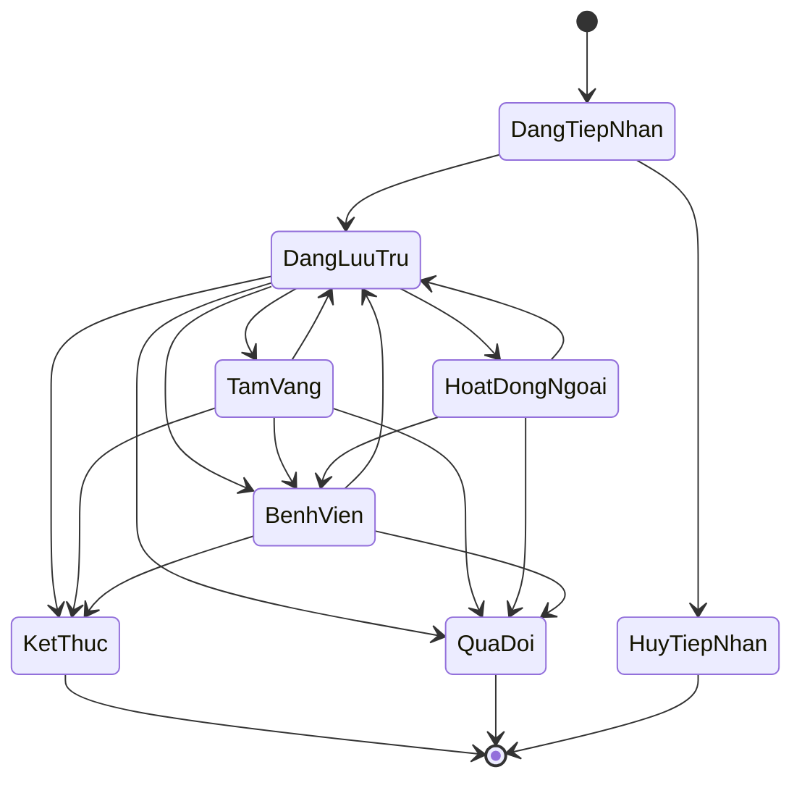
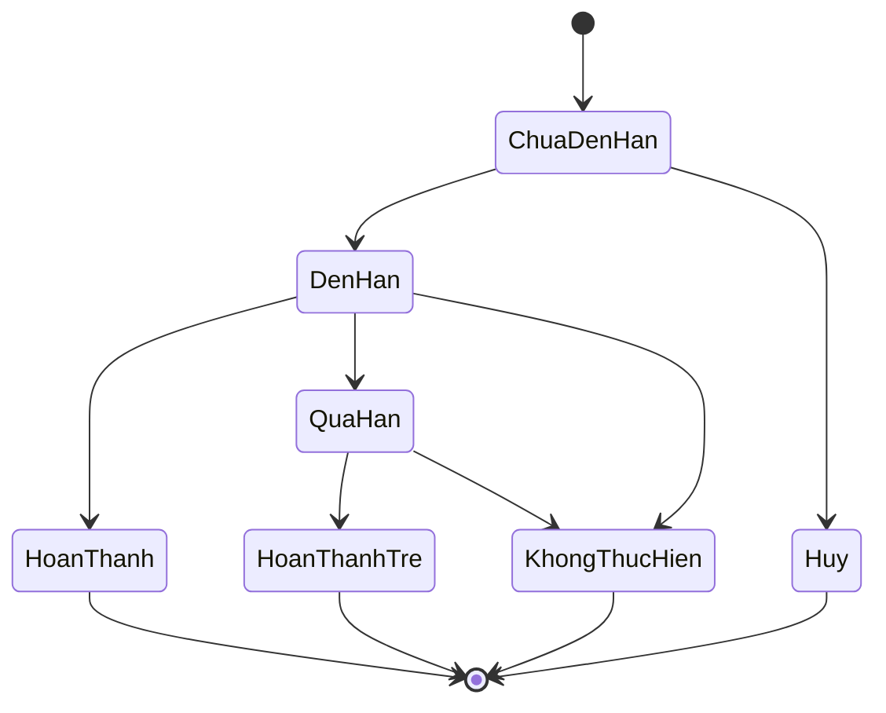
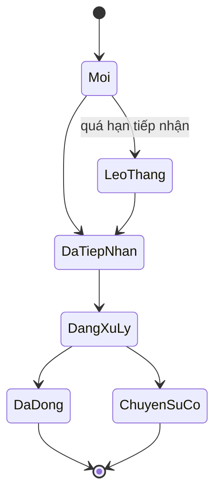
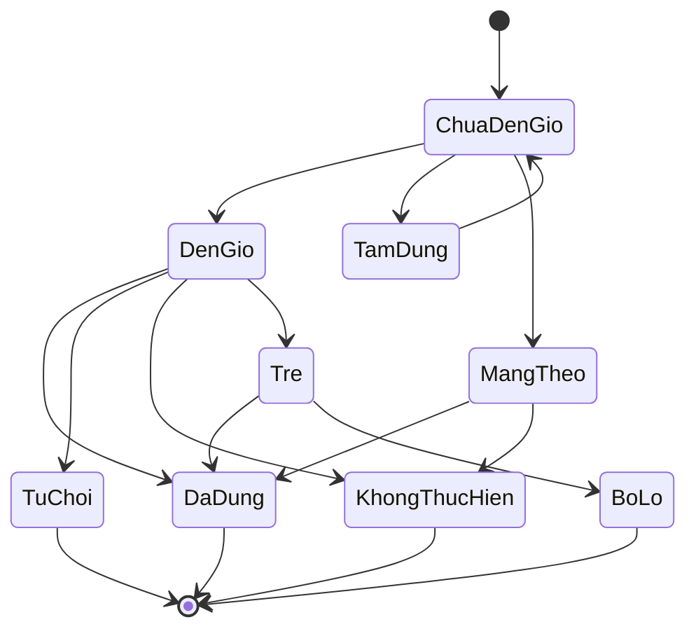
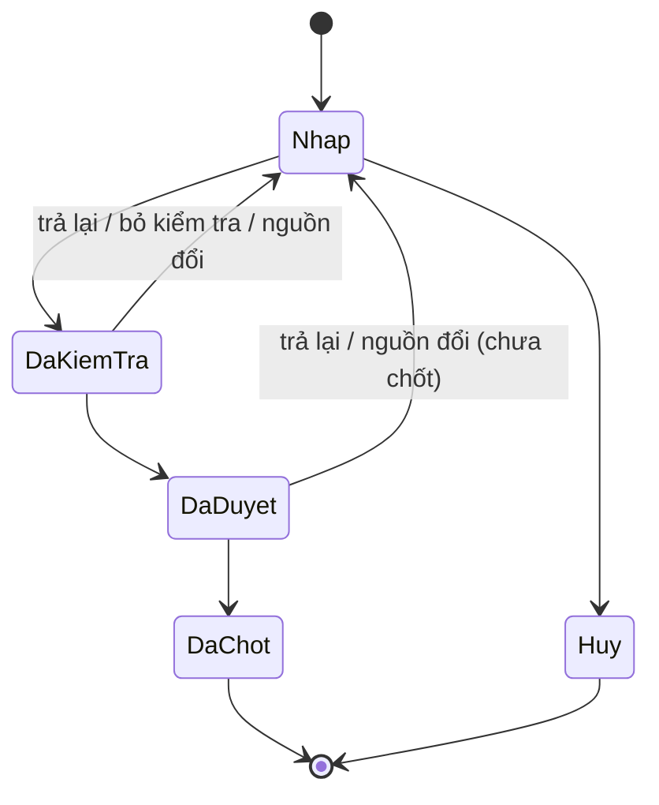
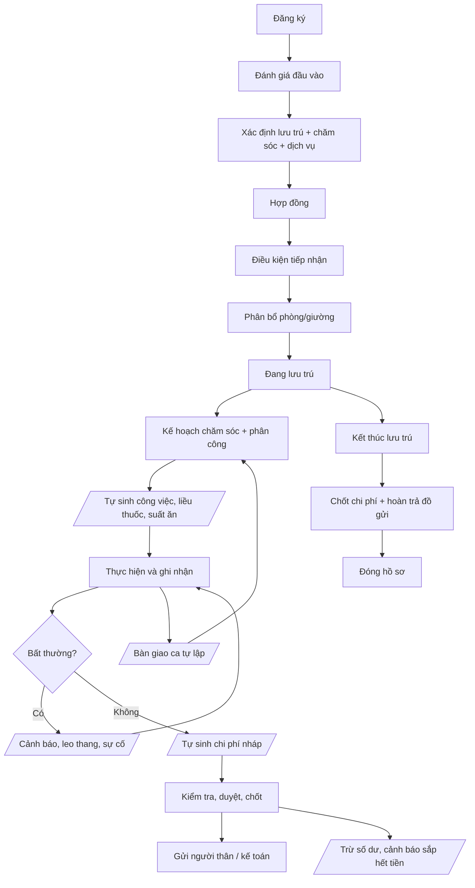

# Nghiệp vụ Hệ thống Quản lý Viện Dưỡng Lão

## 1. Mục tiêu và phạm vi hệ thống

### 1.1. Mục tiêu

Hệ thống hỗ trợ viện dưỡng lão quản lý tập trung toàn bộ quá trình: Tiếp nhận → Đánh giá → Lưu trú → Lập kế hoạch chăm sóc → Phân công → Chăm sóc hằng ngày → Theo dõi sức khỏe → Quản lý thuốc → Dinh dưỡng → Hoạt động → Xử lý sự cố → Ghi nhận chi phí → Tương tác với người thân → Kết thúc lưu trú.

Hệ thống tập trung vào hai nhóm nghiệp vụ chính:

- Quản lý vận hành cơ sở chăm sóc người cao tuổi.
- Quản lý quá trình chăm sóc và theo dõi người cao tuổi trong thời gian lưu trú.

### 1.2. Ranh giới hệ thống

Hệ thống không thay thế:

- hệ thống kế toán chuyên nghiệp;
- hệ thống quản lý kho tổng thể;
- hệ thống bệnh án điện tử chuyên sâu;
- hệ thống quản lý camera chuyên dụng;
- hệ thống quản lý nhân sự/payroll chuyên sâu.

Hệ thống chỉ quản lý những dữ liệu và nghiệp vụ cần thiết để phục vụ vận hành viện, chăm sóc người cao tuổi và truy xuất lịch sử.

**(Đã chỉnh sửa, 2026-09-28, Q-210, Q-211)** Hai ranh giới trên được thu hẹp như sau:

- Về kế toán: hệ thống quản lý **số dư và thu chi của từng người cao tuổi** (tiền cọc, tiền gia đình nộp, trừ theo bảng chi phí đã chốt, hoàn tiền) và đối soát chuyển khoản theo sao kê (15.9). Hệ thống không hạch toán, không lập báo cáo tài chính của viện và không thực hiện thanh toán trực tuyến.
- Về kho: hệ thống quản lý **kho nguyên liệu nấu ăn** (12.7) và **tài sản của viện** (7.7). Kho thuốc, vật tư y tế và vật phẩm tiêu hao tính phí (bỉm, tã, sữa) vẫn nằm ngoài phạm vi.

### 1.3. Nguyên tắc nghiệp vụ

- Mọi thông tin quan trọng phải gắn với người cao tuổi, thời gian và người thực hiện.
- Mọi thay đổi quan trọng phải có lịch sử và người thực hiện.
- Thông tin y tế phải được quản lý theo phạm vi chuyên môn và quyền được cấp.
- Loại hình lưu trú và mức độ chăm sóc là hai thuộc tính độc lập.
- Trạng thái lưu trú không tự động quyết định cách tính phí; chi phí phải dựa trên hợp đồng và chính sách của cơ sở.
- Chi phí phát sinh phải truy xuất được về hoạt động/dịch vụ/vật phẩm tạo ra chi phí.
- Công việc chăm sóc phải có người thực hiện, thời gian thực hiện và kết quả khi nghiệp vụ yêu cầu.
- Công việc chưa hoàn thành và cảnh báo chưa xử lý phải được đưa vào bàn giao ca.
- Hệ thống phải hỗ trợ nhiều mô hình vận hành khác nhau thay vì hard-code theo một viện cụ thể.
- **(Bổ sung)** Hệ thống chủ động sinh công việc, lịch thuốc, suất ăn, cảnh báo và chi phí từ dữ liệu đã có; nhân viên chủ yếu xác nhận kết quả thay vì nhập lại thông tin.
- **(Bổ sung)** Bản ghi quan trọng đã xác nhận không sửa/xóa trực tiếp; mọi sai sót được xử lý bằng bản ghi đính chính hoặc khoản điều chỉnh có lý do.

### 1.4. Quy ước về quy tắc nghiệp vụ (bổ sung)

- Mỗi module có mục **Quy tắc nghiệp vụ** với mã `BR-Mxx-yy`, viết dạng "Khi… thì hệ thống…".
- Giá trị trong ngoặc vuông, ví dụ \[30 phút\], là **tham số cấu hình** có giá trị mặc định, không phải giá trị cố định của sản phẩm.
- Các quy tắc là cơ sở để viết acceptance criteria và test tự động cho từng module.
- **(Bổ sung, 2026-09-28)** Trạng thái được thể hiện bằng bảng. Sơ đồ trạng thái còn giữ trong tài liệu (5.5, 8.3, 9.4, 11.2, 15.6, 20) chỉ để minh họa; khi sơ đồ khác bảng trạng thái hoặc đoạn "Làm rõ" đi kèm, bảng và đoạn làm rõ là căn cứ.

### 1.5. Phân loại dữ liệu và thao tác được phép (bổ sung)

Nguyên tắc: **dữ liệu danh mục được CRUD; dữ liệu nghiệp vụ thay đổi bằng lệnh có trạng thái; dữ liệu đã xác nhận chỉ ghi thêm.** Spec và API phải tuân theo bảng dưới đây; đối tượng thuộc nhóm 2 và 3 không có thao tác sửa/xóa trực tiếp.

| Nhóm                       | Ví dụ                                                                                                                                                          | Thao tác được phép                                                                                                                                                                     |
| -------------------------- | -------------------------------------------------------------------------------------------------------------------------------------------------------------- | -------------------------------------------------------------------------------------------------------------------------------------------------------------------------------------- |
| 1. Danh mục                | Dịch vụ, đơn giá, món ăn, phòng/giường, loại công việc, hồ sơ nhân viên, tham số cấu hình                                                                      | Tạo, sửa. Không xóa đối tượng đã được lịch sử tham chiếu, chỉ "Ngừng hiệu lực". Đơn giá thay đổi bằng phiên bản mới (6.4)                                                              |
| 2. Nghiệp vụ có trạng thái | Trạng thái người cao tuổi, hợp đồng, phân bổ giường, kế hoạch chăm sóc, đơn thuốc, chế độ ăn, dị ứng/bệnh nền, danh sách được phép đón, đồng ý chia sẻ dữ liệu | Chỉ thay đổi qua lệnh nghiệp vụ có điều kiện (ví dụ Chuyển giường, Ngừng đơn, Loại trừ dị ứng) hoặc tạo phiên bản mới có ngày hiệu lực; mọi lệnh lưu người thực hiện, thời điểm, lý do |
| 3. Ghi nhận đã xác nhận    | Kết quả công việc, liều thuốc, chỉ số, sự cố, bàn giao, bàn giao đồ gửi, chi phí đã chốt, thông báo đã gửi                                                     | Chỉ ghi thêm. Sai sót xử lý bằng bản ghi đính chính hoặc khoản điều chỉnh, bản gốc vẫn giữ nguyên                                                                                      |

**(Bổ sung, spec 000)** Quy tắc chung cho bảng trên:

- Mọi lệnh nghiệp vụ trên dữ liệu nhóm 2, mọi đính chính, từ chối, hủy và thay đổi tham số bắt buộc có lý do.
- Bản đính chính chỉ được tạo bởi: người đã ghi bản gốc; hoặc người phụ trách ca / trưởng tầng của phạm vi đó (với bản ghi gắn tầng/khu vực). Bản ghi không gắn tầng (bàn giao đồ gửi, bản ghi của hành chính) thì nhân viên cùng vai trò với người ghi gốc lập yêu cầu phê duyệt loại "Đính chính", chỉ có hiệu lực khi quản lý viện duyệt. Module có thể thu hẹp thêm. **(Làm rõ, spec 010)** Chi phí đã chốt không có bản đính chính; sai sót được xử lý bằng khoản điều chỉnh (15.6, DBR-17, UC-63): hành chính lập, quản lý viện duyệt.
- Bản ghi đính chính loại "Hủy ghi nhận" được dùng cho bản ghi ghi nhầm hoàn toàn; bản gốc vẫn giữ và xem lại được.
- **(Bổ sung, 2026-09-28)** Nhóm 2 gồm thêm: khai báo tạm trú (6.10), nguyện vọng cuối đời (5.2), tài sản của viện (7.7). Nhóm 3 gồm thêm: giao dịch số dư (15.9), phiếu nhập, xuất kho nguyên liệu (12.7). Giao dịch số dư sai được xử lý bằng **giao dịch đảo** có lý do, không có bản đính chính.

Phụ lục mục 25 tập hợp toàn bộ tham số cấu hình được dùng trong các quy tắc nghiệp vụ.

### 1.6. Nhóm chức năng (bổ sung, 2026-09-28, Q-207)

Nhóm chức năng là cách gom các module để trình bày (menu, báo cáo đồ án). Nhóm chức năng **không** đổi số module, mã quy tắc hay ranh giới của các spec đã có.

| Nhóm chức năng | Module, mục | Spec |
| -------------- | ----------- | ---- |
| Hồ sơ và đánh giá | Module 01 | 001 |
| Lưu trú và tạm trú | Module 02 (gồm khai báo tạm trú 6.10); Module 03 phần phòng, giường, vệ sinh | 003, 004, 018 |
| Chăm sóc | Module 04 (kế hoạch chăm sóc, công việc hằng ngày, hoạt động); Module 06 phần theo dõi chỉ số (10.1); Module 10 người thân | 005, 007 (phần chỉ số), 012, 014 |
| Thuốc | Module 07 | 006 |
| Sự cố và cảnh báo | Module 05; Module 06 phần ngưỡng, khám điều trị, phạm vi y tế (10.2 → 10.4) | 007 |
| Dinh dưỡng và kho bếp | Module 08 (gồm kho nguyên liệu 12.7) | 011, 019 |
| Nhân sự và ca trực | Module 09 | 008, 015 |
| Tài chính | Module 11 (gồm số dư và thu chi 15.9) | 010, 017 |
| Tài sản và đồ gửi | Tài sản của viện (7.7); Module 12 | 013, 019 |
| Dịch vụ chung | Module 13, 14, 15 | 009, 016, 002 |

**Chỉ số sức khỏe trong công việc hằng ngày (Q-207).** Đo chỉ số theo lịch là một loại công việc chăm sóc (8.3). Công việc đo hiện trong checklist ca và được ghi nhận như mọi công việc khác (UC-26). Khi kết quả được ghi, các quy tắc của Module 06 vẫn áp dụng: khoảng hợp lệ, so ngưỡng, đo lại, tạo cảnh báo (UC-32, BR-M06-03, 04). Spec sở hữu không đổi.

## 2. Quy mô và mô hình vận hành

### 2.1. Quy mô

Hệ thống được thiết kế cho cơ sở tối thiểu 100 người.

### 2.2. Cấu trúc cơ sở

Cấu trúc quản lý: Viện → Khu vực → Tòa nhà/Tầng → Phòng → Giường.

Một khu vực có thể:

- chứa nhiều phòng;
- có nhiều loại phòng;
- phục vụ nhiều mức độ chăm sóc;
- có nhiều nhóm nhân viên phụ trách.

### 2.3. Người dùng và vai trò

| Vai trò                    | Trách nhiệm chính                                                                                                                                           |
| -------------------------- | ----------------------------------------------------------------------------------------------------------------------------------------------------------- |
| Quản lý viện               | Quản lý vận hành, duyệt thay đổi lưu trú, duyệt chi phí, xem báo cáo, cấu hình nghiệp vụ. **(Bổ sung, Q-209, Q-210)** Quản lý kho nguyên liệu nấu ăn (12.7) và tài sản của viện (7.7) |
| Trưởng tầng/Điều phối tầng | Điều phối hoạt động, công việc, nhân viên và tình trạng người cao tuổi trong phạm vi tầng/khu vực                                                           |
| Bác sĩ                     | Đánh giá sức khỏe, khám, chẩn đoán/chỉ định trong phạm vi được phép, thiết lập ngưỡng cảnh báo                                                              |
| Điều dưỡng                 | Theo dõi sức khỏe, thực hiện y lệnh, quản lý việc dùng thuốc, xử lý cảnh báo, bàn giao ca. **(Bổ sung, Q-214)** Được làm mọi việc của Nhân viên chăm sóc; chiều ngược lại không áp dụng |
| Nhân viên chăm sóc         | Chăm sóc sinh hoạt, hỗ trợ ăn uống, vệ sinh, vận động, ghi nhận kết quả                                                                                     |
| Dinh dưỡng viên            | Quản lý nhu cầu dinh dưỡng, chế độ ăn, thực đơn                                                                                                             |
| Nhân viên bếp              | Chuẩn bị và phân phối suất ăn. **(Bổ sung)** Chuẩn bị, dán nhãn và giao suất ăn theo phiếu bữa ăn; xác nhận phát sinh                                       |
| Nhân viên vệ sinh          | Thực hiện vệ sinh phòng/khu vực. **(Bổ sung)** Thực hiện vệ sinh định kỳ, trả giường, khử khuẩn và đột xuất theo phòng/khu vực; ghi nhận kết quả và hư hỏng |
| Nhân viên hành chính       | Tiếp nhận, hợp đồng, người thân, đồ gửi, chi phí phát sinh. **(Bổ sung, Q-208)** Khai báo tạm trú, lưu trú (6.10)                                          |
| Kế toán **(bổ sung, Q-212)** | Thu tiền cọc và tiền gia đình nộp; ghi thu chi trên số dư người cao tuổi; đối soát chuyển khoản theo sao kê; xuất sao kê, báo cáo thu chi và file kế toán ra Excel (15.9) |
| Người thân                 | Xem thông tin được phép, đăng ký thăm, đón người cao tuổi, nhận thông báo, xem chi phí và gửi phản hồi. **(Bổ sung, Q-211)** Xem số dư, lịch sử giao dịch và thông tin nộp tiền |

### 2.4. Thuật ngữ vai trò và nhiệm vụ (bổ sung)

Vai trò hệ thống là các vai trò ở bảng 2.3, được gán cho tài khoản. Nhiệm vụ là trách nhiệm được gán cho một nhân viên trong một ca hoặc một hoạt động cụ thể; nhiệm vụ không tạo thêm vai trò hệ thống.

| Thuật ngữ                           | Loại      | Định nghĩa                                                                                                                                                                                                                                                                                                                                                                                                                                                                                                                                                                                                                                                                                                                                                                                                             |
| ----------------------------------- | --------- | ---------------------------------------------------------------------------------------------------------------------------------------------------------------------------------------------------------------------------------------------------------------------------------------------------------------------------------------------------------------------------------------------------------------------------------------------------------------------------------------------------------------------------------------------------------------------------------------------------------------------------------------------------------------------------------------------------------------------------------------------------------------------------------------------------------------------- |
| Người phụ trách ca                  | Nhiệm vụ  | Nhân viên được chỉ định phụ trách một ca tại một tầng/khu vực (13.2), thường là trưởng tầng hoặc điều dưỡng. Nhận nhắc việc quá hạn, xác nhận bàn giao. **(Bổ sung, spec 002)** Là ngoại lệ của quy tắc "nhiệm vụ không tạo quyền": trong tầng/khu vực và thời gian của ca, được xử lý việc quá hạn, tạo bản đính chính cho bản ghi gắn tầng và mở khóa sớm tài khoản nhân viên đang khóa tạm. **(Bổ sung, spec 008)** Phải có vai trò Trưởng tầng hoặc Điều dưỡng và có tên trong ca; được ghi nhận vắng ca cho nhân viên trong ca mình phụ trách (Q-80); lập bàn giao cuối ca và tạm nhận cảnh báo, sự cố của ca trước khi bàn giao chưa được xác nhận (Q-78). **(Bổ sung, Q-90)** Khi tầng tạm chưa có Trưởng tầng được giao, thực hiện các lệnh bàn giao và tạm nhận dành cho Trưởng tầng, trong phạm vi ca (13.3) |
| Bác sĩ trực                         | Nhiệm vụ  | Bác sĩ được xếp ca trực tại thời điểm xảy ra sự việc; nhận thông báo khẩn cấp                                                                                                                                                                                                                                                                                                                                                                                                                                                                                                                                                                                                                                                                                                                                          |
| Điều dưỡng phụ trách                | Nhiệm vụ  | Điều dưỡng được phân công cho người cao tuổi trong ca hiện tại                                                                                                                                                                                                                                                                                                                                                                                                                                                                                                                                                                                                                                                                                                                                                         |
| Trưởng đoàn                         | Nhiệm vụ  | Nhân viên được chỉ định dẫn một chuyến hoạt động ngoài viện (8.9). **(Bổ sung, spec 014, Q-161, Q-172)** Phải có vai trò Trưởng tầng hoặc Nhân viên chăm sóc (**bổ sung, Q-214:** hoặc Điều dưỡng); giữ nhiệm vụ tới khi chuyến về, kể cả khi hết ca; được chuyển giữa chuyến cho người đi cùng đủ điều kiện                                                                                                                                                                                                                                                                                                                                                                                                                                                                                                                                                 |
| Người đại diện                      | Quan hệ   | Người thân có quyền ký hợp đồng, đồng ý chia sẻ dữ liệu và yêu cầu thay đổi dịch vụ                                                                                                                                                                                                                                                                                                                                                                                                                                                                                                                                                                                                                                                                                                                                    |
| Người liên hệ chính                 | Quan hệ   | Người thân nhận thông báo đầu tiên, đặc biệt là thông báo khẩn cấp; mỗi người cao tuổi có đúng một người                                                                                                                                                                                                                                                                                                                                                                                                                                                                                                                                                                                                                                                                                                               |
| Lệnh nghiệp vụ                      | Khái niệm | Thao tác làm thay đổi trạng thái theo quy tắc (ví dụ Cho tạm vắng), thay cho sửa dữ liệu trực tiếp                                                                                                                                                                                                                                                                                                                                                                                                                                                                                                                                                                                                                                                                                                                     |
| Đính chính                          | Khái niệm | Bản ghi mới sửa sai cho một bản ghi đã xác nhận; bản gốc giữ nguyên                                                                                                                                                                                                                                                                                                                                                                                                                                                                                                                                                                                                                                                                                                                                                    |
| Phiên bản                           | Khái niệm | Một lần thay đổi của dữ liệu có ngày hiệu lực (hợp đồng, kế hoạch, đơn giá, ngưỡng)                                                                                                                                                                                                                                                                                                                                                                                                                                                                                                                                                                                                                                                                                                                                    |
| Cờ nguy cơ                          | Khái niệm | Nhãn ngã / loét / đi lạc gắn cho người cao tuổi từ kết quả đánh giá (5.3)                                                                                                                                                                                                                                                                                                                                                                                                                                                                                                                                                                                                                                                                                                                                              |
| Bản gán chế độ ăn                   | Khái niệm | **(Bổ sung, spec 011)** Chế độ ăn, kết cấu thức ăn và hạn chế thực phẩm riêng áp cho một người cao tuổi trong một khoảng thời gian; là "chế độ ăn" nhóm 2 ở bảng 1.5 (12.1)                                                                                                                                                                                                                                                                                                                                                                                                                                                                                                                                                                                                                                            |
| Món an toàn                         | Khái niệm | **(Bổ sung, spec 011, Q-147)** Món dinh dưỡng viên khai sẵn cho mỗi chế độ ăn, hệ thống tự dùng khi suất thiếu món thay thế hoặc thiếu món mà dinh dưỡng viên chưa xử lý kịp (BR-M08-02)                                                                                                                                                                                                                                                                                                                                                                                                                                                                                                                                                                                                                               |
| Suất đặc biệt                       | Khái niệm | **(Bổ sung, spec 011)** Suất có tên người trên phiếu bữa ăn vì cần món thay thế, kết cấu khác thường hoặc món chỉ định riêng (12.5)                                                                                                                                                                                                                                                                                                                                                                                                                                                                                                                                                                                                                                                                                    |
| Phát sinh                           | Khái niệm | **(Bổ sung, spec 011)** Thay đổi số suất hoặc nội dung suất sau thời điểm chốt; loại cần giao (bếp xác nhận, chuẩn bị, giao) hoặc chỉ để ghi nhận (BR-M08-01, BR-M08-13)                                                                                                                                                                                                                                                                                                                                                                                                                                                                                                                                                                                                                                               |
| Suất giữ                            | Khái niệm | **(Bổ sung, spec 011, Q-144)** Suất của người chưa trở về đúng dự kiến, giữ tại tầng tới hết ngưỡng giao trễ (BR-M08-01)                                                                                                                                                                                                                                                                                                                                                                                                                                                                                                                                                                                                                                                                                               |
| Phần bổ sung                        | Khái niệm | **(Bổ sung, spec 011)** Suất của phát sinh cần giao, được giao sau khi phiếu bữa ăn đã Đã giao (12.5)                                                                                                                                                                                                                                                                                                                                                                                                                                                                                                                                                                                                                                                                                                                  |
| Người nhận tại tầng                 | Nhiệm vụ  | **(Bổ sung, spec 011, Q-143)** Trưởng tầng, Điều dưỡng hoặc Nhân viên chăm sóc trong phạm vi phân công, kiểm đếm và nhận phiếu bữa ăn, phần bổ sung (BR-M08-11)                                                                                                                                                                                                                                                                                                                                                                                                                                                                                                                                                                                                                                                        |
| Danh sách cần đối chiếu khi phục vụ | Khái niệm | **(Bổ sung, spec 011)** Người có dị ứng không kiểm tra tự động, phải được xác nhận phục vụ; chỉ nhân viên tại tầng thấy, bếp không thấy (12.5)                                                                                                                                                                                                                                                                                                                                                                                                                                                                                                                                                                                                                                                                         |
| Người giữ                           | Khái niệm | **(Bổ sung, spec 013)** Người nhận ở bản ghi bàn giao gần nhất của một đồ gửi: nhân viên đang giữ hoặc chính người cao tuổi (16.3)                                                                                                                                                                                                                                                                                                                                                                                                                                                                                                                                                                                                                                                                                     |
| Người có quyền nhận                 | Quan hệ   | **(Bổ sung, spec 013)** Người đại diện hoặc người thân có quyền "được phép đón" đang hiệu lực, tại thời điểm trả đồ gửi (BR-M12-04)                                                                                                                                                                                                                                                                                                                                                                                                                                                                                                                                                                                                                                                                                    |
| Xác nhận người nhận khác            | Khái niệm | **(Bổ sung, spec 013, Q-149, Q-150)** Xác nhận của người đại diện (hoặc Quản lý viện duyệt thay) cho một người không có quyền nhận, kể cả chính người cao tuổi, nhận các đồ gửi cụ thể, dùng một lần (16.4). **(Sửa, 2026-09-30, Q-253)** Người cao tuổi không có cờ nguy cơ đi lạc tự nhận lại đồ không thuộc loại "cần đồng ý khi giao sử dụng" thì không cần                                                                                                                                                                                                                                                                                                                                                                                                                                                                                                                                                                                                            |
| Đồng ý cho tự giữ                   | Khái niệm | **(Bổ sung, spec 013, Q-155)** Đồng ý của người đại diện cho người cao tuổi tự giữ một đồ gửi là tiền mặt, trang sức (BR-M12-06)                                                                                                                                                                                                                                                                                                                                                                                                                                                                                                                                                                                                                                                                                       |
| Đồ có giá trị                       | Khái niệm | **(Bổ sung, spec 013)** Đồ gửi thuộc loại nằm trong CFG-M12-01; bắt buộc ảnh (BR-M12-05) và được kiểm kê định kỳ (BR-M12-07)                                                                                                                                                                                                                                                                                                                                                                                                                                                                                                                                                                                                                                                                                           |
| Đồ không rõ chủ                     | Khái niệm | **(Bổ sung, spec 013)** Đồ phát hiện khi kiểm kê mà không khớp đồ gửi nào; không phải đồ gửi (16.6)                                                                                                                                                                                                                                                                                                                                                                                                                                                                                                                                                                                                                                                                                                                    |
| Người đi cùng                       | Nhiệm vụ  | **(Bổ sung, spec 014, Q-161)** Nhân viên có ca chồng thời gian chuyến đi, được phân công đi theo chuyến (8.9); Điều dưỡng đi cùng để ghi liều Mang theo                                                                                                                                                                                                                                                                                                                                                                                                                                                                                                                                                                                                                                                                |
| Buổi                                | Khái niệm | **(Bổ sung, spec 014)** Một lần diễn ra cụ thể của một hoạt động, duy nhất theo (hoạt động, thời điểm bắt đầu) (8.8)                                                                                                                                                                                                                                                                                                                                                                                                                                                                                                                                                                                                                                                                                                   |
| Chuyến đi                           | Khái niệm | **(Bổ sung, spec 014)** Buổi của hoạt động loại "ngoài viện" (8.9)                                                                                                                                                                                                                                                                                                                                                                                                                                                                                                                                                                                                                                                                                                                                                     |
| Hoạt động nhóm                      | Khái niệm | **(Bổ sung, spec 014)** Hoạt động có dấu "hoạt động nhóm"; là căn cứ của BR-M04-22 (8.8)                                                                                                                                                                                                                                                                                                                                                                                                                                                                                                                                                                                                                                                                                                                               |
| Chỉ định hạn chế hoạt động          | Khái niệm | **(Bổ sung, spec 014, Q-162)** Cờ "không đủ điều kiện" do bác sĩ gắn, có phạm vi và thời gian hiệu lực; cũng là "chỉ định hạn chế" ở BR-M04-22 (BR-M04-15)                                                                                                                                                                                                                                                                                                                                                                                                                                                                                                                                                                                                                                                             |
| Chỉ định tạm                        | Khái niệm | **(Bổ sung, spec 014, Q-162)** Chỉ định hạn chế do điều dưỡng gắn, tối đa CFG-M04-14, chờ bác sĩ xác nhận hoặc gỡ (BR-M04-15)                                                                                                                                                                                                                                                                                                                                                                                                                                                                                                                                                                                                                                                                                          |
| Đồng ý về muộn                      | Khái niệm | **(Bổ sung, spec 014, Q-167)** Đồng ý của người đại diện cho người bán trú về muộn hơn giờ về theo lịch vì một buổi hoạt động cụ thể (3.4)                                                                                                                                                                                                                                                                                                                                                                                                                                                                                                                                                                                                                                                                             |
| Ngày tính                           | Khái niệm | **(Bổ sung, spec 014, Q-173)** Ngày được đếm cho cảnh báo nguy cơ cô lập (BR-M04-22)                                                                                                                                                                                                                                                                                                                                                                                                                                                                                                                                                                                                                                                                                                                                   |
| Không ghi nhận                      | Khái niệm | **(Bổ sung, spec 014, Q-169)** Kết quả hệ thống gán cho đăng ký chưa được điểm danh khi hết ngày của buổi; không phải Có mặt, không phải Vắng (8.8)                                                                                                                                                                                                                                                                                                                                                                                                                                                                                                                                                                                                                                                                    |
| Mẫu xoay ca                         | Khái niệm | **(Bổ sung, spec 015)** Chu kỳ nhiều ngày, mỗi ngày là một mẫu ca hoặc Nghỉ (ví dụ 2 ngày – 2 đêm – 2 nghỉ), dùng để sinh lịch ca tháng (13.2)                                                                                                                                                                                                                                                                                                                                                                                                                                                                                                                                                                                                                                                                         |
| Nhóm xoay ca                        | Khái niệm | **(Bổ sung, spec 015)** Nhóm nhân viên của một tầng, khu vực hoặc toàn viện dùng chung một mẫu xoay ca và ngày gốc; mỗi thành viên có vị trí bắt đầu riêng trong chu kỳ; mỗi nhân viên thuộc tối đa một nhóm tại một thời điểm (13.2, Q-190)                                                                                                                                                                                                                                                                                                                                                                                                                                                                                                                                                                           |
| Phủ tối thiểu                       | Khái niệm | **(Bổ sung, spec 015)** Số người tối thiểu theo vai trò cho một ca (CFG-M09-07); ca có dòng không đạt là **thiếu phủ**. Nhân viên chỉ được tính cho một dòng và chỉ khi giấy phép, đào tạo bắt buộc với vai trò còn hiệu lực trong toàn ca (Q-181, Q-188)                                                                                                                                                                                                                                                                                                                                                                                                                                                                                                                                                              |
| Thiếu ca                            | Khái niệm | **(Bổ sung, spec 015, Q-189)** Ngày và mẫu ca có yêu cầu phủ tối thiểu áp dụng nhưng lịch không có ca nào; được báo khi sinh lịch và khi công bố                                                                                                                                                                                                                                                                                                                                                                                                                                                                                                                                                                                                                                                                       |
| Nghỉ có duyệt                       | Khái niệm | **(Bổ sung, spec 015)** Tình trạng của nhân viên với một ca (dạng "theo ca") hoặc một ngày (dạng "theo ngày") thuộc yêu cầu nghỉ đột xuất đã được duyệt; không được tính phủ, tỷ lệ phục vụ, không là ứng viên thay (13.2, Q-184)                                                                                                                                                                                                                                                                                                                                                                                                                                                                                                                                                                                      |
| Người nhường, người nhận ca         | Quan hệ   | **(Bổ sung, spec 015)** Hai bên của yêu cầu đổi ca; **nhận thay** là dạng đổi ca một chiều, người nhận nhận ca mà không trả ca (BR-M09-10, Q-179)                                                                                                                                                                                                                                                                                                                                                                                                                                                                                                                                                                                                                                                                      |
| Lời mời nhận ca thay                | Khái niệm | **(Bổ sung, spec 015, Q-183)** Lời mời trưởng tầng gửi nhân viên phù hợp cho ca thiếu phủ; người nhận đầu tiên được bổ sung ngay vào ca (BR-M09-11)                                                                                                                                                                                                                                                                                                                                                                                                                                                                                                                                                                                                                                                                    |
| Danh sách kiểm tra chất lượng       | Khái niệm | **(Bổ sung, spec 014)** Các công việc được chọn ngẫu nhiên trong một ca của một tầng để trưởng tầng kiểm tra (BR-M04-23)                                                                                                                                                                                                                                                                                                                                                                                                                                                                                                                                                                                                                                                                                               |
| Số dư người cao tuổi                | Khái niệm | **(Bổ sung, Q-211)** Số tiền gia đình đã nộp trừ đi các khoản đã thanh toán của một người cao tuổi, bằng tổng các giao dịch đã xác nhận; số dư âm là "còn nợ". Không phải tài khoản ngân hàng (15.9) |
| Giao dịch số dư                     | Khái niệm | **(Bổ sung, Q-211)** Một lần tăng hoặc giảm số dư: nộp tiền, thanh toán bảng chi phí, hoàn tiền, điều chỉnh, giao dịch đảo; nhóm 3 ở bảng 1.5 (15.9) |
| Mã nộp tiền                         | Khái niệm | **(Bổ sung, Q-211)** Mã riêng của mỗi người cao tuổi, ghi trong nội dung chuyển khoản, dùng để hệ thống khớp dòng sao kê với người nộp (15.9) |
| Đối soát                            | Khái niệm | **(Bổ sung, Q-211)** Việc Kế toán nhập sao kê ngân hàng, cho hệ thống khớp từng dòng với mã nộp tiền, rồi xác nhận thành giao dịch nộp tiền (15.9) |
| Tiền cọc                            | Khái niệm | **(Bổ sung, Q-219)** Khoản đặt cọc theo hợp đồng (6.5), theo dõi riêng, không cộng vào số dư; được hoàn hoặc cấn trừ khi quyết toán lúc kết thúc lưu trú. **(Q-225)** Thu được từ khi hợp đồng Chờ ký; trạng thái đặt cọc dẫn xuất từ sổ tiền cọc |
| Chốt quỹ ngày                       | Khái niệm | **(Bổ sung, Q-226, spec 017)** Bản đối chiếu cuối ngày giữa tiền mặt thực có và tổng phiếu thu, phiếu chi tiền mặt trong ngày, do Kế toán lập, Quản lý viện xác nhận (BR-M11-16) |
| Cặp điều chỉnh chuyển tiền          | Khái niệm | **(Bổ sung, Q-227, spec 017)** Hai giao dịch điều chỉnh liên kết, cùng số tiền, chuyển tiền giữa sổ cọc và sổ số dư, hoặc giữa hai người cao tuổi, khi một lần chuyển khoản gộp nhiều khoản (BR-M11-12) |
| Khai báo tạm trú                    | Khái niệm | **(Bổ sung, Q-208)** Bản ghi việc viện đăng ký tạm trú hoặc thông báo lưu trú cho người cao tuổi nội trú với cơ quan công an theo pháp luật về cư trú; hệ thống chỉ ghi nhận và nhắc hạn, không nộp thay (6.10) |
| Nguyện vọng cuối đời                | Khái niệm | **(Bổ sung, Q-213)** Lựa chọn của người cao tuổi hoặc gia đình về nơi chăm sóc khi nguy kịch: chuyển bệnh viện điều trị tích cực, đưa về nhà, hoặc ở lại viện chăm sóc giảm nhẹ; khảo sát khi tiếp nhận, có phiên bản (5.2) |
| Dấu nguy kịch                       | Khái niệm | **(Bổ sung, Q-213)** Dấu gắn cho người cao tuổi khi Bác sĩ nhận định tình trạng nguy kịch; không phải trạng thái ở 5.5; kích hoạt cảnh báo thực hiện nguyện vọng cuối đời (BR-M05-15) |
| Tài sản của viện                    | Khái niệm | **(Bổ sung, Q-209)** Vật có giá trị lớn, dùng lâu dài, thuộc viện: xe đưa đón, giường bệnh, thiết bị lớn. Khác đồ gửi (thuộc người cao tuổi, Module 12) và nguyên liệu (hàng tiêu hao theo số lượng, 12.7) (7.7) |
| Nguyên liệu                         | Khái niệm | **(Bổ sung, Q-210)** Hàng dùng để nấu ăn, quản lý theo số lượng và lô có hạn dùng trong kho nguyên liệu (12.7) |
| BR-Mxx-yy                           | Mã        | Quy tắc nghiệp vụ của module xx                                                                                                                                                                                                                                                                                                                                                                                                                                                                                                                                                                                                                                                                                                                                                                                        |
| CFG-Mxx-yy                          | Mã        | Tham số cấu hình (Phụ lục 25)                                                                                                                                                                                                                                                                                                                                                                                                                                                                                                                                                                                                                                                                                                                                                                                          |

Quyền **Duyệt kế hoạch chăm sóc** là một quyền trong phân quyền (19.2), mặc định gán cho bác sĩ; cơ sở có thể gán thêm cho điều dưỡng có đủ chuyên môn.

**(Bổ sung, 2026-09-28, Q-214) Điều dưỡng làm việc của Nhân viên chăm sóc.** Vai trò Điều dưỡng có mọi quyền thực hiện (T) của vai trò Nhân viên chăm sóc ở Phụ lục 27, trong phạm vi phân công (BR-M15-01), cùng các quyền riêng của Điều dưỡng. Nhân viên chăm sóc không có quyền của Điều dưỡng. Điều dưỡng được phân loại công việc chăm sóc (13.4) và được làm Trưởng đoàn, Người nhận tại tầng như Nhân viên chăm sóc. Điều dưỡng không được tính vào dòng phủ tối thiểu của Nhân viên chăm sóc (Q-221).

## 3. Loại hình lưu trú

### 3.1. Nội trú dài hạn

- Có hợp đồng dài hạn.
- Có chỗ ở/giường theo chính sách.
- Có dịch vụ đăng ký.
- Có kế hoạch chăm sóc dài hạn.
- Có chính sách giữ giường khi tạm vắng theo hợp đồng.

### 3.2. Nội trú ngắn ngày

- Có ngày bắt đầu.
- Có ngày kết thúc.
- Không tự động gia hạn.
- Có kế hoạch chăm sóc trong thời gian lưu trú.
- Việc giữ giường khi vắng được xác định theo hợp đồng/chính sách.

### 3.3. Bán trú

- Có lịch đến và về trong ngày.
- Điểm danh khi đến và khi về.
- Chỉ phát sinh công việc trong khoảng thời gian người cao tuổi có mặt.
- Không nhất thiết có giường cố định.
- Chi phí có thể tính theo buổi/ngày/dịch vụ tùy hợp đồng.
- **(Bổ sung, spec 003, Q-45)** Viện có một khu nghỉ bán trú cho toàn viện. Sức chứa mỗi buổi là CFG-M03-01; mọi người bán trú tính chung.
- **(Bổ sung, spec 003, Q-47)** Mỗi buổi có khung giờ do cơ sở cấu hình. Lịch đến của người bán trú chiếm chỗ ở mọi buổi có khung giờ giao với khoảng từ giờ đến tới giờ về.

### 3.4. Trạng thái có mặt theo ngày của bán trú (bổ sung)

Trạng thái "Đang lưu trú" không cho biết người bán trú hôm nay có ở viện hay không, nên mỗi ngày có lịch đến, người bán trú có thêm một trạng thái có mặt:

| Trạng thái có mặt | Ý nghĩa                                                            |
| ----------------- | ------------------------------------------------------------------ |
| Chưa đến          | Có lịch đến hôm nay, chưa điểm danh đến                            |
| Có mặt            | Đã điểm danh đến, chưa điểm danh về                                |
| Đã về             | Đã điểm danh về (qua quy trình đón tại 14.3)                       |
| Vắng có báo       | Gia đình báo vắng trước thời hạn \[24 giờ\]                        |
| Vắng không báo    | Quá giờ đến dự kiến \[2 giờ\] mà chưa điểm danh, không có báo vắng |

Trạng thái có mặt là căn cứ để sinh công việc (BR-M04-02), chốt suất ăn (BR-M08-01) và tính phí buổi (BR-M11-01). **(Làm rõ, spec 005)** Điểm danh đến và điểm danh về do Hành chính hoặc Nhân viên chăm sóc thực hiện; Trưởng tầng xem (UC-28, Phụ lục 27). Giờ đến, giờ về ghi sai được sửa bằng đính chính.

**(Bổ sung, spec 010, Q-140)** Người bán trú được điểm danh đến cả vào ngày không có lịch. Buổi đó là **buổi phát sinh**, tính 100% phí buổi, nằm ngoài giá tháng. Viện khai báo được **ngày khu bán trú nghỉ**. Buổi có lịch trùng ngày nghỉ không chuyển Vắng không báo, không tính phí và không được đếm khi chia giá tháng (BR-M11-09).

**(Bổ sung, spec 014, Q-167, Q-176) Về muộn vì hoạt động.** Người bán trú được đăng ký một buổi hoạt động hoặc chuyến đi kết thúc sau giờ về theo lịch khi Hành chính đã ghi nhận **đồng ý về muộn** của người đại diện cho đúng buổi đó (qua cổng người thân hoặc bản ký). Khi đăng ký được lưu, giờ về dự kiến của ngày đó tự dời tới giờ kết thúc buổi (với chuyến đi: giờ về dự kiến của chuyến, kể cả khi gia hạn). Giờ về dự kiến theo ngày thuộc trạng thái có mặt theo ngày của mục này (Module 04 quản lý); sinh công việc, chỗ khu nghỉ bán trú, suất ăn và phí buổi đều lấy giờ về từ đây. Người đại diện rút được đồng ý trước giờ bắt đầu của buổi (đăng ký bị hủy, giờ về trở lại theo lịch); từ giờ bắt đầu, đồng ý đã dùng và không rút được. Buổi bắt đầu trước giờ đến theo lịch hoặc vào ngày không có lịch thì không đăng ký được.

## 4. Mức độ chăm sóc

Mức độ chăm sóc được quản lý độc lập với loại hình lưu trú. Các mức có thể gồm:

- Chăm sóc cơ bản.
- Chăm sóc thường xuyên.
- Chăm sóc đặc biệt.
- Hỗ trợ vận động.
- Theo dõi sức khỏe thường xuyên.
- Phục hồi sau tai biến.
- Phục hồi chức năng khác.

Ví dụ: Nội trú dài hạn + Chăm sóc đặc biệt; Nội trú ngắn ngày + Phục hồi sau tai biến; Bán trú + Hỗ trợ vận động.

Mức độ chăm sóc được xác định từ quá trình đánh giá và có thể thay đổi khi tình trạng người cao tuổi thay đổi.

**(Bổ sung)** Mỗi mức chăm sóc có một **trọng số chăm sóc** (cấu hình CFG-M09-12, ví dụ cơ bản = 1, đặc biệt = 2,5). Trọng số được dùng để tính tỷ lệ phục vụ khi lập ca (BR-M09-02). **(Làm rõ, spec 003)** Việc kiểm tra loại phòng phù hợp (BR-M03-01) dùng danh sách mức chăm sóc được phép của phòng (7.1), không dùng trọng số.

## 5. Module 01 – Hồ sơ và đánh giá người cao tuổi

### 5.1. Hồ sơ cá nhân

Quản lý: họ tên; ngày sinh; giới tính; CCCD/giấy tờ định danh; ảnh; địa chỉ; thông tin liên hệ; thông tin đặc biệt. **(Sửa, 2026-09-29, Q-244)** "Địa chỉ" tách thành hai trường: địa chỉ thường trú (theo giấy tờ định danh) và địa chỉ liên hệ. Địa chỉ thường trú là căn cứ để Hành chính xác nhận "thường trú cùng xã/phường với viện" khi khai báo cư trú (6.10). Thông tin người thân được quản lý tại Module 10.

**(Bổ sung) Đồng ý xử lý và chia sẻ dữ liệu.** Khi tiếp nhận, hệ thống ghi nhận bản đồng ý gồm: người đồng ý (người cao tuổi, hoặc người đại diện hợp pháp khi người cao tuổi không đủ khả năng); phạm vi (chia sẻ thông tin sức khỏe cho những người thân nào, sử dụng hình ảnh, nhận thông báo); thời điểm; bằng chứng (bản ký được scan); trạng thái Hiệu lực / Đã rút lại. Căn cứ: quy định bảo vệ dữ liệu cá nhân hiện hành (Nghị định 13/2023/NĐ-CP và các văn bản thay thế, cần đối chiếu bản mới nhất khi triển khai).

**(Bổ sung, spec 001)** Chưa có bản đồng ý Hiệu lực không chặn việc tiếp nhận; hệ thống cảnh báo khi Hoàn tất tiếp nhận và nhắc hành chính mỗi \[1 ngày\] (CFG-M01-06) tới khi có bản đồng ý. Người đồng ý được rút lại đồng ý cả khi hồ sơ đã ở trạng thái cuối (BR-M01-05).

**(Bổ sung, Q-12)** Người từng lưu trú (Kết thúc lưu trú hoặc Hủy tiếp nhận) đăng ký lại thì hệ thống tạo **hồ sơ mới** liên kết với hồ sơ cũ; hồ sơ cũ giữ nguyên chỉ đọc; hồ sơ mới không kế thừa tự động trạng thái, bản đồng ý, đánh giá hay cờ nguy cơ. CCCD chỉ phải duy nhất trong các hồ sơ chưa ở trạng thái cuối.

### 5.2. Hồ sơ sức khỏe ban đầu

Quản lý: bệnh nền; tiền sử bệnh; dị ứng; nhóm máu nếu có; khả năng vận động; khả năng tự chăm sóc; khả năng nhận thức; nhu cầu chăm sóc; nhu cầu dinh dưỡng; thuốc đang sử dụng khi tiếp nhận; nhu cầu phục hồi chức năng; thông tin chăm sóc cuối đời nếu có. Thông tin thuốc được sử dụng trong thời gian lưu trú được quản lý tại Module 07.

**(Bổ sung)** Dị ứng, bệnh nền và tiền sử bệnh được lưu thành **từng mục riêng**, không phải một trường văn bản. Mỗi mục có: nội dung; mức độ (với dị ứng); nguồn thông tin; người ghi nhận; ngày ghi nhận; trạng thái Hiệu lực / Đã loại trừ; lý do loại trừ. Mục đã ghi không bị xóa hay sửa nội dung, chỉ được loại trừ (BR-M01-07).

**(Bổ sung, 2026-09-28, Q-213) Nguyện vọng cuối đời.** "Thông tin chăm sóc cuối đời" ở trên được ghi thành **phiếu khảo sát nguyện vọng**, thực hiện khi tiếp nhận. Phiếu hỏi: khi người cao tuổi nguy kịch, gia đình muốn (a) chuyển bệnh viện điều trị tích cực, (b) đưa về nhà, hoặc (c) ở lại viện chăm sóc giảm nhẹ; kèm người cần liên hệ trước khi thực hiện và ghi chú. Phiếu còn ghi: người trả lời (người cao tuổi hoặc người đại diện) và quan hệ; thời điểm; người ghi nhận; bản ký được scan.

- Nguyện vọng là dữ liệu nhóm 2, có phiên bản. Mỗi người cao tuổi có tối đa một phiên bản Hiệu lực (DBR-34). Phiên bản mới thay phiên bản cũ; phiên bản cũ vẫn tra cứu được.
- Được đổi bất kỳ lúc nào theo yêu cầu của người cao tuổi hoặc người đại diện, và khi xác nhận lại lúc nguy kịch (BR-M05-16).
- **(Q-217)** Bác sĩ hoặc Điều dưỡng ghi phiếu cùng hồ sơ sức khỏe ban đầu. Chưa có phiếu không chặn Hoàn tất tiếp nhận; hệ thống cảnh báo khi Hoàn tất tiếp nhận và nhắc mỗi \[1 ngày\] (CFG-M01-06) tới khi có phiếu, như bản đồng ý (5.1).
- **(Q-216)** Phiếu theo mẫu do viện ban hành, bắt buộc có bản ký được scan. Người cao tuổi còn đủ năng lực thì tự ký. Không còn đủ năng lực thì người đại diện ký. Khi ý kiến của người cao tuổi (còn đủ năng lực) và gia đình khác nhau, phiếu ghi theo ý người cao tuổi; ý kiến của gia đình được ghi vào phần ghi chú. Việc xác định người cao tuổi còn đủ năng lực hay không do Bác sĩ ghi nhận trên phiếu.

### 5.3. Đánh giá đầu vào

Khi tiếp nhận, bác sĩ thực hiện đánh giá với sự hỗ trợ của điều dưỡng khi cần. Đánh giá nhằm xác định: mức độ chăm sóc + nhu cầu dịch vụ + nhu cầu chăm sóc, và đề xuất loại hình lưu trú phù hợp. Loại hình lưu trú chính thức do gia đình lựa chọn và được xác định trong hợp đồng (6.3).

Kết quả đánh giá: được ghi nhận; có người thực hiện; có thời gian; có kết quả/phân loại; được lưu lịch sử; được sử dụng làm cơ sở lập kế hoạch chăm sóc.

**(Bổ sung)** Đánh giá dùng các thang điểm chuẩn, cấu hình được. Khuyến nghị: Barthel (khả năng tự chăm sóc), MMSE (nhận thức), Morse (nguy cơ ngã), Braden (nguy cơ loét tì đè). Điểm số được dùng để đề xuất mức chăm sóc và sinh sẵn hoạt động chăm sóc tương ứng.

**(Bổ sung) Quy đổi kết quả đánh giá.** Hệ thống tự tính tổng điểm từng thang và áp bảng quy đổi (cấu hình) để đề xuất mức chăm sóc, cờ nguy cơ và hoạt động chăm sóc mẫu. Ngưỡng dưới đây là giá trị tham chiếu phổ biến; cơ sở điều chỉnh được, và bác sĩ là người quyết định cuối cùng.

| Thang   | Kết quả                        | Hệ thống đề xuất                                                                    |
| ------- | ------------------------------ | ----------------------------------------------------------------------------------- |
| Barthel | 0–20 (phụ thuộc hoàn toàn)     | Mức chăm sóc đặc biệt; hỗ trợ toàn bộ vệ sinh, ăn uống, di chuyển                   |
| Barthel | 21–60 (phụ thuộc nặng)         | Mức chăm sóc thường xuyên trở lên                                                   |
| Barthel | 61–100                         | Chăm sóc cơ bản; hỗ trợ theo nhu cầu cụ thể                                         |
| Braden  | ≤ 12 (nguy cơ loét cao)        | Cờ nguy cơ loét; hoạt động "xoay trở 2 giờ/lần" và "kiểm tra da mỗi ca"             |
| Morse   | ≥ 45 (nguy cơ ngã cao)         | Cờ nguy cơ ngã; hoạt động "hỗ trợ khi di chuyển" và "kiểm tra an toàn phòng mỗi ca" |
| MMSE    | ≤ 17 (suy giảm nhận thức nặng) | Cờ nguy cơ đi lạc; bắt buộc người đi kèm khi rời khu vực                            |

### 5.4. Đánh giá lại

Đánh giá lại: theo định kỳ; sau sự cố; sau khi điều trị tại bệnh viện; khi tình trạng thay đổi đáng kể; khi có yêu cầu chuyên môn.

Nếu kết quả đánh giá làm thay đổi mức độ chăm sóc thì phải cập nhật kế hoạch chăm sóc và xem xét thay đổi lưu trú/dịch vụ nếu cần.

### 5.5. Trạng thái người cao tuổi (đã chỉnh sửa)

| Trạng thái             | Có thể chuyển sang                                                                   |
| ---------------------- | ------------------------------------------------------------------------------------ |
| Đang tiếp nhận         | Đang lưu trú / Hủy tiếp nhận                                                         |
| Đang lưu trú           | Tạm vắng / Hoạt động bên ngoài / Điều trị tại bệnh viện / Kết thúc lưu trú / Qua đời |
| Tạm vắng               | Đang lưu trú / Điều trị tại bệnh viện / Kết thúc lưu trú / Qua đời                   |
| Hoạt động bên ngoài    | Đang lưu trú / Điều trị tại bệnh viện / Qua đời                                      |
| Điều trị tại bệnh viện | Đang lưu trú / Kết thúc lưu trú / Qua đời                                            |
| Kết thúc lưu trú       | Trạng thái cuối                                                                      |
| Qua đời                | Trạng thái cuối                                                                      |
| Hủy tiếp nhận          | Trạng thái cuối                                                                      |

Thay đổi so với bản trước:

- Bỏ "Hoạt động bên ngoài → Sự cố", vì sự cố không phải trạng thái. Khi người cao tuổi không trở về đúng kế hoạch, trạng thái giữ nguyên và hệ thống tạo sự cố khẩn cấp (BR-M04-17); trạng thái sau đó chuyển theo kết quả xử lý.
- Thêm "Tạm vắng → Qua đời" (trường hợp mất tại nhà) và "Hoạt động bên ngoài → Điều trị tại bệnh viện / Qua đời".
- Điều trị tại bệnh viện là trạng thái riêng, không phải một lý do tạm vắng (xem 6.7).



Sơ đồ trên thể hiện cùng bảng chuyển trạng thái; hồ sơ ở trạng thái cuối chuyển sang chỉ đọc nhưng vẫn tra cứu được.

### 5.6. Điều kiện và tác động khi chuyển trạng thái (bổ sung)

| Chuyển                                | Điều kiện (chặn nếu không đạt)                                                                                                                                                                                                                           | Hệ thống tự động                                                                                                                                                                   |
| ------------------------------------- | -------------------------------------------------------------------------------------------------------------------------------------------------------------------------------------------------------------------------------------------------------- | ---------------------------------------------------------------------------------------------------------------------------------------------------------------------------------- |
| Đang tiếp nhận → Đang lưu trú         | Đánh giá đầu vào hoàn tất và lần đánh giá gần nhất chưa quá \[90 ngày\] (CFG-M01-02); hợp đồng có hiệu lực và thời điểm tiếp nhận không sớm hơn ngày bắt đầu hợp đồng (Q-22); đặt cọc đạt (6.5); nội trú đã có giường. Bản đồng ý không chặn (5.1)       | Sinh lịch cá nhân, lịch thuốc, suất ăn từ ngày hiệu lực                                                                                                                            |
| Đang lưu trú → Tạm vắng               | Người đón thuộc danh sách được phép đón (14.3)                                                                                                                                                                                                           | Hủy công việc và suất ăn trong thời gian vắng; liều thuốc chuyển "Mang theo" hoặc "Tạm dừng"; giường chuyển Giữ chỗ hoặc Trống theo chính sách; áp chính sách phí vắng (BR-M02-06) |
| Đang lưu trú → Hoạt động bên ngoài    | Điểm danh rời viện của chuyến đi (8.9); **(bổ sung, spec 014)** do trưởng đoàn hoặc trưởng tầng thay, chỉ từ Đang lưu trú; ngược lại khi điểm danh về                                                                                                    | **(Đã chỉnh sửa, spec 014)** Hủy công việc Chưa đến hạn trong khoảng thời gian đi theo BR-M04-04 (không "tạm dừng"), sinh lại khi trở về; liều thuốc chuyển "Mang theo"            |
| → Điều trị tại bệnh viện              | Có sự cố hoặc chỉ định chuyển viện                                                                                                                                                                                                                       | Như Tạm vắng; thông báo người liên hệ chính                                                                                                                                        |
| Điều trị tại bệnh viện → Đang lưu trú | —                                                                                                                                                                                                                                                        | Tạm dừng toàn bộ lịch thuốc cũ; tạo yêu cầu đối chiếu thuốc (BR-M07-09) và yêu cầu đánh giá lại (BR-M01-02)                                                                        |
| → Kết thúc lưu trú                    | Không còn đồ gửi ở Đang giữ, Đang được sử dụng hoặc Hư hỏng (BR-M12-03, Q-148); không còn thuốc gửi đang giữ; chi phí kỳ cuối đã chốt theo trình tự 6.8 (Q-21); không còn cảnh báo/sự cố mở — trừ khi quản lý duyệt ngoại lệ; đã bàn giao người cao tuổi. **(Bổ sung, Q-222)** Số dư và tiền cọc đã quyết toán (15.9), được quản lý duyệt ngoại lệ | Hủy mọi lịch tương lai; giải phóng giường; khóa tài khoản người thân sau \[30 ngày\] (CFG-M01-04)                                                                                               |
| → Qua đời                             | Có người xác nhận: bác sĩ khi mất tại viện; khi mất ngoài viện, bác sĩ hoặc hành chính kèm giấy tờ bằng chứng                                                                                                                                            | Như Kết thúc lưu trú; thông báo người liên hệ chính; hồ sơ chỉ đọc                                                                                                                 |
| Đang tiếp nhận → Hủy tiếp nhận        | Có lý do                                                                                                                                                                                                                                                 | Hủy giữ chỗ giường nếu có; đóng hồ sơ chờ liên quan                                                                                                                                |

### 5.7. Quy tắc nghiệp vụ Module 01 (bổ sung)

- **BR-M01-01:** Tạm vắng quá thời gian dự kiến trở lại \[2 giờ\] mà chưa điểm danh về thì hệ thống cảnh báo trưởng tầng và hành chính.
- **BR-M01-02:** Hệ thống tự tạo yêu cầu đánh giá lại khi: đến hạn định kỳ \[90 ngày\]; sau sự cố ngã hoặc sự cố mức trung bình trở lên; khi trở về từ bệnh viện. Mỗi yêu cầu có hạn hoàn thành \[48 giờ\]; quá hạn thì cảnh báo bác sĩ.
- **BR-M01-03:** Nếu kết quả đánh giá lại ra mức chăm sóc khác mức hiện tại, hệ thống tạo yêu cầu thay đổi lưu trú (6.6) ở trạng thái Chờ duyệt. Kế hoạch chăm sóc cũ vẫn áp dụng đến ngày hiệu lực của thay đổi. **(Bổ sung)** Nếu đang có yêu cầu đổi mức chăm sóc chưa áp dụng, yêu cầu cũ chuyển "Được thay thế" (6.6). Nếu phòng hiện tại không cho phép mức mới, việc duyệt và áp dụng không bị chặn; hệ thống cảnh báo trên yêu cầu và nhắc trưởng tầng, hành chính chuyển giường mỗi \[1 ngày\] (CFG-M03-02) tới khi xong (Q-19).
- **BR-M01-04:** Hệ thống chỉ cho phép các chuyển trạng thái có trong bảng 5.5; mọi chuyển trạng thái được ghi lịch sử kèm người thực hiện, thời điểm và lý do.
- **BR-M01-05:** Hồ sơ ở trạng thái cuối chỉ được xem; mọi thao tác thay đổi bị chặn. **(Bổ sung, spec 001, 004)** Ngoại lệ: (1) "Rút lại đồng ý" do hành chính thực hiện, có lý do và bằng chứng — quyền của chủ thể dữ liệu; (2) đính chính bản ghi đã xác nhận, chỉ có hiệu lực khi quản lý viện duyệt; (3) hoàn thành danh sách việc sau qua đời và các việc kết thúc trên đối tượng của module khác (đồ gửi, thuốc gửi, chi phí, sự cố); (4) thao tác tự động của hệ thống về lưu giữ và khóa tài khoản người thân.

* **BR-M01-06:** Không có thao tác "sửa trạng thái". Mỗi chuyển trạng thái là một lệnh nghiệp vụ riêng: Hoàn tất tiếp nhận, Hủy tiếp nhận, Cho tạm vắng, Ghi nhận trở về, Chuyển viện, Kết thúc lưu trú, Ghi nhận qua đời; mỗi lệnh kiểm tra điều kiện ở 5.6. **(Bổ sung, spec 001)** Hai chuyển "Đang lưu trú → Hoạt động bên ngoài" và "Hoạt động bên ngoài → Đang lưu trú" do hệ thống thực hiện khi trưởng đoàn điểm danh rời viện và điểm danh về của chuyến đi (8.9). Cho tạm vắng và Ghi nhận trở về do hành chính hoặc trưởng tầng thực hiện trực tiếp, không qua duyệt. **(Làm rõ, spec 001, spec 007)** Chuyển viện do Điều dưỡng hoặc Bác sĩ thực hiện. Khi họ ghi chuyển viện trên một sự cố khẩn cấp, hệ thống thực hiện lệnh Chuyển viện trong cùng thao tác (BR-M05-14).
* **BR-M01-07:** Dị ứng và bệnh nền không được xóa; chỉ bác sĩ hoặc điều dưỡng được chuyển một mục sang Đã loại trừ, bắt buộc có lý do. Khi thêm dị ứng mới, hệ thống kiểm tra lại toàn bộ đơn thuốc đang hiệu lực (BR-M07-06) và chế độ ăn, thực đơn đang phân bổ (BR-M08-02), tạo cảnh báo nếu có xung đột.
* **BR-M01-08:** Người thân chỉ xem được thông tin sức khỏe khi có bản đồng ý còn hiệu lực bao gồm người đó. Khi đồng ý bị rút lại, quyền xem sức khỏe tương ứng ở cổng người thân tự động bị tắt (liên kết 14.1).

- **BR-M01-09:** Kết quả quy đổi chỉ là đề xuất. Bác sĩ chấp nhận hoặc điều chỉnh (bắt buộc lý do khi khác đề xuất). Khi chấp nhận, các hoạt động mẫu được chép vào bản nháp phiên bản kế hoạch chăm sóc mới (8.1). **(Bổ sung, Q-13; sửa, 2026-09-30, Q-250)** Với cờ nguy cơ, bác sĩ được gắn thêm cờ không có trong đề xuất và được bỏ cờ đề xuất, cả hai bắt buộc lý do. Kết quả đánh giá lưu cả cờ đề xuất, cờ được chấp nhận và lý do của từng khác biệt; lịch sử đánh giá hiện cờ đã bị bỏ kèm lý do.
- **BR-M01-10:** Cờ nguy cơ (ngã, loét, đi lạc) hiển thị trên thẻ người cao tuổi trong checklist và trên thẻ thông tin khẩn cấp (9.5). Cờ chỉ được gỡ qua một lần đánh giá lại cho kết quả không còn nguy cơ. **(Bổ sung, 2026-10-01, Q-255)** Cờ đang gắn cũng được gỡ khi, trong một lần đánh giá lại, thang điểm vẫn đề xuất cờ đó nhưng bác sĩ bỏ cờ đề xuất kèm lý do (BR-M01-09, Q-250); cờ lưu lần đánh giá gỡ và lý do.

## 6. Module 02 – Tiếp nhận và lưu trú

### 6.1. Đăng ký tiếp nhận

Quy trình: Đăng ký → Thu thập thông tin → Đánh giá → Xác định lưu trú → Xác định chăm sóc → Xác định dịch vụ → Kiểm tra điều kiện → Tiếp nhận.

### 6.2. Danh sách chờ

Khi chưa thể tiếp nhận: tạo hồ sơ chờ; ghi ngày đăng ký; nhu cầu; loại lưu trú; mức chăm sóc; mức ưu tiên; trạng thái.

Khi có khả năng tiếp nhận, hệ thống hỗ trợ tìm người phù hợp dựa trên: mức ưu tiên; ngày đăng ký; loại lưu trú; mức chăm sóc; điều kiện phòng/giường.

**(Bổ sung)** Trạng thái hồ sơ chờ: Đang chờ → Đã liên hệ (đang giữ chỗ tạm) → Đã tiếp nhận / Từ chối / Hết hạn giữ chỗ (quay lại Đang chờ) / Hủy chờ.

**(Làm rõ, spec 004, Q-29)**

- Gia đình từ chối giường được đề xuất nhưng vẫn muốn chờ: hồ sơ quay lại Đang chờ, giữ nguyên ngày đăng ký và điểm; giường được đề xuất cho người tiếp theo.
- **Từ chối** (gia đình không tiếp tục chờ) và **Hủy chờ** là trạng thái cuối, và kéo theo Hủy tiếp nhận hồ sơ người cao tuổi với cùng lý do, trong cùng một lần thực hiện.
- Hồ sơ chờ chuyển **Đã tiếp nhận** khi người đó được phân bổ giường, không đợi Hoàn tất tiếp nhận.
- Mỗi hồ sơ chờ giữ tối đa một giường tại một thời điểm; chọn người không nằm trong danh sách đề xuất thì bắt buộc lý do.

**(Bổ sung) Điểm ưu tiên.** Mức ưu tiên được hệ thống tính thành điểm thay vì nhập tay: điểm = điểm theo mức độ cần chăm sóc + điểm thời gian chờ (mỗi \[7 ngày\] +1) + điểm tình huống đặc biệt (từng lưu trú tại viện, sống một mình, vừa ra viện…) theo bảng cấu hình. Hành chính có thể cộng/trừ điểm thủ công, bắt buộc có lý do và được quản lý duyệt.

### 6.3. Hợp đồng lưu trú

Hợp đồng xác định: loại lưu trú; thời hạn; mức chăm sóc; dịch vụ; phòng/giường nếu có; người đại diện; chính sách chi phí; điều kiện đặt cọc; chính sách giữ giường; chính sách khi tạm vắng; điều kiện chấm dứt.

**(Bổ sung)** Trạng thái hợp đồng: Nháp → Chờ ký → Hiệu lực → Kết thúc / Chấm dứt. Hợp đồng chỉ sửa được ở trạng thái Nháp. Từ khi Hiệu lực, hợp đồng bị khóa; mọi thay đổi đi qua yêu cầu thay đổi (6.6) và trở thành phụ lục gắn với hợp đồng gốc, có ngày hiệu lực riêng.

**(Bổ sung, spec 004)** Vòng đời hợp đồng được làm rõ:

- Chờ ký có thể **Trả về nháp** (có lý do) để sửa. Hợp đồng Nháp hoặc Chờ ký có thể chuyển **Đã hủy** (có lý do; tự động khi người cao tuổi Hủy tiếp nhận).
- **Ghi nhận đã ký** bắt buộc ngày ký, người đại diện đã ký và bản scan. Với nội trú, chỉ ghi nhận đã ký được khi người cao tuổi đã có phân bổ giường (kể cả phân bổ trước cho ngày vào) bắt đầu không muộn hơn ngày bắt đầu hợp đồng (Q-28).
- **Kết thúc**: lưu trú kết thúc tại hoặc sau ngày kết thúc hợp đồng. **Chấm dứt**: lưu trú kết thúc trước hạn, người cao tuổi qua đời, hoặc Hủy tiếp nhận sau khi hợp đồng đã Hiệu lực; lưu lý do chấm dứt.
- **Điều khoản khác chuẩn** (giá khác phiên bản đơn giá hiện hành, hoặc dòng ghi đè chính sách phí vắng/giữ giường) phải được quản lý viện duyệt trước khi gửi ký; hợp đồng khớp chuẩn gửi ký trực tiếp (Q-23).
- **Đơn giá**: khi Hiệu lực, hợp đồng ghi lại đơn giá của mọi khoản trong hợp đồng; bảng giá mới chỉ áp cho hợp đồng ký sau đó; muốn đổi giá cho hợp đồng đang hiệu lực phải lập phụ lục (Q-25).
- **Mốc tính phí**: phí lưu trú nội trú tính từ ngày bắt đầu hợp đồng, kể cả khi người cao tuổi vào ở muộn hơn; không được tiếp nhận sớm hơn ngày bắt đầu hợp đồng, muốn vào sớm phải có phụ lục đổi ngày (Q-22). Nếu Hủy tiếp nhận sau ngày bắt đầu hợp đồng, phí tới hết ngày hủy được giữ; miễn giảm chỉ qua khoản điều chỉnh có duyệt (Q-27).
- Gia hạn hợp đồng (dài hạn hoặc ngắn ngày) được thực hiện bằng yêu cầu thay đổi thời gian thành phụ lục.

### 6.4. Dịch vụ và đơn giá

Dịch vụ có thể gồm: chăm sóc; phục hồi; hoạt động; đưa đi khám; tiêm; dịch vụ khác.

Mỗi dịch vụ có: tên; đơn vị tính; đơn giá; ngày hiệu lực; trạng thái. Khi thay đổi giá phải tạo phiên bản đơn giá mới, không sửa lịch sử đã áp dụng.

**(Bổ sung, spec 010, Q-135)** Danh mục có đơn giá gồm cả vật phẩm, thuốc nguồn viện, phí "buổi bán trú" (dùng cho buổi phát sinh ngoài lịch), phí "người thân ở lại" và suất ăn ngoài hợp đồng. Quản lý viện được tạo phiên bản đơn giá có ngày hiệu lực trong quá khứ, nhưng chỉ cho khoảng thời gian mục đó chưa có phiên bản nào (không chồng khoảng, DBR-08). Phiên bản đã có không bị sửa hay rút ngắn. Cách này dùng để bổ sung giá cho khoản chi phí "thiếu đơn giá" (15.3).

### 6.5. Đặt cọc

Hệ thống ghi nhận: khoản cần đặt cọc; trạng thái đã/chưa đáp ứng; thời điểm xác nhận; người xác nhận; nguồn xác nhận.

**(Đã chỉnh sửa, 2026-09-28, Q-211, Q-212)** Việc thu tiền cọc được ghi trong hệ thống:

- **Kế toán** (không còn là Hành chính) ghi nhận tiền cọc đã thu, bằng tiền mặt hoặc chuyển khoản. Chuyển khoản được xác nhận qua đối soát sao kê (15.9). Mỗi lần thu ghi: số tiền, phương thức, thời điểm, người thu, chứng từ.
- Đặt cọc chuyển "Đã đáp ứng" khi tổng tiền cọc đã thu không nhỏ hơn khoản cần đặt cọc của hợp đồng. Cọc chưa đủ thì Hoàn tất tiếp nhận vẫn bị chặn (5.6).
- Tiền cọc được theo dõi riêng, không cộng vào số dư. Khi kết thúc lưu trú, cọc được hoàn hoặc cấn trừ vào số dư âm (Q-219).
- Hệ thống không thực hiện thanh toán trực tuyến.

**(Bổ sung, 2026-09-28, Q-225, spec 017)** Làm rõ:

- Sổ tiền cọc (cùng sổ số dư và mã nộp tiền, 15.9) được mở khi hợp đồng đầu tiên chuyển **Chờ ký**, để Kế toán thu cọc lúc gia đình đến ký. Thu cọc có thể diễn ra trước khi hợp đồng Hiệu lực.
- Trạng thái đặt cọc là **dẫn xuất** từ sổ tiền cọc, không có lệnh "xác nhận đặt cọc": Không yêu cầu (hợp đồng ghi không yêu cầu cọc, được coi là đạt) / Chưa đáp ứng / Đã đáp ứng. Trạng thái được tính lại khi sổ cọc hoặc khoản cần đặt cọc đổi (kể cả phụ lục đổi khoản cọc, giao dịch đảo một lần thu). Sai sót sửa bằng giao dịch đảo có duyệt (BR-M11-10), không bằng đính chính. Trạng thái về Chưa đáp ứng khi người cao tuổi đã Đang lưu trú thì báo Quản lý viện, không đổi trạng thái lưu trú.
- Hợp đồng bị hủy trước khi Hiệu lực, hoặc Hủy tiếp nhận, mà còn tiền cọc: Kế toán được nhắc lập hoàn cọc (có Quản lý viện duyệt) mỗi \[1 ngày\] (CFG-M02-09) tới khi sổ cọc về 0. Hủy tiếp nhận không bị chặn vì cọc chưa hoàn. Hợp đồng Chờ ký được Trả về nháp thì tiền cọc giữ nguyên.
- Cấn trừ tiền cọc vào số dư chỉ làm được khi có hồ sơ kết thúc lưu trú đang chuẩn bị hoặc danh sách việc sau qua đời đang mở, và bảng kỳ cuối đã chốt; không vượt số dư cọc và không vượt phần còn nợ.

Việc chuyển sang trạng thái lưu trú chính thức phải tuân theo điều kiện của cơ sở/hợp đồng (xem 5.6).

### 6.6. Thay đổi lưu trú

Có thể thay đổi: loại lưu trú; mức chăm sóc; dịch vụ; thời gian; phòng/giường. Thay đổi ảnh hưởng đến chi phí hoặc loại lưu trú cần cấp có thẩm quyền phê duyệt.

Mọi thay đổi phải lưu: giá trị trước; giá trị sau; người yêu cầu; người duyệt; thời điểm; ngày hiệu lực; lý do.

**(Bổ sung)** Trạng thái yêu cầu thay đổi: Nháp → Chờ duyệt → Đã duyệt (chờ hiệu lực) → Đã áp dụng / Từ chối / Hủy.

**(Bổ sung, spec 000, 001, 004)** Vòng đời trên là vòng đời chung cho mọi yêu cầu phê duyệt của hệ thống, thêm các quy tắc:

- Thêm hai trạng thái kết thúc: **Áp dụng không thành** khi tới ngày hiệu lực mà điều kiện áp dụng không còn thỏa (không tạo tác động, báo người duyệt và người yêu cầu – Q-11); **Được thay thế** khi một đánh giá lại mới thay cho yêu cầu đổi mức chăm sóc chưa áp dụng.
- Người lập yêu cầu có quyền duyệt loại yêu cầu đó được tự duyệt, bắt buộc lý do, nhật ký đánh dấu "tự duyệt" (Q-10).
- Yêu cầu Chờ duyệt quá \[48 giờ\] (CFG-M15-05) thì nhắc người duyệt; quá \[96 giờ\] (CFG-M15-06) thì báo quản lý viện; không tự hủy.
- Yêu cầu duyệt muộn hơn ngày hiệu lực mong muốn thì tác động tính từ ngày duyệt; không tính lùi. Bộ lập lịch lỡ ngày hiệu lực thì áp dụng bù ở lần chạy kế tiếp.
- **Mọi** thay đổi lưu trú đều phải được quản lý viện duyệt, không chỉ thay đổi ảnh hưởng chi phí hoặc loại lưu trú, vì mọi phụ lục phải gắn với một yêu cầu đã duyệt (DBR-07). Chuyển giường trực tiếp theo 7.4 không phải là thay đổi lưu trú. Người đại diện gửi yêu cầu qua cổng người thân thì yêu cầu được tạo ở Nháp để hành chính hoàn thiện.
- **(Bổ sung, spec 012, spec 010)** Ngoại lệ không dùng vòng đời chung này:
  - yêu cầu thuộc BR-M10-07 và ngoại lệ đón BR-M10-03, dùng vòng đời Chờ xác nhận → Hiệu lực / Từ chối / Hủy (Q-118);
  - đề nghị mua hộ, có vòng đời riêng (BR-M11-07, UC-79).

### 6.7. Tạm vắng

Các trường hợp: về nhà; đi chơi với gia đình; đi khám trong ngày; lý do khác. Điều trị tại bệnh viện là trạng thái riêng (5.5) nhưng dùng chung cơ chế chính sách phí vắng dưới đây.

Hệ thống ghi nhận: thời gian rời viện; thời gian dự kiến trở lại; lý do; người đón; người bàn giao; tình trạng giường; chính sách tính phí áp dụng. **(Bổ sung, spec 004, spec 006)** Với Tạm vắng, lượt vắng ghi thêm **có mang thuốc hay không**; đây là căn cứ để liều trong thời gian vắng chuyển Mang theo hay Tạm dừng (BR-M07-03, 11.3).

Tạm vắng không mặc định đồng nghĩa với miễn phí. Cách tính phí dựa trên: loại hình lưu trú + loại vắng mặt + hợp đồng + chính sách cơ sở.

**(Bổ sung) Bảng chính sách phí khi vắng** là cấu hình của cơ sở và có thể được ghi đè theo từng hợp đồng. Ví dụ tham chiếu:

| Loại lưu trú      | Loại vắng                    | Từ ngày thứ | Hệ số phí lưu trú  | Giữ giường         |
| ----------------- | ---------------------------- | ----------- | ------------------ | ------------------ |
| Nội trú dài hạn   | Về nhà, đi chơi              | 1           | 100%               | Có                 |
| Nội trú dài hạn   | Bệnh viện                    | 1–7         | 100%               | Có                 |
| Nội trú dài hạn   | Bệnh viện                    | 8–30        | 70%                | Có                 |
| Nội trú dài hạn   | Bệnh viện                    | từ 31       | Quản lý quyết định | Quản lý quyết định |
| Nội trú ngắn ngày | Mọi loại                     | 1           | Theo hợp đồng      | Theo hợp đồng      |
| Bán trú           | Vắng có báo trước \[24 giờ\] | —           | 0%                 | —                  |
| Bán trú           | Vắng không báo               | —           | 50%                | —                  |

**(Bổ sung, spec 004)** Quy tắc tra bảng:

- Ngày vắng là mỗi ngày dương lịch có một phần thời gian vắng; ngày rời viện là ngày vắng thứ nhất, ngày trở về cũng tính là ngày vắng.
- Loại vắng không có dòng trong bảng (ví dụ "Đi khám trong ngày", "Lý do khác" với nội trú dài hạn): áp 100% và giữ giường, đánh dấu để quản lý viện bổ sung bảng.
- Dòng "Theo hợp đồng" lấy từ dòng ghi đè của hợp đồng; hợp đồng không có dòng tương ứng thì áp như dòng thiếu.
- **Ngưỡng giữ giường** là ngày vắng đầu tiên mà dòng áp dụng ghi giữ giường "Không" hoặc "Quản lý quyết định" trong khi giường đang được giữ.
- Người đang Tạm vắng chuyển sang Điều trị tại bệnh viện: lượt vắng cũ đóng, lượt vắng loại "Bệnh viện" mở và đếm lại từ ngày 1; giường giữ liên tục (Q-24).
- Bảng thay đổi thì áp cho các ngày vắng tính từ thời điểm thay đổi; các ngày đã tính giữ nguyên.

### 6.8. Kết thúc lưu trú

Các trường hợp: hết hợp đồng; xuất viện; chuyển cơ sở; chấm dứt hợp đồng; qua đời.

Trước khi hoàn tất: chốt chi phí; hoàn trả đồ gửi; hoàn trả thuốc gia đình gửi; xử lý hợp đồng; bàn giao người cao tuổi; giải phóng giường nếu có. Các điều kiện này được hệ thống kiểm tra tự động (5.6).

Trường hợp qua đời, ghi nhận: thời điểm; địa điểm; người phát hiện; người xác nhận; thông tin nguyên nhân nếu được xác định; thông báo người liên hệ chính; xử lý đồ gửi; chốt chi phí; chấm dứt hợp đồng; giải phóng giường; chuyển trạng thái.

**(Bổ sung, spec 004, Q-21, Q-26) Trình tự kết thúc lưu trú.**

1. Hành chính (hoặc bác sĩ, với xuất viện/chuyển cơ sở vì lý do y tế) lập **hồ sơ kết thúc lưu trú**: trường hợp, ngày kết thúc dự kiến, lý do, nơi chuyển đến (nếu chuyển cơ sở). Từ lúc này hệ thống dừng sinh chi phí tự động sau ngày kết thúc dự kiến và tạo bảng kỳ cuối nháp.
2. Hệ thống tự kiểm tra danh sách điều kiện: chi phí kỳ cuối đã chốt; không còn đồ gửi ở Đang giữ, Đang được sử dụng hoặc Hư hỏng (**(Bổ sung, spec 013, Q-148)** đồ Thất lạc không tính ở điều kiện này, nhưng sự cố của nó thuộc điều kiện cảnh báo/sự cố mở); không còn thuốc gia đình gửi; không còn cảnh báo/sự cố mở; đã ghi nhận bàn giao người cao tuổi (người nhận, thời điểm, nhân viên bàn giao). Bốn điều kiện đầu có thể được quản lý viện duyệt ngoại lệ; bàn giao người cao tuổi không có ngoại lệ.
3. Khi mọi điều kiện đạt, lệnh **Kết thúc lưu trú** được thực hiện trong ngày kết thúc dự kiến; hợp đồng chuyển Kết thúc hoặc Chấm dứt, giường được giải phóng, lịch tương lai bị hủy.
4. Đổi ngày kết thúc dự kiến thì kỳ cuối được tính lại. Quá ngày kết thúc dự kiến mà lệnh chưa thực hiện được thì hồ sơ mang dấu "quá ngày dự kiến", hệ thống sinh bù và tiếp tục sinh chi phí, điều kiện chi phí về chưa đạt, hành chính được nhắc hằng ngày đặt ngày mới.

**(Làm rõ, spec 004)** Hồ sơ kết thúc lưu trú có trạng thái: Đang chuẩn bị → Hoàn tất (khi lệnh Kết thúc lưu trú thành công) / Đã hủy (bắt buộc lý do; tự hủy khi người cao tuổi qua đời, các điều kiện chưa đạt chuyển sang danh sách việc sau qua đời). Mỗi người cao tuổi có tối đa một hồ sơ kết thúc chưa ở trạng thái cuối.

**(Bổ sung, 2026-09-28, Q-222) Quyết toán số dư và tiền cọc.** Danh sách điều kiện ở bước 2 có thêm "số dư và tiền cọc đã quyết toán", đạt khi:

- bảng kỳ cuối đã chốt và đã trừ vào số dư (15.9);
- tiền cọc đã hoàn hoặc đã cấn trừ;
- số dư còn lại bằng 0: số dư dương đã hoàn cho người đại diện, số dư âm đã được gia đình nộp đủ.

Điều kiện còn đòi không còn giao dịch chờ duyệt của người đó. **(Làm rõ, Q-230, spec 017)** Bảng bổ sung chưa chốt **không** làm điều kiện này Chưa đạt, nhất quán với Q-134; khi bảng đó chốt sau khi hồ sơ đã ở trạng thái cuối, giao dịch mới xử lý theo Q-224. Kế toán thực hiện; Hành chính hoặc Kế toán lập yêu cầu ngoại lệ, Quản lý viện duyệt ngoại lệ như bốn điều kiện đầu, ví dụ khi còn nợ đang thu. Khi người cao tuổi qua đời, "quyết toán số dư và tiền cọc" là một mục của danh sách việc sau qua đời, do Kế toán thực hiện. Khai báo xóa tạm trú (6.10) không phải điều kiện kết thúc lưu trú.

**(Bổ sung, spec 004) Sau khi qua đời.** Lệnh Ghi nhận qua đời không bị chặn bởi đồ gửi, chi phí hay sự cố. Hệ thống chấm dứt hợp đồng, giải phóng giường, hủy lịch tương lai và dừng sinh chi phí ngay; đồng thời mở **danh sách việc sau qua đời** (xử lý đồ gửi, hoàn trả thuốc gia đình gửi, chốt chi phí kỳ cuối, xử lý cảnh báo/sự cố mở) và nhắc hành chính mỗi \[1 ngày\] (CFG-M02-09) tới khi hoàn thành; khi đó hồ sơ lưu trú được đóng. **(Làm rõ, spec 004)** Mỗi mục của danh sách có trạng thái Chưa hoàn thành / Hoàn thành / Không áp dụng, do hệ thống tự cập nhật từ module sở hữu. Người thực hiện từng mục là người có quyền ở module đó: đồ gửi theo 16 và 19.3 (Hành chính, Điều dưỡng); thuốc gia đình gửi và lần giao thuốc mang theo do Điều dưỡng (11.3, 11.4); chi phí kỳ cuối do Hành chính gửi chốt, Quản lý viện chốt (15.6); cảnh báo, sự cố do Điều dưỡng, Trưởng tầng, Bác sĩ (9.4). Khi mọi mục Hoàn thành hoặc Không áp dụng, hồ sơ lưu trú chuyển **Đã đóng** và không mở lại. **(Bổ sung, spec 013)** Mục "xử lý đồ gửi" hoàn thành khi mọi đồ ở Đã trả, Thất lạc hoặc Đã xử lý (16.6); đồ Thất lạc được tìm thấy sau khi hồ sơ đã đóng không làm mở lại hồ sơ mà được nhắc theo CFG-M12-02. Bổ sung nguyên nhân tử vong về sau được ghi bằng đính chính.

### 6.9. Quy tắc nghiệp vụ Module 02 (bổ sung)

- **BR-M02-01:** Khi một giường chuyển sang Trống, hệ thống lọc hồ sơ chờ ở trạng thái Đang chờ, khớp loại lưu trú, mức chăm sóc phù hợp loại phòng và ràng buộc giới tính của phòng; sắp theo mức ưu tiên rồi ngày đăng ký; đề xuất \[3\] người đầu cho hành chính. **(Bổ sung, spec 004)** Không đề xuất khi giường đã có phân bổ tương lai hoặc phòng đang cách ly/khoanh vùng; đề xuất tự động chỉ áp dụng cho nội trú.
- **BR-M02-02:** Hồ sơ chờ chuyển sang Đã liên hệ thì giường tương ứng chuyển Đang giữ chỗ trong \[48 giờ\]. Hết hạn mà không phản hồi thì trả giường về Trống, hồ sơ về Đang chờ, và hệ thống đề xuất người tiếp theo.
- **BR-M02-03:** Hồ sơ chờ không cập nhật quá \[30 ngày\] thì hệ thống nhắc hành chính xác nhận gia đình còn nhu cầu.
- **BR-M02-04:** Thay đổi lưu trú đã duyệt có ngày hiệu lực trong tương lai được áp dụng tự động vào ngày đó: đổi kế hoạch chăm sóc, đổi đơn giá, chuyển giường. Chi phí trước ngày hiệu lực tính theo giá trị cũ.
- **BR-M02-05:** Hợp đồng dài hạn được nhắc trước khi hết hạn \[30 ngày\]. Hợp đồng ngắn ngày đến ngày kết thúc mà chưa có quyết định thì hệ thống nhắc tạo Kết thúc lưu trú hoặc Thay đổi lưu trú; không tự gia hạn. **(Bổ sung, Q-20)** Hợp đồng (dài hạn hoặc ngắn ngày) đã qua ngày kết thúc mà người cao tuổi vẫn lưu trú và chưa có phụ lục gia hạn hay Kết thúc lưu trú thì vẫn Hiệu lực với ngày kết thúc không đổi, mang dấu "quá hạn hợp đồng"; phí tính theo điều khoản cũ; hành chính được nhắc hằng ngày; quá \[7 ngày\] (CFG-M02-10) thì báo quản lý viện.
- **BR-M02-06:** Mỗi ngày vắng mặt, hệ thống tra bảng chính sách phí khi vắng (6.7) theo loại lưu trú, loại vắng và số ngày đã vắng để xác định hệ số phí và việc giữ giường.
- **BR-M02-07:** Khi thời gian vắng vượt ngưỡng giữ giường, hệ thống tạo yêu cầu để quản lý chọn giữ tiếp (có phí) hoặc giải phóng giường. **(Bổ sung, spec 004)** Chọn giữ tiếp thì quản lý ghi hệ số phí và ngày xem xét lại; chọn giải phóng thì quản lý ghi hệ số phí cho các ngày vắng còn lại. Khi chưa có quyết định, giường vẫn được giữ và các ngày vắng tạm dùng hệ số của dòng liền trước, được tính lại khi có quyết định.
- **BR-M02-08:** Hệ thống không cho tạo hai hợp đồng có hiệu lực chồng thời gian cho cùng một người cao tuổi.

* **BR-M02-09:** Hợp đồng ở trạng thái Hiệu lực không có thao tác sửa. Thông tin hợp đồng hiệu lực tại một ngày bất kỳ = hợp đồng gốc + các phụ lục đã áp dụng có ngày hiệu lực không muộn hơn ngày đó.

- **BR-M02-10:** Điểm ưu tiên của hồ sơ chờ được tính lại mỗi ngày. BR-M02-01 sắp xếp theo điểm, hòa điểm thì theo ngày đăng ký. Mọi điều chỉnh điểm thủ công được lưu lịch sử kèm người duyệt, để bảo đảm công bằng giữa các gia đình.

**Khai báo tạm trú (bổ sung, 2026-09-28)**

- **BR-M02-11:** Khi lệnh Hoàn tất tiếp nhận của người nội trú thành công, hệ thống tạo một khai báo tạm trú ở "Cần khai báo". Loại khai báo lấy theo thời gian lưu trú dự kiến của hợp đồng so với CFG-M02-11. Hạn khai báo là CFG-M02-12; quá hạn thì nhắc Hành chính mỗi ngày và báo Quản lý viện một lần vào ngày quá hạn đầu tiên (bổ sung, 2026-09-29, spec 018). Khai báo tạm trú không chặn Hoàn tất tiếp nhận (Q-215). **(Bổ sung, 2026-09-29, Q-215)** Thời gian lưu trú dự kiến tính cộng dồn từ ngày bắt đầu hợp đồng đầu tiên, gồm cả gia hạn. **(Bổ sung, 2026-09-29, Q-241)** "Hợp đồng đầu tiên" là hợp đồng đầu của chuỗi hợp đồng nối tiếp không gián đoạn trong cùng hồ sơ (hợp đồng mới bắt đầu ngay ngày sau khi hợp đồng trước kết thúc). Có khoảng trống, hoặc hồ sơ mới theo Q-12, thì tính lại từ đầu. Người thường trú cùng xã/phường với viện, khi Hành chính xác nhận, luôn dùng loại thông báo lưu trú.
- **BR-M02-12:** Khai báo tạm trú Đã xác nhận mà còn CFG-M02-13 tới ngày hết hạn, trong khi người cao tuổi vẫn lưu trú, thì hệ thống nhắc Hành chính gia hạn. Qua ngày hết hạn mà chưa có khai báo mới thì khai báo chuyển Hết hạn và Quản lý viện được báo.
- **BR-M02-13:** Khi người cao tuổi Kết thúc lưu trú hoặc Qua đời mà có khai báo tạm trú Đã xác nhận, hệ thống tạo việc "khai báo xóa tạm trú" cho Hành chính. Việc này được thực hiện cả khi hồ sơ đã ở trạng thái cuối (ngoại lệ (3) của BR-M01-05).
- **BR-M02-14:** Hợp đồng nội trú ngắn ngày được gia hạn làm tổng thời gian lưu trú vượt CFG-M02-11 thì hệ thống nhắc Hành chính chuyển từ thông báo lưu trú sang đăng ký tạm trú. **(Bổ sung, 2026-09-29, Q-215)** Gia hạn mà tổng thời gian vẫn dưới CFG-M02-11, hoặc gia hạn của người thường trú cùng xã/phường với viện, thì hệ thống tạo khai báo thông báo lưu trú mới cho ngày kết thúc mới. Đã có khai báo đang xử lý thì không tạo thêm (DBR-33), chỉ nhắc Hành chính. Khai báo mới Đã xác nhận thì khai báo cũ chuyển Được thay thế.

### 6.10. Khai báo tạm trú, lưu trú (bổ sung, 2026-09-28, Q-208)

Người cao tuổi vào ở nội trú tại viện phải được khai báo cư trú với cơ quan công an theo Luật Cư trú (Luật số 68/2020/QH14) và các văn bản hướng dẫn. Cần đối chiếu văn bản hiện hành khi triển khai (Q-215). Hệ thống **ghi nhận và nhắc hạn**. Hệ thống không nộp hồ sơ thay và không kết nối Cổng dịch vụ công (23).

**Loại khai báo (Q-215, chốt 2026-09-29):**

| Loại | Áp dụng | Thời hạn |
| ---- | ------- | -------- |
| Đăng ký tạm trú | Nội trú có tổng thời gian lưu trú dự kiến từ \[30 ngày\] (CFG-M02-11) trở lên, tính cộng dồn từ ngày bắt đầu hợp đồng đầu tiên của chuỗi hợp đồng nối tiếp không gián đoạn trong cùng hồ sơ (Q-241) tới ngày kết thúc dự kiến mới nhất, gồm cả gia hạn; trừ người thường trú cùng xã/phường với viện | Theo ngày hết hạn tạm trú do cơ quan công an xác nhận; gia hạn bằng khai báo mới |
| Thông báo lưu trú | Nội trú có tổng thời gian lưu trú dự kiến dưới CFG-M02-11; hoặc người thường trú cùng xã/phường với viện (Hành chính xác nhận theo địa chỉ thường trú trên hồ sơ, 5.1, Q-244, khi khai báo còn Cần khai báo), bất kể thời gian | Tới ngày kết thúc lưu trú dự kiến; hợp đồng được gia hạn thì thông báo lại (BR-M02-14) |

Người bán trú không cần khai báo.

**Nội dung ghi nhận:** loại; ngày nộp; kênh nộp (Cổng dịch vụ công hoặc trực tiếp); cơ quan tiếp nhận; mã hồ sơ; ngày hết hạn (với đăng ký tạm trú); bằng chứng (bản scan hoặc ảnh màn hình kết quả); người thực hiện. Hành chính thực hiện.

**Trạng thái khai báo:**

| Trạng thái | Lệnh / sự kiện | Trạng thái mới | Người thực hiện |
| ---------- | -------------- | -------------- | --------------- |
| — | Hoàn tất tiếp nhận nội trú; gia hạn hợp đồng khi chỉ có thông báo lưu trú (BR-M02-14) | Cần khai báo | Hệ thống |
| Cần khai báo | Xác nhận thường trú cùng xã/phường với viện, có ghi chú căn cứ: loại chuyển Thông báo lưu trú (Q-215) | Cần khai báo | Hành chính |
| Cần khai báo | Ghi đã nộp | Đã nộp | Hành chính |
| Đã nộp | Ghi kết quả được chấp nhận, kèm bằng chứng | Đã xác nhận | Hành chính |
| Đã nộp | Ghi kết quả bị từ chối, kèm lý do | Cần khai báo | Hành chính |
| — | Hành chính lập khai báo gia hạn khi được nhắc (BR-M02-12) | Cần khai báo | Hành chính |
| Đã xác nhận | Qua ngày hết hạn mà chưa có khai báo gia hạn Đã xác nhận (BR-M02-12); nếu chưa có khai báo gia hạn đang xử lý thì hệ thống tạo một khai báo Cần khai báo | Hết hạn | Bộ lập lịch |
| Đã xác nhận, Hết hạn | Ghi đã khai báo xóa tạm trú sau kết thúc lưu trú, qua đời (BR-M02-13) | Đã xóa | Hành chính |
| Đã xác nhận | Có khai báo gia hạn mới, hoặc khai báo mới sau gia hạn hợp đồng (BR-M02-14), Đã xác nhận | Được thay thế | Hệ thống |

Đã xóa, Được thay thế và Đã hủy là trạng thái cuối. Với mỗi người cao tuổi, tại một thời điểm có tối đa một khai báo Đã xác nhận và tối đa một khai báo đang xử lý (Cần khai báo hoặc Đã nộp) (DBR-33). Khi hồ sơ ở trạng thái cuối, khai báo đang xử lý chuyển Đã hủy, trừ việc khai báo xóa tạm trú.

## 7. Module 03 – Phòng và giường

### 7.1. Cấu trúc

Khu vực → Tòa nhà/Tầng → Phòng → Giường.

**(Bổ sung)** Mỗi phòng có thêm: loại phòng; các mức chăm sóc được phép; chính sách giới tính (nam / nữ / không giới hạn); trạng thái cách ly. Bán trú có khu nghỉ ban ngày với sức chứa theo buổi.

**(Bổ sung, spec 003)** Loại phòng có thêm thuộc tính **loại hình lưu trú được phục vụ** (nội trú dài hạn, nội trú ngắn ngày, hoặc cả hai), là căn cứ cho điều kiện "phù hợp loại lưu trú" ở 7.3 và BR-M03-01. Việc đặt và gỡ cách ly phòng do bác sĩ hoặc quản lý viện thực hiện, bắt buộc lý do.

**(Bổ sung, 2026-09-29, Q-238)** Lệnh tạo giường tự ghi tăng một tài sản loại "giường" (7.7) ở trạng thái Sẵn sàng trong cùng một lần. Quản lý viện bổ sung ngày đưa vào sử dụng, nguyên giá, lịch bảo trì của tài sản sau. **(Bổ sung, 2026-09-29, Q-237)** Giường không có lệnh Ngừng hiệu lực riêng. Giường ngừng dùng vĩnh viễn bằng cách Thanh lý tài sản của giường (giường chuyển Không sử dụng, 7.2). Khu vực, tầng, phòng vẫn Ngừng hiệu lực như nhóm 1 (1.5); phòng chỉ Ngừng hiệu lực được khi mọi giường trong phòng đã Không sử dụng. **(Làm rõ, 2026-10-01, Q-260)** Giường Tạm ngừng sử dụng (7.2) chưa phải Không sử dụng, nên phòng còn giường Tạm ngừng sử dụng không Ngừng hiệu lực được; muốn đóng phòng tạm thời thì tạm ngừng mọi giường của phòng. **(Bổ sung, 2026-09-29, Q-243)** Giường chỉ đổi được phòng khi chưa từng có phân bổ nào; giường đã có lịch sử phân bổ thì tạo giường mới ở phòng mới và Thanh lý giường cũ, để lịch sử "ai nằm giường nào, ở phòng nào" không bị đổi.

### 7.2. Trạng thái giường

Trống; Đang sử dụng; Đang bảo trì; Không sử dụng; Đang giữ chỗ. **(Bổ sung, 2026-09-30, Q-246)** Tạm ngừng sử dụng (xem cuối mục).

**(Bổ sung, vệ sinh)** Thêm trạng thái **Chờ vệ sinh**: giường vừa kết thúc phân bổ, chưa được vệ sinh trả giường, và chưa được phân bổ cho người mới (BR-M03-09). **(Làm rõ, spec 003, Q-40)** Giường Chờ vệ sinh chỉ được tạo phân bổ tương lai cho người mới, với thời điểm bắt đầu không sớm hơn hạn vệ sinh trả giường (CFG-M03-04); không phân bổ bắt đầu ngay. BR-M02-01 chỉ kích hoạt khi giường về Trống. Tới giờ bắt đầu mà giường chưa về Trống thì phân bổ chưa bắt đầu, và trưởng tầng, hành chính được báo.

**(Bổ sung)** Đang giữ chỗ có hai lý do, mỗi lý do có hạn giữ riêng: giữ cho người đang vắng (BR-M02-06) và giữ tạm cho hồ sơ chờ (BR-M02-02). **(Làm rõ, spec 003)** Bảng trạng thái giường của spec 003 viết thành hai dòng "Đang giữ chỗ (hồ sơ chờ)" và "Đang giữ chỗ (người vắng)" để phân biệt hạn giữ và chuyển tiếp; đây vẫn là một trạng thái kèm thuộc tính lý do.

**(Bổ sung, Q-18)** Khi giữ giường cho người đang vắng, bản ghi phân bổ của người đó giữ nguyên đang hiệu lực; khi người đó trở về, giường quay lại Đang sử dụng mà không tạo bản ghi mới. Chỉ khi giường được giải phóng (BR-M02-07) hoặc chính sách vắng là không giữ giường thì phân bổ mới được đóng.

**(Sửa, 2026-09-29, Q-234)** Đang bảo trì và Không sử dụng chỉ phát sinh từ lệnh trên tài sản của giường (7.7, BR-M03-15); không có lệnh đổi trạng thái giường riêng. Báo hỏng hoặc Đưa vào bảo trì thì giường chuyển Đang bảo trì. Ghi kết quả bảo trì đạt thì giường về trạng thái theo phân bổ: không có phân bổ thì Trống, và kích hoạt BR-M02-01. Thanh lý thì giường chuyển Không sử dụng; đây là trạng thái cuối của giường và là cách duy nhất để ngừng dùng giường vĩnh viễn (Q-237, 7.1). **(Sửa, 2026-09-30, Q-246)** Muốn tạm ngừng dùng một giường không vì hỏng thì dùng trạng thái Tạm ngừng sử dụng (đoạn dưới), không dùng Đưa vào bảo trì. **(Bổ sung, 2026-09-29, Q-235)** Giường mang dấu "chờ chuyển người" (BR-M03-15) không nhận phân bổ mới và không kích hoạt BR-M02-01 cho tới khi dấu được xử lý.

**(Bổ sung, 2026-09-30, Q-246)** Thêm trạng thái **Tạm ngừng sử dụng**: giường còn dùng được nhưng viện tạm không đưa vào sử dụng (mùa thấp điểm, thiếu nhân sự, sửa chữa khu vực). Khác với Đang bảo trì và Không sử dụng, trạng thái này đổi bằng lệnh trên giường, không qua tài sản; trạng thái tài sản của giường giữ nguyên.

| Trạng thái | Lệnh / sự kiện | Trạng thái mới | Người thực hiện |
| ---------- | -------------- | -------------- | --------------- |
| Trống | Tạm ngừng sử dụng, bắt buộc lý do; chỉ khi giường không có phân bổ tương lai và không mang dấu "chờ chuyển người" | Tạm ngừng sử dụng | Quản lý viện |
| Tạm ngừng sử dụng | Sử dụng lại | **(Sửa, 2026-10-01, Q-261)** Chờ vệ sinh; hệ thống sinh công việc vệ sinh trả giường (BR-M03-09), hoàn thành thì giường về Trống và kích hoạt BR-M02-01 | Quản lý viện |
| Tạm ngừng sử dụng | Báo hỏng, Đưa vào bảo trì tài sản của giường (7.7) | Đang bảo trì; ghi kết quả bảo trì đạt thì giường quay về Tạm ngừng sử dụng | Quản lý viện, Trưởng tầng (tầng mình) |
| Tạm ngừng sử dụng | Thanh lý tài sản của giường | Không sử dụng | Quản lý viện |

Giường Tạm ngừng sử dụng không nhận phân bổ, không kích hoạt BR-M02-01, không sinh vệ sinh định kỳ khi mọi giường của phòng đều Tạm ngừng sử dụng hoặc Không sử dụng (BR-M03-08), và không tính vào "tổng giường có thể dùng" (18.5).

### 7.3. Phân bổ giường

Một giường không được đồng thời phân bổ cho hai người. Việc phân bổ phải phù hợp với: loại lưu trú; mức chăm sóc; chính sách phòng; tình trạng người cao tuổi.

**(Bổ sung)** Phân bổ giường được lưu thành **bản ghi phân bổ** gồm: người cao tuổi; giường; thời điểm bắt đầu; thời điểm kết thúc (trống khi đang sử dụng); lý do; người thực hiện. Không sửa giường trực tiếp trên hồ sơ người cao tuổi. Nhờ vậy hệ thống trả lời được "ngày X ai nằm giường nào", dùng cho truy vết lây nhiễm (BR-M05-10).

**(Bổ sung, spec 003)**

- **Q-42:** với người Đang tiếp nhận, phân bổ đặt trước chỉ bắt đầu khi lệnh Hoàn tất tiếp nhận được thực hiện; thời điểm bắt đầu thực tế là lúc đó. Trước đó giường vẫn bị giữ bởi phân bổ tương lai.
- **Q-50:** "Hoàn tất tiếp nhận" bị chặn khi giường đặt trước chưa về Trống, trừ khi người thực hiện chuyển phân bổ sang một giường Trống khác ngay trong lệnh.
- **Q-43:** Hành chính và Trưởng tầng (trong phạm vi) nhập bù trực tiếp một phân bổ có thời điểm bắt đầu trong quá khứ, nếu lùi không quá CFG-M03-07. Lùi xa hơn phải qua yêu cầu phê duyệt do Quản lý viện duyệt. Nhập bù chồng lên khoảng Tạm vắng hoặc Điều trị tại bệnh viện bị chặn.
- **Người phân bổ (làm rõ, spec 003):** Hành chính, hoặc Trưởng tầng trong phạm vi tầng, tạo phân bổ giường, kể cả phân bổ đặt trước cho người Đang tiếp nhận và phân bổ cho người đang được giữ chỗ từ hồ sơ chờ; cùng hai vai trò này chuyển giường (UC-20, UC-21, Phụ lục 27).

### 7.4. Chuyển phòng/giường

Ghi nhận: vị trí cũ; vị trí mới; thời gian; lý do; người thực hiện. Sau khi chuyển, hệ thống cập nhật phạm vi phân công theo khu vực mới.

**(Bổ sung, spec 003)** Trưởng tầng, hành chính chuyển giường trực tiếp (hiệu lực ngay) mà không cần duyệt khi giường mới không làm đổi đơn giá theo hợp đồng, hoặc khi lý do thuộc nhóm "y tế/an toàn" do cơ sở cấu hình (khi đó đơn giá giữ theo hợp đồng hiện hành tới khi có phụ lục; **đã chỉnh sửa theo Q-44, Q-52**: hệ thống tự tạo yêu cầu thay đổi lưu trú, hành chính theo dõi, xem đoạn dưới). Chuyển giường làm đổi đơn giá vì lý do khác phải qua yêu cầu thay đổi lưu trú (6.6).

**(Bổ sung, spec 003)**

- **Chuyển giường gấp sang phòng khác giá (Q-44, Q-52):** chuyển ngay. Trong cùng lần, hệ thống tự tạo một yêu cầu thay đổi lưu trú ở Chờ duyệt, người yêu cầu là "Hệ thống", hành chính được giao theo dõi, Quản lý viện được báo; trưởng tầng chỉ nhận kết quả. Nếu được duyệt, đơn giá mới tính từ ngày chuyển (chênh lệch trước ngày hiệu lực thực tế là khoản điều chỉnh, 15.6). Nếu bị từ chối, đơn giá cũ giữ nguyên và hệ thống nhắc chuyển người về phòng cùng giá.
- **Trở về khi phòng đang cách ly (Q-46):** vẫn cho Ghi nhận trở về, nhưng cảnh báo người thực hiện và báo ngay bác sĩ, trưởng tầng. Người đó chỉ ở lại giường cũ khi bác sĩ xác nhận; nếu không thì chuyển ra giường ngoài vùng bằng lệnh chuyển có bác sĩ chỉ định. Thông báo này ở mức Khẩn cấp (Q-114).
- **Việc tự động chạy trễ (Q-48):** bản ghi phân bổ và lịch sử giường ghi giờ thực tế chạy, kèm giờ dự kiến. Trễ quá CFG-M03-08 thì Quản lý viện được báo.

### 7.5. Vệ sinh phòng và khu vực (bổ sung)

Đối tượng vệ sinh: phòng; giường; khu vực chung (hành lang, nhà vệ sinh chung, phòng ăn, phòng sinh hoạt, khu nghỉ bán trú).

**Loại vệ sinh:**

| Loại       | Nguồn phát sinh                   | Ví dụ                                                         |
| ---------- | --------------------------------- | ------------------------------------------------------------- |
| Định kỳ    | Lịch vệ sinh của phòng/khu vực    | Lau phòng hằng ngày, thay ga giường hằng tuần                 |
| Trả giường | Kết thúc một phân bổ giường       | Vệ sinh toàn bộ giường, tủ, nệm trước khi đưa vào sử dụng lại |
| Khử khuẩn  | Khoanh vùng lây nhiễm (BR-M05-11) | Khử khuẩn phòng và khu trong vùng                             |
| Đột xuất   | Nhân viên tạo yêu cầu             | Nôn, bài tiết không tự chủ, đổ vỡ                             |

**Lịch vệ sinh.** Mỗi phòng/khu vực có mẫu lịch (CFG-M03-03) gồm: loại vệ sinh; tần suất; ca thực hiện; danh sách hạng mục kiểm tra (sàn, nhà vệ sinh, giường, rác…). Lịch là dữ liệu danh mục (nhóm 1 ở 1.5).

**Công việc vệ sinh** dùng chung vòng đời trạng thái công việc ở 8.3, nhưng gắn với phòng/khu vực thay vì người cao tuổi. Kết quả ghi nhận gồm: từng hạng mục Đạt / Không đạt; hư hỏng phát hiện (nếu có); ghi chú; người thực hiện; thời gian.

**Phân công.** Nhân viên vệ sinh được phân theo khu vực trong ca (13.4). Công việc vệ sinh chưa có người nhận là công việc chung của khu.

**(Bổ sung, spec 003)**

- **Mức quan trọng (Q-49):**
  - Vệ sinh trả giường: Quan trọng.
  - Khử khuẩn (thay thế, theo khoanh vùng, kết thúc khoanh vùng): Bắt buộc.
  - Vệ sinh định kỳ và đột xuất Thường: Thường.
  - Vệ sinh đột xuất Gấp: Quan trọng.
- **Vệ sinh trả giường bị hủy hoặc "Không thực hiện" (Q-41):** hệ thống tự sinh ngay một công việc thay thế cùng loại (khử khuẩn nếu công việc cũ là khử khuẩn), hạn tính lại theo CFG-M03-04, và báo trưởng tầng phụ trách.
- **Nâng lên khử khuẩn (Q-53):** người vừa rời giường bị đưa vào danh sách nghi nhiễm hoặc tiếp xúc khi giường đang Chờ vệ sinh. Hệ thống đóng công việc vệ sinh trả giường với lý do "nâng lên khử khuẩn", sinh công việc khử khuẩn thay thế (Bắt buộc, xác nhận đồ bảo hộ), và báo trưởng tầng.
- **Giường hỏng đã được đặt trước (Q-51):** vẫn cho đưa vào bảo trì. **(Làm rõ, 2026-09-29, Q-234, Q-235)** Ngoại lệ này áp cho lệnh trên tài sản của giường (7.7) trong ba trường hợp: Báo hỏng hoặc Đưa vào bảo trì gắn với hư hỏng phát hiện khi vệ sinh; Báo hỏng lại giường mang dấu "chờ chuyển người"; Thanh lý. Báo hỏng hoặc Đưa vào bảo trì thông thường vẫn bị chặn khi giường có phân bổ tương lai. Trong cùng lệnh:
  - phân bổ tương lai chuyển Đã hủy (lý do "giường hỏng"), hành chính và trưởng tầng được báo để đặt giường khác;
  - với chuyển giường theo lịch, yêu cầu thay đổi lưu trú chuyển "Áp dụng không thành".

### 7.6. Quy tắc nghiệp vụ Module 03 (bổ sung)

- **BR-M03-01:** Khi phân bổ giường, hệ thống kiểm tra: loại phòng có cho phép mức chăm sóc; giới tính phù hợp chính sách phòng; phòng không đang cách ly; giường không đang bảo trì hoặc không sử dụng (**bổ sung, 2026-09-30, Q-246:** hoặc tạm ngừng sử dụng); thời gian không trùng với phân bổ khác, kể cả phân bổ tương lai; **(bổ sung, 2026-09-29, Q-235)** giường không mang dấu "chờ chuyển người" (BR-M03-15). Vi phạm bất kỳ điều kiện nào thì chặn. **(Bổ sung, Q-17)** Người đang ở phòng cách ly hoặc vùng khoanh vùng không được chuyển sang phòng khác; ngoại lệ duy nhất là lệnh chuyển giường theo chỉ định kiểm soát lây nhiễm của bác sĩ (ghi bác sĩ chỉ định và lý do), khi đó giường đích được phép thuộc phòng cách ly.
- **BR-M03-02:** Nếu hai người dùng cùng phân bổ một giường cùng lúc, người thao tác sau nhận thông báo giường đã được phân bổ và phải chọn giường khác.
- **BR-M03-03:** Bán trú có sức chứa theo buổi. Đăng ký lịch đến vượt sức chứa thì hệ thống chặn.
- **BR-M03-04:** Khi chuyển phòng, các công việc chưa thực hiện được gán lại theo phân công của khu mới; công việc đã thực hiện giữ nguyên người thực hiện.
- **BR-M03-05:** Giường có người đang sử dụng không được chuyển sang Đang bảo trì hoặc Không sử dụng; phải chuyển người sang giường khác trước.
- **BR-M03-06:** **(Sửa, vệ sinh)** Khi giường được giải phóng hoặc hết hạn giữ chỗ cho người đang vắng (tức là một phân bổ kết thúc), trạng thái chuyển Chờ vệ sinh (BR-M03-09). Khi giường giữ tạm cho hồ sơ chờ (BR-M02-02) hết hạn hoặc bị hủy, giường chưa có người sử dụng nên chuyển thẳng Trống. Mỗi khi giường chuyển sang Trống thì kích hoạt BR-M02-01, trừ giường mang dấu "chờ chuyển người" (bổ sung, 2026-09-29, Q-235). _Trước đây mọi trường hợp đều chuyển thẳng về Trống; thay đổi này ảnh hưởng Module 02 và Module 03._

* **BR-M03-07:** Chuyển giường là một lệnh: đóng bản ghi phân bổ hiện tại tại thời điểm chuyển và mở bản ghi mới, trong cùng một giao dịch. Bản ghi phân bổ đã đóng không sửa được.

**Vệ sinh phòng và khu vực (bổ sung)**

- **BR-M03-08:** Vào thời điểm sinh công việc (CFG-M04-01), hệ thống sinh công việc vệ sinh định kỳ từ lịch vệ sinh của phòng/khu vực (CFG-M03-03). Phòng có toàn bộ giường Không sử dụng thì không sinh. **(Bổ sung, 2026-09-30, Q-246)** Phòng mà mọi giường đều Tạm ngừng sử dụng hoặc Không sử dụng cũng không sinh.
- **BR-M03-09:** Khi một phân bổ giường kết thúc (chuyển giường, kết thúc lưu trú, qua đời, giải phóng sau giữ chỗ), giường chuyển sang Chờ vệ sinh và hệ thống sinh công việc vệ sinh trả giường, hạn \[4 giờ\] (CFG-M03-04). Chỉ khi công việc này Hoàn thành thì giường mới chuyển Trống. **(Bổ sung, 2026-10-01, Q-261)** Lệnh Sử dụng lại một giường Tạm ngừng sử dụng (7.2) cũng đưa giường sang Chờ vệ sinh và sinh công việc vệ sinh trả giường như trên.
- **BR-M03-10:** Nếu người vừa rời giường thuộc danh sách nghi nhiễm hoặc tiếp xúc (BR-M05-10), vệ sinh trả giường được thay bằng khử khuẩn, và bắt buộc xác nhận đã dùng đồ bảo hộ.
- **BR-M03-11:** Khi một khu bị khoanh vùng, hệ thống sinh công việc khử khuẩn cho các phòng và khu vực chung trong vùng \[2 lần/ngày\] (CFG-M03-05) đến khi gỡ khoanh vùng. Khi gỡ, hệ thống sinh một lần khử khuẩn kết thúc.
- **BR-M03-12:** Nhân viên chăm sóc, điều dưỡng hoặc trưởng tầng có thể tạo yêu cầu vệ sinh đột xuất, gồm phòng/khu vực, mô tả và mức ưu tiên Thường/Gấp. Yêu cầu Gấp có hạn \[30 phút\] (CFG-M03-06); quá hạn thì cảnh báo trưởng tầng.
- **BR-M03-13:** Hạng mục Không đạt hoặc có hư hỏng thì hệ thống thông báo trưởng tầng. Nếu hư hỏng liên quan đến giường, trưởng tầng quyết định chuyển giường sang Đang bảo trì (áp dụng BR-M03-05). **(Sửa, 2026-09-29, Q-234)** Việc chuyển được làm bằng lệnh Báo hỏng hoặc Đưa vào bảo trì trên tài sản của giường (7.7), có gắn với hư hỏng (BR-M03-18). Giường đang có người thì áp BR-M03-15 (dấu "chờ chuyển người").
- **BR-M03-14:** Công việc vệ sinh chưa hoàn thành khi hết ca được chuyển thành công việc chung của khu ở ca sau. Yêu cầu vệ sinh Gấp chưa xong được đưa vào bản nháp bàn giao (BR-M09-06).

**Tài sản của viện (bổ sung, 2026-09-28)**

- **BR-M03-15:** Tài sản là giường thì trạng thái tài sản và trạng thái giường (7.2) đi cùng nhau: tài sản Đang bảo trì hoặc Hỏng thì giường Đang bảo trì; tài sản Đã thanh lý thì giường Không sử dụng. Đổi trạng thái tài sản của giường đang có người bị chặn như BR-M03-05 (Q-220). **(Bổ sung, 2026-09-29, Q-232)** Riêng Báo hỏng giường đang có người: hư hỏng vẫn được ghi vào lịch sử tài sản với dấu "chờ chuyển người", trạng thái tài sản và giường không đổi, hệ thống nhắc Trưởng tầng chuyển người mỗi \[1 ngày\] (CFG-M03-02) tới khi giường không còn người. Khi giường đã trống, trạng thái không tự đổi; Trưởng tầng hoặc Quản lý viện báo hỏng lại (hoặc đưa vào bảo trì) thì tài sản chuyển Hỏng (hoặc Đang bảo trì), giường chuyển Đang bảo trì và dấu "chờ chuyển người" được gỡ. **(Sửa, 2026-09-30, Q-245)** Khi Báo hỏng giường đang có người, người báo bắt buộc chọn **mức ảnh hưởng**:
  - **Mất an toàn** (ví dụ gãy khung, hỏng thành giường, hỏng cơ cấu nâng hạ): ngoài dấu "chờ chuyển người", hệ thống báo ngay mức Khẩn cấp cho Trưởng tầng và Người phụ trách ca của tầng. Việc chuyển người dùng lệnh chuyển giường với lý do "y tế/an toàn" (7.4, Q-44), không chờ nhắc hằng ngày. **(Bổ sung, 2026-10-01, Q-256)** Nếu lúc báo hỏng tầng của giường không còn giường Trống nào đạt điều kiện phân bổ cho người đang nằm (BR-M03-01), thông báo Khẩn cấp gửi thêm cho Quản lý viện và Hành chính, kèm danh sách giường Trống phù hợp ở tầng khác (Q-256).
  - **Không mất an toàn**: như trên (dấu "chờ chuyển người", nhắc mỗi CFG-M03-02).

  Với cả hai mức, Trưởng tầng (tầng mình) hoặc Quản lý viện được gỡ dấu với lý do "đã sửa tại chỗ" ngay cả khi giường vẫn có người; hư hỏng và lần sửa được ghi vào lịch sử tài sản, trạng thái tài sản và giường không đổi. **(Bổ sung, 2026-09-29, Q-235)** Giường mang dấu không nhận phân bổ mới và không kích hoạt BR-M02-01. Khi giường mang dấu về Trống, hệ thống nhắc Trưởng tầng báo hỏng lại mỗi CFG-M03-02. Trưởng tầng (tầng mình) hoặc Quản lý viện có thể gỡ dấu kèm lý do (ví dụ hư hỏng nhẹ, đã sửa tại chỗ); gỡ khi giường Trống thì kích hoạt BR-M02-01. Phân bổ tương lai đã có khi gắn dấu được giữ; Hành chính và Trưởng tầng được báo kèm danh sách người bị ảnh hưởng; tới giờ bắt đầu mà dấu còn thì phân bổ chưa bắt đầu, như giường chưa vệ sinh xong (Q-40); báo hỏng lại thì phân bổ tương lai chuyển Đã hủy như Q-51, gỡ dấu thì chạy tiếp. **(Bổ sung, 2026-09-29, Q-234)** Trạng thái Đang bảo trì, Không sử dụng của giường chỉ đổi qua lệnh trên tài sản của giường (7.2). **(Bổ sung, 2026-09-30, Q-246)** Tạm ngừng sử dụng đổi bằng lệnh trên giường, không làm đổi trạng thái tài sản.
- **BR-M03-16:** Lịch sử dụng xe đưa đón không được chồng giờ trên cùng một xe. Xe Đang bảo trì, Hỏng, hoặc đã quá hạn đăng kiểm, bảo hiểm thì không được đặt lịch. **(Bổ sung, 2026-09-29, Q-236)** Ngoại lệ: chuyến đi ngoài viện đang diễn ra được gia hạn giờ về thì giờ về dự kiến của lịch xe Đang dùng dời theo, kể cả khi chồng với lịch kế tiếp của cùng xe. Việc gia hạn không bị chặn; Quản lý viện và người đặt lịch kế tiếp được báo. **(Bổ sung, 2026-09-29, Q-239)** Ngược lại, dời một chuyến đi ngoài viện còn Đã lên lịch mà lịch xe ở giờ mới chồng với lịch khác của cùng xe thì lệnh dời chuyến bị chặn với lý do "xe đã có lịch khác". Muốn dời thì chọn giờ khác, hoặc hủy lịch xe và đặt xe khác trước.
- **BR-M03-17:** Hệ thống nhắc Quản lý viện trước hạn bảo trì, kiểm định, đăng kiểm, bảo hiểm của tài sản \[30 ngày\] (CFG-M03-09). Quá hạn mà chưa ghi lần mới thì tài sản mang dấu "quá hạn bảo trì", nhắc lại mỗi ngày.
- **BR-M03-18:** Hư hỏng phát hiện khi vệ sinh (BR-M03-13) hoặc do nhân viên báo được gắn với tài sản cụ thể nếu xác định được. Quản lý viện hoặc Trưởng tầng chuyển tài sản sang Hỏng hoặc Đang bảo trì.

### 7.7. Tài sản của viện (bổ sung, 2026-09-28, Q-209)

Tài sản là vật có giá trị lớn, dùng lâu dài, thuộc viện, ví dụ: xe đưa đón; giường bệnh; thiết bị lớn (máy tạo oxy, nệm chống loét, xe lăn, máy đo của viện); đồ nội thất có giá trị. Tài sản khác với:

- **đồ gửi**: thuộc người cao tuổi (Module 12);
- **nguyên liệu**: hàng tiêu hao quản lý theo số lượng (12.7).

Quản lý viện quản lý tài sản (Q-209).

**Thông tin tài sản** (nhóm 1 ở 1.5, nhưng trạng thái chỉ đổi qua lệnh): mã tài sản; loại; tên; vị trí hiện tại (khu vực, tầng, phòng, hoặc "bãi xe"); ngày đưa vào sử dụng; nguyên giá (không bắt buộc); lịch bảo trì hoặc kiểm định; với xe, thêm biển số, số chỗ, hạn đăng kiểm, hạn bảo hiểm. Giường ở 7.1 là một tài sản loại "giường": mỗi giường có đúng một bản ghi tài sản, được tạo tự động khi tạo giường (Q-238).

**Trạng thái tài sản:**

| Trạng thái | Lệnh / sự kiện | Trạng thái mới | Người thực hiện |
| ---------- | -------------- | -------------- | --------------- |
| — | Ghi tăng tài sản | Sẵn sàng | Quản lý viện |
| Sẵn sàng | Đưa vào sử dụng tại vị trí (không áp cho tài sản loại giường, Q-242) | Đang sử dụng | Quản lý viện |
| Sẵn sàng, Đang sử dụng | Báo hỏng (BR-M03-18) | Hỏng | Quản lý viện, Trưởng tầng |
| Sẵn sàng, Đang sử dụng, Hỏng | Đưa vào bảo trì | Đang bảo trì | Quản lý viện, Trưởng tầng |
| Đang bảo trì, Hỏng | Ghi kết quả bảo trì đạt | Sẵn sàng | Quản lý viện |
| Mọi trạng thái trừ Đã thanh lý | Thanh lý, bắt buộc lý do | Đã thanh lý | Quản lý viện |

Đã thanh lý là trạng thái cuối. Chuyển vị trí tài sản ghi vị trí cũ, vị trí mới, thời điểm, người thực hiện, lý do (DBR-32). **(Sửa, 2026-09-29, Q-243)** Vị trí của tài sản loại giường luôn là phòng của giường (7.1) và chỉ đổi được khi giường chưa từng có phân bổ nào; giường đã có lịch sử phân bổ thì tạo giường mới ở phòng mới và Thanh lý giường cũ. **(Bổ sung, 2026-09-29, Q-242)** Tài sản loại giường không dùng trạng thái Đang sử dụng: việc giường có người lấy theo phân bổ (7.3). Mỗi lần bảo trì ghi: ngày, nội dung, đơn vị thực hiện, chi phí (không bắt buộc), kết quả.

**Lịch sử dụng xe đưa đón.** Trưởng tầng, Hành chính hoặc Quản lý viện đặt lịch dùng xe cho: chuyến đi ngoài viện (8.9), đưa đi khám, chuyển viện không cấp cứu, việc khác. Lịch gồm: xe; giờ đi và giờ về dự kiến; mục đích; tham chiếu (chuyến đi, người cao tuổi); người lái. Lịch không chồng giờ trên cùng xe (BR-M03-16). Chuyến đi ngoài viện dùng xe của viện thì phải có lịch xe trước khi điểm danh rời viện (Q-220).

**Trạng thái lịch xe (bổ sung, 2026-09-29, Q-231):**

| Trạng thái | Lệnh / sự kiện | Trạng thái mới | Người thực hiện |
| ---------- | -------------- | -------------- | --------------- |
| — | Đặt lịch (BR-M03-16) | Đã đặt | Trưởng tầng, Hành chính, Quản lý viện |
| Đã đặt | Dời giờ (BR-M03-16 với giờ mới); chuyến đi ngoài viện đổi giờ | Đã đặt | Người đặt, Quản lý viện; hệ thống |
| Đã đặt | Ghi xuất phát; với chuyến đi ngoài viện (8.9): người đầu tiên được điểm danh rời viện | Đang dùng | Người đặt, Quản lý viện; hệ thống |
| Đang dùng | Chuyến đi ngoài viện được gia hạn giờ về: giờ về dự kiến dời theo (BR-M03-16, Q-236) | Đang dùng | Hệ thống |
| Đang dùng | Mọi bản ghi rời viện của chuyến đi ngoài viện bị Hủy ghi nhận (8.9, Q-240): bỏ thời điểm xuất phát thực tế | Đã đặt | Hệ thống |
| Đang dùng | Ghi trả xe; với chuyến đi ngoài viện: "Kết thúc điểm danh về" | Đã hoàn thành | Người đặt, Quản lý viện; hệ thống |
| Đã đặt | Hủy, bắt buộc lý do; chuyến đi ngoài viện bị hủy | Đã hủy | Người đặt, Quản lý viện; hệ thống |

Đã hoàn thành và Đã hủy là trạng thái cuối. Hủy, dời lịch thì báo người lái. Lịch Đang dùng quá giờ về dự kiến thì nhắc người đặt; nếu chồng với lịch kế tiếp của cùng xe thì báo Quản lý viện.

## 8. Module 04 – Chăm sóc và sinh hoạt hằng ngày

Đây là module nghiệp vụ trung tâm.

### 8.1. Kế hoạch chăm sóc

Kế hoạch được lập dựa trên kết quả đánh giá. Mỗi hoạt động chăm sóc có: nội dung; tần suất; thời gian; vai trò thực hiện; kết quả cần ghi; ngày hiệu lực.

**(Bổ sung)** Mỗi hoạt động có thêm: khung thời gian cho phép (ví dụ ±\[15 phút\]); mức quan trọng (Thường / Quan trọng / Bắt buộc); có tính phí hay không.

Ví dụ: xoay trở mỗi 2 giờ; hỗ trợ uống nước 3 giờ/lần; thay băng; tập phục hồi; hỗ trợ vệ sinh. Kế hoạch được lưu lịch sử khi thay đổi.

**(Bổ sung)** Kế hoạch chăm sóc được quản lý theo **phiên bản**: Nháp → Hiệu lực từ ngày X → Hết hiệu lực (khi phiên bản mới có hiệu lực). Không sửa phiên bản đang hiệu lực; mọi thay đổi tạo phiên bản mới, kèm người lập, người duyệt và lý do.

**(Làm rõ, spec 005)** Vòng đời đầy đủ của phiên bản kế hoạch; bảng dưới là căn cứ khi khác câu trên.

| Trạng thái | Lệnh / sự kiện | Trạng thái mới | Người thực hiện |
| --- | --- | --- | --- |
| — | Lập phiên bản | Nháp | Điều dưỡng; Hệ thống khi bác sĩ chấp nhận đánh giá (BR-M01-09) |
| Nháp | Gửi duyệt | Chờ duyệt | Điều dưỡng |
| Chờ duyệt | Duyệt; ngày hiệu lực muộn hơn ngày duyệt (Q-34) | Chờ hiệu lực | Người có quyền Duyệt kế hoạch chăm sóc (2.4) |
| Chờ duyệt | Trả lại (bắt buộc lý do) | Nháp | Người có quyền duyệt |
| Nháp, Chờ duyệt | Hủy phiên bản (bắt buộc lý do) | Đã hủy | Người lập, người có quyền duyệt |
| Chờ hiệu lực | Thu hồi duyệt, trước ngày hiệu lực (bắt buộc lý do) | Đã hủy | Người có quyền duyệt |
| Chờ hiệu lực | Tới ngày hiệu lực | Hiệu lực | Bộ lập lịch |
| Hiệu lực | Phiên bản mới có hiệu lực; người cao tuổi chuyển trạng thái cuối | Hết hiệu lực | Hệ thống |
| Nháp, Chờ duyệt, Chờ hiệu lực | Người cao tuổi chuyển trạng thái cuối | Đã hủy | Hệ thống |

Mỗi người cao tuổi có tối đa một phiên bản Hiệu lực tại một ngày và tối đa một phiên bản ở Nháp, Chờ duyệt hoặc Chờ hiệu lực. Người duyệt không sửa nội dung hay ngày hiệu lực; nếu ngày hiệu lực đề xuất không còn hợp lệ thì dùng lệnh Trả lại.

**(Bổ sung, spec 005)**

- **Ngày hiệu lực (Q-34):** ngày hiệu lực sớm nhất của một phiên bản là ngày hôm sau ngày duyệt (DBR-11 giữ nguyên). Việc gấp trong ngày dùng công việc phát sinh (8.3).
- **Mục tiêu lượng nước (Q-30):** lấy từ mục tiêu ml/ngày của mục kế hoạch "hỗ trợ uống nước" trong phiên bản Hiệu lực. Người bán trú và người vắng một phần ngày được so với mục tiêu theo tỷ lệ số giờ có mặt, tính từ đầu ngày tới mốc kiểm tra. Không có mục tiêu thì không kiểm tra.

### 8.2. Thời khóa biểu cá nhân

Lịch được tổng hợp từ: lịch sinh hoạt; kế hoạch chăm sóc; lịch đo chỉ số; lịch thuốc; lịch ăn; hoạt động; lịch thăm; các công việc phát sinh. Với bán trú, chỉ tạo công việc trong khoảng thời gian có mặt.

### 8.3. Công việc chăm sóc

Bao gồm: vệ sinh; tắm; thay quần áo; hỗ trợ ăn; hỗ trợ uống nước; hỗ trợ đi vệ sinh; vận động; phục hồi; đo chỉ số; uống thuốc; hoạt động; vệ sinh phòng; công việc phát sinh.

**(Làm rõ)** "Uống thuốc" và "đo chỉ số" xuất hiện trong checklist nhưng không sinh công việc trùng lặp: liều thuốc là thực thể của Module 07 và được hiển thị chung trong checklist; đo chỉ số là công việc sinh từ lịch đo, kết quả đo được lưu ở Module 06.

**(Làm rõ, vệ sinh)** "Vệ sinh phòng" là công việc vệ sinh của Module 03 (7.5), gắn với phòng/khu vực, hiển thị chung trong checklist của nhân viên vệ sinh. "Vệ sinh" trong danh sách trên là vệ sinh cá nhân cho người cao tuổi.

**(Bổ sung) Trạng thái công việc:**



Không thực hiện bắt buộc có lý do; Hủy chỉ do hệ thống thực hiện (vắng mặt, thay đổi kế hoạch) hoặc trưởng tầng hủy có lý do.

**(Làm rõ, spec 005)** Sơ đồ trên thiếu một số chuyển đã chốt. Bảng dưới là căn cứ khi khác sơ đồ. Hoàn thành, Hoàn thành trễ, Không thực hiện và Hủy là trạng thái cuối.

| Trạng thái | Lệnh / sự kiện | Trạng thái mới | Người thực hiện |
| --- | --- | --- | --- |
| — | Sinh công việc / tạo công việc phát sinh | Chưa đến hạn | Bộ lập lịch; Trưởng tầng, Điều dưỡng |
| — | Ghi nhận phát sinh (Q-36) | Hoàn thành | Người ghi, trong phạm vi |
| Chưa đến hạn | Tới đầu khung thời gian | Đến hạn | Bộ lập lịch |
| Chưa đến hạn | Hủy tự động (vắng mặt, đã về, thay đổi kế hoạch hoặc nguồn, trạng thái cuối) | Hủy | Hệ thống |
| Chưa đến hạn | Hủy công việc (bắt buộc lý do) | Hủy | Trưởng tầng |
| Đến hạn | Ghi nhận hoàn thành / không thực hiện | Hoàn thành / Không thực hiện | Người được phân công, Trưởng tầng |
| Đến hạn | Hết khung thời gian | Quá hạn | Bộ lập lịch |
| Quá hạn | Ghi nhận hoàn thành, thời điểm thực hiện **trong** khung (ghi muộn, đồng bộ sau mất kết nối) | Hoàn thành | Người được phân công, Trưởng tầng, Người phụ trách ca (Q-35) |
| Quá hạn | Ghi nhận hoàn thành, thời điểm thực hiện sau khung | Hoàn thành trễ | Như trên |
| Quá hạn | Ghi nhận không thực hiện | Không thực hiện | Như trên |
| Quá hạn | Ca sau xác nhận bàn giao chứa công việc; chỉ mức Thường (Q-32, Q-37) | Không thực hiện | Hệ thống |
| Đến hạn, Quá hạn | Người cao tuổi chuyển trạng thái cuối (Q-38) | Không thực hiện | Hệ thống |

Công việc đã Đến hạn hoặc Quá hạn không bị hủy, kể cả khi người cao tuổi vắng mặt; người thực hiện hoặc trưởng tầng đóng bằng Không thực hiện có lý do (8.7).

**(Bổ sung, spec 005)**

- **Ghi nhận phát sinh (Q-36):** công việc phát sinh do nhân viên tự tạo để ghi việc vừa làm dùng lệnh "Ghi nhận phát sinh". Lệnh tạo và ghi kết quả trong một lần, vào thẳng Hoàn thành. Thời điểm thực hiện không được sau thời điểm ghi; nhãn ghi muộn áp như thường.
- **Người phụ trách ca ghi thay (Q-35):** Người phụ trách ca (không phải trưởng tầng) chỉ được ghi nhận thay công việc Quá hạn trong tầng và thời gian ca. Với công việc chưa Quá hạn, họ chỉ phân lại hoặc nhận việc về mình rồi ghi như người được giao. Hủy công việc Chưa đến hạn chỉ do Trưởng tầng.

### 8.4. Phân công

Hệ thống hỗ trợ: nhân viên phụ trách chính; nhân viên hỗ trợ; công việc chung của tầng/khu vực. Một nhân viên có thể phụ trách nhiều người cao tuổi. Một người cao tuổi có thể được nhiều nhân viên cùng chăm sóc. Số lượng người cao tuổi/nhân viên là cấu hình vận hành, không hard-code.

### 8.5. Checklist theo ca

Đầu ca, nhân viên nhận checklist gồm: công việc chăm sóc; công việc chuyên môn; công việc phát sinh; công việc tồn từ ca trước.

Điều dưỡng có thêm: nhận bàn giao; kiểm tra đầu ca; giám sát; xử lý cảnh báo; lập bàn giao cuối ca.

### 8.6. Ghi nhận thực hiện

Quy trình: Mở công việc → Thực hiện → Nhập kết quả → Hoàn thành.

| Công việc             | Kết quả                                  |
| --------------------- | ---------------------------------------- |
| Ăn uống               | Ăn hết/phần lớn/một phần/không ăn/bỏ bữa |
| Uống nước             | Số ml                                    |
| Đo chỉ số             | Giá trị đo                               |
| Uống thuốc            | Đã uống/từ chối/không thực hiện          |
| Vận động              | Tự làm/cần hỗ trợ/không thể              |
| Ngủ                   | Thời gian/chất lượng                     |
| Tâm trạng             | Mức độ/trạng thái                        |
| Thay tã/bỉm (bổ sung) | Số lượng vật phẩm đã dùng                |

Hệ thống lưu: người thực hiện; thời gian; người cao tuổi; công việc; kết quả; ghi chú.

**(Bổ sung – cần xác nhận với cơ sở) Ghi nhận khi mất kết nối.** Đề xuất: ứng dụng nhân viên cho phép ghi nhận tạm trên thiết bị khi mất mạng và tự đồng bộ khi có mạng. Mỗi bản ghi lưu hai mốc: thời điểm ghi trên thiết bị và thời điểm đồng bộ. Ngoại lệ bắt buộc trực tuyến: kích hoạt sự cố khẩn cấp (cần thông báo ngay) và xác nhận liều thuốc có kiểm soát đặc biệt.

### 8.7. Công việc chưa hoàn thành

Nếu quá thời gian: Nhắc người thực hiện → Báo người phụ trách ca → Đưa vào bàn giao.

Nếu là công việc quan trọng: tạo cảnh báo; yêu cầu lý do; theo dõi đến khi xử lý. Mức quan trọng được xác định theo cấu hình ở 8.1 (xem BR-M04-06).

**(Bổ sung, spec 005)**

- **Báo người phụ trách ca (Q-31):** với công việc Thường quá hạn mà người thực hiện chưa xử lý, người phụ trách ca được báo sau CFG-M04-12 kể từ lúc Quá hạn.
- **Tự đóng sau bàn giao (Q-32, Q-37):** chỉ công việc Thường được tự chuyển Không thực hiện, với lý do "hệ thống đóng sau bàn giao". Việc này xảy ra khi bàn giao đầu tiên chứa công việc được ca sau xác nhận, và lúc xác nhận công việc vẫn đang Quá hạn. Công việc Quan trọng, Bắt buộc không tự đóng. Việc đã được người khác nhận ở ca sau cũng không tự đóng (Q-93, 13.5).
- **Trạng thái cuối (Q-38):** khi người cao tuổi chuyển trạng thái cuối (Kết thúc lưu trú, Qua đời, Hủy tiếp nhận), công việc Đến hạn / Quá hạn tự chuyển Không thực hiện với lý do trạng thái cuối, và cảnh báo quá hạn liên quan được đóng. Vắng mặt tạm thời vẫn đóng bằng tay.

### 8.8. Hoạt động

Hoạt động có thể: giải trí; vận động; phục hồi; giao lưu; xem TV; vui chơi; đi dạo; hoạt động ngoài viện.

Quản lý: tên; loại; thời gian; địa điểm; người phụ trách; số lượng; đối tượng; người tham gia; điểm danh; kết quả. Hoạt động có thu phí có thể tạo chi phí phát sinh.

**(Bổ sung) Hoạt động định kỳ.** Hoạt động lặp lại được khai báo bằng mẫu lặp (ví dụ thể dục 08:00 thứ 2 đến thứ 6) để hệ thống tự sinh từng buổi. Người tham gia thường xuyên được đăng ký sẵn vào các buổi. Hệ thống gợi ý người tham gia dựa trên sở thích (8.10), mức chăm sóc và cờ điều kiện sức khỏe.

**(Bổ sung, spec 014)**

- **Buổi và địa điểm (Q-175):** mỗi lần diễn ra của một hoạt động là một **buổi**, duy nhất theo (hoạt động, thời điểm bắt đầu). Địa điểm của buổi trong viện là một phòng hoặc khu vực gắn tầng/khu vực (7.1); người phụ trách buổi là Trưởng tầng hoặc Nhân viên chăm sóc (**đã chỉnh sửa, Q-214:** hoặc Điều dưỡng). Hoạt động theo tầng do trưởng tầng của tầng quản lý; hoạt động toàn viện do trưởng tầng đã tạo hoặc trưởng tầng nơi đặt địa điểm của buổi quản lý. Mỗi hoạt động có dấu **hoạt động nhóm** (mặc định theo loại), là căn cứ của BR-M04-22.
- **Mẫu lặp:** không sinh buổi sau ngày kết thúc của mẫu; đổi mẫu có ngày áp dụng không sớm hơn hôm nay. Viện không có lịch ngày nghỉ hoạt động riêng; buổi rơi vào ngày không tổ chức được hủy có lý do.
- **Điểm danh:** với người có mặt, ghi mức độ tham gia (tích cực / bình thường / thụ động / bỏ giữa chừng), mức giao tiếp và tình trạng sau hoạt động. Lượt "bỏ giữa chừng" vẫn là Có mặt: tính phí, tính tham gia (Q-173). Người chưa đăng ký được thêm lúc điểm danh buổi trong viện nếu đủ điều kiện của BR-M04-15.
- **Buổi thiếu điểm danh (Q-169):** hết ngày của buổi mà đăng ký chưa có kết quả thì nhận kết quả **Không ghi nhận** (không tính phí, không là lượt tham gia); buổi chuyển Đã điểm danh kèm dấu "điểm danh không đủ", hoặc "Không điểm danh" nếu chưa có lượt nào; người phụ trách và trưởng tầng được báo. Kết quả sửa được bằng đính chính, gắn nhãn "ghi nhận muộn" theo CFG-M04-06.
- **Người mang dấu "nghi nhiễm" (Q-165):** không được đăng ký, điểm danh có mặt ở hoạt động nhóm và chuyến đi; đăng ký nhóm đã có tự hủy khi dấu được gắn; hoạt động cá nhân vẫn được, kèm cảnh báo.
- **Bán trú về muộn (Q-167, Q-176):** xem 3.4.
- **Tỷ lệ tham gia (Q-173):** số lượt Có mặt ÷ (số lượt Có mặt + số lượt Vắng vì từ chối, sức khỏe hoặc lý do khác); lượt vắng vì không có mặt tại viện, "Không ghi nhận" và đăng ký đã hủy không vào mẫu số. "Số hoạt động đã tham gia" trong bản tin (BR-M10-08) là số lượt Có mặt, gồm cả hoạt động cá nhân và chuyến đi.

### 8.9. Hoạt động ngoài viện

Trước khi đi: đánh giá khả năng tham gia; phân công người đi cùng; điểm danh; kiểm tra thuốc cần mang; ghi nhận thời gian rời viện.

Trong chuyến đi: theo dõi danh sách.

Khi trở về: điểm danh; cập nhật trạng thái; xử lý trường hợp thiếu người như sự cố.

**(Bổ sung, spec 014)**

- **Trưởng đoàn, người đi cùng, đánh giá (Q-161, Q-172):** trưởng đoàn là Trưởng tầng hoặc Nhân viên chăm sóc (**đã chỉnh sửa, Q-214:** hoặc Điều dưỡng); người đi cùng là nhân viên bất kỳ có ca chồng thời gian chuyến, kể cả Điều dưỡng. Trưởng tầng của tầng người cao tuổi đánh giá khả năng tham gia (Đạt / Không đạt kèm lý do), kể cả với chuyến toàn viện. Người có cờ nguy cơ đi lạc được đánh giá Đạt phải có một người đi cùng kèm riêng; mỗi người đi cùng kèm riêng tối đa một người. Trưởng đoàn và người đi cùng giữ nhiệm vụ tới khi chuyến về, kể cả khi hết ca; giữa chuyến, trưởng đoàn được chuyển cho người đi cùng là Trưởng tầng, Nhân viên chăm sóc hoặc Điều dưỡng (Q-214); không còn ai đủ điều kiện thì trưởng tầng tạm chịu trách nhiệm và Quản lý viện được báo. **(Đã chỉnh sửa, Q-214)** Người đi cùng không có vai trò Trưởng tầng, Nhân viên chăm sóc hoặc Điều dưỡng chỉ có lệnh "Báo thiếu người" trong các lệnh của chuyến (quyền ghi sự cố vốn có).
- **Đăng ký và rời viện (Q-171):** đăng ký chuyến đóng khi người đầu tiên được điểm danh rời viện; người đã đăng ký được đi sau tới giờ về dự kiến. Chỉ người ở Đang lưu trú (bán trú: đã điểm danh đến) được điểm danh rời viện, sớm nhất trước giờ rời dự kiến CFG-M04-13. Rời viện bị chặn khi còn liều trong khoảng đi mà chưa có lần giao thuốc mang theo (11.3) hoặc quyết định "không mang thuốc" của Điều dưỡng (lệnh của Module 07; liều khi đó Tạm dừng như tạm vắng không mang thuốc). Chuyến bị hủy, hoặc người chuyển "Không đi" sau khi đã giao thuốc, thì điều dưỡng phụ trách được báo để ghi Nhận lại (Q-58). Chuyến dời sang ngày khác thì mọi đánh giá phải làm lại.
- **Người thân không đón thẳng từ điểm đến (Q-166):** 5.5 không có chuyển Hoạt động bên ngoài → Tạm vắng; người cao tuổi phải được điểm danh về viện trước, rồi mới Cho tạm vắng theo 14.3. Người chuyển viện hoặc qua đời trong chuyến được đánh dấu "rời đoàn", không bị tính là thiếu người.
- **Thiếu người:** trưởng đoàn, người đi cùng hoặc trưởng tầng "Báo thiếu người" được ngay trong chuyến; khi kết thúc điểm danh về, người chưa về và không rời đoàn chuyển "thiếu khi về". Mỗi trường hợp tạo sự cố khẩn cấp loại "đi lạc hoặc không trở về", nguồn "hoạt động ngoài viện". Hai lệnh này bắt buộc trực tuyến như kích hoạt sự cố khẩn cấp (8.6); mất kết nối thì gọi trưởng tầng để thực hiện thay.
- **Đính chính điểm danh rời/về (Q-170):** chỉ Trưởng tầng, có lý do; không đổi người, loại bản ghi; sửa thời điểm thực tế, hoặc "Hủy ghi nhận" khi chuyến chưa về (người bị ghi đi nhầm về lại Đang lưu trú, Module 04, 07, 08, 11 tính lại). **(Bổ sung, 2026-09-29, Q-240)** Khi mọi bản ghi rời viện của chuyến đều bị Hủy ghi nhận, chuyến quay về Đã lên lịch, đăng ký mở lại theo quy tắc trước khi đi, và lịch xe (nếu có) quay về Đã đặt (7.7).
- **Dời chuyến dùng xe của viện (bổ sung, 2026-09-29, Q-239):** bị chặn nếu lịch xe ở giờ mới chồng với lịch khác của cùng xe (BR-M03-16).
- **Chi phí:** với chuyến đi có thu phí, lượt có mặt là bản ghi điểm danh rời viện; ngày tính phí là ngày rời viện thực tế.

### 8.10. Theo dõi tinh thần

Ghi nhận: tâm trạng; giao tiếp; mức độ tham gia; hành vi bất thường; sở thích. Nếu bất thường kéo dài, có thể tạo cảnh báo và đề xuất hoạt động phù hợp.

**(Bổ sung, spec 014)** Tâm trạng, hành vi bất thường được ghi qua công việc chăm sóc (8.6); mức độ tham gia và giao tiếp được ghi lúc điểm danh hoạt động; không có phiếu ghi tinh thần riêng. Sở thích gồm nhóm sở thích (danh mục liên kết loại hoạt động), mức (thích / không thích) và nguồn; mỗi nhóm có tối đa một mục hiện hành, mục cũ giữ trong lịch sử; Trưởng tầng, Điều dưỡng, Nhân viên chăm sóc ghi trong phạm vi. Gợi ý hoạt động (BR-M04-11, BR-M04-22) gồm các buổi trong CFG-M04-09 tới, còn chỗ, người đó đủ điều kiện đăng ký, loại trừ nhóm "không thích", ưu tiên nhóm "thích". Hồ sơ tinh thần tổng hợp các dữ liệu trên theo khoảng thời gian, chỉ để xem.

### 8.11. Quy tắc nghiệp vụ Module 04 (bổ sung)

**Sinh công việc**

- **BR-M04-01:** Vào thời điểm cấu hình \[00:00, hoặc trước mỗi ca 1 giờ\], hệ thống sinh công việc cho ngày/ca tới từ kế hoạch chăm sóc (phiên bản đang hiệu lực), lịch đo, lịch ăn, hoạt động đã đăng ký và **(bổ sung)** lịch vệ sinh (BR-M03-08) (liều thuốc do Module 07 sinh và chỉ hiển thị chung trong checklist); chỉ sinh cho người đang có mặt hoặc dự kiến có mặt.
- **BR-M04-02:** Với bán trú, công việc được sinh khi điểm danh đến; khi điểm danh về, công việc sau giờ về tự động chuyển Hủy.
- **BR-M04-03:** Khi kế hoạch thay đổi, hệ thống chỉ hủy và sinh lại công việc ở trạng thái Chưa đến hạn, tính từ ngày hiệu lực; công việc đã thực hiện không bị sửa.
- **BR-M04-04:** Khi người cao tuổi chuyển sang Tạm vắng, Điều trị tại bệnh viện hoặc Hoạt động bên ngoài, công việc trong khoảng thời gian vắng tự động chuyển Hủy (lý do: vắng mặt).

**Thời hạn và mức quan trọng**

- **BR-M04-05:** Hết khung thời gian cho phép mà chưa hoàn thành thì công việc chuyển Quá hạn và hệ thống nhắc người thực hiện.
- **BR-M04-06:** Công việc Quan trọng quá hạn thì cảnh báo trưởng tầng. Công việc Bắt buộc (thuốc, đo chỉ số theo chỉ định, xoay trở) quá hạn thì tạo cảnh báo mức trung bình và bắt buộc ghi lý do khi đóng. **(Làm rõ, spec 005)** "Cảnh báo trưởng tầng" với công việc Quan trọng là **thông báo** (Module 13) gửi Trưởng tầng, không tạo bản ghi cảnh báo của Module 05; chỉ công việc Bắt buộc tạo cảnh báo.
- **BR-M04-07:** Công việc chưa đóng khi kết thúc ca được tự động đưa vào bản nháp bàn giao (BR-M09-06).

**Kết quả kích hoạt quy tắc**

- **BR-M04-08:** Đến \[16:00\], nếu tổng lượng nước trong ngày dưới \[60%\] mục tiêu thì hệ thống tạo cảnh báo nhẹ và sinh thêm công việc "hỗ trợ uống nước".
- **BR-M04-09:** \[3\] bữa liên tiếp ở mức "một phần", "không ăn" hoặc "bỏ bữa" thì hệ thống cảnh báo điều dưỡng và nhắc dinh dưỡng viên. **(Làm rõ, spec 011)** Việc nhắc dinh dưỡng viên được thực hiện bằng yêu cầu xem lại chế độ ăn của BR-M08-05, không gửi nhắc riêng.
- **BR-M04-10:** Kết quả đo chỉ số được so ngay với ngưỡng ở Module 06.
- **BR-M04-11:** Tâm trạng tiêu cực hoặc hành vi bất thường ghi nhận \[3\] ngày liên tiếp thì hệ thống tạo cảnh báo nhẹ và đề xuất hoạt động theo sở thích đã ghi nhận.

**Thực hiện**

- **BR-M04-12:** Chỉ nhân viên được phân công hoặc trưởng tầng được ghi nhận công việc. Ghi nhận muộn hơn \[2 giờ\] so với thời điểm thực hiện bị gắn nhãn "ghi nhận muộn"; với bản ghi đồng bộ sau khi mất kết nối, hệ thống so theo thời điểm ghi trên thiết bị, không theo thời điểm đồng bộ.
- **BR-M04-13:** Khi nhân viên vắng ca, công việc của họ chuyển thành công việc chung của tầng để trưởng tầng phân lại.
- **BR-M04-14:** Công việc đã Hoàn thành không sửa kết quả trực tiếp; sửa sai bằng bản ghi đính chính có lý do.

**Hoạt động**

- **BR-M04-15:** Hệ thống chặn đăng ký khi hoạt động đã đủ số lượng tối đa, khi người cao tuổi có cờ "không đủ điều kiện" do bác sĩ gắn, hoặc khi khu vực đang bị khoanh vùng (BR-M05-11). **(Làm rõ, spec 014, Q-162, Q-165)** Cờ "không đủ điều kiện" là **chỉ định hạn chế hoạt động**, có phạm vi (mọi hoạt động / mọi hoạt động nhóm / hoạt động ngoài viện / theo loại hoạt động) và thời gian hiệu lực. Điều dưỡng được gắn **chỉ định tạm** tối đa \[24 giờ\] (CFG-M04-14); bác sĩ trực (không có thì mọi bác sĩ đang hoạt động) được báo, xác nhận thành chính thức hoặc gỡ; quá hạn không xác nhận thì chỉ định hết hiệu lực. Khi chỉ định được gắn hoặc mở rộng, đăng ký bị bao trùm tự hủy. Hệ thống cũng chặn đăng ký hoạt động nhóm và chuyến đi của người mang dấu "nghi nhiễm" (9.6), và tự hủy các đăng ký đó khi dấu được gắn. Gỡ chỉ định hay dấu không khôi phục đăng ký đã hủy.
- **BR-M04-16:** Khi điểm danh rời viện cho hoạt động ngoài viện, người tham gia chuyển sang Hoạt động bên ngoài; liều thuốc trong khoảng đi chuyển "Mang theo" và giao cho người đi cùng ghi nhận. **(Làm rõ, spec 014, Q-54)** Liều Mang theo chỉ do Điều dưỡng ghi nhận (11.3): điều dưỡng đi cùng ghi tại chỗ, không có thì điều dưỡng phụ trách ghi theo báo lại. Rời viện bị chặn khi chưa xử lý thuốc cần mang (8.9).
- **BR-M04-17:** Quá giờ về dự kiến \[30 phút\] mà chưa điểm danh về thì cảnh báo trưởng đoàn và trưởng tầng. Khi điểm danh về mà thiếu người thì hệ thống tạo sự cố khẩn cấp. **(Làm rõ, spec 014, Q-172)** "Cảnh báo" ở đây là thông báo mức Trung bình (Module 13), không phải cảnh báo của Module 05; quá giờ về dự kiến cộng hai lần CFG-M04-07 mà chưa kết thúc điểm danh về và chưa gia hạn thì báo thêm Quản lý viện. Trưởng đoàn hoặc trưởng tầng gia hạn giờ về được, có lý do. Sự cố thiếu người thuộc loại "đi lạc hoặc không trở về", mức mặc định Khẩn cấp, và cũng được tạo khi "Báo thiếu người" trong chuyến (8.9).
- **BR-M04-18:** Điểm danh hoạt động có thu phí tự tạo chi phí nháp (BR-M11-01). **(Làm rõ, spec 014)** Chỉ lượt Có mặt tạo chi phí; lượt Vắng và "Không ghi nhận" không tạo. Đính chính hủy lượt Có mặt thì chi phí được hủy hoặc điều chỉnh theo 15.6.

**Kế hoạch chăm sóc**

- **BR-M04-19:** Phiên bản kế hoạch đang hiệu lực không sửa được. Phiên bản mới chỉ có hiệu lực khi được người có quyền Duyệt kế hoạch chăm sóc (2.4) duyệt; từ ngày hiệu lực, BR-M04-03 sinh lại công việc.
- **BR-M04-20:** Khi đánh giá lại (BR-M01-03) hoặc sự cố ngã (BR-M05-07) xảy ra, hệ thống tạo yêu cầu xem xét kế hoạch chăm sóc cho điều dưỡng phụ trách, có hạn \[48 giờ\].

**Hoạt động định kỳ và đời sống tinh thần**

- **BR-M04-21:** Mẫu hoạt động định kỳ sinh buổi trước \[7 ngày\]. Thay đổi mẫu chỉ ảnh hưởng các buổi chưa diễn ra; buổi đã điểm danh giữ nguyên. **(Làm rõ, spec 014)** Người tham gia thường xuyên chỉ được đăng ký sẵn khi đủ điều kiện của BR-M04-15; người không đủ được báo cho trưởng tầng. Buổi đã hủy thủ công không được sinh lại.
- **BR-M04-22:** Người cao tuổi không tham gia hoạt động nhóm nào trong \[7 ngày\] (không tính thời gian vắng mặt hoặc có chỉ định hạn chế) thì hệ thống tạo cảnh báo nhẹ "nguy cơ cô lập" cho trưởng tầng, kèm danh sách hoạt động gợi ý. **(Làm rõ, spec 014, Q-165, Q-169, Q-173)** Đếm theo **ngày tính**: ngày dương lịch người cao tuổi ở Đang lưu trú suốt ngày, không có khoảng vắng dù ngắn (bán trú: ngày có điểm danh đến), không có chỉ định hạn chế bao trùm hoạt động nhóm, không mang dấu "nghi nhiễm" và không có đăng ký hoạt động nhóm "Không ghi nhận". Ngày không phải ngày tính được bỏ qua, không làm đứt chuỗi; lượt Có mặt ở hoạt động nhóm (kể cả chuyến đi, kể cả "bỏ giữa chừng") làm chuỗi đếm lại. Chuỗi bắt đầu không sớm hơn ngày tiếp nhận; hệ thống xét lúc 00:00 cho ngày vừa kết thúc. Cảnh báo cùng người đang mở được gộp (BR-M05-02).

**Giám sát chất lượng chăm sóc**

- **BR-M04-23:** Mỗi ca, hệ thống chọn ngẫu nhiên \[5%\] công việc đã Hoàn thành để trưởng tầng kiểm tra lại (Đạt / Không đạt + ghi chú). Kết quả Không đạt tạo công việc làm lại cho ca hiện tại và được ghi vào báo cáo chất lượng theo nhân viên (18.2). Bản ghi gốc của công việc không bị sửa. **(Bổ sung, vệ sinh)** Áp dụng cả cho công việc vệ sinh (7.5). **(Làm rõ, spec 014, Q-163, Q-168, Q-174)** Cách chọn: mỗi công việc Hoàn thành hoặc Hoàn thành trễ trong ca được xét chọn ngẫu nhiên ngay khi hoàn thành với tỷ lệ \[5%\] (CFG-M04-11); tại mốc CFG-M09-04 trước khi kết ca, nếu số đã chọn chưa đạt tỷ lệ (làm tròn lên, tối thiểu 1) thì chọn bổ sung. Hạn kiểm tra là hết ca; mục chưa kiểm tra thành "Quá hạn kiểm tra" và Quản lý viện được báo; trưởng tầng được giao ghi được trong thời gian ca dù không có tên trong ca. Công việc làm lại thuộc chính ca đó. Không chọn: công việc do chính trưởng tầng được giao thực hiện (không có người kiểm tra thay), liều thuốc, công việc vệ sinh khu vực chung không gắn tầng, công việc đã bị hủy ghi nhận, công việc ngoại tuyến đồng bộ sau khi ca đã kết thúc. Kết quả Không đạt không tự đổi trạng thái giường. Chỉ Trưởng tầng được giao của tầng ghi kết quả; Người phụ trách ca không có quyền này. Tỷ lệ Đạt = Đạt ÷ (Đạt + Không đạt). **(Sửa, 2026-09-30, Q-254)** Với ca mà Trưởng tầng được giao của tầng không có tên trong ca (ví dụ ca đêm), Người phụ trách ca của tầng trong ca đó cũng ghi được kết quả; Trưởng tầng vẫn ghi được như trên. Trong ca này, công việc do chính Người phụ trách ca thực hiện không được chọn vào mẫu (như Q-168). Báo cáo chất lượng ghi người kiểm tra là Trưởng tầng hay Người phụ trách ca. **(Làm rõ, 2026-10-01, Q-262)** "Ca không có Trưởng tầng được giao" là ca mà Trưởng tầng được giao của tầng (a) không có tên trong lịch ca đã công bố, hoặc (b) có tên nhưng đã được ghi nhận vắng ca hoặc có nghỉ đột xuất đã duyệt cho ca đó (13.2, 13.4); ở trường hợp (b) quyền của Người phụ trách ca bắt đầu từ lúc bản ghi vắng hoặc quyết định duyệt có hiệu lực. Người phụ trách ca không ghi kết quả cho công việc do chính mình thực hiện, kể cả công việc đã vào mẫu trước đó.

## 9. Module 05 – Sự cố và cảnh báo

### 9.1. Nguồn phát sinh

Sự cố có thể phát sinh từ: chăm sóc; ăn uống; thuốc; vận động; hoạt động; đi lại; điều trị; hoạt động ngoài viện; **(bổ sung)** phục vụ sai suất ăn (BR-M08-14); **(bổ sung, spec 013)** đồ gửi (thất lạc, hư hỏng; BR-M12-02), kể cả khi đồ mất lúc người cao tuổi đang ở ngoài viện.

Cảnh báo có thể được tạo tự động từ: chỉ số vượt ngưỡng; công việc quá hạn; bỏ ăn; từ chối thuốc; hành vi bất thường.

**(Bổ sung) Phân biệt:** Cảnh báo là tín hiệu do hệ thống hoặc nhân viên phát hiện, cần xem xét. Sự cố là sự việc đã xảy ra cần xử lý và lưu hồ sơ. Một cảnh báo có thể được chuyển thành sự cố; sự cố có thể được tạo trực tiếp.

### 9.2. Ghi nhận

Bao gồm: người cao tuổi; thời gian; địa điểm; hoạt động; người phát hiện; mô tả; mức độ; xử lý ban đầu; người được thông báo.

**(Bổ sung, spec 016, Q-202)** Mỗi loại trong danh mục loại sự cố có dấu "không thuộc sức khỏe" do Quản lý viện đặt, mặc định bật cho đồ gửi thất lạc, đồ gửi hư hỏng, cơ sở vật chất; đổi dấu được ghi nhật ký. Dấu quyết định Hành chính có thấy số liệu của loại sự cố đó trên báo cáo, dashboard hay không (19.3).

### 9.3. Mức độ

| Mức độ     | Ví dụ                            | Xử lý                                   | Thời hạn tiếp nhận (bổ sung) |
| ---------- | -------------------------------- | --------------------------------------- | ---------------------------- |
| Nhẹ        | Bỏ bữa, khó ngủ                  | Nhân viên ghi nhận, điều dưỡng theo dõi | Trong ca                     |
| Trung bình | Chỉ số bất thường, từ chối thuốc | Điều dưỡng xử lý, báo bác sĩ khi cần    | \[15 phút\]                  |
| Khẩn cấp   | Ngã, mất ý thức, khó thở         | Kích hoạt quy trình khẩn cấp            | Ngay lập tức                 |

**(Làm rõ, spec 007, Q-70)** Sự cố ngã có mức mặc định là Khẩn cấp. Người ghi được chọn mức thấp hơn, kèm lý do. Tác động của BR-M05-07 áp cho mọi sự cố ngã, bất kể mức.

**(Làm rõ, spec 007)** Cột "Xử lý" mô tả người làm việc chuyên môn. Người tiếp nhận ban đầu của cảnh báo ở mọi mức là Điều dưỡng phụ trách; chuỗi leo thang theo BR-M05-01.

### 9.4. Quy trình

Phát hiện → Ghi nhận → Đánh giá → Xử lý → Thông báo → Theo dõi → Đóng.

**(Bổ sung) Vòng đời cảnh báo:**



Đóng cảnh báo bắt buộc có kết quả xử lý.

**(Làm rõ, spec 007)** Sơ đồ trên thiếu một số chuyển đã chốt. Bảng dưới là căn cứ khi khác sơ đồ; "đang mở" là Mới, Leo thang, Đã tiếp nhận, Đang xử lý.

| Trạng thái | Lệnh / sự kiện | Trạng thái mới | Người thực hiện |
| --- | --- | --- | --- |
| — | Tạo cảnh báo; cùng khóa loại đang mở thì gộp (BR-M05-02) | Mới | Hệ thống; Trưởng tầng, Bác sĩ, Điều dưỡng |
| Mới, Leo thang | Quá hạn tiếp nhận, chưa ở cấp cao nhất (BR-M05-01) | Leo thang (lên cấp kế tiếp) | Bộ lập lịch |
| Mới, Leo thang | Tiếp nhận | Đã tiếp nhận | Điều dưỡng, Trưởng tầng, Bác sĩ; Quản lý viện chỉ ở Leo thang cấp 2 (Q-71) |
| Đã tiếp nhận | Giao người phụ trách | Đã tiếp nhận | Quản lý viện, khi là người phụ trách |
| Đã tiếp nhận | Bắt đầu xử lý | Đang xử lý | Người phụ trách |
| Đang xử lý | Đóng cảnh báo (bắt buộc kết quả) | Đã đóng | Điều dưỡng, Trưởng tầng, Bác sĩ |
| Đang xử lý | Chuyển sự cố | Chuyển sự cố | Điều dưỡng, Trưởng tầng, Bác sĩ |
| Mới, Leo thang, Đã tiếp nhận | Kích hoạt khẩn cấp từ cảnh báo (Q-67) | Chuyển sự cố | Điều dưỡng, Trưởng tầng, Bác sĩ |
| Đang mở | Mọi nguồn đã được xử lý, theo yêu cầu của module nguồn | Đã đóng | Hệ thống |
| Đang mở | Nâng mức / hạ mức (hạ từ Khẩn cấp: chỉ Bác sĩ); bàn giao ca được xác nhận (BR-M05-05) | Giữ nguyên | Điều dưỡng, Trưởng tầng, Bác sĩ; Hệ thống |

Cảnh báo đã ở cấp 2 mà vẫn chưa tiếp nhận thì không leo thang thêm và mang dấu "đã leo thang tối đa". **(Bổ sung, 2026-09-30, Q-248)** Cảnh báo mang dấu này được nhắc lại mức Trung bình cho Quản lý viện và Trưởng tầng của tầng người cao tuổi, mỗi khoảng bằng thời hạn tiếp nhận của mức cảnh báo (CFG-M05-01 với mức Trung bình; hết ca với mức Nhẹ), tới khi có người tiếp nhận.

**(Bổ sung, spec 007) Vòng đời sự cố.** Nội dung ghi nhận và diễn biến của sự cố là dữ liệu nhóm 3 (chỉ ghi thêm, sửa bằng đính chính); trạng thái xử lý đi theo bảng dưới.

| Trạng thái | Lệnh / sự kiện | Trạng thái mới | Người thực hiện |
| --- | --- | --- | --- |
| — | Ghi nhận sự cố; hệ thống tạo (thiếu người khi trở về từ chuyến đi, phục vụ suất có thành phần gây dị ứng) | Mới | Mọi nhân viên (BR-M15-01); Hệ thống |
| — | Chuyển sự cố / Kích hoạt khẩn cấp từ cảnh báo | Đang xử lý | Điều dưỡng, Trưởng tầng, Bác sĩ |
| Mới | Tiếp nhận xử lý | Đang xử lý | Điều dưỡng, Trưởng tầng, Bác sĩ |
| Mới | Quá hạn tiếp nhận | Mới (cấp leo thang tăng) | Bộ lập lịch |
| Đang xử lý | Chuyển theo dõi; có ít nhất một diễn biến đánh giá và một diễn biến xử lý | Đang theo dõi | Điều dưỡng, Trưởng tầng, Bác sĩ |
| Đang theo dõi | Mở lại xử lý (bắt buộc lý do) | Đang xử lý | Điều dưỡng, Trưởng tầng, Bác sĩ |
| Đang xử lý, Đang theo dõi | Đóng sự cố (bắt buộc kết quả, BR-M05-09) | Đã đóng | Mức Nhẹ: Điều dưỡng, Trưởng tầng, Bác sĩ; mức Trung bình, Khẩn cấp: Điều dưỡng hoặc Bác sĩ |
| Mới, Đang xử lý, Đang theo dõi, Đã đóng | Đính chính "Hủy ghi nhận"; nguồn đồ gửi bị hủy ghi nhận | Đã hủy | Người được đính chính (1.5); Hệ thống |

Ghi diễn biến, nâng/hạ mức, chuyển viện và đính chính đổi loại không đổi trạng thái. Đã đóng và Đã hủy là trạng thái cuối (trừ đính chính). Sự cố lây nhiễm không đóng được khi vùng khoanh vùng liên quan còn hiệu lực. Quản lý viện không xử lý, không đóng sự cố (Q-71).

**(Bổ sung, spec 007)**

- **Cảnh báo Khẩn cấp không tự tạo sự cố (Q-67):** hệ thống báo đồng thời cho Điều dưỡng phụ trách, Người phụ trách ca, Bác sĩ trực và Trưởng tầng. Người tiếp nhận chọn "Kích hoạt khẩn cấp từ cảnh báo" khi cần. Người liên hệ chính chỉ được báo khi có sự cố Khẩn cấp.
- **Quản lý viện (Q-71):** được tiếp nhận cảnh báo ở Leo thang cấp 2 rồi giao người phụ trách; được ghi nhận sự cố và kích hoạt khẩn cấp. Quản lý viện không xử lý, không đóng cảnh báo hay sự cố.
- **Nguồn của cảnh báo đã Chuyển sự cố được xử lý (Q-76):** ví dụ liều được đính chính thành Đã dùng. Cảnh báo giữ trạng thái Chuyển sự cố; hệ thống thêm diễn biến "nguồn đã được xử lý" vào sự cố và báo người xử lý. Sự cố không tự đóng; người có quyền đóng kèm kết quả.
- **Sự cố bị hủy hoặc đổi loại (Q-73):**
  - Sự cố hủy chuyển Đã hủy (trạng thái cuối). Các tác động tự động đã tạo không tự thu hồi; hệ thống gửi Điều dưỡng phụ trách và Bác sĩ danh sách để đóng bằng lệnh riêng.
  - Đổi loại sang Ngã (hoặc lây nhiễm) tạo ngay tác động của loại mới; đổi loại khỏi Ngã được xử lý như hủy.

### 9.5. Quy trình khẩn cấp

Người phát hiện phải kích hoạt quy trình ngay theo quy định của cơ sở.

Hệ thống ghi nhận: thời gian phát hiện; người xử lý; hành động đã thực hiện; thời gian gọi hỗ trợ/cấp cứu; kết quả; người được thông báo.

Nếu cần chuyển viện: Sự cố → Chuyển viện → Điều trị tại bệnh viện.

**(Bổ sung, spec 007)**

- **Không có Bác sĩ trực (Q-74):** khi có khẩn cấp mà ca hiện tại không có Bác sĩ trực, mọi Bác sĩ đang hoạt động của cơ sở nhận thông báo song song. Sự cố hoặc cảnh báo gắn dấu "không có Bác sĩ trực tại thời điểm", và Quản lý viện được báo.
- **Người ngoài nhóm chăm sóc chưa có bản đồng ý (Q-72):** người liên hệ chính không có bản đồng ý bao gồm mình chỉ nhận thông tin tối thiểu ("có tình huống khẩn cấp liên quan [họ tên người cao tuổi]…"). Người trong danh sách tiếp xúc chỉ được báo "có thể đã tiếp xúc tại [khu vực, khoảng thời gian], đề nghị làm theo hướng dẫn". Không nêu danh tính hay tình trạng của người nghi nhiễm.

**(Bổ sung)** Khi kích hoạt quy trình khẩn cấp, hệ thống hiển thị ngay cho người xử lý một **thẻ thông tin khẩn cấp**: nguyện vọng chăm sóc cuối đời (5.2), dị ứng đang hiệu lực, thuốc đang dùng, bệnh nền, người liên hệ chính và số điện thoại. Người xử lý xác nhận đã xem nguyện vọng cuối đời trước khi ghi nhận các biện pháp hồi sức.

**(Bổ sung, 2026-09-28, Q-213) Khi người cao tuổi nguy kịch.** Bác sĩ ghi **dấu nguy kịch** cho người cao tuổi, bắt buộc nhận định. Khi không có Bác sĩ trực, Điều dưỡng được ghi dấu tạm (Q-218). Dấu nguy kịch không phải trạng thái ở 5.5. Khi dấu được ghi, hệ thống:

1. Tạo cảnh báo Khẩn cấp loại "nguy kịch – thực hiện nguyện vọng cuối đời", báo đồng thời Bác sĩ trực, Điều dưỡng phụ trách, Trưởng tầng, Quản lý viện. Cảnh báo hiển thị nguyện vọng Hiệu lực (5.2) hoặc dòng "chưa có nguyện vọng".
2. Báo người liên hệ chính và người đại diện ở mức Khẩn cấp. Nội dung tối thiểu theo Q-72 nếu người nhận không thuộc bản đồng ý.
3. Tạo yêu cầu **xác nhận lại nguyện vọng** với người đại diện, dùng cơ chế yêu cầu gọi điện (BR-M13-02, 23).

Kết quả xác nhận lại được ghi thành: giữ nguyện vọng, hoặc một phiên bản nguyện vọng mới (5.2). Mỗi kết quả ghi người xác nhận, kênh (gọi điện, trực tiếp), thời điểm, người ghi. Sau đó người xử lý thực hiện theo lựa chọn:

| Lựa chọn | Lệnh thực hiện | Căn cứ |
| -------- | -------------- | ------ |
| Chuyển bệnh viện điều trị tích cực | Chuyển viện | UC-16, BR-M05-14 |
| Đưa về nhà | Cho tạm vắng, lý do "về nhà theo nguyện vọng cuối đời"; Hành chính lập hồ sơ kết thúc lưu trú khi gia đình quyết định (Q-218) | 6.7, 6.8 |
| Ở lại viện chăm sóc giảm nhẹ | Tạo yêu cầu xem xét kế hoạch chăm sóc (BR-M04-20); ghi quyết định vào cảnh báo rồi đóng | 8.1 |

Dấu nguy kịch được Bác sĩ gỡ, bắt buộc lý do. Dấu tự gỡ khi người cao tuổi chuyển trạng thái cuối hoặc Điều trị tại bệnh viện. Sau khi dấu đã gỡ, ghi lại dấu nguy kịch sẽ tạo cảnh báo mới.

### 9.6. Sự cố lây nhiễm

Khi phát hiện dấu hiệu nghi ngờ: ghi nhận; khoanh vùng theo quy trình của cơ sở; lập danh sách người tiếp xúc; theo dõi; hạn chế hoạt động/thăm nom theo chính sách; thực hiện thông báo theo quy định.

**(Bổ sung, spec 007)**

- **Đơn vị khoanh vùng (Q-69):** "khu" khi khoanh vùng lây nhiễm là một hoặc nhiều tầng, hoặc toàn bộ một khu vực (2.2). Một phòng riêng dùng "Đặt cách ly phòng" (7.1).
- **Danh sách tiếp xúc (Q-68):** Điều dưỡng (trong phạm vi phân công) và Bác sĩ được xác nhận, bổ sung, loại người khỏi danh sách tiếp xúc; Quản lý viện chỉ xem.
- **Đặt khoanh vùng (làm rõ, spec 007):** Bác sĩ hoặc Quản lý viện đặt khoanh vùng, bắt buộc lý do; cùng hai vai trò này gỡ khoanh vùng (BR-M05-12). Trưởng tầng, Hành chính và điều dưỡng có ca trong vùng được thông báo.

### 9.7. Quy tắc nghiệp vụ Module 05 (bổ sung)

**Cảnh báo**

- **BR-M05-01:** Cảnh báo quá thời hạn tiếp nhận (9.3) thì leo thang theo thứ tự: nhân viên → điều dưỡng → trưởng tầng hoặc bác sĩ → quản lý. Mỗi lần leo thang được ghi lịch sử. **(Làm rõ, spec 007)** Vì nhân viên chăm sóc chỉ xem cảnh báo (4.4, UC-34), chuỗi được rút còn ba cấp: cấp 0 — Điều dưỡng phụ trách (người phụ trách ban đầu; nhân viên thực hiện công việc nguồn chỉ được thông báo, không là người tiếp nhận); cấp 1 — Trưởng tầng của tầng người cao tuổi **và** Bác sĩ trực, được báo đồng thời, một trong hai tiếp nhận là đủ; cấp 2 — Quản lý viện (Q-71). Mức Trung bình: mỗi cấp chờ CFG-M05-01 rồi lên cấp kế tiếp. Mức Nhẹ: hạn "trong ca" là hết ca hiện tại của tầng người cao tuổi; chưa tiếp nhận khi hết ca thì vào bản nháp bàn giao (BR-M05-05) và lên một cấp. Mức Khẩn cấp không leo thang theo cấp: mọi người nhận được báo đồng thời (9.4, Q-67). Cấp không có người nhận trong ca được bỏ qua, lên thẳng cấp kế tiếp. **(Bổ sung, 2026-09-30, Q-248)** Sau cấp 2 không leo thang thêm, nhưng cảnh báo được nhắc lại theo chu kỳ tới khi có người tiếp nhận (9.4).
- **BR-M05-02:** Nếu cùng người cao tuổi đã có một cảnh báo cùng loại đang mở, hệ thống gộp vào cảnh báo đó và tăng số lần, không tạo cảnh báo mới. **(Làm rõ, spec 007, Q-75)** Một công việc đo Bắt buộc từ lịch đo bị bỏ chỉ sinh một cảnh báo: cảnh báo quá hạn của công việc đo được ghi với khóa "bỏ lỡ lần đo theo lịch: <chỉ số>"; các nguồn Không thực hiện hoặc Quá hạn cuối ca gộp vào cảnh báo đó; mức là mức cao nhất của các nguồn.
- **BR-M05-03:** Cảnh báo trung bình lặp lại \[3\] lần trong 24 giờ thì hệ thống đề xuất nâng lên mức khẩn cấp.
- **BR-M05-04:** Quy tắc theo xu hướng (cấu hình được): cân nặng giảm ≥\[5%\] trong \[30\] ngày; bỏ lỡ lần đo theo lịch; từ chối cùng một thuốc \[2\] lần liên tiếp; mất ngủ \[3\] đêm liên tiếp.
- **BR-M05-05:** Cảnh báo và sự cố đang mở khi kết thúc ca được đưa vào bàn giao; sau khi ca sau xác nhận, người phụ trách chuyển sang ca mới. **(Làm rõ, spec 007/008)** Người nhận là Điều dưỡng phụ trách người cao tuổi trong ca mới, nếu không có thì Người phụ trách ca mới; trạng thái, cấp leo thang, hạn tiếp nhận giữ nguyên. Từ giờ bắt đầu ca sau mà bàn giao chưa được xác nhận, Người phụ trách ca sau tạm nhận (Q-78, BR-M09-08).

**Sự cố**

- **BR-M05-06:** Sự cố khẩn cấp tạo từ bất kỳ nguồn nào đều kích hoạt thông báo đồng thời cho bác sĩ trực, trưởng tầng, quản lý và người liên hệ chính (BR-M13-01).
- **BR-M05-07:** Sự cố ngã tự động kéo theo: yêu cầu đánh giá lại (BR-M01-02) và sinh công việc theo dõi sau ngã (đo sinh hiệu mỗi \[4 giờ\] trong \[72 giờ\]).
- **BR-M05-08:** Bản ghi sự cố khẩn cấp không được sửa hoặc xóa. Bổ sung hay sửa sai bằng bản ghi đính chính kèm lý do.
- **BR-M05-09:** Sự cố chỉ được đóng khi có kết quả xử lý và, với mức trung bình trở lên, có xác nhận của điều dưỡng hoặc bác sĩ.

**Lây nhiễm**

- **BR-M05-10:** Hệ thống tự đề xuất danh sách tiếp xúc từ dữ liệu sẵn có: người cùng phòng; người cùng tham gia hoạt động (theo điểm danh) trong \[5\] ngày; nhân viên được phân công chăm sóc; người thân đã đến thăm. Điều dưỡng xác nhận danh sách cuối cùng. **(Làm rõ, spec 007)** Khoảng \[5 ngày\] (CFG-M05-07) áp cho mọi nguồn trên (người cùng phòng, người cùng tham gia hoạt động, nhân viên được phân công, người thân đã đến thăm), tính ngược từ thời điểm phát hiện.
- **BR-M05-11:** Khi một khu bị khoanh vùng, hệ thống chặn đăng ký thăm mới, chặn hoạt động chung và chặn phân bổ giường mới trong khu. **(Bổ sung, spec 012, Q-120)** Lượt thăm đã duyệt của người cao tuổi trong khu tự chuyển Hủy và báo người đăng ký (14.2). **(Bổ sung, spec 014, Q-164)** Buổi hoạt động trong viện chưa điểm danh có địa điểm trong khu và đăng ký hoạt động chưa diễn ra của người cao tuổi có giường trong khu tự chuyển Hủy, báo người phụ trách buổi và trưởng tầng; khi gỡ khoanh vùng, buổi và đăng ký không tự khôi phục. Chuyến đi đang diễn ra không bị ảnh hưởng; người trở về vùng khoanh được báo cho trưởng đoàn và trưởng tầng. Người tiếp xúc được sinh công việc đo nhiệt độ \[2 lần/ngày\] trong thời gian theo dõi \[7 ngày\].
- **BR-M05-12:** Khoanh vùng chỉ được gỡ bởi vai trò có thẩm quyền (bác sĩ hoặc quản lý), có lý do; khi gỡ, các chặn ở BR-M05-11 tự động được bỏ.

**Khẩn cấp**

- **BR-M05-13:** Khi sự cố khẩn cấp được tạo, hệ thống hiển thị thẻ thông tin khẩn cấp (9.5). Nếu người cao tuổi có nguyện vọng cuối đời đã ghi nhận, bản ghi sự cố bắt buộc có xác nhận "đã đối chiếu nguyện vọng" trước khi ghi nhận biện pháp hồi sức.
- **BR-M05-14:** Khi sự cố khẩn cấp dẫn đến chuyển viện, hệ thống tự thực hiện lệnh Chuyển viện (5.6) và tạo bản tóm tắt chuyển viện gồm dị ứng, thuốc đang dùng, chỉ số gần nhất và diễn biến sự cố.

**Nguy kịch và nguyện vọng cuối đời (bổ sung, 2026-09-28, Q-213)**

- **BR-M05-15:** Khi dấu nguy kịch được ghi, hệ thống tạo cảnh báo Khẩn cấp "nguy kịch – thực hiện nguyện vọng cuối đời", hiển thị nguyện vọng Hiệu lực và báo theo 9.5. Cảnh báo này không gộp với cảnh báo khác theo BR-M05-02. Nó chỉ được đóng khi đã có kết quả xác nhận lại nguyện vọng (BR-M05-16) và đã ghi lựa chọn được thực hiện. Người cao tuổi chưa có nguyện vọng Hiệu lực thì cảnh báo mang dấu "chưa có nguyện vọng", và việc hỏi gia đình là bước đầu tiên.
- **BR-M05-16:** Yêu cầu xác nhận lại nguyện vọng dùng thứ tự gọi của BR-M13-02, bắt đầu từ người đại diện. Không liên lạc được ai thì người xử lý thực hiện theo nguyện vọng Hiệu lực và ghi "không liên lạc được". Chưa có nguyện vọng Hiệu lực thì Bác sĩ quyết định theo chuyên môn và ghi lý do. Mọi kết quả là bản ghi nhóm 3.

## 10. Module 06 – Sức khỏe

### 10.1. Theo dõi chỉ số

Quản lý: huyết áp; nhịp tim; nhiệt độ; SpO2; đường huyết; chỉ số khác. Bác sĩ có thể thiết lập lịch đo riêng cho từng người; lịch đo sinh công việc đo chỉ số (BR-M04-01).

**(Làm rõ, 2026-09-28, Q-207)** Theo dõi chỉ số thuộc nhóm chức năng "Chăm sóc" (1.6). Công việc đo được ghi nhận trong checklist như công việc chăm sóc hằng ngày. Các quy tắc 10.3 và 10.5 áp khi kết quả được ghi.

### 10.2. Khám và điều trị

Có thể ghi nhận: khám; đánh giá; chẩn đoán; chỉ định; điều trị; kết quả; cơ sở thực hiện.

Phạm vi thực hiện tại viện phụ thuộc vào phạm vi hoạt động được cấp phép của cơ sở và phạm vi hành nghề của người hành nghề.

### 10.3. Ngưỡng cảnh báo

Ngưỡng có thể: theo từng người; theo cấu hình mặc định của cơ sở.

Khi vượt ngưỡng: Ghi nhận → Tạo cảnh báo → Phân công xử lý → Theo dõi → Đóng.

**(Bổ sung)** Mỗi chỉ số có hai mức: ngưỡng **cảnh báo** và ngưỡng **nguy hiểm**, mỗi mức có cận dưới và cận trên. Ngưỡng cá nhân có người thiết lập, ngày hiệu lực và được lưu lịch sử.

### 10.4. Phạm vi y tế

Hệ thống phải cấu hình được: cơ sở có/không có phạm vi hoạt động khám bệnh, chữa bệnh; người hành nghề có/không có quyền thực hiện nghiệp vụ tương ứng; phạm vi chuyên môn được phép.

Không được thiết kế mặc định rằng có bác sĩ = cơ sở được thực hiện mọi hoạt động khám chữa bệnh.

**(Bổ sung)** Giấy phép hoạt động của cơ sở (số, cơ quan cấp, ngày cấp, ngày hết hạn, phạm vi) được lưu tại đây làm căn cứ cho BR-M06-05.

### 10.5. Quy tắc nghiệp vụ Module 06 (bổ sung)

- **BR-M06-01:** Khi so ngưỡng, ngưỡng cá nhân còn hiệu lực được ưu tiên hơn ngưỡng mặc định của cơ sở.
- **BR-M06-02:** Người lưu trú quá \[7 ngày\] mà chưa có ngưỡng cá nhân thì hệ thống nhắc bác sĩ.
- **BR-M06-03:** Vượt ngưỡng cảnh báo thì tạo cảnh báo mức trung bình; vượt ngưỡng nguy hiểm thì tạo cảnh báo khẩn cấp.
- **BR-M06-04:** Giá trị ngoài khoảng hợp lệ về mặt vật lý (ví dụ SpO2 > 100, nhiệt độ < 30°C) bị chặn nhập. Giá trị ở mức nguy hiểm thì hệ thống yêu cầu đo lại để xác nhận, trừ khi người đo chọn "xử lý ngay". **(Bổ sung, spec 007)** Quá \[10 phút\] (CFG-M06-04) mà chưa đo lại thì bản ghi được xác nhận với nhãn "chưa đo lại" và hệ thống tạo cảnh báo Khẩn cấp.
- **BR-M06-05:** Quyền chẩn đoán và kê đơn chỉ được bật khi cơ sở có phạm vi khám chữa bệnh còn hiệu lực **và** người hành nghề có giấy phép còn hiệu lực đúng phạm vi. Khi một trong hai hết hạn, quyền tự tắt; hệ thống cảnh báo quản lý trước \[60 ngày\].
- **BR-M06-06:** Bản ghi chỉ số đã lưu không sửa trực tiếp; sửa sai bằng bản ghi đính chính có lý do, giá trị cũ vẫn được giữ.

## 11. Module 07 – Thuốc

Module chỉ quản lý đơn thuốc, lịch thuốc và thực hiện thuốc, không quản lý kho thuốc tổng thể.

### 11.1. Đơn thuốc

Đơn thuốc có: người cao tuổi; thuốc; liều; đường dùng; thời gian; người kê; cơ sở kê; nguồn thuốc; ghi chú. Mọi thay đổi phải lưu lịch sử.

**(Bổ sung)** Đơn thuốc có thêm: hoạt chất; ngày bắt đầu; ngày kết thúc (nếu có); loại đơn (định kỳ / khi cần – PRN); với PRN: khoảng cách tối thiểu giữa hai lần và số lần tối đa mỗi ngày; nguồn thuốc (viện cung cấp / gia đình gửi). Trạng thái đơn: Hiệu lực → Tạm dừng → Hiệu lực / Đã ngừng / Hết hạn.

**(Bổ sung)** Đơn thuốc đã Hiệu lực **không sửa liều, thuốc hay tần suất**. Đổi liều hoặc đổi thuốc = ngừng đơn cũ và tạo đơn thay thế, hai đơn liên kết với nhau ("thay thế cho"). Chỉ được sửa các trường không ảnh hưởng đến việc dùng thuốc, như ghi chú hướng dẫn, và vẫn lưu lịch sử.

**(Làm rõ, spec 006)** Vòng đời đơn thuốc đầy đủ; bảng dưới là căn cứ khi khác câu "Trạng thái đơn" ở trên. Đã ngừng và Hết hạn là trạng thái cuối.

| Trạng thái | Lệnh / sự kiện | Trạng thái mới | Người thực hiện |
| --- | --- | --- | --- |
| — | Nhập đơn | Hiệu lực (ngày bắt đầu không sau hôm nay) hoặc Chờ hiệu lực | Bác sĩ; Điều dưỡng chỉ với đơn kê bên ngoài (BR-M07-05) |
| — | Phiếu đối chiếu "tiếp nhận" được xác nhận khi hồ sơ còn Đang tiếp nhận (Q-57) | Chờ hiệu lực (dấu "chờ tiếp nhận") | Hệ thống |
| Chờ hiệu lực | Tới ngày giờ bắt đầu; hoặc lệnh Hoàn tất tiếp nhận với đơn "chờ tiếp nhận" | Hiệu lực | Bộ lập lịch; Hệ thống |
| Hiệu lực | Tạm dừng đơn (bắt buộc lý do) | Tạm dừng | Bác sĩ; Điều dưỡng chỉ với đơn bên ngoài có căn cứ từ cơ sở kê |
| Hiệu lực | Tiếp nhận hoặc trở về từ bệnh viện (BR-M07-09) | Tạm dừng (lý do "chờ đối chiếu") | Hệ thống |
| Tạm dừng | Tiếp tục đơn, khi không đang chờ đối chiếu; phiếu đối chiếu xác nhận Tiếp tục | Hiệu lực | Như Tạm dừng đơn; Hệ thống |
| Hiệu lực, Tạm dừng, Chờ hiệu lực | Ngừng đơn; đổi liều / đổi thuốc (tạo đơn thay thế); phiếu đối chiếu xác nhận Ngừng hoặc Thay đổi liều; người cao tuổi chuyển trạng thái cuối | Đã ngừng | Như Tạm dừng đơn; Hệ thống |
| Hiệu lực, Tạm dừng | Hết ngày kết thúc mà không được gia hạn (BR-M07-08) | Hết hạn | Bộ lập lịch |

Lệnh **Gia hạn** (đặt ngày kết thúc muộn hơn, hoặc bỏ ngày kết thúc, kèm lý do) do Bác sĩ thực hiện; với đơn bên ngoài có căn cứ từ cơ sở kê, Điều dưỡng cũng thực hiện được. Rút ngắn ngày kết thúc dùng lệnh Ngừng đơn.

### 11.2. Lịch thuốc

Lịch thuốc sinh từ đơn thuốc. Quản lý: thuốc; liều; thời gian; tần suất; hướng dẫn; người thực hiện.

**(Bổ sung)** Lịch thuốc được sinh thành từng **liều** cụ thể. Mỗi liều có cửa sổ thời gian cho phép \[±30 phút\], cấu hình được theo từng thuốc.



Sơ đồ trên là vòng đời của một liều; Tạm dừng do vắng mặt hoặc đang chờ đối chiếu, Mang theo do hoạt động ngoài viện hoặc tạm vắng có mang thuốc.

**(Làm rõ, spec 006)** Ngoài các chuyển ở sơ đồ trên, vòng đời liều có thêm các chuyển dưới đây; bảng là căn cứ khi khác sơ đồ.

| Trạng thái | Lệnh / sự kiện | Trạng thái mới | Người thực hiện |
| --- | --- | --- | --- |
| Tạm dừng | Trở về từ Tạm vắng; đơn Tiếp tục; phiếu đối chiếu xác nhận Tiếp tục; cuối cửa sổ chưa qua | Chưa đến giờ, hoặc Đến giờ nếu đã trong cửa sổ | Hệ thống |
| Mang theo | Người cao tuổi trở về trước cuối cửa sổ, liều chưa được ghi nhận (Q-60) | Chưa đến giờ, hoặc Đến giờ | Hệ thống |
| Trễ | Ghi Từ chối / Không thực hiện (bắt buộc lý do) | Từ chối / Không thực hiện | Điều dưỡng |
| Chưa đến giờ, Đến giờ, Tạm dừng, Mang theo (chưa ghi nhận) | Ngừng đơn, đổi liều, Hết hạn, quyết định Ngừng hoặc Thay đổi liều trên phiếu đối chiếu (BR-M07-07) | **Đã hủy** | Hệ thống |
| Chưa đến giờ, Tạm dừng, Mang theo (chưa ghi nhận) | Người cao tuổi chuyển trạng thái cuối | Đã hủy | Hệ thống |
| Đến giờ, Trễ | Người cao tuổi chuyển trạng thái cuối | Không thực hiện | Hệ thống |

Trở về từ Điều trị tại bệnh viện không khôi phục liều: liều giữ Tạm dừng tới khi phiếu đối chiếu được xác nhận (BR-M07-09). Đã dùng, Từ chối, Không thực hiện, Bỏ lỡ và Đã hủy là trạng thái cuối. Liều Tạm dừng đã qua cuối cửa sổ kết thúc ở Tạm dừng, không tính Bỏ lỡ và không cảnh báo.

**(Bổ sung, spec 006, Q-56)** Số lần tối đa mỗi ngày của thuốc khi cần (PRN) được tính theo 24 giờ trượt: đếm các lần Đã dùng trong 24 giờ liền trước thời điểm dùng mới.

### 11.3. Thực hiện thuốc

Ghi nhận: đã thực hiện; không thực hiện; từ chối; chưa thực hiện; lý do; phản ứng; ghi chú. Các trường hợp bất thường tạo cảnh báo/sự cố theo chính sách.

**(Bổ sung, spec 006)**

- **Liều chung của tầng (Q-61):** khi người cao tuổi không có điều dưỡng được phân công trong ca, liều thành "liều chung của tầng". Mọi Điều dưỡng có ca tại tầng thấy được, và người có giấy phép còn hiệu lực xác nhận được. Trưởng tầng và Người phụ trách ca được thông báo.
- **Liều Mang theo (Q-54):** chỉ Điều dưỡng ghi nhận. Điều dưỡng đi cùng thì ghi tại chỗ. Không có điều dưỡng đi cùng thì Điều dưỡng phụ trách ghi sau khi người cao tuổi trở về, theo báo lại của nhân viên đi cùng hoặc người thân; bản ghi gắn căn cứ "ghi theo báo lại" và lưu người báo lại.
- **Giao thuốc mang theo (Q-58):** khi người cao tuổi rời viện có mang thuốc, điều dưỡng ghi "Giao thuốc mang theo" với số lượng từng đơn. Ngay lúc giao, thuốc gia đình gửi bị trừ số lượng và thuốc viện được tạo chi phí nháp. Khi trở về, điều dưỡng ghi "Nhận lại" để cộng lại số lượng hoặc giảm chi phí. Liều ghi sau đó không trừ số lượng hay tính phí lần nữa.
- **Trở về sớm (Q-60, Q-65):** liều Mang theo chưa tới giờ thôi thuộc lần giao. Điều dưỡng chỉ dùng viên thuốc đã giao cho liều ở viện sau khi đã ghi "Nhận lại" viên đó vào lô. Liều dùng ở viện trừ số lượng và tính phí như bình thường. Nếu lần giao còn mở khi xác nhận liều, hệ thống nhắc ghi nhận lại, không chặn.
- **Lần giao còn chờ nhận lại khi kết thúc lưu trú hoặc qua đời (Q-64):** xử lý như thuốc gia đình gửi. Lần giao chưa Đã nhận lại chặn Kết thúc lưu trú (trừ ngoại lệ được duyệt) và là một mục của danh sách việc sau qua đời (6.8). Điều dưỡng ghi Nhận lại, kể cả số lượng 0 với lý do "người thân giữ lại".
- **Thuốc kiểm soát đặc biệt khi mất kết nối (Q-62, Q-66):**
  - Vẫn cho dùng, ghi tạm ngoài hệ thống, rồi ghi trực tuyến ngay khi có kết nối với thời điểm dùng thực tế và nhãn "ghi sau mất kết nối". Trạng thái liều tính theo thời điểm dùng thực tế.
  - Bản ghi luôn chuyển "chờ xem lại" cho một Điều dưỡng khác người ghi: ưu tiên Điều dưỡng giữ nhiệm vụ Người phụ trách ca, nếu không có thì Điều dưỡng khác có ca tại tầng.
  - Người xem lại tự đính chính khi cần; Trưởng tầng chỉ được thông báo.
  - Kiểm soát pháp lý riêng (người chứng kiến, đếm số lượng còn) là quyết định còn mở Q-63.

### 11.4. Thuốc gia đình gửi

Khi tiếp nhận: tên thuốc; hàm lượng; số lượng; hạn dùng; bao bì; đơn thuốc/toa; người giao; người nhận.

Thuốc gia đình gửi không tự động trở thành lịch thuốc. Phải được đối chiếu với đơn thuốc hiện hành và xác nhận bởi vai trò được cơ sở phân quyền. Nếu không rõ nguồn gốc hoặc không có căn cứ sử dụng: chỉ ghi nhận/giữ hộ, không đưa vào lịch sử dụng.

**(Bổ sung)** Trạng thái thuốc gia đình gửi: Chờ đối chiếu → Được sử dụng (gắn với đơn thuốc) / Chỉ giữ hộ → Đã hoàn trả / Đã hủy theo yêu cầu gia đình.

**(Làm rõ, spec 006)** Vòng đời thuốc gia đình gửi đầy đủ; bảng dưới là căn cứ khi khác câu trên. Đã hoàn trả, Đã hủy theo yêu cầu gia đình và Đã dùng hết là trạng thái cuối.

| Trạng thái | Lệnh / sự kiện | Trạng thái mới | Người thực hiện |
| --- | --- | --- | --- |
| — | Tiếp nhận | Chờ đối chiếu | Điều dưỡng |
| Chờ đối chiếu, Chỉ giữ hộ | Xác nhận sử dụng, gắn với đơn nguồn "gia đình gửi" cùng thuốc | Được sử dụng | Bác sĩ, Điều dưỡng |
| Chờ đối chiếu | Chỉ giữ hộ (bắt buộc lý do) | Chỉ giữ hộ | Bác sĩ, Điều dưỡng |
| Được sử dụng | Ngừng sử dụng (bắt buộc lý do) | Chỉ giữ hộ | Bác sĩ, Điều dưỡng |
| Được sử dụng | Đơn gắn chuyển Đã ngừng hoặc Hết hạn mà không có đơn thay thế cùng thuốc; qua ngày hạn dùng | Chỉ giữ hộ | Hệ thống; Bộ lập lịch |
| Được sử dụng | Số lượng còn về 0 | Đã dùng hết | Hệ thống |
| Chờ đối chiếu, Chỉ giữ hộ | Hoàn trả | Đã hoàn trả | Điều dưỡng |
| Chờ đối chiếu, Chỉ giữ hộ | Hủy theo yêu cầu của người đại diện | Đã hủy theo yêu cầu gia đình | Điều dưỡng |

Thuốc Được sử dụng muốn hoàn trả hoặc hủy phải qua Ngừng sử dụng trước.

**(Bổ sung, spec 006, Q-59)** Người thân không cần bản đồng ý chia sẻ dữ liệu để xem thuốc gia đình gửi của người cao tuổi (tên, số lượng còn, hạn dùng, trạng thái) và nhận thông báo sắp hết hoặc hết hạn dùng. Phiếu đối chiếu thuốc chỉ xem được khi có bản đồng ý đang hiệu lực bao gồm người thân đó.

**(Bổ sung, spec 010, Q-139)** Thuốc mua hộ (15.2) được tiếp nhận như thuốc gia đình gửi, có tham chiếu tới đề nghị mua hộ. Liều dùng thuốc này không sinh chi phí thuốc (BR-M07-14 chỉ áp cho nguồn "viện cung cấp"); thuốc đã được tính một lần ở khoản mua hộ.

### 11.5. Đối chiếu thuốc (bổ sung)

Đối chiếu thuốc là bước bắt buộc khi tiếp nhận và khi người cao tuổi trở về từ bệnh viện. Mỗi thuốc trong danh sách hiện có và trong đơn ra viện/thuốc đang dùng khi tiếp nhận được xem xét và chọn một trong: Tiếp tục / Ngừng / Thay đổi liều / Thêm mới. Phiếu đối chiếu có người thực hiện, người xác nhận, thời gian và được lưu lịch sử.

**(Bổ sung, spec 006)**

- **Người xác nhận (Q-55):** Bác sĩ hoặc Điều dưỡng lập phiếu; một Bác sĩ hoặc Điều dưỡng **khác** xác nhận, theo quy tắc hai người, không tự xác nhận. Quy tắc áp như nhau khi cơ sở có hay không có phạm vi khám chữa bệnh. Phiếu có dòng tạo đơn nội bộ chỉ được xác nhận bởi Bác sĩ có quyền kê đơn.
- **Người mới tiếp nhận (Q-57):** phiếu "tiếp nhận" được lập, gửi, xác nhận khi hồ sơ còn Đang tiếp nhận. Đơn tạo ra ở trạng thái chờ và có hiệu lực ngay tại lệnh Hoàn tất tiếp nhận. Nếu tới lúc đó phiếu chưa được xác nhận thì áp quy tắc cũ: chưa có liều, và hạn CFG-M07-05 tính từ Hoàn tất tiếp nhận.

### 11.6. Quy tắc nghiệp vụ Module 07 (bổ sung)

**Sinh liều và thời hạn**

- **BR-M07-01:** Hệ thống sinh liều cụ thể từ các đơn Hiệu lực loại định kỳ, cho \[2 ngày\] tới, và sinh bổ sung mỗi ngày.
- **BR-M07-02:** Quá cửa sổ thời gian mà chưa xác nhận thì liều chuyển Trễ và hệ thống nhắc điều dưỡng. Quá thêm \[30 phút\] thì chuyển Bỏ lỡ và tạo cảnh báo mức trung bình.
- **BR-M07-03:** Khi người cao tuổi vắng mặt (Tạm vắng, Điều trị tại bệnh viện), các liều trong thời gian vắng chuyển Tạm dừng; khi đi hoạt động ngoài viện hoặc tạm vắng có mang thuốc thì chuyển Mang theo. **(Bổ sung, spec 014, Q-171)** Với chuyến đi, Điều dưỡng ghi được quyết định "không mang thuốc" (có lý do) trước khi rời viện; liều trong khoảng đi khi đó chuyển Tạm dừng như tạm vắng không mang thuốc. Chuyến bị hủy hoặc người không đi sau khi đã giao thuốc mang theo thì điều dưỡng phụ trách được nhắc ghi Nhận lại (Q-58).

**Thuốc khi cần (PRN)**

- **BR-M07-04:** Thuốc PRN không sinh lịch. Mỗi lần dùng phải ghi lý do. Hệ thống chặn nếu chưa đủ khoảng cách tối thiểu hoặc đã đạt số lần tối đa trong ngày. **(Làm rõ, Q-56)** "Trong ngày" là 24 giờ trượt: đếm các lần Đã dùng trong 24 giờ liền trước thời điểm dùng mới (11.2).

**Kê và thay đổi đơn**

- **BR-M07-05:** Chỉ người có quyền kê đơn hợp lệ (BR-M06-05) mới tạo đơn nội bộ; nếu cơ sở không có phạm vi khám chữa bệnh, đơn chỉ được nhập từ cơ sở kê bên ngoài và bắt buộc có thông tin cơ sở kê.
- **BR-M07-06:** Khi thêm đơn mới (kể cả đơn thay thế), hệ thống kiểm tra trùng hoạt chất với các đơn Hiệu lực và đối chiếu với dị ứng trong hồ sơ. Có vấn đề thì cảnh báo; chỉ được tiếp tục khi người nhập xác nhận lý do.
- **BR-M07-07:** Khi ngừng thuốc hoặc đổi liều (ngừng đơn cũ và tạo đơn thay thế), các liều từ thời điểm hiệu lực trở đi bị hủy và sinh lại; liều đã dùng giữ nguyên.
- **BR-M07-08:** Đơn có ngày kết thúc được nhắc trước \[3 ngày\] để bác sĩ quyết định gia hạn hay ngừng; đến ngày kết thúc thì tự chuyển Hết hạn.

**Đối chiếu thuốc**

- **BR-M07-09:** Khi tiếp nhận hoặc trở về từ bệnh viện, mọi đơn cũ chuyển Tạm dừng và hệ thống tạo phiếu đối chiếu (11.5). Lịch thuốc chỉ chạy lại khi phiếu được xác nhận. Quá \[4 giờ\] chưa đối chiếu thì tạo cảnh báo mức trung bình.

**Thuốc gia đình gửi**

- **BR-M07-10:** Thuốc gia đình gửi ở trạng thái Chờ đối chiếu hoặc Chỉ giữ hộ không được gắn vào lịch dùng.
- **BR-M07-11:** Số lượng thuốc gia đình gửi giảm theo mỗi liều đã dùng từ nguồn này. Khi còn dưới \[5 ngày\] dùng, hệ thống thông báo người thân. **(Bổ sung, 2026-09-30, Q-247)** Khi còn dưới \[2 ngày\] dùng (CFG-M07-07), hệ thống nhắc lần hai cho cùng người thân và báo thêm Điều dưỡng phụ trách, để chủ động liên hệ gia đình hoặc báo Bác sĩ. Mỗi mốc chỉ báo một lần mỗi khi số ngày còn lại đi xuống qua mốc đó; tiếp nhận thêm thuốc làm số ngày vượt mốc thì mốc được tính lại. **(Làm rõ, 2026-10-01, Q-264)** Khi một biến động đưa số ngày còn lại xuống dưới cả hai mốc cùng lúc, hoặc ngay lần tiếp nhận đầu số ngày đã dưới mốc, hệ thống chỉ gửi một thông báo của mốc CFG-M07-07 (người thân và Điều dưỡng phụ trách); mốc \[5 ngày\] coi như đã báo. Thuốc đã hết hạn dùng bị chặn sử dụng. **(Làm rõ, Q-58)** Với thuốc giao mang theo, số lượng bị trừ lúc ghi "Giao thuốc mang theo" và được cộng lại khi ghi "Nhận lại"; liều Mang theo ghi sau đó không trừ số lượng lần nữa (11.3).

**Xác nhận và chi phí**

- **BR-M07-12:** Mỗi liều chỉ được xác nhận một lần; sửa sau khi xác nhận bằng bản ghi đính chính có lý do.
- **BR-M07-13:** Từ chối cùng một thuốc \[2\] lần liên tiếp hoặc ghi nhận phản ứng sau dùng thì tạo cảnh báo mức trung bình trở lên.
- **BR-M07-14:** Liều có nguồn "viện cung cấp" khi được xác nhận Đã dùng tự tạo chi phí nháp (BR-M11-01). **(Làm rõ, Q-58)** Với thuốc viện giao mang theo, chi phí nháp được tạo lúc giao và giảm khi nhận lại; liều Mang theo ghi sau đó không tạo chi phí lần nữa (11.3).

## 12. Module 08 – Dinh dưỡng

### 12.1. Chế độ ăn

Quản lý: nhu cầu dinh dưỡng; dị ứng; hạn chế thực phẩm; chế độ ăn; bệnh lý liên quan đến chế độ ăn; thực đơn; suất ăn.

**(Bổ sung)** Chế độ ăn gán cho người cao tuổi có trạng thái: Đề xuất → Chờ duyệt (với chế độ ăn liên quan điều trị) → Hiệu lực → Ngừng. Mỗi món ăn được gắn thành phần gây dị ứng và các chế độ ăn phù hợp.

**(Bổ sung, spec 011)** Làm rõ:

- **Danh mục chế độ ăn** (nhóm 1) gồm: tên; dấu "liên quan điều trị"; danh sách thành phần bị hạn chế của chế độ ăn (ví dụ "đường" với chế độ tiểu đường); **món an toàn** của chế độ ăn (Q-147, BR-M08-02), là trường bắt buộc; món đang là món an toàn của một chế độ ăn còn hiệu lực không bị Ngừng hiệu lực cho tới khi chế độ ăn đó có món an toàn khác. Có đúng một chế độ ăn **mặc định của viện**, không liên quan điều trị, dùng cho người chưa được gán chế độ ăn và cho người thân ở lại.
- **Bản gán chế độ ăn** (nhóm 2, là "chế độ ăn" ở bảng 1.5) gồm: chế độ ăn; kết cấu thức ăn (thường / mềm / xay nhuyễn, danh sách cố định); **hạn chế thực phẩm riêng** của người đó (ví dụ kiêng thịt bò); ghi chú nhu cầu dinh dưỡng; thời điểm hiệu lực. Hạn chế thực phẩm ở mục này được lưu tại bản gán, vì hồ sơ sức khỏe (5.2) chỉ quản lý dị ứng, bệnh nền, tiền sử. Nội dung bản gán không sửa được; thay đổi kết cấu hay hạn chế cũng tạo bản gán mới.
- Mỗi người cao tuổi có tối đa một bản gán Hiệu lực và tối đa một bản gán đang chờ (Đề xuất, Chờ duyệt, Chờ hiệu lực). Vòng đời đầy đủ: Đề xuất → Chờ duyệt (khi cần bác sĩ duyệt theo BR-M08-03) → Chờ hiệu lực (nếu thời điểm hiệu lực ở tương lai) → Hiệu lực → Ngừng (khi có bản gán mới Hiệu lực, hoặc Kết thúc lưu trú, Qua đời). Bản gán không cần duyệt đi thẳng Đề xuất → Hiệu lực. Bác sĩ từ chối thì bản gán chuyển **Từ chối**; bản gán đang chờ bị hủy hoặc gặp Kết thúc lưu trú, Qua đời thì chuyển **Đã hủy**. Không có lệnh Ngừng trực tiếp.
- Người Đang lưu trú chưa có bản gán Hiệu lực được tính suất theo chế độ ăn mặc định, kết cấu thường, và dinh dưỡng viên được nhắc. Việc thiếu bản gán không chặn Hoàn tất tiếp nhận.

### 12.2. Lập thực đơn

Dinh dưỡng viên xây dựng thực đơn dựa trên: nhóm người cao tuổi; chế độ ăn; dị ứng; nhu cầu dinh dưỡng. Chế độ ăn liên quan đến điều trị phải tuân theo quy trình phê duyệt chuyên môn của cơ sở.

**(Bổ sung)** Thực đơn (theo tuần) có vòng đời: Nháp → Chờ duyệt → Công bố → Đã áp dụng. Thực đơn chỉ được công bố khi qua các kiểm tra tự động ở BR-M08-06 và BR-M08-07.

**(Bổ sung, spec 011, Q-142)** Làm rõ vòng đời thực đơn:

- Thực đơn là của toàn viện, theo tuần (thứ 2 → chủ nhật); mỗi tuần có tối đa một thực đơn chưa hủy. Nội dung gồm, với mỗi ngày, bữa, chế độ ăn: các món, và với mỗi món: các món thay thế theo thứ tự ưu tiên. "Nhóm người cao tuổi" ở trên là những người dùng cùng một chế độ ăn.
- **Không có người duyệt thủ công.** Dinh dưỡng viên gửi duyệt; thực đơn qua kiểm tra tự động (BR-M08-06, BR-M08-07) chuyển Chờ duyệt, với nghĩa "đã qua kiểm tra, chờ công bố". Chính dinh dưỡng viên công bố; khi công bố, kiểm tra độ phủ chạy lại với dữ liệu tại thời điểm đó. Bác sĩ và Quản lý viện xem được thực đơn và các cảnh báo đã được xác nhận. Quyền duyệt của bác sĩ ở dòng "Chế độ ăn, thực đơn" (4.4) chỉ áp cho việc gán chế độ ăn (UC-45); căn cứ ở 19.3.
- Các lệnh khác: Rút lại (Chờ duyệt → Nháp); Hủy (Nháp → Đã hủy); thực đơn công bố khi tuần đã bắt đầu chuyển thẳng Đã áp dụng. Thực đơn Công bố hoặc Đã áp dụng không bị hủy, chỉ đổi món theo BR-M08-08.
- Khi tới thời điểm CFG-M08-07 trước ngày đầu tuần mà tuần kế tiếp chưa có thực đơn Công bố, hệ thống nhắc dinh dưỡng viên và báo Quản lý viện (BR-M08-16). Nếu tới lúc chốt suất vẫn chưa có thực đơn, việc chốt vẫn chạy và phiếu mang dấu "chưa có thực đơn công bố".

### 12.3. Chuẩn bị suất ăn

Bếp nhận thông tin: thực đơn; số lượng; chế độ ăn; yêu cầu đặc biệt. Số suất được điều chỉnh theo người có mặt và chính sách của cơ sở.

### 12.4. Đồ ăn gia đình mang vào

Hệ thống hỗ trợ ghi nhận: người gửi; người cao tuổi; loại đồ ăn; thời gian; số lượng; tình trạng; ghi chú.

Đồ ăn không được sử dụng nếu vi phạm chính sách của cơ sở hoặc không phù hợp với các hạn chế/dị ứng đã được ghi nhận.

**(Bổ sung, spec 011)** Làm rõ:

- Chính sách của cơ sở được thể hiện bằng danh mục **loại đồ ăn bị cấm** (ví dụ đồ uống có cồn, thực phẩm sống, thực phẩm không nhãn) do Quản lý viện quản lý. Điều dưỡng hoặc dinh dưỡng viên ghi nhận đồ ăn, gồm cả thành phần chính (chọn từ danh mục dị nguyên, được chọn "không rõ") và hạn dùng nếu có.
- Trạng thái: Không sử dụng / Cần xác nhận / Được sử dụng → Đã kết thúc (trả lại người gửi, hủy bỏ, đã dùng hết). Đồ ăn Không sử dụng không bao giờ chuyển sang Được sử dụng; nếu thông tin được làm rõ thì ghi nhận lại như một lần gửi mới.
- Với đồ ăn tự chế biến hoặc đã mở, người xác nhận cho dùng phải ghi hạn dùng. Đồ ăn Được sử dụng tới hạn dùng, hoặc trở nên xung đột do dị ứng mới hay bản gán chế độ ăn mới, được hệ thống chuyển Không sử dụng và điều dưỡng phụ trách được báo.
- Khi đồ ăn Không sử dụng, người gửi là người thân có tài khoản và quan hệ Hiệu lực được báo; lý do liên quan dị ứng, chế độ ăn chỉ hiện cho người có quyền xem sức khỏe.

### 12.5. Chuẩn bị và phân phối suất ăn (bổ sung)

**Phiếu bữa ăn.** Sau khi chốt suất (BR-M08-01), hệ thống sinh một phiếu bữa ăn cho mỗi tầng/khu, gồm:

- số suất theo từng chế độ ăn;
- danh sách suất đặc biệt có tên người, gồm: họ tên; phòng; chế độ ăn; món thay thế; kết cấu thức ăn (thường / mềm / xay nhuyễn).

Phiếu không chứa thông tin sức khỏe ngoài những gì bếp cần để chuẩn bị (19.3).

**Trạng thái phiếu bữa ăn:**

| Trạng thái  | Người chuyển | Ý nghĩa                                                  |
| ----------- | ------------ | -------------------------------------------------------- |
| Đã chốt     | Hệ thống     | Phiếu được sinh sau thời điểm chốt suất                  |
| Đã chuẩn bị | Bếp          | Bếp đã chuẩn bị xong các suất trên phiếu                 |
| Đã giao     | Bếp          | Bếp đã giao phiếu và suất ăn tới tầng/khu (BR-M08-10)    |
| Đã nhận     | Tầng         | Người nhận tại tầng đã kiểm đếm và xác nhận (BR-M08-11)  |
| Có sai lệch | Tầng         | Tầng báo thiếu/sai; phiếu quay lại bếp xử lý (BR-M08-11) |

Luồng chính: Đã chốt → Đã chuẩn bị → Đã giao → Đã nhận; hoặc từ Đã giao sang Có sai lệch.

**(Bổ sung, spec 011)** Làm rõ phiếu bữa ăn:

- Phiếu chỉ được sinh cho tầng/khu có ít nhất một suất; tầng/khu chưa có phiếu mà nhận phát sinh "+" thì được sinh phiếu lúc đó (DBR-27 áp cho tầng/khu có suất). Người bán trú thuộc phiếu của khu bán trú; người thân ở lại thuộc phiếu của tầng người cao tuổi được gắn.
- Có sai lệch → Đã giao khi bếp ghi cách xử lý (bổ sung suất / đổi suất / khác), rồi tầng xác nhận Đã nhận; lịch sử sai lệch giữ nguyên. Đã chuẩn bị → Đã chốt khi có phát sinh làm thêm hoặc đổi suất đặc biệt. Đã nhận là trạng thái cuối.
- Phát sinh tới sau khi phiếu Đã giao được giao như **phần bổ sung** của phiếu, có người, thời điểm giao và nhận, và có thể bị báo sai lệch riêng; phiếu không quay lại trạng thái trước. Sau Đã nhận, thiếu suất xử lý bằng yêu cầu suất bổ sung (BR-M08-01), suất sai đã phục vụ xử lý theo BR-M08-14 hoặc ghi sự cố.

**(Bổ sung, spec 011) Suất đặc biệt.** Suất của một người cao tuổi là suất đặc biệt khi có ít nhất một: một món trong bữa của chế độ ăn người đó dùng có thành phần trùng dị ứng Hiệu lực, hạn chế riêng hoặc hạn chế của chế độ ăn, nên cần món thay thế (BR-M08-02); kết cấu khác "thường"; dinh dưỡng viên đã chỉ định món thay thế riêng. Suất của người thân ở lại không là suất đặc biệt. Người có mục dị ứng loại "khác" (không kiểm tra tự động) **không** được đưa thành suất đặc biệt, để bếp không suy ra việc có dị ứng (19.3); họ nằm trong **danh sách cần đối chiếu khi phục vụ** chỉ nhân viên tại tầng thấy, và được xác nhận phục vụ như suất đặc biệt (BR-M08-14).

**Nhãn suất đặc biệt.** Mỗi suất đặc biệt được dán nhãn họ tên, phòng và chế độ ăn để nhân viên chăm sóc đối chiếu khi phục vụ.

**(Đã chốt, Q-39, Q-146) Lưu mẫu thức ăn.** Mỗi bữa có một bản ghi lưu mẫu, gồm danh sách **mọi món được nấu trong bữa** (món của mọi chế độ ăn, món thay thế và món chỉ định riêng; mỗi món một mẫu dù xuất hiện ở nhiều chế độ ăn), với mỗi món: đã lưu mẫu hay không và lý do nếu không lưu; thời điểm lưu; người lưu; thời điểm hủy mẫu. Món không lưu được có lý do thì không chặn giao phiếu, nhưng được báo cho dinh dưỡng viên và Quản lý viện. Mục này tham chiếu quy định kiểm thực ba bước và lưu mẫu thức ăn đối với bếp ăn tập thể của Bộ Y tế; hệ thống chỉ ghi nhận, không thay quy định đó; cần đối chiếu văn bản hiện hành khi triển khai.

### 12.6. Quy tắc nghiệp vụ Module 08 (bổ sung)

- **BR-M08-01:** Trước mỗi bữa \[2 giờ\], hệ thống chốt số suất theo từng chế độ ăn = số người dự kiến có mặt trong bữa (đã trừ Tạm vắng, Điều trị tại bệnh viện, Hoạt động bên ngoài, bán trú không có mặt) + người thân ở lại có đăng ký ăn. Thay đổi sau thời điểm chốt được gửi cho bếp dưới dạng phát sinh. **(Bổ sung, spec 011, Q-144)** Làm rõ:
  - Người Tạm vắng hoặc Hoạt động bên ngoài **được tính** nếu lượt vắng hoặc chuyến đi có thời điểm dự kiến trở lại không muộn hơn giờ bữa dự kiến; suất mang dấu "dự kiến trở về". Tới giờ bữa mà người đó chưa trở về thì hệ thống ghi phát sinh "−1" chỉ để ghi nhận (không cần bếp xác nhận, không chặn giao phiếu); suất thành "suất giữ" tại tầng tới hết ngưỡng giao trễ (CFG-M08-04), người đó về trong khoảng này thì được phục vụ suất giữ. Lượt vắng không có thời điểm dự kiến trở lại, và người Điều trị tại bệnh viện, không được tính.
  - Người bán trú được tính khi có lịch đến bao trùm giờ bữa, ngày đó không phải ngày khu bán trú nghỉ, và trạng thái có mặt là Chưa đến hoặc Có mặt (3.4).
  - Người thân ở lại chỉ được tính khi lượt ở lại **Đang ở lại** (14.4); lượt bắt đầu sau thời điểm chốt và trước giờ bữa tạo phát sinh "+1".
  - Phát sinh chỉ được hệ thống tự tạo cho thay đổi xảy ra trước giờ bữa dự kiến; một thay đổi ảnh hưởng nhiều bữa tạo một phát sinh cho mỗi bữa đã chốt mà chưa tới giờ. Sau giờ bữa, người nhận tại tầng lập **yêu cầu suất bổ sung** có lý do cho người đang có mặt, tới hết ngưỡng giao trễ; yêu cầu này được gửi bếp như một phát sinh.
- **BR-M08-02:** Khi lập thực đơn và khi phân bổ, hệ thống cảnh báo nếu món ăn chứa thành phần gây dị ứng hoặc không phù hợp chế độ ăn của người được phân bổ; bếp nhận danh sách người cần món thay thế. **(Bổ sung, spec 011, Q-147)** Khi chốt suất, hệ thống chọn món thay thế đầu tiên trong danh sách ưu tiên của thực đơn không xung đột với người nhận; không có món phù hợp thì suất mang dấu "thiếu món thay thế" và dinh dưỡng viên được báo để chỉ định món thay thế riêng, hoặc xác nhận kèm lý do rằng món gốc được chế biến không có thành phần xung đột; bếp không chuẩn bị suất đó cho tới khi có một trong hai. Hệ thống tự dùng **món an toàn** của chế độ ăn (12.1), nếu món đó không xung đột với người nhận, khi suất thiếu món thay thế hoặc chế độ ăn không có món ở bữa, vào lúc chốt hoặc tạo phát sinh ngoài giờ hành chính của dinh dưỡng viên (CFG-M13-06), hoặc lúc còn \[30 phút\] (CFG-M08-05) trước giờ bữa mà dinh dưỡng viên chưa xử lý; sau đó báo dinh dưỡng viên xem lại. Nếu món an toàn cũng xung đột thì báo điều dưỡng phụ trách người đó để xử lý tại tầng.
- **BR-M08-03:** Chế độ ăn liên quan điều trị chỉ chuyển Hiệu lực khi bác sĩ duyệt; trong lúc chờ duyệt, người cao tuổi vẫn dùng chế độ ăn đang hiệu lực. **(Bổ sung, spec 011, Q-145)** Bản gán mới cần bác sĩ duyệt khi, so với bản gán Hiệu lực (hoặc chế độ ăn mặc định nếu chưa có): (a) chuyển sang một chế độ ăn liên quan điều trị khác chế độ đang dùng; (b) rời khỏi chế độ ăn liên quan điều trị đang dùng; (c) giữ chế độ ăn liên quan điều trị nhưng chuyển kết cấu cứng hơn (xay nhuyễn → mềm → thường); (d) giữ chế độ ăn liên quan điều trị nhưng bỏ bớt một hạn chế riêng (thay một hạn chế bằng hạn chế khác cũng tính là bỏ). Các thay đổi khác, gồm thêm hạn chế hoặc chuyển kết cấu mềm hơn khi đang dùng chế độ ăn liên quan điều trị, được dinh dưỡng viên áp dụng ngay và bác sĩ đã duyệt chế độ ăn đó được báo.
- **BR-M08-04:** Đồ ăn gia đình mang vào được hệ thống đối chiếu với dị ứng và hạn chế đã ghi nhận. Vi phạm thì trạng thái là Không sử dụng; còn nghi vấn thì cần điều dưỡng hoặc dinh dưỡng viên xác nhận trước khi cho dùng. **(Bổ sung, spec 011)** Vi phạm gồm: loại đồ ăn bị cấm, hạn dùng đã qua, thành phần trùng dị ứng Hiệu lực, hạn chế riêng hoặc hạn chế của chế độ ăn đang dùng. Nghi vấn gồm ít nhất: thành phần "không rõ" hoặc loại "khác"; người nhận có dị ứng không kiểm tra tự động; kết cấu thức ăn của người nhận khác "thường"; đồ ăn đã mở hoặc tự chế biến; người gửi không có quan hệ Hiệu lực; người nhận đang dùng chế độ ăn liên quan điều trị.
- **BR-M08-05:** Khi BR-M04-09 kích hoạt (ăn kém kéo dài) hoặc BR-M05-04 phát hiện sụt cân, hệ thống tạo yêu cầu dinh dưỡng viên xem lại chế độ ăn, có hạn xử lý \[48 giờ\]. **(Bổ sung, spec 011)** Mỗi người cao tuổi có tối đa một yêu cầu đang mở; sự kiện mới được gộp làm nguồn, hạn giữ nguyên. Dinh dưỡng viên kết thúc yêu cầu bằng "giữ nguyên chế độ ăn" có lý do hoặc bằng một đề xuất chế độ ăn mới. Hạn xử lý không dừng khi người cao tuổi vắng mặt; quá hạn thì nhắc dinh dưỡng viên và báo quản lý viện, yêu cầu không tự đóng. Thông báo tạo yêu cầu là thông báo duy nhất tới dinh dưỡng viên cho sự kiện ăn kém kéo dài (thay cho nhắc riêng ở BR-M04-09).

* **BR-M08-06:** Khi gửi duyệt thực đơn, hệ thống kiểm tra độ phủ: mỗi chế độ ăn đang có người sử dụng phải có món cho mọi bữa trong kỳ. Thiếu thì chặn công bố và chỉ rõ chế độ ăn, bữa bị thiếu.
* **BR-M08-07:** Hệ thống cảnh báo khi một món lặp lại trong \[3 ngày\] liên tiếp, hoặc khi món chứa thành phần gây dị ứng của người thuộc nhóm được phân bổ mà chưa có món thay thế.
* **BR-M08-08:** Thực đơn đã công bố chỉ đổi món qua yêu cầu thay đổi có lý do. Bếp nhận thông báo; thay đổi sau thời điểm chốt suất (BR-M08-01) được đánh dấu phát sinh. **(Bổ sung, spec 011)** Lệnh Đổi món do dinh dưỡng viên thực hiện, có hiệu lực ngay khi có lý do, không cần duyệt; không áp cho bữa đã qua giờ bữa dự kiến; bị chặn nếu làm một chế độ ăn đang có người sử dụng mất món ở bữa đó (BR-M08-06); chạy lại cảnh báo lặp món và dị ứng (BR-M08-07). Bác sĩ và quản lý viện xem được lịch sử đổi món.

**Chuẩn bị và phân phối suất ăn (bổ sung)**

- **BR-M08-09:** Ngay sau thời điểm chốt suất, hệ thống sinh phiếu bữa ăn theo tầng/khu. Suất của người thân ở lại có đăng ký ăn được tính vào tầng tương ứng.
- **BR-M08-10:** Bếp chỉ chuyển phiếu sang Đã giao khi mọi suất đặc biệt trên phiếu đã được đánh dấu chuẩn bị. Khi giao, hệ thống ghi người giao và thời điểm giao.
- **BR-M08-11:** Người nhận tại tầng kiểm đếm rồi xác nhận Đã nhận, hoặc báo Có sai lệch kèm nội dung. Bếp xử lý bổ sung hoặc đổi suất, và mọi sai lệch được lưu lịch sử. **(Bổ sung, spec 011, Q-143)** Người nhận tại tầng là Trưởng tầng, Điều dưỡng hoặc Nhân viên chăm sóc (kể cả Người phụ trách ca) có phạm vi phân công tại tầng/khu của phiếu trong ca đang diễn ra; với phiếu khu bán trú là nhân viên thuộc các vai trò đó được phân công tại tầng/khu vực mà khu nghỉ bán trú gắn vào (7.1); nếu tầng/khu vực đó không có ai được phân công trong ca, cảnh báo giao trễ (BR-M08-12) gửi Quản lý viện. Mỗi phiếu chỉ có một lần xác nhận Đã nhận. Người nhận tại tầng cũng xác nhận nhận, hoặc báo sai lệch, cho từng **phần bổ sung** của phiếu (12.5).
- **BR-M08-12:** Quá giờ bữa dự kiến \[30 phút\] (CFG-M08-04) mà phiếu chưa ở trạng thái Đã giao thì hệ thống cảnh báo nhẹ cho trưởng tầng và bếp.
- **BR-M08-13:** Thay đổi phát sinh sau thời điểm chốt (BR-M08-01, BR-M08-08) phải được bếp xác nhận đã nhận. Chưa xác nhận trước giờ bữa \[30 phút\] (CFG-M08-05) thì nhắc bếp và dinh dưỡng viên.
- **BR-M08-14:** Khi phục vụ suất đặc biệt, nhân viên chăm sóc xác nhận đúng người, đúng suất trước khi ghi nhận kết quả ăn uống (8.6). Nếu suất có thành phần gây dị ứng với người nhận, hệ thống chặn ghi nhận và tạo sự cố mức trung bình. Nếu người cao tuổi đã ăn, mức sự cố được xác định theo triệu chứng, nguồn sự cố là "ăn uống", và hệ thống thông báo điều dưỡng phụ trách.
- **BR-M08-15 (đã chốt, Q-39, Q-146):** Mỗi bữa phải có bản ghi lưu mẫu trước khi phiếu chuyển Đã giao. Bản ghi gồm mọi món được nấu trong bữa, kể cả món thay thế, mỗi món một mẫu; món không lưu được thì ghi lý do và không chặn giao (12.5). Mẫu được nhắc hủy sau \[24 giờ\] (CFG-M08-06).
- **BR-M08-16 (bổ sung, spec 011):** Tới thời điểm \[2 ngày\] trước ngày đầu tuần (CFG-M08-07) mà tuần kế tiếp chưa có thực đơn Công bố, hệ thống nhắc dinh dưỡng viên và báo quản lý viện (12.2).

**Kho nguyên liệu (bổ sung, 2026-09-28)**

- **BR-M08-17:** Tồn kho của mỗi lô = nhập − xuất ± điều chỉnh, không được âm (DBR-31). Phiếu xuất vượt tồn bị chặn. Xuất theo lô có hạn dùng sớm nhất trước; người xuất được chọn lô khác, bắt buộc lý do.
- **BR-M08-18:** Lô đã quá hạn dùng không được xuất cho bữa ăn, chỉ được xuất "hủy". Lô còn \[2 ngày\] (CFG-M08-08) tới hạn dùng, và nguyên liệu có tồn dưới mức tồn tối thiểu, được báo cho Quản lý viện và Nhân viên bếp mỗi ngày.
- **BR-M08-19:** Kiểm kê kho theo chu kỳ CFG-M08-09. Chênh lệch giữa tồn thực tế và tồn trên hệ thống tạo phiếu điều chỉnh có lý do; phiếu chỉ có hiệu lực khi Quản lý viện duyệt. **(Bổ sung, 2026-09-29, Q-233)** Nhân viên bếp đếm và lập phiếu kiểm kê; người lập không duyệt phiếu của chính mình (12.7).
- **BR-M08-20:** Phiếu nhập, phiếu xuất đã xác nhận không sửa, không xóa (nhóm 3). Sai sót xử lý bằng phiếu đảo có lý do. Nhập, xuất kho không sinh chi phí cho người cao tuổi, vì tiền ăn đã nằm trong phí lưu trú hoặc phí suất ăn (15.2).

### 12.7. Kho nguyên liệu nấu ăn (bổ sung, 2026-09-28, Q-210)

Kho quản lý nguyên liệu dùng cho bếp ăn của viện. Kho không quản lý thuốc, vật tư y tế hay vật phẩm tiêu hao tính phí (1.2). Quản lý viện quản lý kho. Nhân viên bếp lập phiếu xuất cho bữa ăn, đề nghị nhập và phiếu kiểm kê (Q-233). Dinh dưỡng viên xem tồn kho (Q-220).

- **Danh mục nguyên liệu** (nhóm 1): tên; nhóm; đơn vị tính; thành phần gây dị ứng (chọn từ danh mục dị nguyên của 12.1); mức tồn tối thiểu; trạng thái Đang dùng / Ngừng hiệu lực.
- **Phiếu nhập:** ngày nhập; nhà cung cấp; các dòng (nguyên liệu, số lượng, đơn giá, số lô, hạn dùng); kết quả kiểm tra nguyên liệu đầu vào (đạt / không đạt, ghi chú). Phiếu nhập làm căn cứ cho bước 1 của quy định kiểm thực ba bước đối với bếp ăn tập thể, tương tự 12.5 (lưu mẫu). Dòng "không đạt" không vào tồn.
- **Phiếu xuất:** ngày; mục đích (cho bữa: ngày, bữa; hủy do hết hạn hoặc hỏng; khác); các dòng (nguyên liệu, lô, số lượng); người xuất.
- **Đề nghị nhập:** Nhân viên bếp lập khi thiếu nguyên liệu (nguyên liệu, số lượng, lý do, ngày cần); Quản lý viện chuyển thành phiếu nhập hoặc từ chối kèm lý do.
- **Phiếu kiểm kê:** tồn thực tế từng lô, chênh lệch, lý do (BR-M08-19). **(Bổ sung, 2026-09-29, Q-233)** Nhân viên bếp đếm và lập; Quản lý viện duyệt hoặc trả lại; người lập không tự duyệt.

**Trạng thái đề nghị nhập (bổ sung, 2026-09-29):**

| Trạng thái | Lệnh / sự kiện | Trạng thái mới | Người thực hiện |
| ---------- | -------------- | -------------- | --------------- |
| — | Lập đề nghị (nguyên liệu Đang dùng) | Chờ xử lý | Nhân viên bếp |
| Chờ xử lý | Chuyển thành phiếu nhập (phiếu nhập lưu cùng lần, được liên kết) | Đã nhập | Quản lý viện |
| Chờ xử lý | Từ chối, bắt buộc lý do | Từ chối | Quản lý viện |
| Chờ xử lý | Hủy, bắt buộc lý do | Đã hủy | Người lập |

Đã nhập, Từ chối, Đã hủy là trạng thái cuối.

**Trạng thái phiếu kiểm kê (bổ sung, 2026-09-29, Q-233):**

| Trạng thái | Lệnh / sự kiện | Trạng thái mới | Người thực hiện |
| ---------- | -------------- | -------------- | --------------- |
| — | Lập phiếu kiểm kê (mọi dòng lệch có lý do; chưa có phiếu Chờ duyệt cùng kỳ) | Chờ duyệt | Nhân viên bếp |
| Chờ duyệt | Duyệt (người duyệt khác người lập; tồn sau điều chỉnh không âm): tạo điều chỉnh cho mọi dòng lệch | Đã duyệt | Quản lý viện |
| Chờ duyệt | Trả lại, bắt buộc lý do; đếm lại bằng phiếu mới | Bị trả lại | Quản lý viện |
| Chờ duyệt | Hủy, bắt buộc lý do | Đã hủy | Người lập |

Đã duyệt, Bị trả lại, Đã hủy là trạng thái cuối; phiếu đã lập không sửa được.

Hệ thống **không** tự trừ kho theo định lượng món × số suất đã chốt. Định lượng món và gợi ý nhu cầu nguyên liệu để lại giai đoạn sau (Q-220).

## 13. Module 09 – Nhân sự và ca trực

### 13.1. Hồ sơ nhân viên

Quản lý: họ tên; chức danh; chuyên môn; trạng thái làm việc; giấy phép hành nghề nếu thuộc đối tượng phải có; phạm vi hành nghề; đào tạo; đào tạo sơ cứu; thời hạn đào tạo; lịch sử. Hệ thống cảnh báo trước thời hạn cần gia hạn.

**(Bổ sung, spec 008)** Trạng thái làm việc: Đang làm việc, Nghỉ việc (lệnh Cho nghỉ việc, Nhận lại làm việc). Giấy phép/đào tạo được ghi theo bản: gia hạn bằng bản mới thay thế bản cũ; giấy phép bị đình chỉ trước hạn được ghi nhận thu hồi kèm lý do và ngày hiệu lực; không xóa. Giấy phép/đào tạo còn hiệu lực tới hết ngày hết hạn.

### 13.2. Ca trực

Ca có: tên ca; thời gian; khu vực; nhân viên; người phụ trách. Thời gian ca phải cấu hình được.

Ví dụ khảo sát: Ca ngày 07:00–18:00; Ca đêm 18:00–07:00 hôm sau. Đây là cấu hình tham chiếu, không phải giá trị cố định của sản phẩm.

**(Bổ sung) Lịch ca xoay vòng.** Lịch ca được sinh theo tháng từ mẫu xoay ca của từng nhóm nhân viên (ví dụ 2 ngày – 2 đêm – 2 nghỉ), không nhập tay từng ô. Mỗi ca có yêu cầu phủ tối thiểu theo vai trò, ví dụ mỗi tầng mỗi ca có ít nhất một điều dưỡng. Lịch có trạng thái Nháp → Đã công bố; sau khi công bố, đổi ca và nghỉ đột xuất đi qua yêu cầu có duyệt, không sửa lịch trực tiếp.

**(Làm rõ, spec 008)**

- Phạm vi của ca là một tầng, một khu vực hoặc toàn viện. Mẫu ca khai báo có yêu cầu bàn giao hay không (mặc định: có với tầng/khu vực, không với toàn viện). Ca toàn viện dùng cho Bác sĩ trực và các vai trò phục vụ toàn viện; lịch toàn viện do Quản lý viện lập và công bố. Ca kéo qua hai tháng thuộc lịch của tháng chứa giờ bắt đầu.
- Ranh giới feature (Q-77): feature 008 sở hữu lịch ca (lập tay, công bố, các lệnh Ghi nhận vắng ca, Bổ sung nhân viên vào ca, Chuyển người phụ trách ca, Hủy ca); feature 015 sở hữu sinh lịch từ mẫu xoay ca, đổi ca, nghỉ đột xuất có duyệt, phủ tối thiểu và gợi ý người thay.
- Trạng thái ca: Nháp → Đã công bố → Đang diễn ra → Chờ bàn giao (tới giờ kết thúc mà bàn giao chưa lập xong) → Đã đóng; ca Đã công bố chưa bắt đầu có thể Hủy (chỉ Quản lý viện, có lý do).
- Lịch không công bố được khi còn ca thiếu người phụ trách, khi tầng/khu vực chưa có Trưởng tầng được giao cho cả tháng (Q-86), hoặc khi còn phân công soạn sẵn không hợp lệ. Người lập tự công bố được, bắt buộc lý do, nhật ký đánh dấu "tự duyệt" (Q-10).
- Ghi nhận vắng ca (Q-81) chỉ thực hiện được từ giờ bắt đầu ca trừ \[2 giờ\] (CFG-M15-07) tới giờ kết thúc ca, do Trưởng tầng hoặc Người phụ trách ca của ca đó (Q-80); vắng biết trước phải đi qua yêu cầu nghỉ đột xuất có duyệt. **(Q-91)** Một lần ghi nhận vắng ca chỉ ảnh hưởng ca đó; ca tương lai của nhân viên giữ nguyên. Nghỉ nhiều ca đi qua yêu cầu nghỉ đột xuất; chuyển công việc tương lai về việc chung chỉ áp cho Nghỉ việc (BR-M09-04).

**(Làm rõ, spec 015)**

- Mẫu xoay ca do Quản lý viện cấu hình; nhóm xoay ca do Trưởng tầng (tầng được giao) hoặc Quản lý viện lập, nhóm toàn viện chỉ Quản lý viện. Vị trí của nhân viên trong chu kỳ tính từ ngày gốc của nhóm, nối liền qua các tháng. Mẫu xoay ca và ngày gốc của nhóm đã có thành viên không sửa được; muốn đổi thì lập nhóm mới và chuyển thành viên (Q-190).
- Khi sinh lịch, hệ thống không tạo ca rỗng; ngày và mẫu ca có yêu cầu phủ áp dụng mà không có ca được báo là "thiếu ca" (Q-189). Lịch còn ca thiếu phủ hoặc thiếu ca vẫn công bố được; người công bố xác nhận kèm một lý do, và mỗi ca thiếu phủ mở cảnh báo cho Trưởng tầng từ lúc công bố (Q-178).
- Nghỉ đột xuất có hai dạng: "theo ca" cho ca đã công bố chưa bắt đầu, và "theo ngày" cho ngày thuộc tháng chưa công bố lịch (Q-184). Nghỉ theo ngày đã duyệt được áp khi sinh, sinh lại và gỡ khỏi lịch Nháp; "ngày nghỉ" là các ca bắt đầu trong ngày đó. Nhân viên tự lập; Trưởng tầng lập thay cho nhân viên tầng mình, Quản lý viện lập thay cho ca toàn viện. Người duyệt được duyệt một phần theo từng ca hoặc từng ngày (Q-182).
- Người duyệt yêu cầu đổi ca, nghỉ đột xuất là Trưởng tầng được giao của phạm vi; với ca toàn viện là Quản lý viện (Q-177).

### 13.3. Trưởng tầng

Trưởng tầng có thể: xem người cao tuổi trong tầng; điều phối công việc; phân công; theo dõi thuốc; theo dõi cảnh báo; điều phối hoạt động; kiểm tra công việc chưa hoàn thành; tiếp nhận/bàn giao ca. Trưởng tầng không mặc định có quyền thay đổi y lệnh hoặc kê đơn.

**(Bổ sung, spec 008)** Quản lý viện giao Trưởng tầng cho tầng/khu vực theo khoảng thời gian; một người được giao nhiều tầng, nhưng mỗi tầng có tối đa một Trưởng tầng được giao tại một thời điểm; thay tạm bằng giao có thời hạn (Q-84). Khi tầng tạm thời chưa có Trưởng tầng được giao, nhắc việc dành cho Trưởng tầng gửi Quản lý viện. **(Đã chỉnh sửa, Q-90, thay phần làm thay của Q-86)** Quản lý viện không làm thay các lệnh bàn giao và tạm nhận của Trưởng tầng, để giữ đúng quyền "X" ở Permission Matrix. Quản lý viện được nhắc ngay để giao một Trưởng tầng tạm bằng giao có thời hạn. Trong lúc chờ, Người phụ trách ca đang diễn ra của tầng thực hiện các lệnh đó, trong phạm vi ca của mình.

### 13.4. Phân công

Hỗ trợ: phân công theo tầng; phòng; người cao tuổi; công việc; nhân viên chính; nhân viên hỗ trợ. **(Làm rõ, Q-92)** Đối tượng phân công chỉ gồm tầng/khu vực, phòng, người cao tuổi; không có đối tượng "nhóm người cao tuổi".

**(Bổ sung)** Mỗi loại công việc khai báo vai trò và chứng chỉ/đào tạo yêu cầu, ví dụ phát thuốc yêu cầu điều dưỡng có giấy phép còn hiệu lực.

**(Làm rõ, spec 008)** Mỗi người cao tuổi có tối đa một nhân viên chính cho mỗi vai trò tại mỗi thời điểm; phân công theo người cao tuổi thắng theo phòng, theo phòng thắng theo tầng; cùng mức, phân công giới hạn theo loại công việc thắng phân công không giới hạn. Phân công theo tầng/phòng tự áp cho người đang ở đó. Phân công soạn trên lịch Nháp chỉ có hiệu lực (phạm vi dữ liệu, gán công việc, liều) khi lịch được công bố, lúc đó được kiểm tra lại (Q-82).

**(Bổ sung, spec 016)** Lịch sử phân công theo ca, giao Trưởng tầng (kể cả giao tạm có thời hạn), bổ sung và gỡ nhân viên khỏi ca, vắng ca và Người phụ trách ca được lưu theo thời gian, làm căn cứ tính phạm vi báo cáo cho khoảng đã qua (18.7, Q-192).

### 13.5. Bàn giao ca

Ca trước bàn giao: tình trạng người cao tuổi; thuốc; chỉ số; sự cố; công việc chưa hoàn thành; cảnh báo; vấn đề cần theo dõi.

Quy trình: Lập bàn giao → Ca sau tiếp nhận → Xác nhận → Công việc tồn chuyển sang ca mới. Nội dung bàn giao đã xác nhận phải được lưu lịch sử.

**(Bổ sung)** Trạng thái bàn giao: Bản nháp (hệ thống tự lập) → Đã lập (người bàn giao hoàn tất) → Đã xác nhận (ca sau) — hoặc Có ý kiến (ca sau phản hồi thiếu sót, quay lại người bàn giao).

**(Làm rõ, spec 008)**

- Mỗi ca có yêu cầu bàn giao có đúng một bàn giao. Người bàn giao là Người phụ trách ca; người xác nhận là Người phụ trách ca sau (hoặc Trưởng tầng của phạm vi). "Ca sau" là ca cùng phạm vi bắt đầu sớm nhất trong khoảng ca trước; nếu không có thì ca cùng phạm vi bắt đầu sớm nhất sau giờ kết thúc, trong vòng \[24 giờ\] (CFG-M09-09); nếu vẫn không có thì Trưởng tầng xác nhận.
- Ở Bản nháp, các mục tự lập được cập nhật theo nguồn; mục rời danh sách khi nguồn đã kết thúc (công việc đóng; liều được ghi hoặc đính chính; cảnh báo, sự cố đóng; vệ sinh Gấp Hoàn thành); chỉ số vượt ngưỡng và biến động người cao tuổi trong ca luôn được giữ (Q-88). Khi Đã lập, nội dung được chốt; mục phát sinh sau đó được ghi thêm vào phần "Phát sinh sau khi lập".
- Hoàn tất bàn giao bắt buộc có nhận định chung và ghi chú cho từng mục nghiêm trọng: cảnh báo, sự cố mức Khẩn cấp hoặc Trung bình; liều Bỏ lỡ, Từ chối; công việc Bắt buộc đang Quá hạn (Q-83).
- Bàn giao ở Có ý kiến được coi là chưa lập xong: ca không đóng, nằm ở Chờ bàn giao tới khi người bàn giao bổ sung và gửi lại (Q-87).
- **(Q-93)** Khi bàn giao được xác nhận, chỉ công việc vẫn là việc chung chưa ai nhận mới bị tự đóng. Việc Thường quá hạn đã chuyển tạm thành việc chung nhưng đã có nhân viên ca sau nhận thì không bị đóng.
- **(Q-94)** Trong lúc cảnh báo ở trạng thái "tạm nhận" (BR-M09-08), người tạm nhận thay Điều dưỡng phụ trách ở mọi chỗ Module 05 dùng: là người nhận thông báo và bậc đầu của chuỗi leo thang. Các bậc sau giữ nguyên.

### 13.6. Quy tắc nghiệp vụ Module 09 (bổ sung)

**Phân công và ca**

- **BR-M09-01:** Nhân viên có giấy phép hoặc đào tạo bắt buộc đã hết hạn thì không được phân vào loại công việc yêu cầu giấy phép/đào tạo đó.
- **BR-M09-02:** Khi lập ca, hệ thống tính tỷ lệ phục vụ của từng khu theo trọng số mức chăm sóc (mục 4) và cảnh báo khu dưới ngưỡng cấu hình. Quy tắc này chỉ cảnh báo, không chặn. **(Làm rõ, spec 008, Q-79)** Tỷ lệ phục vụ của một ca = tổng trọng số của người cao tuổi dự kiến có mặt ÷ số Điều dưỡng và Nhân viên chăm sóc có ca, không vắng (Trưởng tầng không tính trừ khi kiêm); ngưỡng là trọng số tối đa trên mỗi nhân viên, cấu hình riêng cho từng mẫu ca. Khi lịch đã công bố, cảnh báo gửi Trưởng tầng, và gửi thêm Quản lý viện khi ca bắt đầu trong vòng \[24 giờ\] (CFG-M09-08).
- **BR-M09-03:** Mỗi ca phải có người phụ trách. Hệ thống không cho xếp một nhân viên vào hai ca chồng giờ và cảnh báo khi số giờ làm liên tục vượt \[16 giờ\].
- **BR-M09-04:** Khi nhân viên chuyển trạng thái Nghỉ việc, tài khoản bị khóa ngay và công việc tương lai của họ chuyển về công việc chung của tầng.
- **BR-M09-05:** Hệ thống cảnh báo trước \[60 ngày\] khi giấy phép hành nghề hoặc đào tạo bắt buộc sắp hết hạn.

**Bàn giao tự động**

- **BR-M09-06:** Trước khi kết thúc ca \[30 phút\], hệ thống tự lập bản nháp bàn giao gồm: công việc chưa hoàn thành; liều thuốc Trễ, Bỏ lỡ hoặc Từ chối; chỉ số vượt ngưỡng; cảnh báo và sự cố đang mở; người mới nhập, trở về hoặc tạm vắng trong ca. Người bàn giao chỉ bổ sung ghi chú và nhận định. **(Bổ sung, spec 008)** Bản nháp còn gồm liều Mang theo chờ ghi nhận (feature 006) và yêu cầu vệ sinh Gấp chưa hoàn thành (BR-M03-14); người đang vắng từ trước ca chỉ xuất hiện khi đã quá giờ dự kiến trở về. Hoàn tất bắt buộc ghi chú cho từng mục nghiêm trọng (Q-83); cách xác định mục "đã xử lý xong" theo 13.5 (Q-88).
- **BR-M09-07:** Không thể đóng ca khi chưa lập bàn giao. Ca sau chưa xác nhận sau \[30 phút\] từ đầu ca thì nhắc trưởng tầng. **(Làm rõ, spec 008, Q-87)** Bàn giao ở Có ý kiến được coi là chưa lập xong; ca ở Chờ bàn giao và người phụ trách ca cùng Trưởng tầng được nhắc.
- **BR-M09-08:** Sau khi ca sau xác nhận, công việc tồn chuyển sang checklist ca mới và trách nhiệm với cảnh báo đang mở chuyển sang ca mới: **(làm rõ, spec 007/008)** Điều dưỡng phụ trách người cao tuổi trong ca mới, nếu không có thì Người phụ trách ca mới. Bàn giao đã xác nhận không sửa được. **(Bổ sung, spec 008, Q-78, Q-85)** Từ giờ bắt đầu ca sau, nếu bàn giao chưa được xác nhận: cảnh báo và sự cố đang mở của người ca trước đã hết ca được Người phụ trách ca sau (không có thì Trưởng tầng) tạm nhận; công việc chưa đóng và liều chờ ghi nhận của họ tạm thành công việc chung, liều chung của tầng. Khi xác nhận, việc chuyển chính thức áp như trên.

**Lịch ca**

- **BR-M09-09:** Hệ thống sinh bản nháp lịch ca tháng từ mẫu xoay ca trước \[15 ngày\]; trưởng tầng hoặc quản lý duyệt để công bố. **(Làm rõ, spec 015)** Không ghi đè lịch đã có; lịch Nháp sinh lại được, mất các sửa tay sau khi xác nhận kèm lý do; người phụ trách ca chọn theo danh sách ưu tiên của nhóm; sinh lỗi thì thử lại lúc 00:00 kế tiếp. Nhắc công bố trước đầu tháng CFG-M09-10. Công bố khi còn ca thiếu phủ hoặc thiếu ca theo Q-178, Q-189.
- **BR-M09-10:** Yêu cầu đổi ca giữa hai nhân viên cần người nhận ca đồng ý và trưởng tầng duyệt. Trước khi duyệt, hệ thống kiểm tra BR-M09-01 (chứng chỉ) và BR-M09-03 (chồng giờ, giờ làm liên tục). **(Làm rõ, spec 015)** Gồm đổi hai chiều và nhận thay một chiều, chỉ trong cùng phạm vi (Q-179). Người nhận phải có vai trò của dòng phủ mà người nhường được tính; nếu người nhường không được tính cho dòng nào, hai người phải có chung ít nhất một vai trò hệ thống (Q-191). Phân công của người nhường chuyển cho người nhận nếu đạt BR-M09-01, không đạt thì thành việc chung. Người nhường là người phụ trách ca mà không có ai đủ điều kiện thay thì không duyệt được (Q-187). Yêu cầu hết hiệu lực khi tới giờ ca; nhắc trước CFG-M09-11. Ca toàn viện do Quản lý viện duyệt (Q-177).
- **BR-M09-11:** Khi nghỉ đột xuất hoặc đổi ca làm một ca không đạt yêu cầu phủ tối thiểu theo vai trò, hệ thống cảnh báo trưởng tầng và gợi ý nhân viên phù hợp đang không có ca, sắp theo số giờ đã làm trong tháng (ít nhất trước). **(Làm rõ, spec 015)** Cảnh báo cũng phát khi ghi nhận vắng ca, nghỉ việc, giấy phép hết hiệu lực (Q-188) hoặc thay đổi cấu hình làm ca thiếu phủ. "Đang không có ca" là không có ca chồng giờ với ca cần thay. "Số giờ đã làm trong tháng" gồm giờ đã làm và giờ đã xếp còn lại của tháng, hai phần hiển thị riêng (Q-180). Trưởng tầng gửi lời mời nhận ca thay; người nhận đầu tiên được bổ sung ngay vào ca (Q-183); người đang ngoài ca chỉ nhận lời mời trong ứng dụng (Q-186). Nghỉ đột xuất vẫn được duyệt khi người nghỉ là người phụ trách ca (ca gắn dấu "thiếu người phụ trách", Q-187) hoặc là trưởng đoàn, người đi cùng của chuyến đi (nhiệm vụ bị gỡ, Q-185).

## 14. Module 10 – Người thân và gia đình

**(Làm rõ, 2026-09-28, Q-207)** Module này thuộc nhóm chức năng "Chăm sóc" (1.6); số module và spec 012 không đổi.

### 14.1. Hồ sơ người thân

Quản lý: họ tên; quan hệ; số liên hệ; người đại diện; người liên hệ chính; người được phép đón; quyền nhận thông tin.

**(Bổ sung)** Quyền được cấp theo từng người thân, gồm: xem sức khỏe; xem chi phí; nhận thông báo khẩn; đăng ký thăm; được phép đón; được yêu cầu thay đổi dịch vụ. Mỗi người cao tuổi có đúng một người liên hệ chính và ít nhất một người đại diện.

**(Bổ sung)** Danh sách người được phép đón và quyền xem sức khỏe là dữ liệu kiểm soát, không sửa tự do: thêm hoặc bỏ một người phải có người đại diện xác nhận (qua cổng hoặc bản ký) hoặc quản lý duyệt, và được ghi lịch sử. Quyền xem sức khỏe chỉ bật được khi bản đồng ý chia sẻ dữ liệu (5.1) bao gồm người thân đó.

**(Bổ sung, spec 012)**

- **Quyền ban đầu (Q-126):** khi lập quan hệ, mọi quyền mặc định tắt. Quyền ban đầu được bật qua **phiếu đăng ký người thân** có chữ ký của người đại diện (người ký hợp đồng); Hành chính ghi nhận kèm bản scan, và mỗi quyền ghi trên phiếu có hiệu lực ngay, kể cả quyền của chính người đại diện. Không có phiếu thì quyền chỉ bật qua yêu cầu BR-M10-07 do Quản lý viện duyệt.
- **Người đại diện (Q-127):** người đại diện đầu tiên do Hành chính đặt kèm bằng chứng, không cần duyệt. Khi đã có người đại diện, việc thêm hoặc thôi người đại diện đi qua yêu cầu BR-M10-07. Yêu cầu chỉ có hiệu lực khi một người đại diện hiện có **khác** người bị tác động xác nhận, hoặc Quản lý viện duyệt.
- **Dấu "được tự về" (Q-125):** người cao tuổi bán trú có thể có dấu này. Dấu bật hoặc tắt qua yêu cầu BR-M10-07, và không bật được khi người cao tuổi có cờ nguy cơ đi lạc.
- **Người liên hệ chính (Q-96, spec 009):** luôn nhận thông báo Khẩn cấp; quyền "nhận thông báo khẩn" của người này không tắt được.

### 14.2. Thăm nom

Quản lý: người thăm; người cao tuổi; thời gian; trạng thái; lịch sử vào/ra.

**(Bổ sung, đã chỉnh sửa theo Q-119, Q-120)** Trạng thái lượt thăm: Đã duyệt → Đã vào → Đã ra / Không đến / Hủy. Không còn trạng thái Đăng ký hay Từ chối cho lượt thăm.

- **Tự duyệt (Q-119):** đăng ký đạt mọi kiểm tra của BR-M10-02 thì lượt được tạo thẳng ở Đã duyệt và giữ chỗ trong khung. Đăng ký không đạt bị từ chối ngay kèm lý do và không tạo lượt.
- **Tham số:** khung giờ và sức chứa theo CFG-M10-04; thời hạn đăng ký trước theo CFG-M10-05; số người tối đa mỗi lượt theo CFG-M10-06; nhắc ghi giờ ra theo CFG-M10-07.
- **Khoanh vùng (Q-120):** lượt Đã duyệt của người cao tuổi trong vùng vừa bị khoanh vùng tự chuyển Hủy với lý do "khu đang khoanh vùng", trả chỗ và báo người đăng ký. Gỡ vùng không khôi phục lượt đã hủy.

### 14.3. Đón người cao tuổi

Khi người thân đón: Kiểm tra người được phép đón → Xác nhận danh tính → Ghi nhận thời gian → Ghi nhận người bàn giao. Áp dụng cho: tạm vắng; đi chơi; bán trú về; kết thúc lưu trú.

**(Bổ sung, spec 012)**

- **Người thực hiện quy trình đón (Q-121):** là người có quyền thực hiện lệnh nguồn:
  - Hành chính, Trưởng tầng với Cho tạm vắng;
  - Hành chính, Nhân viên chăm sóc với Điểm danh về bán trú;
  - Hành chính với Kết thúc lưu trú.
- **Ngoại lệ đón:** có hiệu lực trong CFG-M10-08 và dùng tối đa một lần. Bản ghi đón chưa dùng còn làm căn cứ trong CFG-M10-09.
- **Tự về (Q-125):** người bán trú có dấu "được tự về" đang bật được điểm danh về không cần người đón. Hệ thống vẫn ghi bản ghi đón loại "Tự về" với thời điểm và nhân viên tiễn. Trường hợp "viện đưa về" chưa có quy tắc.

### 14.4. Người thân ở lại chăm sóc

Hệ thống hỗ trợ ghi nhận trường hợp người thân được phép ở lại: người ở lại; người cao tuổi; thời gian bắt đầu; thời gian kết thúc; vị trí; lý do; trạng thái; chi phí nếu có.

**(Bổ sung, spec 012)**

- **Cho phép (Q-123):** Hành chính đăng ký lượt ở lại; Trưởng tầng được giao của tầng xác nhận thì mới bắt đầu được. Tầng không có Trưởng tầng thì Quản lý viện xác nhận.
- **Tính phí (Q-123):** theo số đêm, mỗi lần lượt ở lại đi qua mốc 00:00 là một đêm. Ở trong ngày, không qua đêm, thì không tính phí ở lại.
- **Giới hạn (Q-128):** với phòng có từ hai giường đang sử dụng, Trưởng tầng khi xác nhận phải ghi đã hỏi ý kiến người cùng phòng (hoặc người đại diện của họ) và kết quả. Mỗi người cao tuổi có tối đa CFG-M10-10 lượt Đã xác nhận hoặc Đang ở lại chồng thời gian. Một người thân không có hai lượt chồng thời gian.

### 14.5. Thông tin cho người thân

Có thể cung cấp: tình trạng chăm sóc; hoạt động; thông báo; thông tin sức khỏe phù hợp; sự cố theo quyền; bảng chi phí.

**(Bổ sung) Bản tin định kỳ.** Bản tin cho người thân được hệ thống tự tổng hợp từ dữ liệu đã ghi nhận thay vì soạn tay: tỷ lệ ăn trung bình, lượng nước trung bình, số hoạt động đã tham gia, cân nặng và xu hướng, các chỉ số chính, sự cố trong kỳ, chi phí tạm tính. Nội dung được lọc theo quyền của từng người thân (14.1) và bản đồng ý chia sẻ dữ liệu (5.1).

### 14.6. Cổng thông tin người thân

Người thân có thể: xem thông tin được cấp quyền; xem lịch sinh hoạt; đăng ký thăm; xem chi phí; nhận thông báo; gửi phản hồi. Camera, nếu có, được xem là tích hợp tùy chọn, không phải nghiệp vụ lõi của hệ thống.

**(Bổ sung, spec 013)** Đồ gửi: người đại diện và người có quyền "được phép đón" xem danh sách đồ gửi, lịch sử bàn giao và ảnh (BR-M12-09, Q-151); người đại diện xác nhận người nhận khác và ghi, rút đồng ý cho tự giữ (BR-M12-04, BR-M12-06). Người thân khác không thấy đồ gửi. Đây là quy tắc hiển thị riêng, không phải một loại thông tin mới của thông báo.

### 14.7. Phản hồi và khiếu nại

Ghi nhận: người gửi; người cao tuổi; nội dung; loại; mức ưu tiên; người phụ trách; hướng xử lý; kết quả; thời gian đóng.

**(Bổ sung)** Trạng thái: Mới → Đang xử lý → Đã phản hồi → Đóng (người thân xác nhận hoặc tự đóng sau \[7 ngày\]) / Mở lại.

**(Bổ sung, spec 012, Q-122)**

- **Giao tự động theo nhóm nội dung:** chăm sóc, sinh hoạt, ăn uống, sức khỏe, thuốc giao cho Trưởng tầng được giao của tầng (không có thì Quản lý viện); chi phí, hợp đồng, khác giao cho Hành chính.
- **Mức ưu tiên:** Khiếu nại mặc định Cao; Góp ý và Hỏi đáp mặc định Thường. Người phụ trách đổi được mức, kèm lý do; hạn xử lý tính lại từ thời điểm gửi.

### 14.8. Quy tắc nghiệp vụ Module 10 (bổ sung)

- **BR-M10-01:** Cổng người thân chỉ hiển thị dữ liệu theo quyền của từng người thân (14.1). Chỉ người đại diện mới được gửi yêu cầu thay đổi dịch vụ.
- **BR-M10-02:** Khi đăng ký thăm, hệ thống kiểm tra khung giờ thăm, sức chứa theo khung giờ, khu có đang khoanh vùng không (BR-M05-11) và trạng thái người cao tuổi (Điều trị tại bệnh viện hoặc Tạm vắng thì không nhận đăng ký).
- **BR-M10-03:** Người đón không có trong danh sách được phép đón thì bị chặn. Ngoại lệ phải có người đại diện xác nhận qua cổng hoặc quản lý duyệt, và được ghi lịch sử.
- **BR-M10-04 (đã chỉnh sửa, Q-123):** Người thân ở lại tự tạo chi phí theo đơn giá mỗi **đêm** (mỗi lần lượt ở lại đi qua mốc 00:00), sau khi lượt được Trưởng tầng xác nhận, và được tính vào số suất ăn nếu có đăng ký ăn (BR-M08-01).
- **BR-M10-05:** Phản hồi có hạn xử lý theo mức ưu tiên (cao \[24 giờ\], thường \[72 giờ\]). Quá hạn thì leo thang lên quản lý.
- **BR-M10-06:** Mỗi thông tin gửi người thân (tổng hợp định kỳ, thông báo sự cố) được ghi nhận thời điểm gửi và thời điểm người thân đã xem.

* **BR-M10-07 (đã chỉnh sửa, Q-118, Q-125, Q-127):**
  - **Vòng đời:** yêu cầu thêm/bỏ người được phép đón, thay đổi quyền của người thân, bật/tắt dấu "được tự về", hoặc thêm/thôi người đại diện (khi đã có người đại diện) có trạng thái Chờ xác nhận → Hiệu lực / Từ chối / **Hủy**. Đây là vòng đời riêng, không đi qua vòng đời phê duyệt chung ở 6.6.
  - **Hiệu lực:** xác nhận của người đại diện (qua cổng hoặc bản ký) hoặc duyệt của Quản lý viện đưa yêu cầu sang Hiệu lực ngay. Với yêu cầu thêm/thôi người đại diện, người xác nhận phải là người đại diện khác người bị tác động.
  - **Nhắc:** yêu cầu chờ lâu được nhắc theo CFG-M10-11.
  - **Trong lúc chờ:** quyền cũ vẫn áp dụng; riêng yêu cầu **bỏ** người được phép đón có hiệu lực ngay để bảo đảm an toàn.
  - **Báo người đại diện khác (bổ sung, 2026-09-30, Q-249):** xác nhận của một người đại diện vẫn là đủ. Khi yêu cầu chuyển Hiệu lực (hoặc yêu cầu bỏ người được phép đón có hiệu lực ngay), mọi người đại diện Hiệu lực khác của người cao tuổi, trừ người đã lập hoặc xác nhận yêu cầu, nhận thông báo mức Nhẹ nêu nội dung thay đổi và người xác nhận, để phát hiện sớm bất đồng trong gia đình.

- **BR-M10-08 (đã chỉnh sửa, Q-124):** Theo lịch \[thứ 2 hằng tuần\], hệ thống sinh bản nháp bản tin. Điều dưỡng phụ trách thêm nhận xét và duyệt trong \[48 giờ\] rồi gửi; quá hạn chưa duyệt thì nhắc trưởng tầng. Quá CFG-M10-12 kể từ lúc sinh, Trưởng tầng được giao của tầng được duyệt thay, vẫn bắt buộc phần giải thích của BR-M10-09. Tới khi bản nháp kỳ sau được sinh mà vẫn chưa duyệt, bản cũ chuyển Không gửi và Quản lý viện được báo. Bản tin đã gửi không sửa.
- **BR-M10-09 (đã chỉnh sửa, Q-129):** Nếu trong kỳ có sự cố mức trung bình trở lên, bản tin bắt buộc có phần giải thích của điều dưỡng trước khi được duyệt. Mức được xét là mức cao nhất sự cố từng có tính tới lúc duyệt, với sự cố có thời điểm xảy ra trong kỳ; sự cố Đã hủy không tính.
- **BR-M10-10 (bổ sung, spec 010):** Người đại diện đồng ý hoặc từ chối đề nghị mua hộ vượt hạn mức qua cổng (BR-M11-07, UC-79), **(bổ sung, 2026-10-01, Q-251)** kể cả yêu cầu đồng ý bổ sung khi số tiền thực tế vượt số đã đồng ý quá CFG-M11-06; cổng hiện cả số đã đồng ý trước và số mới. Người thân có quyền xem chi phí xem bảng chi phí đã chốt và chi phí tạm tính trên cổng. Tên thuốc trên khoản chi phí chỉ hiện với người thân có quyền xem sức khỏe có tác dụng (Q-133).

## 15. Module 11 – Chi phí phát sinh

### 15.1. Nguyên tắc

Hệ thống: Ghi nhận → Kiểm tra → Duyệt → Chốt → Cung cấp dữ liệu cho kế toán.

Hệ thống kế toán: Thu tiền → Hạch toán → Đối soát → Quyết toán.

**(Đã chỉnh sửa, 2026-09-28, Q-211, Q-212)** Thu tiền và đối soát tiền thu của từng người cao tuổi được làm trong hệ thống, do vai trò Kế toán thực hiện (15.9): Nộp tiền → Đối soát → Chốt bảng chi phí trừ vào số dư → Cảnh báo số dư thấp → Quyết toán khi kết thúc lưu trú. Hạch toán và báo cáo tài chính của viện vẫn làm ở phần mềm kế toán bên ngoài, nhận file ở mục 23.

**(Bổ sung)** Phần lớn chi phí được **hệ thống tự sinh** từ sự kiện nghiệp vụ ở các module khác; nhân viên chủ yếu kiểm tra, không nhập lại.

### 15.2. Nguồn chi phí

- Dịch vụ: chăm sóc; phục hồi; đưa đi khám; tiêm; hoạt động.
- Thuốc: thuốc sử dụng; thuốc mua hộ.
- Vật phẩm tiêu hao: bỉm; tã; sữa; vật phẩm cá nhân khác.
- Khoản phát sinh khác: khoản ngoài danh mục được cơ sở cho phép.
- **(Bổ sung)** Phí lưu trú định kỳ theo hợp đồng; phí buổi bán trú; phí người thân ở lại.

**(Bổ sung) Bảng sự kiện sinh chi phí tự động:**

| Sự kiện nguồn                                                                                                                  | Module   | Chi phí nháp được tạo                                |
| ------------------------------------------------------------------------------------------------------------------------------ | -------- | ---------------------------------------------------- |
| Mỗi ngày lưu trú (nội trú), có mặt hoặc vắng; nguồn là **ngày lưu trú** do M11 lập mỗi ngày từ dữ liệu M02 (bổ sung, spec 010) | M02, M11 | Phí lưu trú ngày × hệ số chính sách vắng (BR-M02-06) |
| Điểm danh đến của bán trú / vắng không báo                                                                                     | M02, M04 | Phí buổi theo hợp đồng / theo chính sách vắng        |
| Công việc dịch vụ có tính phí hoàn thành (đưa đi khám, tiêm, phục hồi ngoài gói)                                               | M04      | Phí dịch vụ theo đơn giá                             |
| Ghi nhận dùng vật phẩm tiêu hao (thay tã/bỉm, sữa)                                                                             | M04      | Số lượng × đơn giá vật phẩm                          |
| Điểm danh hoạt động có thu phí                                                                                                 | M04      | Phí hoạt động                                        |
| Liều thuốc nguồn viện xác nhận Đã dùng                                                                                         | M07      | Số lượng × đơn giá thuốc                             |
| Người thân ở lại (mỗi ngày)                                                                                                    | M10      | Phí ở lại theo đơn giá                               |
| **(Bổ sung, spec 010)** Người bán trú đến vào ngày không có lịch (buổi phát sinh, 3.4)                                         | M04      | Phí buổi 100%, ngoài giá tháng                       |
| **(Bổ sung, spec 010)** Lần giao thuốc mang theo nguồn viện; suất ăn của người thân ở lại có đăng ký ăn                        | M07, M08 | Số lượng × đơn giá                                   |
| **(Bổ sung, spec 010)** Ghi đã mua cho đề nghị mua hộ                                                                          | M11      | Số tiền thực tế trên chứng từ                        |

**(Bổ sung, spec 010)** Không sinh chi phí cho: liều thuộc một lần giao mang theo đã tính phí; liều thuốc gia đình gửi, kể cả thuốc mua hộ (Q-139); buổi trùng ngày khu bán trú nghỉ (Q-140). Sự kiện xảy ra ngoài thời gian tính phí (trước ngày bắt đầu hợp đồng, sau ngày kết thúc dự kiến, sau thời điểm qua đời) không sinh khoản mà vào danh sách "sự kiện không sinh chi phí", và được sinh bù nếu thời gian tính phí thay đổi sau đó.

### 15.3. Ghi nhận chi phí

Mỗi khoản có: người cao tuổi; hoạt động/dịch vụ/vật phẩm; ngày; số lượng; đơn vị; đơn giá; số tiền; người tạo; ghi chú; trạng thái. **(Bổ sung)** Thêm: nguồn sinh (tự động / nhập tay); tham chiếu đến bản ghi nguồn (công việc, liều thuốc, lượt điểm danh…); kỳ chi phí.

Ví dụ: Đưa cụ A đi khám → 1 lần → 300.000 đồng. Hoặc: Bỉm → 2 gói → 200.000 đồng.

**(Bổ sung, spec 010)** Loại chi phí chuẩn: Phí lưu trú; Phí buổi bán trú; Dịch vụ; Vật phẩm tiêu hao; Hoạt động; Thuốc; Người thân ở lại; Suất ăn người thân; Mua hộ; Khoản khác (nhập tay). "Điều chỉnh" là nguồn sinh, không phải loại. Khoản chưa xác định được đơn giá vẫn được tạo ở Nháp, mang dấu "thiếu đơn giá", và được tính lại khi có phiên bản đơn giá (6.4, Q-135). Số tiền tính bằng đồng, làm tròn nửa lên.

**(Bổ sung, spec 010, Q-133)** Với khoản thuốc, tên thuốc và hàm lượng chỉ hiện với người có quyền xem thuốc của người cao tuổi đó (Quản lý viện; người thân có quyền xem sức khỏe có tác dụng). Hành chính, người thân chỉ có quyền xem chi phí, và file kế toán chỉ thấy loại "Thuốc", mã vật phẩm, số lượng, đơn giá, thành tiền.

### 15.4. Truy xuất nguồn gốc

Không chỉ lưu "Cụ A phát sinh 500.000 đồng", mà phải truy xuất được 500.000 đồng phát sinh từ những hoạt động, dịch vụ, thuốc hoặc vật phẩm nào. Quy tắc BR-M11-01 bảo đảm mỗi khoản chi phí tự sinh đều trỏ về bản ghi nguồn.

### 15.5. Chính sách tính phí khi vắng

Chi phí căn cứ: loại lưu trú + trạng thái/vắng mặt + hợp đồng + chính sách. Bảng chính sách chi tiết tại mục 6.7.

### 15.6. Chốt kỳ

Quy trình: Chi phí phát sinh → Hành chính kiểm tra → Quản lý duyệt → Chốt → Tổng hợp → Gửi người thân/Kế toán.

Sau khi chốt: không sửa/xóa trực tiếp; sai sót tạo khoản điều chỉnh; khoản điều chỉnh phải có lý do; phải có người duyệt.



Sơ đồ trên là vòng đời của một khoản chi phí; sai sót sau khi Đã chốt được xử lý bằng một khoản Điều chỉnh mới đi lại vòng đời này.

**(Bổ sung, spec 010) Bảng chi phí và người chốt.**

- **Chốt theo từng bảng (Q-131):** việc chốt thực hiện trên **bảng chi phí** của từng người cao tuổi trong một kỳ, không chốt một lần cho cả viện.
- **Bảng thường và bảng bổ sung:** mỗi người, mỗi kỳ có một bảng thường. Khi bảng thường của kỳ hiện tại đã chốt, hoặc người đó không còn lưu trú, khoản điều chỉnh vào một **bảng bổ sung** của kỳ hiện tại.
- **Vòng đời bảng:** Đang mở → Chờ chốt → Đã chốt. Hành chính gửi chốt; Quản lý viện trả lại hoặc chốt.
- **Vòng đời kỳ của viện:** Đang mở → Chờ chốt (sau ngày cuối tháng) → Đã chốt (khi mọi bảng của kỳ đã chốt).
- **Hai cấp duyệt:** hành chính kiểm tra, được Bỏ kiểm tra khi bảng còn Đang mở. Quản lý viện duyệt từng khoản hoặc hàng loạt. Khoản nhập tay, mua hộ và điều chỉnh do hành chính lập phải được duyệt từng khoản.
- **Không đính chính khoản đã chốt:** khoản chi phí đã chốt không có bản đính chính theo 1.5; mọi sai sót đi qua khoản điều chỉnh (UC-63).
- **(Đã chỉnh sửa, 2026-09-28, Q-212)** Việc tải file kế toán (UC-64, 23) chuyển từ Hành chính sang **Kế toán**. Hành chính vẫn kiểm tra và gửi chốt bảng.
- **Chi phí tạm tính cho người thân (Q-136):** tổng theo loại của các khoản chưa hủy, chưa chốt, trừ khoản nhập tay và mua hộ chưa được duyệt. Không có chi tiết từng khoản; có nhãn "tạm tính, chưa chốt".

### 15.7. Kết thúc giữa kỳ

Khi người cao tuổi kết thúc lưu trú giữa kỳ: chốt chi phí đến ngày kết thúc; áp dụng chính sách theo hợp đồng; tạo bảng kỳ cuối. **(Làm rõ, Q-21)** Việc chốt kỳ cuối diễn ra **trước** lệnh Kết thúc lưu trú, theo trình tự ở 6.8.

**(Bổ sung) Kỳ chi phí và cách chia phí tháng.** Kỳ chi phí là tháng dương lịch. **(Làm rõ, Q-132)** Tham số CFG-M11-01 không đổi ranh giới kỳ; nó là **hạn chốt**, tức ngày mọi bảng của kỳ vừa kết thúc phải chốt xong. Mặc định là ngày cuối của tháng liền sau kỳ. **(Làm rõ, Q-141)** Ngày qua đời được tính phí lưu trú trọn ngày theo hệ số của ngày đó; "dừng sinh chi phí từ thời điểm qua đời" áp cho sự kiện có thời điểm sau đó và cho các ngày sau ngày qua đời. Với hợp đồng tính giá theo tháng, phí lưu trú mỗi ngày được tính:

```latex
\text{Phí ngày} = \frac{\text{Giá tháng theo hợp đồng}}{\text{Số ngày của tháng}} \times \text{Hệ số chính sách vắng}
```

Tổng phí lưu trú của một tháng không vắng ngày nào bằng đúng giá tháng; tháng có vắng mặt hoặc bắt đầu/kết thúc giữa tháng được tính theo số ngày thực tế.

### 15.8. Quy tắc nghiệp vụ Module 11 (bổ sung)

- **BR-M11-01:** Khi một sự kiện nguồn trong bảng 15.2 xảy ra, hệ thống tự tạo chi phí ở trạng thái Nháp, có tham chiếu đến bản ghi nguồn.
- **BR-M11-02:** Đơn giá lấy theo phiên bản có hiệu lực tại ngày phát sinh (6.4), không phải ngày chốt. **(Làm rõ, Q-25)** Với khoản thuộc hợp đồng (phí lưu trú, dịch vụ đăng ký), đơn giá là đơn giá đã ghi trong nội dung hợp đồng hiệu lực tại ngày phát sinh (hợp đồng gốc hoặc phụ lục, BR-M02-09); quy tắc phiên bản đơn giá chỉ áp cho khoản phát sinh ngoài hợp đồng.
- **BR-M11-03:** Nếu dịch vụ hoặc vật phẩm đã nằm trong gói của hợp đồng, chi phí được ghi với số tiền 0 và vẫn giữ để truy xuất.
- **BR-M11-04:** Chi phí nhập tay chỉ dành cho khoản ngoài danh mục, bắt buộc có lý do và phải được quản lý duyệt.
- **BR-M11-05 (đã chỉnh sửa, spec 010):** Nếu bản ghi nguồn bị hủy hoặc đính chính trước khi chốt, chi phí tương ứng (kể cả khoản ở trạng thái Đã kiểm tra hoặc Đã duyệt) về Nháp rồi bị hủy hoặc tính lại theo. Nếu sau khi chốt, hệ thống tạo khoản Điều chỉnh ở trạng thái Nháp. Khoản này trỏ về khoản gốc, nằm ở bảng chưa chốt của kỳ hiện tại hoặc bảng bổ sung, và đi lại vòng đời 15.6 (kiểm tra, duyệt, chốt).
- **BR-M11-06 (đã chỉnh sửa, Q-131):** Không thể chốt một bảng chi phí khi bảng đó còn chi phí ở trạng thái Nháp hoặc Đã kiểm tra chưa duyệt. Khoản chưa duyệt của người này không chặn bảng của người khác.
- **BR-M11-07:** Khoản mua hộ vượt \[500.000 đồng\] phải có người đại diện đồng ý qua cổng hoặc quản lý duyệt trước khi mua. Tổng chi phí phát sinh trong kỳ vượt \[30%\] so với kỳ trước thì hệ thống cảnh báo hành chính. **(Bổ sung, spec 010)** Hạn mức xét theo giá trị tham số lúc gửi đề nghị. **(Q-137; sửa, 2026-09-30, Q-251)** Số tiền thực tế vượt số đã đồng ý:
  - không quá \[10%\] (CFG-M11-06), hoặc số thực tế vẫn không quá CFG-M11-02: vẫn ghi được đã mua; khoản mang dấu "vượt số tiền đã đồng ý", quản lý phải nhập lý do khi duyệt, và người đại diện được báo phần vượt;
  - quá CFG-M11-06 và số thực tế quá CFG-M11-02: Hành chính phải **xin đồng ý bổ sung** cho số tiền mới; người đại diện đồng ý (qua cổng, BR-M10-10) hoặc Quản lý viện duyệt trước khi mua; bị từ chối thì giữ số được phép cũ. **(Làm rõ, 2026-10-01, Q-259)** "Số đã đồng ý" là số của lần đồng ý hoặc duyệt có hiệu lực gần nhất; CFG-M11-06 tính trên số đó; không giới hạn số lần xin đồng ý bổ sung, mỗi lần đều được lưu; chưa có thì không ghi được đã mua. Ngoại lệ: đồ mua gấp thuộc loại thuốc hoặc vật tư y tế được ghi đã mua trước, khoản mang dấu "mua gấp vượt số tiền đã đồng ý", Quản lý viện duyệt kèm lý do và người đại diện được báo.

   Cảnh báo biến động tính theo từng người cao tuổi, so bảng thường với bảng thường của kỳ liền trước, bỏ qua khi một trong hai bảng không đủ tháng.
- **BR-M11-08 (đã chỉnh sửa, Q-21, Q-26):** Khi hồ sơ kết thúc lưu trú được lập với ngày kết thúc dự kiến, hệ thống dừng sinh chi phí tự động sau ngày đó và tạo bảng kỳ cuối nháp; hành chính kiểm tra, quản lý duyệt và chốt kỳ cuối trước khi thực hiện lệnh Kết thúc lưu trú. Đổi ngày kết thúc dự kiến thì kỳ cuối được tính lại; quá ngày kết thúc dự kiến mà người cao tuổi vẫn ở viện thì hệ thống sinh bù và tiếp tục sinh chi phí cho tới khi có ngày mới. Khi qua đời, sinh chi phí tự động dừng từ thời điểm qua đời. **(Bổ sung, spec 010)**
  - **Q-134:** sự kiện phát sinh sau khi kỳ cuối đã chốt, trước lệnh Kết thúc lưu trú, thành khoản điều chỉnh ở bảng bổ sung và không làm điều kiện "chi phí đã chốt" về Chưa đạt. Chỉ khoản điều chỉnh do đổi ngày kết thúc dự kiến hoặc do quá ngày dự kiến mới làm điều kiện về Chưa đạt, cho tới khi được chốt.
  - **Q-141:** ngày qua đời vẫn tính phí lưu trú trọn ngày.

* **BR-M11-09:** Phí lưu trú hằng ngày của hợp đồng tính theo tháng được chia theo công thức ở 15.7; hợp đồng tính theo ngày hoặc buổi dùng đơn giá trực tiếp. Chênh lệch làm tròn được dồn vào ngày cuối của kỳ để tổng kỳ khớp giá tháng. **(Bổ sung, Q-138)** Hợp đồng bán trú tính giá tháng được chia theo số buổi có lịch trong tháng (không đếm buổi trùng ngày khu nghỉ, không đếm buổi phát sinh), nhân hệ số trạng thái có mặt; chênh lệch làm tròn dồn vào buổi có lịch cuối cùng của tháng.

**Số dư và thu chi (bổ sung, 2026-09-28)**

- **BR-M11-10:** Số dư của một người cao tuổi luôn bằng tổng các giao dịch số dư đã xác nhận (DBR-28). Giao dịch đã xác nhận không sửa, không xóa. Sai sót xử lý bằng giao dịch đảo trỏ về giao dịch gốc, có lý do. Giao dịch đảo và giao dịch điều chỉnh chỉ có hiệu lực khi Quản lý viện duyệt.
- **BR-M11-11:** Khi một bảng chi phí (thường hoặc bổ sung) chuyển Đã chốt, hệ thống tạo ngay đúng một giao dịch "thanh toán bảng chi phí" bằng tổng của bảng (DBR-30). Tổng âm, ví dụ bảng bổ sung chỉ có khoản điều chỉnh giảm, thì làm tăng số dư. Số dư được phép âm; khi âm thì hiển thị "còn nợ".
- **BR-M11-12:** Mỗi dòng sao kê ngân hàng chỉ được ghi nhận một lần, theo mã giao dịch ngân hàng (DBR-29). Dòng có nội dung chứa đúng một mã nộp tiền đang có hiệu lực thì được khớp tự động. Dòng không khớp hoặc khớp nhiều mã vào danh sách "chưa khớp" để Kế toán gán thủ công, có lý do, hoặc đánh dấu "không thuộc người cao tuổi". Dòng đã khớp chỉ thành giao dịch nộp tiền khi Kế toán xác nhận. **(Bổ sung, Q-227, spec 017)** Một dòng sao kê không được tách thành nhiều giao dịch. Chuyển khoản gộp tiền của hai sổ (cọc và số dư) hoặc của hai người cao tuổi được ghi toàn bộ vào một sổ, rồi chuyển phần còn lại bằng một **cặp điều chỉnh chuyển tiền** (giảm một sổ, tăng sổ kia, cùng số tiền, liên kết với dòng sao kê), có hiệu lực khi Quản lý viện duyệt cả cặp. File sao kê không đọc được hoặc thiếu cột bắt buộc bị từ chối toàn bộ; lần nhập là "hoặc toàn bộ, hoặc không".
- **BR-M11-13:** Hằng ngày, Bộ lập lịch tính **số ngày còn đủ tiền** của mỗi người cao tuổi đang lưu trú: (số dư − chi phí tạm tính chưa chốt theo Q-136) ÷ phí lưu trú một ngày theo hợp đồng hiệu lực. **(Làm rõ, Q-228, spec 017)** "Chi phí tạm tính chưa chốt" là tổng các khoản của **mọi** bảng chi phí chưa chốt của người đó (bảng thường kỳ hiện tại và kỳ trước, bảng bổ sung), theo thành phần của Q-136. Phí một ngày của bán trú theo Q-223. Nếu kết quả dưới \[15 ngày\] (CFG-M11-04), hoặc số dư đã âm, thì hệ thống:
  - gửi thông báo "sắp hết tiền" hoặc "còn nợ" cho người đại diện, mức Trung bình, loại thông tin "chi phí";
  - báo Kế toán ở mức Nhẹ, kèm danh sách;
  - nhắc lại mỗi \[7 ngày\] (CFG-M11-05) tới khi số ngày còn đủ tiền vượt ngưỡng.

  **(Bổ sung, 2026-09-30, Q-252)** Khi người cao tuổi đang ở tình trạng "sắp hết tiền" hoặc "còn nợ" mà một **giao dịch nộp tiền** (phiếu thu tiền mặt, hoặc chuyển khoản đã đối soát) làm số ngày còn đủ tiền vượt ngưỡng, hệ thống tính lại ngay lúc ghi giao dịch, dừng nhắc và gửi người đại diện thông báo mức Nhẹ "đã ghi nhận khoản nộp, số dư đã đủ", loại thông tin "chi phí" (người không có quyền xem chi phí chỉ nhận phần "chung", không có số tiền). Các biến động làm số dư tốt lên khác (hủy khoản, điều chỉnh) vẫn không báo ngay. **(Bổ sung, 2026-10-01, Q-257)** Giao dịch nộp tiền của người đang ở "sắp hết tiền" hoặc "còn nợ" mà sau khi tính lại vẫn chưa vượt ngưỡng thì người đại diện cũng nhận thông báo mức Nhẹ "đã ghi nhận khoản nộp", kèm tình trạng sau khi nộp (vẫn sắp hết tiền / vẫn còn nợ); chu kỳ nhắc CFG-M11-05 giữ nguyên. Người đang ở tình trạng bình thường nộp tiền thì không gửi thông báo này.

  Số dư âm quá CFG-M11-05 thì Quản lý viện được báo thêm. Số dư thấp hoặc âm **không chặn** việc chăm sóc, cấp thuốc hay suất ăn (Q-219).

  **(Làm rõ, Q-228, spec 017)** Tình trạng số dư là Bình thường / Sắp hết tiền / Còn nợ. Chuyển theo chiều xấu đi (sang Sắp hết tiền, hoặc Sắp hết tiền → Còn nợ) được báo ngay và đặt lại chu kỳ nhắc; chuyển theo chiều tốt lên (Còn nợ → Sắp hết tiền) không báo ngay, giữ chu kỳ cũ. Thông báo tới người đại diện chia phần theo loại thông tin (Q-105): người đại diện không có quyền xem chi phí chỉ nhận phần "chung" đề nghị liên hệ Kế toán, không có số tiền. Hồ sơ đã ở trạng thái cuối mà còn nợ (ngoại lệ quyết toán) vẫn được nhắc cho tới khi số dư về 0 hoặc Quản lý viện ghi "dừng nhắc" có lý do.
- **BR-M11-14:** Hoàn tiền (trả số dư dương, trả tiền cọc) do Kế toán lập, có người nhận (người đại diện), phương thức, chứng từ. Hoàn tiền chỉ có hiệu lực khi Quản lý viện duyệt. Số tiền hoàn không vượt số dư hoặc tiền cọc hiện có. **(Làm rõ, Q-229, spec 017)** Khi người cao tuổi chưa ở trạng thái cuối, hoàn tiền (gia đình rút bớt) không vượt số dư − chi phí tạm tính chưa chốt (BR-M11-13), để không tạo nợ. Tại lúc duyệt, số tiền và người nhận được kiểm tra lại; người nhận không còn là người đại diện Hiệu lực thì lệnh duyệt bị chặn. Giao dịch cần duyệt có trạng thái Chờ duyệt → Đã xác nhận / Từ chối / Đã hủy (Kế toán hủy khi còn Chờ duyệt, có lý do), theo vòng đời yêu cầu phê duyệt chung (6.6).
- **BR-M11-15:** Chi phí mua hộ (BR-M11-07) vẫn đi qua bảng chi phí như hiện nay. Nếu khi gửi đề nghị mua hộ mà số dư không đủ trả số tiền dự kiến, thì đề nghị mang dấu "số dư không đủ" để người đại diện hoặc Quản lý viện thấy khi đồng ý (Q-219). **(Làm rõ, spec 017)** Dấu được tính lại mỗi khi số dư hoặc chi phí chưa chốt đổi, tới khi đề nghị được quyết định.
- **BR-M11-16 (bổ sung, Q-226, spec 017):** Phiếu thu tiền mặt có hiệu lực ngay và mang số phiếu do hệ thống cấp, tăng liên tục, không bỏ số, dùng chung một dãy cho thu vào số dư và thu cọc; hoàn tiền bằng tiền mặt có số phiếu chi theo dãy riêng. Mỗi ngày có giao dịch tiền mặt, Kế toán lập một **chốt quỹ ngày** (tổng thu, tổng chi tiền mặt, số tiền phải có, số tiền thực có, chênh lệch, lý do bắt buộc khi lệch); Quản lý viện xác nhận hoặc trả lại có lý do. Chênh lệch không làm đổi số dư của người cao tuổi; xử lý thiếu, thừa quỹ thuộc kế toán của viện. Hết giờ hành chính (CFG-M13-06) chưa lập thì nhắc Kế toán; hết giờ hành chính ngày làm việc kế tiếp chưa xác nhận thì báo Quản lý viện.

### 15.9. Số dư và thu chi của người cao tuổi (bổ sung, 2026-09-28, Q-211, Q-212)

Mỗi người cao tuổi có một **sổ số dư**, mở khi hợp đồng đầu tiên chuyển **Chờ ký** (**đã chỉnh sửa, Q-225**; trước đây là Hiệu lực), và một **sổ tiền cọc** riêng (6.5). Số dư hiển thị trên hồ sơ người cao tuổi cho người có quyền xem chi phí (Phụ lục 27). Nhân viên chăm sóc, điều dưỡng, bác sĩ không xem số dư.

**Loại giao dịch số dư:**

| Loại | Tăng / giảm | Nguồn | Người thực hiện |
| ---- | ----------- | ----- | --------------- |
| Nộp tiền mặt | Tăng | Phiếu thu | Kế toán |
| Nộp chuyển khoản | Tăng | Dòng sao kê đã đối soát (BR-M11-12) | Kế toán xác nhận |
| Thanh toán bảng chi phí | Giảm (hoặc tăng nếu tổng âm) | Bảng chi phí Đã chốt (BR-M11-11) | Hệ thống |
| Hoàn tiền | Giảm | Phiếu chi hoàn (BR-M11-14) | Kế toán lập, Quản lý viện duyệt |
| Cấn trừ tiền cọc | Tăng | Quyết toán khi kết thúc lưu trú (6.8); là cặp với giao dịch giảm cùng tên ở sổ tiền cọc | Kế toán |
| Điều chỉnh | Tăng hoặc giảm | Lý do bắt buộc | Kế toán lập, Quản lý viện duyệt |
| Cặp điều chỉnh chuyển tiền (bổ sung, Q-227) | Giảm một sổ, tăng sổ kia | Chuyển khoản gộp nhiều khoản (BR-M11-12) | Kế toán lập, Quản lý viện duyệt cả cặp |
| Giao dịch đảo | Ngược giao dịch gốc | Trỏ giao dịch gốc (BR-M11-10); mỗi giao dịch gốc tối đa một giao dịch đảo; không đảo giao dịch thanh toán bảng chi phí | Kế toán lập, Quản lý viện duyệt |

Sổ tiền cọc có các loại: Thu cọc (tiền mặt, chuyển khoản), Hoàn cọc, Cấn trừ tiền cọc (giảm), Điều chỉnh, Giao dịch đảo.

Mỗi giao dịch ghi: người cao tuổi; loại; số tiền (đồng); thời điểm; phương thức; tham chiếu (phiếu thu, dòng sao kê, bảng chi phí, giao dịch gốc, giao dịch liên kết); số phiếu thu hoặc phiếu chi với giao dịch tiền mặt (BR-M11-16); người lập; người duyệt nếu có; trạng thái Chờ duyệt / Đã xác nhận / Từ chối / Đã hủy (**bổ sung Đã hủy, Q-229**). Chỉ giao dịch Đã xác nhận được tính vào số dư.

**Chốt quỹ ngày (bổ sung, Q-226).** Cuối mỗi ngày có giao dịch tiền mặt, Kế toán đối chiếu tiền thực có với tổng phiếu thu, phiếu chi trong ngày và Quản lý viện xác nhận (BR-M11-16). Chốt quỹ có trạng thái Đã lập → Đã xác nhận / Bị trả lại (Kế toán lập chốt quỹ mới); đã lập thì không sửa. Giao dịch tiền mặt được duyệt muộn cho một ngày đã chốt quỹ được tính vào chốt quỹ của ngày duyệt.

**Chuyển khoản.** Mỗi người cao tuổi có một **mã nộp tiền** không đổi. Cổng người thân hiển thị số tài khoản của viện, mã nộp tiền và mã QR theo chuẩn VietQR có sẵn nội dung chuyển khoản. Kế toán tải sao kê từ ngân hàng (Excel/CSV) và nhập vào hệ thống. Hệ thống khớp từng dòng theo BR-M11-12. Hệ thống không kết nối trực tiếp với ngân hàng ở giai đoạn đầu (23).

**Thông báo sắp hết tiền.** Hệ thống tự phát hiện và gửi thông báo theo BR-M11-13. Kế toán là người theo dõi danh sách số dư thấp và liên hệ gia đình.

**Sao kê và báo cáo thu chi.** Kế toán xuất ra Excel:

- sao kê số dư của một người hoặc nhiều người, trong một khoảng thời gian: số dư đầu kỳ, từng giao dịch, số dư cuối kỳ;
- báo cáo thu chi theo khoảng: tổng nộp theo phương thức, tổng thanh toán bảng chi phí, tổng hoàn, tổng điều chỉnh, số dư âm;
- sổ tiền cọc.

Người thân có quyền xem chi phí xem được số dư, lịch sử giao dịch và tải sao kê của người cao tuổi trên cổng.

## 16. Module 12 – Đồ dùng và tài sản gửi

Module này quản lý đồ gửi của người cao tuổi, không phải quản lý kho tổng thể.

### 16.1. Loại đồ

Điện thoại; kính; quần áo; xe lăn; giấy tờ; đồ dùng cá nhân; thuốc gia đình gửi (quy tắc sử dụng tại 11.4); tài sản khác.

**(Bổ sung, spec 013)**

- **Thuốc gia đình gửi** được tiếp nhận, sử dụng và hoàn trả theo 11.4 (Điều dưỡng), không đi qua quy trình đồ gửi của Hành chính, vì Hành chính không xem thông tin thuốc (19.3).
- Danh mục loại đồ có thêm **trang sức** và **tiền mặt** (CFG-M12-01 đã dùng hai loại này). Tiền mặt ghi số tiền bằng đồng; ngoại tệ, vàng miếng, giấy tờ có giá ghi là "tài sản khác".
- **Xe lăn** ở đây là xe lăn riêng của người cao tuổi. Tài sản, thiết bị của viện không phải đồ gửi (hư hỏng thiết bị trong phòng theo 7.5).
- Mỗi loại đồ có dấu "cần đồng ý khi giao sử dụng", mặc định bật cho tiền mặt và trang sức (BR-M12-06). Bật, tắt dấu phải có lý do và được lưu lịch sử.

### 16.2. Tiếp nhận

Ghi nhận: người cao tuổi; vật phẩm; số lượng; tình trạng; người giao; người nhận; thời gian; vị trí lưu giữ; hình ảnh nếu cần.

**(Bổ sung, spec 013)** Vị trí lưu giữ là danh mục (1.5 nhóm 1), có thể gắn tầng/khu vực; vị trí còn đồ đang giữ không được ngừng hiệu lực. Tình trạng ghi theo **danh mục mức tình trạng** (Q-156) kèm mô tả. Được tiếp nhận khi người cao tuổi ở Đang tiếp nhận, Đang lưu trú, Tạm vắng, Hoạt động bên ngoài hoặc Điều trị tại bệnh viện. Đồ dùng hằng ngày có thể được giao ngay cho người cao tuổi sử dụng trong cùng lần tiếp nhận (với tiền mặt, trang sức: chỉ khi người giao là người đại diện và ký đồng ý cho tự giữ trong lần đó).

### 16.3. Bàn giao

Mỗi lần bàn giao phải có: Ai giao → Ai nhận → Khi nào → Vật gì → Số lượng → Tình trạng.

**(Bổ sung, spec 013)**

- **Loại bàn giao:** Tiếp nhận; Giao sử dụng (cho người cao tuổi); Thu lại; Chuyển giữ (đổi người giữ hoặc vị trí); Trả; Báo thất lạc; Ghi hư hỏng; Tìm thấy; Xử lý (đồ không người nhận, 16.6). Mỗi lần là một bản ghi bàn giao (1.5 nhóm 3); trạng thái hiện tại là trạng thái của bản ghi gần nhất.
- **Người giữ** là người nhận ở bản ghi gần nhất. Người giao ghi trên lệnh phải là người giữ, trừ lệnh Trả từ người cao tuổi, Báo thất lạc, Tìm thấy, và Hành chính bàn giao thay khi người giữ vắng mặt (điều kiện theo Q-158).
- **Bàn giao một phần** số lượng thì đồ gửi được **tách**: phần được bàn giao thành đồ gửi mới trỏ về đồ gốc và lần tiếp nhận gốc. Đếm thiếu khi bàn giao thì phần thiếu được tách và ghi Báo thất lạc trong cùng lệnh.
- **Tình trạng xấu đi** so với lần trước thì người ghi chọn ghi nhận tình trạng mới hoặc Ghi hư hỏng; mức "không dùng được" chỉ ghi qua Ghi hư hỏng, trừ khi tiếp nhận đồ đã hỏng từ trước.
- **Đính chính** theo 1.5 (bản ghi không gắn tầng): không đổi loại bàn giao hay trạng thái đích; "Hủy ghi nhận" chỉ áp cho bản ghi gần nhất và làm trạng thái, sự cố liên quan được tính lại (Q-160).
- Tiếp nhận, bàn giao, trả đồ gửi phải thực hiện trực tuyến.

### 16.4. Trả lại

Khi trả: người nhận; người bàn giao; thời gian; tình trạng; trạng thái. Khi kết thúc lưu trú, hệ thống kiểm tra các đồ gửi chưa hoàn trả.

**(Bổ sung, đã chỉnh sửa theo Q-148, Q-152)** Trạng thái đồ gửi:

| Trạng thái                       | Có thể chuyển sang                                                                                                 |
| -------------------------------- | ------------------------------------------------------------------------------------------------------------------ |
| Đang giữ                         | Đang được người cao tuổi sử dụng (Giao sử dụng); Đang giữ (Chuyển giữ); Đã trả; Thất lạc; Hư hỏng; Đã xử lý (16.6) |
| Đang được người cao tuổi sử dụng | Đang giữ (Thu lại); Đã trả; Thất lạc; Hư hỏng                                                                      |
| Thất lạc                         | Đang giữ (Tìm thấy)                                                                                                |
| Hư hỏng                          | Hư hỏng (Chuyển giữ); Đã trả; Thất lạc; Đã xử lý (16.6)                                                            |
| Đã trả                           | Trạng thái cuối                                                                                                    |
| Đã xử lý                         | Trạng thái cuối                                                                                                    |

**(Bổ sung, spec 013)**

- **Người có quyền nhận:** người đại diện hoặc người thân có quyền "được phép đón" đang hiệu lực, xác minh danh tính như quy trình đón (14.3). Người nhận ký xác nhận; trả nhiều đồ một lần thì mỗi đồ một bản ghi, chung chữ ký. Người nhận xem tình trạng lúc tiếp nhận và được ghi ý kiến không đồng ý.
- **Người trả (Q-153):** Hành chính trả mọi đồ; Điều dưỡng chỉ trả đồ không có giá trị cho người có quyền nhận. **(Làm rõ, 2026-10-01, Q-258)** Người cao tuổi thuộc ngoại lệ Q-253 được coi là người có quyền nhận với đồ của chính mình, nên Điều dưỡng trả được đồ không có giá trị thẳng cho người cao tuổi; đồ có giá trị vẫn chỉ Hành chính trả.
- **Người nhận khác (Q-149, Q-150):** kể cả chính người cao tuổi, cần **xác nhận người nhận khác** của người đại diện (qua cổng hoặc bản ký), cho đúng người nhận và đúng đồ, dùng một lần trong CFG-M10-08. **(Sửa, 2026-09-30, Q-253)** Ngoại lệ: người cao tuổi tự nhận lại đồ của chính mình không cần xác nhận người nhận khác, khi người cao tuổi không có cờ nguy cơ đi lạc và đồ không thuộc loại "cần đồng ý khi giao sử dụng" (tiền mặt, trang sức); các đồ loại này vẫn theo BR-M12-06. Người trả vẫn theo BR-M12-04 (Hành chính mọi đồ; Điều dưỡng chỉ đồ không có giá trị). Không liên hệ được người đại diện sau CFG-M12-05, hoặc không còn người đại diện Hiệu lực, thì Quản lý viện duyệt thay có lý do và bằng chứng liên hệ (CFG-M12-06, Q-157); không duyệt thay khi người đại diện đã từ chối. Xác nhận này có vòng đời riêng: Chờ xác nhận → Hiệu lực / Từ chối / Hủy; Hiệu lực → Đã dùng / Hết hạn.
- Khi hồ sơ người cao tuổi đã ở trạng thái cuối, đồ gửi vẫn được thu lại, chuyển giữ, trả, báo thất lạc, ghi hư hỏng (ngoại lệ (3) của BR-M01-05); Hành chính được nhắc theo CFG-M12-02 tới khi hết đồ chưa trả.

### 16.5. Quy tắc nghiệp vụ Module 12 (bổ sung)

- **BR-M12-01:** Mọi lần chuyển trạng thái đồ gửi phải có người giao, người nhận và thời điểm; bản ghi bàn giao không sửa/xóa được. **(Làm rõ, spec 013)** Báo thất lạc không có người nhận thực tế, Tìm thấy không có người giao; khi đó người ghi nhận được ghi thay.
- **BR-M12-02:** Đồ gửi chuyển sang Thất lạc hoặc Hư hỏng thì hệ thống tự tạo sự cố mức trung bình và thông báo người liên hệ chính. **(Bổ sung, spec 013)** Sự cố có nguồn "đồ gửi" (9.1), loại "đồ gửi thất lạc" / "đồ gửi hư hỏng"; không tạo yêu cầu đánh giá lại "sau sự cố" (BR-M01-02). Nếu sự cố về việc này đã được ghi trực tiếp, lệnh đồ gửi liên kết sự cố đó thay vì tạo mới. Thông báo tới người thân chỉ nêu loại đồ và sự kiện; sau khi người cao tuổi qua đời chỉ gửi người đại diện.
- **BR-M12-03 (đã chỉnh sửa, Q-148):** Kết thúc lưu trú bị chặn nếu còn đồ gửi ở trạng thái Đang giữ, Đang được sử dụng hoặc **Hư hỏng**, trừ khi quản lý duyệt ngoại lệ có lý do (5.6). Đồ Thất lạc không chặn điều kiện đồ gửi, nhưng sự cố của nó vẫn chặn qua điều kiện "không còn sự cố mở" cho tới khi đóng.
- **BR-M12-04 (đã chỉnh sửa, Q-149, Q-150, Q-153):** Đồ gửi chỉ được trả cho người thân có quyền đón hoặc người đại diện; người nhận khác, **kể cả chính người cao tuổi**, cần người đại diện xác nhận (**sửa, 2026-09-30, Q-253:** trừ người cao tuổi không có cờ nguy cơ đi lạc tự nhận lại đồ không thuộc loại "cần đồng ý khi giao sử dụng", 16.4). Không liên hệ được người đại diện quá CFG-M12-05, hoặc không còn người đại diện Hiệu lực, thì Quản lý viện duyệt thay có lý do và bằng chứng (16.4). Điều dưỡng chỉ trả đồ không có giá trị cho người có quyền nhận. **(Làm rõ, 2026-10-01, Q-258)** Người cao tuổi thuộc ngoại lệ Q-253 là người có quyền nhận với đồ của chính mình (16.4).
- **BR-M12-05:** Đồ có giá trị (theo danh mục cấu hình, ví dụ điện thoại, trang sức, tiền mặt) bắt buộc có hình ảnh khi tiếp nhận và khi trả. **(Bổ sung, spec 013)** Cũng bắt buộc khi Tìm thấy; Ghi hư hỏng bắt buộc hình ảnh với mọi loại đồ.
- **BR-M12-06 (bổ sung, Q-155):** Tiền mặt, trang sức (loại có dấu "cần đồng ý khi giao sử dụng") chỉ được giao cho người cao tuổi tự giữ khi người đại diện đã đồng ý cho đúng đồ đó (qua cổng hoặc bản ký) và người cao tuổi không có cờ nguy cơ đi lạc. Đồng ý bị rút hoặc cờ đi lạc được gắn khi đồ đang được sử dụng thì Hành chính và điều dưỡng phụ trách được báo để thu lại. Điện thoại giao sử dụng không cần đồng ý.
- **BR-M12-07 (bổ sung, Q-154):** Theo CFG-M12-04, hệ thống sinh phiếu kiểm kê cho mỗi vị trí lưu giữ đang có đồ có giá trị ở Đang giữ; Hành chính kiểm kê; đồ không tìm thấy phải được ghi Báo thất lạc khi hoàn thành phiếu. Phiếu quá hạn được nhắc Hành chính hằng ngày và báo Quản lý viện.
- **BR-M12-08 (bổ sung, Q-152):** Hồ sơ người cao tuổi ở trạng thái cuối từ CFG-M12-03 trở lên mà còn đồ Đang giữ hoặc Hư hỏng không ai nhận thì Hành chính được lập đề nghị "Xử lý đồ không người nhận" (thanh lý, tiêu hủy, chuyển cơ quan có thẩm quyền) kèm biên bản và bằng chứng liên hệ (CFG-M12-07); Quản lý viện duyệt thì đồ chuyển Đã xử lý. Tiền mặt chỉ được chuyển cơ quan có thẩm quyền (Q-159).
- **BR-M12-09 (bổ sung, Q-151):** Trên cổng người thân, đồ gửi, lịch sử bàn giao và ảnh chỉ hiển thị cho người đại diện và người có quyền "được phép đón" đang hiệu lực.

### 16.6. Kiểm kê và đồ không người nhận (bổ sung, spec 013)

- **Kiểm kê (Q-154):** chỉ áp cho đồ có giá trị ở Đang giữ, theo từng vị trí lưu giữ. Phiếu kiểm kê: Chờ kiểm kê → Hoàn thành / Đã hủy (khi mọi đồ đã rời vị trí trước khi kiểm). Kết quả từng đồ: Đúng (không sinh bản ghi bàn giao); Lệch tình trạng; Không tìm thấy (Báo thất lạc). Đồ thừa: đồ Thất lạc thấy lại thì ghi Tìm thấy; số lượng nhiều hơn thì đính chính lần tiếp nhận; đồ không rõ chủ ghi ở phiếu kèm ảnh và báo Quản lý viện.
- **Đồ không người nhận (Q-152):** đề nghị "Xử lý đồ không người nhận" là một loại yêu cầu phê duyệt dùng chung (6.6); Quản lý viện không tự duyệt đề nghị do mình lập. Đồ được trả trong lúc đề nghị chờ duyệt thì bị loại khỏi phần áp dụng. Đồ Đang được sử dụng phải thu lại trước; đồ Thất lạc không thuộc đề nghị.
- **Đồ do nhân viên giữ khi hết ca:** đồ có giá trị ở Đang giữ mà người giữ hết ca được đưa vào bản nháp bàn giao ca (13.5) và nhân viên được nhắc chuyển giữ (Q-158).

## 17. Module 13 – Thông báo

Thông báo là dịch vụ dùng chung, không phải nghiệp vụ độc lập.

Nguồn kích hoạt: sự cố; cảnh báo sức khỏe; thuốc; công việc quá hạn; thay đổi lịch; giấy phép sắp hết hạn; chi phí; thông báo người thân. **(Bổ sung, 2026-09-28)** Số dư thấp, còn nợ (BR-M11-13); nguy kịch (BR-M05-15); khai báo tạm trú tới hạn (BR-M02-11, 12); tài sản tới hạn bảo trì (BR-M03-17); nguyên liệu sắp hết hạn hoặc dưới tồn tối thiểu (BR-M08-18).

Kênh: thông báo nội bộ; cổng người thân; tin nhắn; cuộc gọi theo chính sách; kênh khác được cấu hình.

Mức độ thông báo phụ thuộc vào mức độ nghiệp vụ.

**(Bổ sung, spec 009) Xếp mức và nội dung.**

- **Nguyên tắc 3 bậc (Q-113):**

  - Nhẹ: thông tin hoặc nhắc không cần làm ngay.
  - Trung bình: cần hành động trong ca hoặc trong ngày, hoặc nhắc leo thang vì quá hạn.
  - Khẩn cấp: nguy cơ trực tiếp tới an toàn người cao tuổi, hoặc báo tin nghiêm trọng cho gia đình.

  Mức mặc định của từng thông báo nằm ở bảng mức của spec 009 (FR-043b). Module nguồn được ghi đè, có lý do.

- **Mức cụ thể đã chốt:**
  - Người cao tuổi trở về giường ở phòng cách ly hoặc vùng khoanh vùng: Khẩn cấp cho Bác sĩ trực và Trưởng tầng (Q-114).
  - Hết ngày mà người bán trú vẫn "Có mặt": Trung bình cho Người phụ trách ca, Nhẹ cho Trưởng tầng; mất dấu thì ghi sự cố đi lạc (Q-115).
  - Thuốc gia đình gửi sắp hết: Trung bình cho người thân, nội dung chia phần "chung" và "sức khỏe" (Q-116).
  - Nhắc công việc quá hạn cho chính người thực hiện: Nhẹ; báo leo thang giữ Trung bình (Q-117).
  - **(Bổ sung, 2026-09-28)** Nguy kịch: Khẩn cấp cho mọi người nhận ở 9.5 (Q-213). Số dư thấp, còn nợ: Trung bình cho người đại diện, Nhẹ cho Kế toán (Q-211). Khai báo tạm trú quá hạn, tài sản quá hạn bảo trì, nguyên liệu sắp hết hạn: Nhẹ.
  - **(Bổ sung, 2026-09-30)** Giường đang có người bị báo hỏng mức "mất an toàn": Khẩn cấp cho Trưởng tầng và Người phụ trách ca của tầng (Q-245); tầng hết giường Trống phù hợp thì gửi thêm Quản lý viện và Hành chính (Q-256). Thuốc gia đình gửi nhắc lần hai: Trung bình cho người thân và Điều dưỡng phụ trách (Q-247). Nhắc lại cảnh báo "đã leo thang tối đa": Trung bình (Q-248). Thay đổi quyền, danh sách đón do người đại diện khác xác nhận: Nhẹ cho các người đại diện còn lại (Q-249). Khoản nộp của người đang bị nhắc số dư (đủ hoặc chưa đủ): Nhẹ cho người đại diện (Q-252, Q-257).
- **Yêu cầu không nêu mức (Q-108):** vẫn được gửi ở mức Nhẹ, gắn dấu "thiếu mức" và ghi vào danh sách lỗi gửi, để module nguồn bổ sung.
- **Nhiều loại thông tin (Q-105):** thông báo cho người thân mang nhiều loại thông tin (chung, sức khỏe, chi phí…) thì nội dung chia phần theo loại. Người thân nhận khi có quyền với ít nhất một loại và chỉ thấy các phần mình có quyền.
- **Mở lại thông báo cũ (Q-99):** hiển thị theo quyền hiện hành. Người đã mất quyền chỉ thấy tiêu đề, loại sự kiện, thời điểm; nội dung gốc vẫn được lưu.
- **Độ trễ và gửi lại (Q-106):** độ trễ xử lý là mục tiêu nghiệm thu, không phải tham số. Số lần tự gửi lại khi kênh ngoài ứng dụng lỗi là CFG-M13-05.

### 17.1. Quy tắc nghiệp vụ Module 13 (bổ sung)

- **BR-M13-01 (đã chỉnh sửa, spec 009):** Kênh gửi theo mức độ: Nhẹ – chỉ thông báo trong ứng dụng; Trung bình – ứng dụng và tin nhắn; Khẩn cấp – đồng thời mọi kênh tự động đang dùng được, gửi song song cho tất cả người nhận (không tuần tự); gọi điện theo BR-M13-02, không gọi đồng thời.
  - **Nhân viên ngoài ca (Q-98):** thông báo Trung bình chỉ vào ứng dụng, không gửi tin nhắn. **(Bổ sung, spec 015, Q-186)** Áp cả cho lời mời nhận ca thay, yêu cầu đổi ca và nhắc gửi người đang ngoài ca; không có ngoại lệ.
  - **Vai trò không xếp ca (Q-111):** Quản lý viện, Hành chính, Dinh dưỡng viên được coi là trong ca trong giờ hành chính CFG-M13-06.
  - **Gộp tin nhắn (Q-101, Q-107):** các thông báo Trung bình của cùng người nhận được gộp ở kênh tin nhắn theo khung cố định CFG-M13-03. Tin đầu gửi ngay; mỗi khung tối đa một tin tổng hợp. Khẩn cấp không gộp.
- **BR-M13-02 (đã chỉnh sửa, spec 009):** Thông báo khẩn cấp không được xác nhận đã xem sau \[5 phút\] thì hệ thống yêu cầu người phụ trách gọi điện và ghi nhận kết quả cuộc gọi.
  - **Người gọi (Q-95):** Người phụ trách ca của tầng người cao tuổi; không có thì Trưởng tầng được giao, rồi Quản lý viện. Không liên lạc được một người thân thì hệ thống tạo yêu cầu gọi người kế tiếp (người đại diện, rồi người thân có quyền nhận thông báo khẩn); hết người thì báo Quản lý viện.
  - **Hạn gọi (Q-103):** yêu cầu gọi có hạn thực hiện CFG-M13-04. Quá hạn thì giao người kế tiếp; người được giao hết ca thì chuyển Người phụ trách ca sau của cùng tầng.
  - **Gộp yêu cầu gọi (Q-100):** thông báo Khẩn cấp mới được gắn vào yêu cầu gọi đang chờ của cùng người cần gọi và cùng người cao tuổi.
  - **Không liên lạc được (Q-104):** khi mọi cuộc gọi không liên lạc được, thông báo chuyển trạng thái "Không liên lạc được"; người nhận vẫn tự xác nhận muộn được.
  - **Xác nhận khác tiếp nhận (Q-102):** "xác nhận đã nhận" không phải là tiếp nhận xử lý cảnh báo/sự cố. Người có quyền được chọn "Xác nhận và tiếp nhận" trong một thao tác, được ghi thành hai bản ghi.
- **BR-M13-03 (đã chỉnh sửa, Q-97):** Thông báo không khẩn cho người thân không được gửi trong giờ yên tĩnh \[21:00–07:00\]; được giữ lại và gửi đầu giờ sau đó. Chỉ mức Khẩn cấp được gửi ngay trong giờ yên tĩnh; module nguồn muốn báo ngay ban đêm (qua đời, chuyển viện) phải dùng mức Khẩn cấp.
- **BR-M13-04 (đã chỉnh sửa, spec 009):** Người nhận thông báo được xác định theo phân công hiện tại (ca, tầng, người cao tuổi) và quyền nhận thông tin của người thân (14.1), không cấu hình cứng theo tên người.
  - **Người thân nhận thông báo (Q-96):** người liên hệ chính luôn nhận thông báo Khẩn cấp; người thân khác nhận Khẩn cấp khi có quyền "nhận thông báo khẩn". Thông báo không khẩn được lọc theo loại thông tin. Mục "đồng ý nhận thông báo" của bản đồng ý (5.1) không là điều kiện gửi.
  - **Tài khoản khóa tạm (Q-109):** tài khoản đang Khóa tạm vẫn là người nhận ở mọi mức; chỉ tài khoản Đã khóa hoặc Không hoạt động bị loại.
  - **Nhóm người nhận không có ai (Q-110):** mỗi nhóm khai cách thay: mặc định / người thay chỉ định / không thay.
  - **Người thân được nêu trong bản ghi nguồn (Q-112):** ví dụ khách thăm trong danh sách tiếp xúc, là một nhóm người nhận riêng; họ chỉ nhận và chỉ thấy phần loại "chung".
- **BR-M13-05:** Mỗi thông báo lưu: nguồn kích hoạt, người nhận, kênh, thời điểm gửi, thời điểm đã xem. **(Bổ sung, Q-104)** Thêm thời điểm xác nhận và trạng thái "Không liên lạc được".

## 18. Module 14 – Báo cáo và thống kê

### 18.1. Báo cáo người cao tuổi

Số lượng; loại lưu trú; mức chăm sóc; trạng thái; phân bố phòng; danh sách chờ.

### 18.2. Báo cáo chăm sóc

Công việc hoàn thành; chưa hoàn thành; quá hạn; theo nhân viên; theo ca; theo tầng; hoạt động; tỷ lệ tham gia. **(Bổ sung)** Tỷ lệ hoàn thành đúng hạn công việc Bắt buộc; số ghi nhận muộn (BR-M04-12); tỷ lệ Đạt của kiểm tra chất lượng ngẫu nhiên theo nhân viên và theo tầng (BR-M04-23); danh sách người cao tuổi có nguy cơ cô lập (BR-M04-22). **(Bổ sung, vệ sinh và suất ăn)** Tỷ lệ vệ sinh đúng hạn theo khu; thời gian giường ở trạng thái Chờ vệ sinh (BR-M03-09); số phiếu bữa ăn giao trễ hoặc có sai lệch (BR-M08-11, BR-M08-12). **(Bổ sung, spec 014)** Tỷ lệ tham gia theo công thức ở 8.8 (Q-173); số lượt "Không ghi nhận" theo hoạt động và tầng (Q-169); số mục kiểm tra chất lượng "Không kiểm tra được" và "Quá hạn kiểm tra" tính riêng; công việc do trưởng tầng thực hiện ghi rõ là ngoài phạm vi kiểm tra, không hiển thị tỷ lệ Đạt cho trưởng tầng (Q-168); chuyến đi quá giờ về và sự cố thiếu người. **(Làm rõ, spec 016)** Tỷ lệ hoàn thành đúng hạn và tỷ lệ vệ sinh đúng hạn = Hoàn thành ÷ (Hoàn thành + Hoàn thành trễ + Không thực hiện); công việc Không thực hiện do hệ thống đóng (Q-32, Q-38) không vào mẫu số và được đếm riêng. "Quá hạn" là công việc đã từng ở Quá hạn trong khoảng. Phiếu giao trễ là phiếu Đã giao sau giờ bữa + CFG-M08-04 hoặc chưa giao khi tới mốc đó; phiếu có sai lệch là phiếu đã từng Có sai lệch. Chuyến quá giờ về tính theo CFG-M04-07, số chuyến tới mốc 2 × CFG-M04-07 (Q-172) tính riêng.

### 18.3. Báo cáo sức khỏe

Chỉ số; cảnh báo; sự cố; trường hợp cần theo dõi; tình trạng dùng thuốc. **(Bổ sung)** Thời gian trung bình từ khi tạo cảnh báo đến khi tiếp nhận, theo mức độ; số lần leo thang; tỷ lệ liều Bỏ lỡ/Từ chối theo người cao tuổi và theo ca; yêu cầu đánh giá lại và đối chiếu thuốc quá hạn. **(Bổ sung, spec 016, Q-199)** Số lần leo thang và thời gian từ khi tạo đến khi tiếp nhận xử lý của **sự cố** theo mức, tính riêng với cảnh báo. **(Làm rõ, spec 016)** Mốc "tạo" của cảnh báo là lần tạo đầu tiên (không đặt lại khi gộp, DBR-18); mốc "tiếp nhận" với cảnh báo kích hoạt khẩn cấp là thời điểm kích hoạt, với cảnh báo Quản lý viện tiếp nhận ở cấp 2 là thời điểm Quản lý viện tiếp nhận (Q-71). Tỷ lệ liều = số liều Bỏ lỡ (hoặc Từ chối) ÷ số liều có trạng thái cuối Đã dùng, Từ chối, Không thực hiện, Bỏ lỡ; liều Đã hủy, Tạm dừng và liều Không thực hiện do người cao tuổi chuyển trạng thái cuối không vào mẫu số.

### 18.4. Báo cáo chi phí

Theo người cao tuổi; theo tháng; theo loại; theo dịch vụ; theo hoạt động; theo thuốc; theo vật phẩm. Đây là chi phí phát sinh của người cao tuổi, không phải báo cáo tài chính của viện. **(Bổ sung)** Tỷ lệ chi phí tự sinh so với nhập tay; số khoản điều chỉnh sau chốt. **(Làm rõ, spec 016)** Mặc định chỉ tính bảng chi phí Đã chốt, có chế độ "tạm tính" theo thành phần của Q-136; khoản điều chỉnh tính vào kỳ của bảng chứa nó, kèm kỳ gốc, để số kỳ khớp bảng đã chốt và file kế toán. Khoản Mua hộ là tự sinh; chỉ "Khoản khác (nhập tay)" là nhập tay. **(Bổ sung, 2026-09-28, Q-211, Q-212)** Sao kê số dư, báo cáo thu chi và sổ tiền cọc theo 15.9, do Kế toán xem và xuất; Quản lý viện xem.

### 18.5. Dashboard

Dashboard có thể hiển thị: số người đang lưu trú; tình trạng phòng/giường; công việc hôm nay; công việc quá hạn; cảnh báo; sự cố; hoạt động; chi phí; giấy phép sắp hết hạn; giấy phép hành nghề/đào tạo sắp hết hạn. **(Bổ sung)** Tỷ lệ phục vụ theo khu trong ca hiện tại (BR-M09-02); khu đang khoanh vùng; bàn giao chưa xác nhận. **(Bổ sung, 2026-09-28)** Số người cao tuổi có số dư thấp hoặc còn nợ (Kế toán, Quản lý viện); người đang mang dấu nguy kịch; khai báo tạm trú cần làm; tài sản quá hạn bảo trì; nguyên liệu dưới tồn tối thiểu.

**(Bổ sung)** Báo cáo và dashboard tuân theo phân quyền dữ liệu (19.2): trưởng tầng chỉ thấy tầng mình phụ trách.

**(Làm rõ, spec 016)** "Bàn giao chưa xác nhận" là bàn giao Đã lập hoặc Có ý kiến, cộng ca đang Chờ bàn giao mà bàn giao còn Bản nháp. Tình trạng giường tách hai loại Đang giữ chỗ (hồ sơ chờ, người vắng) và có Không sử dụng; "tổng giường có thể dùng" không tính giường Không sử dụng. **(Bổ sung, 2026-09-30, Q-246)** Tình trạng giường có thêm Tạm ngừng sử dụng, cũng không tính vào "tổng giường có thể dùng". "Khu đang khoanh vùng" và "bàn giao chưa xác nhận" chỉ có trên dashboard.

### 18.6. Báo cáo nhân sự và ca trực (bổ sung, spec 016, Q-194)

Tỷ lệ phục vụ của từng ca đã diễn ra theo lần tính cuối trước khi ca kết thúc, kèm dấu "từng không đạt" nếu có lần tính nào trong ca không đạt; số ca không đạt đếm theo dấu này (Q-200). Số ca thiếu phủ, tổng thời gian ca chạy thiếu phủ, số mục "thiếu ca" đã công bố theo tầng, vai trò, tháng (BR-M09-11). Số yêu cầu đổi ca, nghỉ đột xuất theo trạng thái cuối và thời gian từ lập tới quyết định; số lời mời nhận ca thay và số được nhận. Phân bố số giờ làm trong tháng theo nhân viên (giờ đã làm, giờ đã xếp còn lại, Q-180). Không hiện lý do nghỉ, lý do đổi ca, danh sách gợi ý người thay; không chia theo loại nghỉ. Chỉ Quản lý viện và trưởng tầng được giao xem (19.3).

Số liệu thăm, phản hồi (Module 10), đồ gửi (Module 12), thống kê thông báo (Module 13), số suất theo bữa và chế độ ăn (Module 08) thuộc giai đoạn sau.

### 18.7. Quy tắc chung của báo cáo và dashboard (bổ sung, spec 016)

- **Chỉ đọc:** báo cáo, dashboard không tạo, sửa dữ liệu nghiệp vụ, không gửi thông báo; trạng thái và kết quả lấy đúng như module sở hữu đã xác định. Bản ghi duy nhất được tạo là bản ghi lần xuất (19.4).
- **Nhóm chỉ tiêu theo vai trò:** một vai trò thấy một nhóm chỉ tiêu khi có quyền ở dòng "Dashboard, báo cáo" của 4.4 và có quyền ở **dòng nguồn chính** của nhóm; phạm vi lấy theo ký hiệu ở dòng "Dashboard, báo cáo"; "P" ở dòng "Lịch ca, phân công" chỉ là lịch của chính mình. Nhân viên chăm sóc, dinh dưỡng viên, bếp, vệ sinh và người thân không có dashboard, báo cáo. Quản lý viện được thu hẹp theo vai trò, tài khoản (Q-15).
- **Phạm vi theo thời gian (Q-192, Q-195):** dashboard theo phạm vi hiện hành (giờ ca ± CFG-M15-07). Báo cáo khoảng đã qua: trưởng tầng theo các tầng/khu đang được giao, gồm cả bản ghi trước khi được giao; điều dưỡng theo phân công trong các ca mình thật sự thuộc về (không tính ca vắng, nghỉ có duyệt, ca hủy); Người phụ trách ca thấy cả tầng/khu trong các ca mình phụ trách, với nhóm chỉ tiêu của Điều dưỡng, kể cả khi tầng tạm chưa có trưởng tầng (Q-90). **(Làm rõ, 2026-10-01, Q-263)** Khi Người phụ trách ca là người kiểm tra chất lượng (BR-M04-23, Q-254), họ chỉ thấy danh sách kiểm tra chất lượng của ca mình phụ trách và số mục còn chờ; không thấy nhóm chỉ tiêu chất lượng, tỷ lệ Đạt theo nhân viên hay báo cáo chất lượng.
- **Bản ghi của người ngoài phạm vi (Q-196):** danh sách chi tiết chỉ hiện họ tên, phòng/giường lúc phát sinh và nội dung bản ghi (theo giới hạn trường); không mở hồ sơ hiện tại; mở bản ghi đầy đủ chỉ khi quyền ở module sở hữu cho phép.
- **Mốc và giá trị:** mọi số liệu dùng giá trị hiện hành sau đính chính; bản ghi ngoại tuyến xếp theo thời điểm trên thiết bị; bản ghi "chờ xem lại" được đếm theo giá trị đang ghi và nêu kèm số bản ghi chờ xem lại (Q-201). Mẫu số bằng 0 hiện "—".
- **Khoảng thời gian:** một lần xem, xuất không dài hơn CFG-M14-01 (Q-203).
- **Xuất file (Q-193, Q-197, Q-198):** ai có quyền xem báo cáo thì xuất được, đúng phạm vi và giới hạn trường. Chỉ Quản lý viện xuất được thông tin định danh người cao tuổi (họ tên, mã, phòng/giường, ngày sinh, CCCD, ảnh, nhóm chỉ có một người) và phải nhập mục đích; vai trò khác chỉ xuất số liệu tổng hợp. Tên nhân viên được xuất theo quyền xem; số giờ làm theo nhân viên chỉ Quản lý viện xuất. File đã xuất không bị sửa khi dữ liệu nguồn đổi.

## 19. Module 15 – Quản trị hệ thống

### 19.1. Tài khoản

Quản lý: tài khoản; trạng thái; đăng nhập; liên kết nhân viên; liên kết người thân. Tài khoản nhân viên phải bị khóa khi nhân viên không còn được phép sử dụng hệ thống.

**(Bổ sung, Q-16)** Tài khoản nhân viên do Quản lý viện tạo. Tài khoản người thân do Hành chính (hoặc Quản lý viện) tạo, kích hoạt lại và cấp lại mật khẩu, sau khi xác minh danh tính trực tiếp tại viện bằng giấy tờ tùy thân hoặc gọi lại số điện thoại đã đăng ký; cách xác minh được ghi nhật ký. Giai đoạn đầu người thân chưa tự đặt lại mật khẩu (phụ thuộc Q-06).

### 19.2. Vai trò và phân quyền

Phân quyền theo: vai trò; khu vực; tầng; phòng; người cao tuổi (**làm rõ, Q-92**: không có đối tượng "nhóm người cao tuổi"); nghiệp vụ; trạng thái pháp lý; phạm vi chuyên môn.

Quyền được chia thành: xem; tạo; sửa; xác nhận; duyệt; chốt; thực hiện nghiệp vụ chuyên môn.

**(Bổ sung, Q-15)** Permission Matrix (Phụ lục 27; trước đây là mục 4.4 tab Phân tích yêu cầu) là quyền tối đa của mỗi vai trò. Quản lý viện chỉ được thu hẹp quyền so với ma trận, theo vai trò hoặc theo từng tài khoản; ngoại lệ duy nhất được thêm vượt ma trận là quyền Duyệt kế hoạch chăm sóc cho điều dưỡng (2.4, Q-07). Khi một tài khoản có nhiều vai trò cùng đem lại một quyền, phạm vi của quyền đó là hợp các phạm vi.

### 19.3. Các quyền quan trọng

- Bác sĩ chỉ thực hiện nghiệp vụ chuyên môn trong phạm vi được phép (BR-M06-05).
- Điều dưỡng thực hiện nghiệp vụ theo phân công và phạm vi chuyên môn.
- Nhân viên chăm sóc chỉ xem/thực hiện trên phạm vi được phân công.
- Trưởng tầng chỉ điều phối trong phạm vi được giao.
- Hành chính quản lý hồ sơ, hợp đồng và chi phí theo quyền.
- Quản lý viện phê duyệt các nghiệp vụ được quy định.
- Người thân chỉ xem dữ liệu được cấp quyền.
- **(Bổ sung)** Dinh dưỡng viên xem dị ứng và bệnh lý liên quan chế độ ăn, không xem toàn bộ hồ sơ sức khỏe. **(Bổ sung, spec 005, Q-33)** Dinh dưỡng viên xem kết quả ghi nhận ăn uống và lượng nước (chỉ xem); Bác sĩ xem mọi kết quả ghi nhận chăm sóc (chỉ xem, không ghi).
- **(Bổ sung)** Nhân viên bếp chỉ xem số suất và yêu cầu đặc biệt theo chế độ ăn, không xem hồ sơ sức khỏe. **(Làm rõ, suất ăn)** Với suất đặc biệt trên phiếu bữa ăn (12.5), bếp xem họ tên, phòng, chế độ ăn, món thay thế và kết cấu thức ăn; không xem dị ứng, bệnh lý hay thông tin sức khỏe khác ngoài những gì đã thể hiện qua chế độ ăn và món thay thế.
- **(Bổ sung)** Nhân viên vệ sinh chỉ xem công việc vệ sinh phòng/khu vực được phân công.
- **(Bổ sung, spec 011, Q-142, Q-143)** Quyền duyệt (D) của Bác sĩ ở dòng "Chế độ ăn, thực đơn" (4.4) chỉ áp cho việc gán chế độ ăn (UC-45); thực đơn tuần do dinh dưỡng viên tự công bố sau kiểm tra tự động, không có người duyệt (12.2). Người nhận phiếu bữa ăn tại tầng (UC-76) là Trưởng tầng, Điều dưỡng, Nhân viên chăm sóc trong phạm vi phân công của tầng/khu và ca (BR-M08-11); vai trò ở chú thích ¹⁵ của 4.4 không còn là tạm. Danh sách người có dị ứng không kiểm tra tự động (danh sách cần đối chiếu khi phục vụ, 12.5) không hiển thị cho bếp.

* **(Bổ sung)** Trưởng tầng xử lý việc quá hạn, kiểm tra chất lượng ngẫu nhiên, tham gia xử lý phản hồi của người thân trong tầng và duyệt yêu cầu đổi ca; không duyệt thay đổi lưu trú hay chi phí.
* **(Bổ sung)** Quản lý viện có thể gỡ khoanh vùng lây nhiễm cùng bác sĩ (BR-M05-12) và là người duyệt các ngoại lệ (kết thúc lưu trú, người đón ngoài danh sách, điều chỉnh điểm ưu tiên).
* **(Bổ sung)** Người thân là người đại diện được gửi yêu cầu thay đổi dịch vụ và xác nhận thay đổi danh sách người được phép đón; người thân khác chỉ xem theo quyền và bản đồng ý.
* **(Bổ sung, spec 002)** Hành chính chỉ xem mức chăm sóc và cờ nguy cơ của người cao tuổi; không xem dị ứng, bệnh nền, tiền sử, chỉ số, thuốc, kết quả đánh giá. Trưởng tầng xem đầy đủ hồ sơ sức khỏe trong phạm vi. Giới hạn này áp dụng cả với giá trị trước/sau trong nhật ký. **(Bổ sung, spec 010, Q-133)** Giới hạn "không xem thuốc" áp cả cho khoản chi phí loại Thuốc: hành chính chỉ thấy mã vật phẩm, số lượng, đơn giá, thành tiền, kể cả trong lịch sử tính lại, thông báo và file kế toán.
* **(Bổ sung, spec 002)** Phạm vi của quyền thực hiện và duyệt theo vai trò: Trưởng tầng, Điều dưỡng, Nhân viên chăm sóc, Nhân viên vệ sinh trong phạm vi phân công; Quản lý viện, Bác sĩ, Hành chính, Dinh dưỡng viên, Nhân viên bếp toàn viện. Dashboard, báo cáo của Bác sĩ và Hành chính là toàn viện, vẫn áp giới hạn trường ở trên.
* **(Bổ sung, spec 002)** Khi không xác định được quyền vì dữ liệu nguồn thiếu hoặc lỗi (phân công, giấy phép, bản đồng ý…), hệ thống từ chối và báo Quản lý viện; riêng ghi nhận sự cố và kích hoạt khẩn cấp vẫn được thực hiện (BR-M15-01).

* **(Bổ sung, spec 013, Q-150 → Q-153)** Đồ gửi: Hành chính và Điều dưỡng (trong phạm vi) tiếp nhận, bàn giao; Điều dưỡng chỉ trả đồ không có giá trị cho người có quyền nhận, còn trả theo xác nhận người nhận khác, lập yêu cầu xác nhận, kiểm kê và lập đề nghị xử lý đồ không người nhận chỉ do Hành chính. Quản lý viện, ngoài quyền xem, duyệt thay xác nhận người nhận khác (BR-M12-04) và duyệt đề nghị xử lý đồ (BR-M12-08). Trưởng tầng chỉ xem đồ gửi của người cao tuổi trong tầng. Người thân: theo 14.6.

* **(Bổ sung, spec 014, Q-161, Q-162, Q-167, Q-168, Q-175)** Hoạt động, ngoài viện, kiểm tra chất lượng: Trưởng tầng khai báo hoạt động, mẫu lặp, buổi (tầng mình hoặc toàn viện, theo 8.8), phân công trưởng đoàn và người đi cùng, đánh giá khả năng tham gia, ghi kết quả kiểm tra chất lượng (chỉ Trưởng tầng được giao; Người phụ trách ca không có quyền này; **sửa, 2026-09-30, Q-254:** trừ ca mà Trưởng tầng được giao không có tên trong ca, khi đó Người phụ trách ca của tầng cũng ghi được). Nhân viên chăm sóc (và Điều dưỡng, **Q-214**) đăng ký, hủy đăng ký, điểm danh, phụ trách buổi, làm trưởng đoàn. Trưởng đoàn (Trưởng tầng, Nhân viên chăm sóc hoặc Điều dưỡng) điểm danh rời/về, gia hạn giờ về, chuyển trưởng đoàn; trưởng tầng làm thay được. Bác sĩ gắn, xác nhận, gỡ chỉ định hạn chế hoạt động. Điều dưỡng gắn chỉ định tạm, ghi quyết định "không mang thuốc" (Module 07), làm người đi cùng (**đã chỉnh sửa, Q-214:** với mọi lệnh của Nhân viên chăm sóc trên chuyến; chỉ người đi cùng không có vai trò Trưởng tầng, Nhân viên chăm sóc, Điều dưỡng mới bị giới hạn ở "Báo thiếu người"). Trưởng tầng, Điều dưỡng, Nhân viên chăm sóc ghi sở thích và xem hồ sơ tinh thần trong phạm vi. Hành chính ghi nhận đồng ý về muộn của người đại diện cho bán trú (3.4). Người thân xem buổi đã đăng ký, chuyến đi, số hoạt động đã tham gia; không xem chỉ định hạn chế, mức độ tham gia, cảnh báo cô lập hay kết quả kiểm tra; người đại diện ghi, rút đồng ý về muộn qua cổng. Lý do của chỉ định hạn chế là thông tin sức khỏe, chỉ người có quyền xem sức khỏe thấy.

* **(Bổ sung, spec 015, Q-177)** Lịch ca xoay vòng, đổi ca, nghỉ đột xuất: Quản lý viện cấu hình mẫu xoay ca và yêu cầu phủ tối thiểu; Trưởng tầng (tầng được giao) và Quản lý viện lập nhóm xoay ca, sinh, sinh lại lịch. Mọi nhân viên có ca lập yêu cầu đổi ca, nghỉ đột xuất cho chính mình; Trưởng tầng duyệt và lập thay yêu cầu nghỉ cho nhân viên tầng mình, gửi lời mời nhận ca thay. Với ca toàn viện, Quản lý viện duyệt, lập thay và gửi lời mời; đây là ngoại lệ thứ hai của Q-15 so với dòng "Yêu cầu đổi ca" của 4.4 (Quản lý viện "X"). Người lập yêu cầu đổi ca chỉ thấy ngày, giờ, mẫu ca của các ca đổi được của người nhận. Lý do nghỉ, lý do đổi ca chỉ người lập, các bên, người duyệt và Quản lý viện xem; danh sách gợi ý người thay và số giờ làm của người khác chỉ người nhận cảnh báo thiếu phủ và Quản lý viện xem. **(Làm rõ, spec 016)** Người nhận cảnh báo thiếu phủ gồm Trưởng tầng được giao của tầng, là người nhận cố định (Q-178); vì vậy Trưởng tầng được giao xem được số giờ làm của nhân viên có phân công tại tầng trong báo cáo nhân sự (18.6); Người phụ trách ca không phải trưởng tầng thì không.

* **(Bổ sung, spec 016, Q-192 → Q-203)** Dashboard, báo cáo: nhóm chỉ tiêu theo vai trò và phạm vi theo 18.7. Chú thích ¹¹ của dòng "Dashboard, báo cáo" (4.4): giới hạn trường chỉ áp cho Hành chính; Bác sĩ không có giới hạn trường riêng. Trạng thái 5.5 (kể cả Điều trị tại bệnh viện) là trạng thái lưu trú, Hành chính xem được; lý do, chẩn đoán thì không. Hành chính xem số liệu sự cố chỉ với loại sự cố mang dấu "không thuộc sức khỏe" trên danh mục loại sự cố (mặc định đồ gửi thất lạc, đồ gửi hư hỏng, cơ sở vật chất; dấu do Quản lý viện đặt), không xem mô tả, diễn biến (Q-202). Chỉ Quản lý viện xuất được danh sách có định danh người cao tuổi, kèm mục đích (Q-193, Q-198).

* **(Bổ sung, 2026-09-28, Q-214)** Điều dưỡng có mọi quyền T của Nhân viên chăm sóc (2.4), gồm: điểm danh bán trú đến/về (UC-28), hoạt động và chuyến đi, kể cả làm Trưởng đoàn (UC-29, UC-30), quy trình đón theo lệnh điểm danh về bán trú (UC-58), xác nhận phục vụ suất đặc biệt (UC-77). Chiều ngược lại không áp dụng. Điều dưỡng cũng được làm người phụ trách buổi và có mọi lệnh của Nhân viên chăm sóc trên chuyến đi; giới hạn "chỉ có lệnh Báo thiếu người" chỉ còn áp cho người đi cùng không có vai trò Trưởng tầng, Nhân viên chăm sóc hoặc Điều dưỡng (8.8, 8.9; thay phần tương ứng của Q-161, Q-175).

* **(Bổ sung, 2026-09-28, Q-211, Q-212)** Kế toán: ghi thu tiền cọc (từ khi hợp đồng Chờ ký, Q-225), tiền nộp; đối soát sao kê; lập chốt quỹ ngày để Quản lý viện xác nhận (Q-226); lập hoàn tiền, điều chỉnh, giao dịch đảo (chỉ có hiệu lực khi Quản lý viện duyệt); quyết toán khi kết thúc lưu trú; xuất file kế toán, sao kê, báo cáo thu chi. Kế toán xem được hồ sơ người cao tuổi ở mức định danh, hợp đồng, bảng chi phí, số dư; giới hạn trường như Hành chính (không xem sức khỏe; khoản thuốc chỉ thấy mã vật phẩm, Q-133). Hành chính xem số dư, không lập giao dịch. Người thân có quyền xem chi phí xem số dư và giao dịch.

* **(Bổ sung, 2026-09-28, Q-208, Q-213)** Khai báo tạm trú do Hành chính thực hiện; Quản lý viện xem. Nguyện vọng cuối đời do Bác sĩ, Điều dưỡng ghi nhận (Q-217); Hành chính chỉ thấy "đã có / chưa có"; nội dung nguyện vọng là thông tin sức khỏe (người thân xem theo bản đồng ý). Dấu nguy kịch do Bác sĩ ghi, gỡ; Điều dưỡng ghi dấu tạm Q-218. Việc xác nhận lại nguyện vọng do Bác sĩ, Điều dưỡng thực hiện.

* **(Bổ sung, 2026-09-28, Q-209, Q-210)** Tài sản và kho nguyên liệu: Quản lý viện cấu hình và thực hiện mọi lệnh. Trưởng tầng báo hỏng, đưa vào bảo trì tài sản trong tầng mình và đặt lịch xe. Hành chính đặt lịch xe. Nhân viên bếp lập phiếu xuất cho bữa, đề nghị nhập. Dinh dưỡng viên xem tồn kho (Q-220). **(Bổ sung, 2026-09-29, Q-233)** Nhân viên bếp đếm và lập phiếu kiểm kê; Quản lý viện duyệt hoặc trả lại. Nhân viên bếp không lập phiếu nhập. **(Bổ sung, 2026-09-30, Q-245, Q-246)** Khi báo hỏng giường đang có người, người báo chọn mức ảnh hưởng; Trưởng tầng (tầng mình) hoặc Quản lý viện gỡ dấu "chờ chuyển người" với lý do "đã sửa tại chỗ". Chỉ Quản lý viện đặt, gỡ trạng thái Tạm ngừng sử dụng của giường.

Ma trận chi tiết theo từng use case và vai trò nằm ở Phụ lục 27 (chuyển từ mục 4.4 tab Phân tích yêu cầu ngày 2026-09-28); danh sách use case ở 26.2; khi hai nơi khác nhau, mục 19.3 này là căn cứ.

### 19.4. Nhật ký hệ thống

Ghi: người thực hiện; thời gian; hành động; đối tượng; dữ liệu trước; dữ liệu sau; lý do. **(Làm rõ, spec 000)** Lý do là bắt buộc với mọi lệnh nghiệp vụ trên dữ liệu nhóm 2, đính chính, từ chối, hủy và thay đổi tham số (mục 1.5); các thao tác khác ghi lý do nếu có.

Đặc biệt quan trọng với: sức khỏe; thuốc; sự cố; chi phí; đồ gửi; phân quyền; hợp đồng; bàn giao. **(Bổ sung, spec 002)** Đăng nhập thành công và thất bại cũng được ghi nhật ký. **(Bổ sung, spec 016)** Mỗi lần xuất báo cáo được ghi (người xuất, vai trò, thời điểm, báo cáo, bộ lọc, khoảng, phạm vi, số dòng, dấu "có định danh", mục đích khi có định danh), lưu theo CFG-M15-04; lần xem báo cáo, dashboard của nhân viên không ghi nhật ký (NFR-08 chỉ đòi với người thân; xem lại khi chốt Q-03).

**(Bổ sung, spec 000)** Quyền xem nhật ký: Quản lý viện xem toàn bộ; nhân viên xem lịch sử của đối tượng trong phạm vi mình đang được xem, trường không có quyền xem chỉ hiện "đã thay đổi"; người thân không xem nhật ký. Thời hạn lưu giữ theo NFR-07.

Các bản ghi quan trọng như thực hiện thuốc, cấp cứu và chi phí đã chốt phải được bảo vệ khỏi việc sửa/xóa trái phép.

### 19.5. Quy tắc nghiệp vụ Module 15 (bổ sung)

- **BR-M15-01:** Quyền hiệu lực của một người dùng = quyền của vai trò ∩ phạm vi dữ liệu được phân công ∩ điều kiện pháp lý còn hiệu lực. Mọi API và màn hình kiểm tra đủ cả ba. **(Bổ sung, spec 002)** Ngoại lệ: ghi nhận sự cố và kích hoạt khẩn cấp được miễn lớp phạm vi dữ liệu; người ghi ngoài phạm vi chỉ thấy thông tin nhận dạng (họ tên, ảnh, phòng/giường), không thấy thông tin sức khỏe, và nhật ký đánh dấu "ngoài phạm vi".
- **BR-M15-02:** Khi phân công thay đổi (chuyển tầng, đổi ca), phạm vi dữ liệu của nhân viên được cập nhật ngay, không cần quản trị cấp lại quyền. **(Bổ sung, Q-14)** Phạm vi theo ca có hiệu lực từ \[2 giờ\] trước đến \[2 giờ\] sau giờ ca (CFG-M15-07), để ghi nhận muộn và lập bàn giao.
- **BR-M15-03:** Các bản ghi thuộc danh sách bảo vệ (liều thuốc đã xác nhận, sự cố khẩn cấp, chi phí đã chốt, bàn giao đã xác nhận, bàn giao đồ gửi) không có thao tác sửa/xóa; chỉ có đính chính hoặc điều chỉnh, được ghi nhật ký.
- **BR-M15-04:** Thay đổi phân quyền và cấu hình tham số (các giá trị trong ngoặc vuông) chỉ do quản lý thực hiện và được ghi nhật ký kèm giá trị trước/sau.
- **BR-M15-05:** Đăng nhập sai \[5\] lần liên tiếp thì khóa tài khoản tạm thời \[15 phút\]; tài khoản người thân không đăng nhập quá \[180 ngày\] chuyển trạng thái Không hoạt động. **(Bổ sung, spec 002)** Ngoài Quản lý viện, Trưởng tầng hoặc Người phụ trách ca được mở khóa sớm tài khoản nhân viên đang khóa tạm, nếu người đó cùng tầng/khu vực và cùng ca, sau khi xác minh trực tiếp và có lý do.

## 20. Luồng nghiệp vụ tổng thể

Luồng giữ nguyên như bản gốc; các bước dạng hình bình hành trong sơ đồ dưới đây là phần hệ thống tự thực hiện theo quy tắc nghiệp vụ.



Các nút dạng hình bình hành là bước tự động; mọi bước còn lại do người dùng thực hiện hoặc xác nhận.

## 21. Các điểm đã xác thực từ khảo sát

Các thông tin khảo sát được sử dụng để validate nghiệp vụ, không biến thành cấu hình bắt buộc của sản phẩm.

| Điểm khảo sát                                   | Được phản ánh tại                |
| ----------------------------------------------- | -------------------------------- |
| Quy mô khoảng 100 người                         | 2.1                              |
| Khoảng 40 nhân viên                             | 13, BR-M09-02                    |
| Có bác sĩ                                       | 10.4, BR-M06-05                  |
| Có trưởng tầng                                  | 13.3                             |
| Có 2 ca làm việc                                | 13.2 (cấu hình tham chiếu)       |
| Bàn giao hiện còn thực hiện bằng giấy           | 13.5, BR-M09-06                  |
| Hồ sơ người cao tuổi còn sử dụng sổ giấy        | Module 01                        |
| Nhân viên có thể phụ trách 3–5 người            | 8.4, BR-M09-02                   |
| Nhân viên có thể hỗ trợ chung cả tầng           | 8.4, BR-M04-13                   |
| Có lịch uống nước định kỳ                       | 8.1, BR-M04-08                   |
| Thuốc có thể do viện cung cấp hoặc gia đình gửi | 11.1, 11.4, BR-M07-10, BR-M07-11 |
| Có hoạt động chung và cá nhân                   | 8.8                              |
| Người thân có thể được phép ở lại chăm sóc      | 14.4, BR-M10-04                  |
| Tạm vắng có chính sách tính phí khác nhau       | 6.7, BR-M02-06                   |
| Có chi phí phát sinh từ bỉm, tã, sữa            | 15.2, BR-M11-01                  |

## 22. Yêu cầu phi chức năng

Các con số dưới đây là mục tiêu cho quy mô 100–300 người cao tuổi; phần đánh dấu "cần xác nhận" được chốt ở mục 24.

| Mã     | Nhóm               | Yêu cầu                                                                                                                                                                                                                                                                                                                                                                                                 |
| ------ | ------------------ | ------------------------------------------------------------------------------------------------------------------------------------------------------------------------------------------------------------------------------------------------------------------------------------------------------------------------------------------------------------------------------------------------------- |
| NFR-01 | Quy mô             | Phục vụ tối đa 300 người cao tuổi, 100 nhân viên, 60 người dùng đồng thời trong giờ giao ca, 600 tài khoản người thân                                                                                                                                                                                                                                                                                   |
| NFR-02 | Hiệu năng          | 95% thao tác ghi nhận trên app nhân viên phản hồi dưới 2 giây; mở checklist ca dưới 3 giây                                                                                                                                                                                                                                                                                                              |
| NFR-03 | Thông báo khẩn cấp | Đến thiết bị của người nhận trong ≤ 10 giây kể từ khi sự cố được tạo                                                                                                                                                                                                                                                                                                                                    |
| NFR-04 | Tác vụ định kỳ     | Sinh công việc/liều cho cả viện hoàn tất trong ≤ 5 phút; chạy lại không tạo trùng                                                                                                                                                                                                                                                                                                                       |
| NFR-05 | Khả dụng           | 99,5%/tháng; bảo trì có kế hoạch ngoài khung 06:00–08:00 và 17:00–19:00 (giờ giao ca)                                                                                                                                                                                                                                                                                                                   |
| NFR-06 | Sao lưu            | Sao lưu hằng ngày, giữ 30 ngày; mất dữ liệu tối đa 24 giờ (RPO), khôi phục trong 4 giờ (RTO)                                                                                                                                                                                                                                                                                                            |
| NFR-07 | Lưu trữ            | Hồ sơ người cao tuổi, sức khỏe, thuốc, sự cố lưu tối thiểu \[10 năm\] sau khi kết thúc lưu trú (CFG-M15-03); nhật ký hệ thống lưu \[10 năm\] (CFG-M15-04) và không bị loại bỏ trước hồ sơ liên quan (Q-04). **(Bổ sung)** Chỉ Bộ lập lịch được loại bỏ dữ liệu hết hạn; bản ghi còn được bản ghi chưa hết hạn tham chiếu được giữ tới khi cả chuỗi hết hạn; mỗi đợt loại bỏ ghi một bản nhật ký tóm tắt |
| NFR-08 | Bảo mật            | HTTPS cho mọi kết nối; mật khẩu băm; dữ liệu sức khỏe chỉ trả về theo phân quyền 3 lớp (BR-M15-01); mọi lần xem hồ sơ sức khỏe bởi người thân được ghi nhật ký                                                                                                                                                                                                                                          |
| NFR-09 | Thời gian          | Múi giờ Asia/Ho_Chi_Minh cho mọi quy tắc theo giờ; thời gian lấy từ đồng hồ máy chủ, không từ thiết bị (trừ bản ghi ngoại tuyến, 8.6)                                                                                                                                                                                                                                                                   |
| NFR-10 | Thiết bị           | App nhân viên dùng tốt trên điện thoại và máy tính bảng (một tay, nút lớn); web quản trị cho máy tính; cổng người thân chạy trên trình duyệt điện thoại                                                                                                                                                                                                                                                 |
| NFR-11 | Ngôn ngữ           | Giao diện tiếng Việt; định dạng ngày dd/MM/yyyy, tiền VND                                                                                                                                                                                                                                                                                                                                               |
| NFR-12 | Khả năng cấu hình  | Mọi tham số ở Phụ lục 25 thay đổi được không cần triển khai lại                                                                                                                                                                                                                                                                                                                                         |
| NFR-13 | Khả năng kiểm thử  | Mọi quy tắc theo thời gian kiểm thử được bằng đồng hồ giả lập                                                                                                                                                                                                                                                                                                                                           |

## 23. Tích hợp với hệ thống bên ngoài

| Hệ thống         | Hướng    | Nội dung                                                                                                                                                                                                                                                                                                                                                                                                | Hình thức (giai đoạn đầu)                                                                                                                                        |
| ---------------- | -------- | ------------------------------------------------------------------------------------------------------------------------------------------------------------------------------------------------------------------------------------------------------------------------------------------------------------------------------------------------------------------------------------------------------- | ---------------------------------------------------------------------------------------------------------------------------------------------------------------- |
| Kế toán (phần mềm kế toán bên ngoài; **đã chỉnh sửa, Q-212:** file do vai trò Kế toán xuất) | Xuất     | Bảng chi phí đã chốt theo kỳ: mã người cao tuổi, họ tên, kỳ, loại chi phí, mô tả, số lượng, đơn giá, thành tiền, mã tham chiếu nguồn, khoản điều chỉnh. **(Bổ sung, spec 010, cần kế toán xác nhận cùng Q-05)** Thêm ngày phát sinh, đơn vị, dấu "thuộc gói", loại điều chỉnh, kỳ gốc; mô tả khoản thuốc là mã vật phẩm (Q-133); dòng tổng kiểm soát; đánh dấu bảng "xuất lần đầu" / "đã xuất trước đó" | File Excel/CSV tải về sau khi **bảng chi phí** được chốt (Q-131), theo phạm vi "toàn bộ bảng đã chốt của kỳ" hoặc "chỉ bảng chưa từng xuất"; API ở giai đoạn sau |
| Nhà cung cấp SMS | Gửi      | Thông báo mức trung bình và khẩn cấp cho nhân viên và người thân. **(Bổ sung, Q-98, Q-111)** Tin nhắn Trung bình cho nhân viên chỉ gửi khi đang trong ca, hoặc trong giờ hành chính CFG-M13-06 với vai trò không xếp ca; gộp theo CFG-M13-03                                                                                                                                                            | Qua cổng nhà cung cấp cấu hình được (chưa chọn)                                                                                                                  |
| Gọi điện         | Gửi      | Nhắc gọi khi thông báo khẩn cấp chưa được xác nhận (BR-M13-02). **(Bổ sung, Q-95)** Người gọi: Người phụ trách ca → Trưởng tầng → Quản lý viện                                                                                                                                                                                                                                                          | Hệ thống tạo **yêu cầu gọi điện** (tên dùng thay "nhiệm vụ gọi" để không trùng thuật ngữ "Nhiệm vụ" ở 2.4) và ghi kết quả; không tự gọi ở giai đoạn đầu          |
| Ngân hàng **(bổ sung, Q-211)** | Nhập | Sao kê tài khoản thu của viện: mã giao dịch ngân hàng, thời điểm, số tiền, nội dung chuyển khoản. Mã QR nộp tiền theo chuẩn VietQR có mã nộp tiền trong nội dung (15.9) | Kế toán tải file sao kê Excel/CSV từ ngân hàng và nhập vào hệ thống; không kết nối API ở giai đoạn đầu |
| Cơ quan công an (cư trú) **(bổ sung, Q-208)** | Không tích hợp | Đăng ký tạm trú, thông báo lưu trú, khai báo xóa tạm trú (6.10) | Hành chính khai báo trên Cổng dịch vụ công hoặc trực tiếp, rồi ghi kết quả vào hệ thống |
| Camera           | Tùy chọn | Không thuộc nghiệp vụ lõi (14.6)                                                                                                                                                                                                                                                                                                                                                                        | Ngoài phạm vi giai đoạn đầu                                                                                                                                      |

## 24. Các quyết định

### 24.1. Quyết định còn mở

Những điểm dưới đây cần được chốt trước hoặc trong bước làm rõ (clarify) của từng feature. Cột Mặc định là giá trị sẽ dùng nếu chưa có quyết định. **(Bổ sung, Q-204)** Spec dùng một quyết định ở bảng này thì ghi "theo mặc định Q-xx" và viết yêu cầu, tiêu chí kiểm thử theo giá trị Mặc định; nhãn `[NEEDS CLARIFICATION]` (Q-xx) chỉ dùng khi quyết định chưa có Mặc định. Đây là cách hiểu "không tự đoán" của constitution VII: giá trị Mặc định đã được ghi sẵn ở đây, không do người viết spec tự nghĩ ra. Khi quyết định được chốt khác Mặc định, mọi spec ghi "theo mặc định Q-xx" phải được rà lại.

| Mã   | Vấn đề                                                                                                                                      | Mặc định đề xuất                                                                                                                                                                                                                                                      | Người quyết định               | Feature ảnh hưởng  |
| ---- | ------------------------------------------------------------------------------------------------------------------------------------------- | --------------------------------------------------------------------------------------------------------------------------------------------------------------------------------------------------------------------------------------------------------------------- | ------------------------------ | ------------------ |
| Q-01 | Ghi nhận khi mất kết nối (8.6)                                                                                                              | Cho phép ghi tạm, đồng bộ sau; khẩn cấp bắt buộc trực tuyến. **(Bổ sung, spec 002)** Quyền được kiểm tra theo thời điểm ghi trên thiết bị; bản ghi ngoại tuyến quá \[24 giờ\] (CFG-M15-08) hoặc có thời điểm thiết bị bất hợp lý chuyển "chờ xem lại" cho trưởng tầng | Quản lý viện + nhóm phát triển | 002, 005, 006, 007 |
| Q-02 | Ngưỡng quy đổi thang điểm (5.3)                                                                                                             | Theo bảng 5.3; dòng Barthel 21–60 tạm hiểu là "Chăm sóc thường xuyên"                                                                                                                                                                                                 | Bác sĩ của cơ sở               | 001                |
| Q-03 | Căn cứ pháp lý và mẫu bản đồng ý chia sẻ dữ liệu (5.1)                                                                                      | Theo Nghị định 13/2023/NĐ-CP, cần đối chiếu văn bản mới nhất                                                                                                                                                                                                          | Quản lý viện / tư vấn pháp lý  | 001, 012           |
| Q-05 | Định dạng xuất cho kế toán (23)                                                                                                             | Excel/CSV theo cột ở mục 23                                                                                                                                                                                                                                           | Kế toán của cơ sở              | 010                |
| Q-06 | Nhà cung cấp SMS                                                                                                                            | Chưa chọn; giai đoạn đầu chỉ thông báo trong ứng dụng                                                                                                                                                                                                                 | Quản lý viện                   | 009                |
| Q-07 | Ai có quyền Duyệt kế hoạch chăm sóc (2.4)                                                                                                   | Bác sĩ; cơ sở được gán thêm cho điều dưỡng (xem Q-15)                                                                                                                                                                                                                 | Quản lý viện + bác sĩ          | 005                |
| Q-08 | Bảng chính sách phí khi vắng (6.7)                                                                                                          | Theo bảng ví dụ 6.7                                                                                                                                                                                                                                                   | Quản lý viện                   | 004, 010           |
| Q-09 | Mẫu xoay ca thực tế (13.2)                                                                                                                  | 2 ca ngày/đêm theo khảo sát                                                                                                                                                                                                                                           | Quản lý viện                   | 008, 015           |
| Q-63 | Có cần kiểm soát pháp lý riêng cho thuốc gây nghiện, hướng thần (người chứng kiến, đếm số lượng còn) ngoài xác nhận trực tuyến không (11.6) | Không bổ sung; giữ xác nhận trực tuyến và xem lại khi mất kết nối (spec 006)                                                                                                                                                                                          | Quản lý viện, tư vấn pháp lý   | 006                |
### 24.2. Quyết định đã chốt (bổ sung)

Các quyết định dưới đây đã được chốt khi làm rõ spec của từng feature và đã được phản ánh vào các mục tương ứng của tài liệu này. Cột "Spec" là feature đã chốt quyết định. **(Bổ sung, 2026-09-28)** Khi một quyết định chuyển từ 24.1 sang đây, cần cập nhật theo: đoạn tương ứng ở thân tài liệu, Phụ lục 26–28 nếu liên quan vai trò hoặc quyền, docs/luong-nghiep-vu.md, và mục "Điểm cần báo lại" của spec liên quan. **(Bổ sung, 2026-10-01)** Q-245 → Q-254 do nhóm phân tích chốt sau rà soát vận hành ngày 2026-09-30 và **chưa được người vận hành xác nhận**; giá trị mặc định của CFG-M07-07, CFG-M11-06 cũng vậy. Khi người vận hành trả lời khác, mở mã Q mới để sửa.

| Mã    | Vấn đề                                                                                                   | Quyết định                                                                                                                                                                                                                                 | Phản ánh tại                                               | Spec     |
| ----- | -------------------------------------------------------------------------------------------------------- | ------------------------------------------------------------------------------------------------------------------------------------------------------------------------------------------------------------------------------------------ | ---------------------------------------------------------- | -------- |
| Q-04  | Thời hạn lưu trữ hồ sơ và nhật ký                                                                        | Hồ sơ \[10 năm\] sau kết thúc lưu trú (CFG-M15-03); nhật ký \[10 năm\] (CFG-M15-04), không bị loại bỏ trước hồ sơ liên quan                                                                                                                | NFR-07, 19.4                                               | 000      |
| Q-10  | Người lập yêu cầu có quyền duyệt có được tự duyệt không                                                  | Được, bắt buộc lý do, nhật ký đánh dấu "tự duyệt"                                                                                                                                                                                          | 6.6                                                        | 000      |
| Q-11  | Yêu cầu đã duyệt nhưng tới ngày hiệu lực không còn áp dụng được                                          | Trạng thái kết thúc "Áp dụng không thành", không tạo tác động, báo người duyệt và người yêu cầu                                                                                                                                            | 6.6                                                        | 000      |
| Q-12  | Người từng lưu trú quay lại                                                                              | Tạo hồ sơ mới liên kết hồ sơ cũ; CCCD chỉ duy nhất trong các hồ sơ chưa ở trạng thái cuối                                                                                                                                                  | 5.1                                                        | 001      |
| Q-13  | Bác sĩ có được bỏ hoặc thêm cờ nguy cơ khi chấp nhận đánh giá                                            | Được gắn thêm (bắt buộc lý do); không được bỏ cờ đề xuất                                                                                                                                                                                   | BR-M01-09, BR-M01-10. **(2026-09-30)** Bỏ cờ đề xuất sửa theo Q-250 | 001      |
| Q-14  | Phạm vi dữ liệu theo ca ngoài giờ ca                                                                     | Giờ ca ± \[2 giờ\] (CFG-M15-07)                                                                                                                                                                                                            | BR-M15-02                                                  | 002      |
| Q-15  | Quản lý viện điều chỉnh quyền khác Permission Matrix                                                     | Chỉ thu hẹp; ngoại lệ duy nhất được thêm là quyền Duyệt kế hoạch chăm sóc cho điều dưỡng. **(Bổ sung, spec 015, Q-177)** Ngoại lệ thứ hai: Quản lý viện duyệt và lập thay yêu cầu đổi ca, nghỉ đột xuất của ca toàn viện                   | 19.2, 19.3                                                 | 002, 015 |
| Q-16  | Ai quản lý tài khoản người thân                                                                          | Hành chính (và Quản lý viện) tạo, kích hoạt lại, cấp lại mật khẩu, sau khi xác minh danh tính                                                                                                                                              | 19.1                                                       | 002      |
| Q-17  | Chuyển người trong/ra khỏi phòng cách ly                                                                 | Chặn; ngoại lệ duy nhất là chuyển theo chỉ định bác sĩ vì kiểm soát lây nhiễm                                                                                                                                                              | BR-M03-01                                                  | 003      |
| Q-18  | Phân bổ giường khi giữ giường cho người vắng                                                             | Bản ghi phân bổ giữ nguyên; giường Đang giữ chỗ, trở về thì Đang sử dụng lại                                                                                                                                                               | 7.2                                                        | 003      |
| Q-19  | Đổi mức chăm sóc khi phòng hiện tại không cho phép mức mới                                               | Không chặn; cảnh báo trên yêu cầu và nhắc chuyển giường theo \[1 ngày\] (CFG-M03-02)                                                                                                                                                       | BR-M01-03                                                  | 003      |
| Q-20  | Hợp đồng qua ngày kết thúc mà chưa có quyết định                                                         | Vẫn Hiệu lực, gắn dấu "quá hạn hợp đồng", phí theo điều khoản cũ; quá \[7 ngày\] (CFG-M02-10) báo Quản lý viện                                                                                                                             | BR-M02-05                                                  | 004      |
| Q-21  | Thứ tự chốt chi phí và Kết thúc lưu trú                                                                  | Chốt kỳ cuối trước lệnh, hai bước; sinh chi phí dừng từ khi lập hồ sơ kết thúc                                                                                                                                                             | 5.6, 6.8, BR-M11-08                                        | 004      |
| Q-22  | Mốc bắt đầu tính phí lưu trú                                                                             | Nội trú tính từ ngày bắt đầu hợp đồng; tiếp nhận không sớm hơn ngày đó                                                                                                                                                                     | 5.6, 6.3                                                   | 004      |
| Q-23  | Hợp đồng có giá riêng hoặc ghi đè chính sách vắng                                                        | Quản lý viện duyệt điều khoản khác chuẩn trước khi gửi ký                                                                                                                                                                                  | 6.3                                                        | 004      |
| Q-24  | Tạm vắng chuyển sang nằm viện                                                                            | Đếm lại ngày vắng từ 1 theo dòng "Bệnh viện"; giường giữ liên tục                                                                                                                                                                          | 6.7                                                        | 004      |
| Q-25  | Bảng giá mới có áp cho hợp đồng đang hiệu lực không                                                      | Không; hợp đồng giữ đơn giá lúc ký, đổi giá qua phụ lục; khoản ngoài hợp đồng theo giá tại ngày phát sinh                                                                                                                                  | 6.3, BR-M11-02                                             | 004      |
| Q-26  | Qua ngày kết thúc dự kiến mà chưa kết thúc được lưu trú                                                  | Gắn dấu "quá ngày dự kiến", sinh bù chi phí, bắt đặt ngày kết thúc mới                                                                                                                                                                     | 6.8                                                        | 004      |
| Q-27  | Hủy tiếp nhận sau ngày bắt đầu hợp đồng                                                                  | Giữ phí tới hết ngày hủy; miễn giảm chỉ qua khoản điều chỉnh có duyệt                                                                                                                                                                      | 6.3                                                        | 004      |
| Q-28  | Hợp đồng nội trú khi chưa có giường                                                                      | Chỉ ghi nhận đã ký khi có phân bổ giường bắt đầu không muộn hơn ngày bắt đầu hợp đồng                                                                                                                                                      | 6.3                                                        | 004      |
| Q-29  | Hồ sơ chờ Từ chối hoặc Hủy chờ                                                                           | Kéo theo Hủy tiếp nhận hồ sơ người cao tuổi trong cùng một lần                                                                                                                                                                             | 6.2                                                        | 004      |
| Q-30  | Mục tiêu lượng nước mỗi ngày lấy từ đâu; áp thế nào khi có mặt một phần ngày                             | Mục tiêu ml/ngày của mục kế hoạch "hỗ trợ uống nước" đang hiệu lực; bán trú và người vắng một phần ngày tính theo tỷ lệ giờ có mặt; không có mục tiêu thì không kiểm tra                                                                   | 8.1                                                        | 005      |
| Q-31  | Công việc Thường quá hạn: khi nào báo người phụ trách ca                                                 | Sau CFG-M04-12 (mặc định \[30 phút\]) kể từ lúc Quá hạn                                                                                                                                                                                    | 8.7, Phụ lục 25                                            | 005      |
| Q-32  | Công việc Quá hạn qua nhiều ca có tự đóng không                                                          | Chỉ công việc Thường: tự Không thực hiện khi bàn giao đầu tiên chứa nó được ca sau xác nhận; Quan trọng, Bắt buộc không tự đóng                                                                                                            | 8.7                                                        | 005      |
| Q-33  | Bác sĩ, Dinh dưỡng viên có xem kết quả ghi nhận chăm sóc không                                           | Chỉ xem: Bác sĩ xem mọi kết quả; Dinh dưỡng viên chỉ xem ăn uống, lượng nước                                                                                                                                                               | 19.3, 4.4 tab Phân tích yêu cầu (chú thích ²²)             | 005      |
| Q-34  | Kế hoạch duyệt với ngày hiệu lực hôm nay có áp dụng ngay không                                           | Không; hiệu lực sớm nhất là hôm sau; việc gấp dùng công việc phát sinh                                                                                                                                                                     | 8.1                                                        | 005      |
| Q-35  | Người phụ trách ca được ghi nhận thay công việc nào                                                      | Chỉ công việc Quá hạn trong tầng và thời gian ca; hủy công việc Chưa đến hạn chỉ do Trưởng tầng                                                                                                                                            | 8.3                                                        | 005      |
| Q-36  | Công việc phát sinh tự tạo để ghi việc vừa làm                                                           | Lệnh "Ghi nhận phát sinh": tạo và ghi kết quả trong một lệnh, vào thẳng Hoàn thành                                                                                                                                                         | 8.3                                                        | 005      |
| Q-37  | Trạng thái Quá hạn để tự đóng công việc Thường xét lúc nào                                               | Lúc ca sau xác nhận bàn giao; phải vừa có trong bàn giao vừa đang Quá hạn                                                                                                                                                                  | 8.7                                                        | 005      |
| Q-38  | Người cao tuổi chuyển trạng thái cuối: công việc đến hạn/quá hạn có tự đóng không                        | Có, chỉ với Kết thúc lưu trú, Qua đời, Hủy tiếp nhận; vắng tạm thời vẫn đóng tay                                                                                                                                                           | 8.7                                                        | 005      |
| Q-40  | Giường Chờ vệ sinh có được phân bổ trước cho người mới không                                             | Chỉ tạo phân bổ tương lai bắt đầu không sớm hơn hạn vệ sinh trả giường (CFG-M03-04); BR-M02-01 chỉ kích hoạt khi giường về Trống; tới giờ bắt đầu mà chưa về Trống thì phân bổ chưa bắt đầu, báo trưởng tầng và hành chính                 | 7.2                                                        | 003      |
| Q-41  | Vệ sinh trả giường bị hủy hoặc Không thực hiện                                                           | Tự sinh ngay công việc thay thế cùng loại, hạn tính lại theo CFG-M03-04, báo trưởng tầng                                                                                                                                                   | 7.5                                                        | 003      |
| Q-42  | Phân bổ đặt trước cho người Đang tiếp nhận bắt đầu khi nào                                               | Khi lệnh Hoàn tất tiếp nhận được thực hiện; trước đó giường vẫn bị giữ                                                                                                                                                                     | 7.3                                                        | 003      |
| Q-43  | Nhập bù phân bổ giường có thời điểm bắt đầu trong quá khứ                                                | Hành chính, Trưởng tầng nhập trực tiếp nếu lùi không quá CFG-M03-07 (mặc định \[24 giờ\]); xa hơn cần Quản lý viện duyệt; chặn khi chồng khoảng vắng                                                                                       | 7.3, Phụ lục 25                                            | 003      |
| Q-44  | Chuyển giường gấp vì y tế/an toàn sang phòng khác giá                                                    | Chuyển ngay; tự tạo yêu cầu thay đổi lưu trú Chờ duyệt, đơn giá mới từ ngày chuyển nếu được duyệt; bị từ chối thì giữ giá cũ và nhắc chuyển về phòng cùng giá                                                                              | 7.4                                                        | 003      |
| Q-45  | Số khu nghỉ bán trú                                                                                      | Một khu cho toàn viện, sức chứa mỗi buổi CFG-M03-01                                                                                                                                                                                        | 3.3                                                        | 003      |
| Q-46  | Người tạm vắng trở về đúng lúc phòng đang cách ly                                                        | Vẫn ghi nhận trở về, cảnh báo và báo bác sĩ, trưởng tầng; ở lại giường cũ chỉ khi bác sĩ xác nhận                                                                                                                                          | 7.4                                                        | 003      |
| Q-47  | Lịch đến bán trú không trùng khít buổi                                                                   | Mỗi buổi có khung giờ cấu hình; chiếm chỗ ở mọi buổi giao với khoảng đến–về                                                                                                                                                                | 3.3                                                        | 003      |
| Q-48  | Việc tự động chạy trễ ghi giờ nào                                                                        | Giờ thực tế chạy, kèm giờ dự kiến; trễ quá CFG-M03-08 (mặc định \[30 phút\]) thì báo Quản lý viện                                                                                                                                          | 7.4, Phụ lục 25                                            | 003      |
| Q-49  | Mức quan trọng của công việc vệ sinh                                                                     | Trả giường: Quan trọng; khử khuẩn: Bắt buộc; định kỳ và đột xuất Thường: Thường; đột xuất Gấp: Quan trọng                                                                                                                                  | 7.5                                                        | 003      |
| Q-50  | Hoàn tất tiếp nhận khi giường đặt trước còn chờ vệ sinh                                                  | Chặn, trừ khi chuyển phân bổ sang giường Trống khác ngay trong lệnh                                                                                                                                                                        | 7.3                                                        | 003      |
| Q-51  | Giường hỏng đã được đặt trước                                                                            | Cho đưa vào bảo trì; phân bổ tương lai Đã hủy, báo hành chính và trưởng tầng; chuyển giường theo lịch thành Áp dụng không thành                                                                                                            | 7.5                                                        | 003      |
| Q-52  | Ai là người yêu cầu của yêu cầu thay đổi lưu trú tự tạo khi chuyển giường gấp                            | Hệ thống; hành chính theo dõi; trưởng tầng chỉ nhận kết quả                                                                                                                                                                                | 7.4                                                        | 003      |
| Q-53  | Người vừa rời giường bị đưa vào danh sách nghi nhiễm khi giường đang chờ vệ sinh                         | Đóng vệ sinh trả giường, sinh khử khuẩn thay thế (Bắt buộc), báo trưởng tầng                                                                                                                                                               | 7.5                                                        | 003      |
| Q-54  | Ai ghi nhận liều Mang theo                                                                               | Chỉ Điều dưỡng; không có điều dưỡng đi cùng thì Điều dưỡng phụ trách ghi sau theo báo lại, gắn căn cứ "ghi theo báo lại"                                                                                                                   | 11.3                                                       | 006      |
| Q-55  | Ai xác nhận phiếu đối chiếu thuốc                                                                        | Bác sĩ hoặc Điều dưỡng lập, một Bác sĩ hoặc Điều dưỡng khác xác nhận; phiếu có đơn nội bộ chỉ Bác sĩ có quyền kê đơn xác nhận                                                                                                              | 11.5                                                       | 006      |
| Q-56  | Giới hạn số lần PRN tính theo gì                                                                         | 24 giờ trượt                                                                                                                                                                                                                               | 11.2                                                       | 006      |
| Q-57  | Phiếu đối chiếu cho người mới tiếp nhận                                                                  | Lập và xác nhận khi còn Đang tiếp nhận; đơn có hiệu lực tại lệnh Hoàn tất tiếp nhận                                                                                                                                                        | 11.5                                                       | 006      |
| Q-58  | Thuốc giao mang theo tính số lượng, chi phí lúc nào                                                      | Lúc giao: trừ thuốc gia đình gửi, tạo chi phí thuốc viện; khi về ghi Nhận lại để cộng lại, giảm chi phí                                                                                                                                    | 11.3                                                       | 006      |
| Q-59  | Người thân không có bản đồng ý xem được gì về thuốc                                                      | Thuốc gia đình gửi và thông báo sắp hết/hết hạn không cần bản đồng ý; phiếu đối chiếu cần bản đồng ý                                                                                                                                       | 11.4                                                       | 006      |
| Q-60  | Trở về sớm, liều Mang theo chưa tới giờ                                                                  | Liều thôi thuộc lần giao; ghi Nhận lại; liều dùng ở viện trừ số lượng, tính phí bình thường                                                                                                                                                | 11.3                                                       | 006      |
| Q-61  | Người cao tuổi không có điều dưỡng được phân công trong ca                                               | Liều thành "liều chung của tầng"; mọi điều dưỡng có ca tại tầng xác nhận được                                                                                                                                                              | 11.3                                                       | 006      |
| Q-62  | Mất kết nối khi phát thuốc kiểm soát đặc biệt                                                            | Vẫn cho dùng, ghi ngay khi có kết nối với nhãn "ghi sau mất kết nối", luôn chờ xem lại                                                                                                                                                     | 11.3                                                       | 006      |
| Q-64  | Qua đời hoặc kết thúc lưu trú khi lần giao thuốc còn chờ nhận lại                                        | Như thuốc gia đình gửi: chặn Kết thúc lưu trú (trừ ngoại lệ), là mục của danh sách việc sau qua đời                                                                                                                                        | 11.3                                                       | 006      |
| Q-65  | Dùng viên đã giao mang theo cho liều ở viện                                                              | Chỉ sau khi ghi Nhận lại vào lô                                                                                                                                                                                                            | 11.3                                                       | 006      |
| Q-66  | Ai xem lại bản ghi thuốc kiểm soát "ghi sau mất kết nối"                                                 | Điều dưỡng khác người ghi (ưu tiên Người phụ trách ca); Trưởng tầng chỉ được thông báo                                                                                                                                                     | 11.3                                                       | 006      |
| Q-67  | Cảnh báo Khẩn cấp có tự tạo sự cố khẩn cấp không                                                         | Không; báo đồng thời các vai trò; người tiếp nhận chọn "Kích hoạt khẩn cấp từ cảnh báo"                                                                                                                                                    | 9.4                                                        | 007      |
| Q-68  | Ai quản lý danh sách tiếp xúc                                                                            | Điều dưỡng (trong phạm vi) và Bác sĩ; Quản lý viện chỉ xem                                                                                                                                                                                 | 9.6, 4.4 tab Phân tích yêu cầu (dòng "Danh sách tiếp xúc") | 007      |
| Q-69  | "Khu" khi khoanh vùng lây nhiễm là gì                                                                    | Một hoặc nhiều tầng, hoặc cả một khu vực; phòng riêng dùng cách ly phòng                                                                                                                                                                   | 9.6                                                        | 007      |
| Q-70  | Sự cố ngã có bắt buộc mức Khẩn cấp không                                                                 | Mặc định Khẩn cấp, được hạ kèm lý do; tác động BR-M05-07 áp mọi mức                                                                                                                                                                        | 9.3                                                        | 007      |
| Q-71  | Quản lý viện với cảnh báo leo thang và sự cố                                                             | Tiếp nhận ở Leo thang cấp 2 rồi giao người phụ trách; ghi sự cố, kích hoạt khẩn cấp; không xử lý, không đóng                                                                                                                               | 9.4, 4.4 tab Phân tích yêu cầu (chú thích ²³)              | 007      |
| Q-72  | Nội dung thông báo cho người ngoài nhóm chăm sóc chưa có bản đồng ý                                      | Chỉ thông tin tối thiểu ("có tình huống khẩn cấp…", "có thể đã tiếp xúc…"), không nêu tình trạng sức khỏe                                                                                                                                  | 9.5                                                        | 007      |
| Q-73  | Sự cố bị hủy hoặc đổi loại                                                                               | Hủy thành Đã hủy; tác động không tự thu hồi mà gửi danh sách để đóng; đổi loại tạo tác động loại mới                                                                                                                                       | 9.4                                                        | 007      |
| Q-74  | Khẩn cấp khi không có Bác sĩ trực                                                                        | Mọi Bác sĩ đang hoạt động nhận song song; gắn dấu và báo Quản lý viện                                                                                                                                                                      | 9.5                                                        | 007      |
| Q-75  | Công việc đo Bắt buộc bị bỏ sinh mấy cảnh báo                                                            | Một, gộp theo khóa "bỏ lỡ lần đo theo lịch"; mức cao nhất của các nguồn                                                                                                                                                                    | BR-M05-02                                                  | 007      |
| Q-76  | Nguồn của cảnh báo đã Chuyển sự cố được xử lý                                                            | Thêm diễn biến "nguồn đã được xử lý" vào sự cố và báo người xử lý; sự cố không tự đóng                                                                                                                                                     | 9.4                                                        | 007      |
| Q-77  | Ranh giới 008/015 về lịch ca (UC-50)                                                                     | 008: lập tay, công bố, vắng ca, bổ sung nhân viên, chuyển người phụ trách ca, hủy ca; 015: sinh từ mẫu xoay ca, đổi ca, nghỉ đột xuất, phủ tối thiểu                                                                                       | 13.2                                                       | 008      |
| Q-78  | Trách nhiệm cảnh báo, sự cố khi ca sau chưa xác nhận bàn giao                                            | Từ giờ bắt đầu ca sau, Người phụ trách ca sau (không có thì Trưởng tầng) tạm nhận; chuyển chính thức khi xác nhận                                                                                                                          | 2.4, BR-M05-05, BR-M09-08                                  | 008      |
| Q-79  | Công thức tỷ lệ phục vụ                                                                                  | Tính Điều dưỡng và Nhân viên chăm sóc; ngưỡng là trọng số tối đa trên mỗi nhân viên, theo mẫu ca                                                                                                                                           | BR-M09-02, CFG-M09-01                                      | 008      |
| Q-80  | Người phụ trách ca có được ghi nhận vắng ca không                                                        | Được, với ca mình phụ trách, trong thời gian phạm vi ca                                                                                                                                                                                    | 2.4, 13.2                                                  | 008      |
| Q-81  | Ghi nhận vắng ca được dùng từ lúc nào                                                                    | Từ giờ bắt đầu ca trừ \[2 giờ\] (CFG-M15-07) tới hết ca; vắng biết trước đi qua yêu cầu nghỉ đột xuất                                                                                                                                      | 13.2                                                       | 008      |
| Q-82  | Phân công soạn trên lịch Nháp                                                                            | Chỉ có hiệu lực khi lịch công bố, kiểm tra lại lúc công bố                                                                                                                                                                                 | 13.4                                                       | 008      |
| Q-83  | Ghi chú bắt buộc khi hoàn tất bàn giao                                                                   | Nhận định chung và ghi chú cho từng mục nghiêm trọng                                                                                                                                                                                       | 13.5, BR-M09-06                                            | 008      |
| Q-84  | Số Trưởng tầng của một tầng                                                                              | Tối đa một Trưởng tầng được giao tại một thời điểm; thay tạm bằng giao có thời hạn                                                                                                                                                         | 13.3                                                       | 008      |
| Q-85  | Công việc, liều của người ca trước khi bàn giao chưa xác nhận                                            | Từ giờ bắt đầu ca sau tạm thành công việc chung, liều chung của tầng                                                                                                                                                                       | BR-M09-08                                                  | 008      |
| Q-86  | Tầng chưa có Trưởng tầng được giao                                                                       | Lịch không công bố được; thiếu giữa chừng thì Quản lý viện thay các lệnh bàn giao, bắt buộc lý do. **(Đã được thay một phần)** Phần "Quản lý viện thay" đã được Q-90 thay (xem 24.3); phần chặn công bố lịch giữ nguyên                    | 13.2, 13.3                                                 | 008      |
| Q-87  | Ca có đóng khi bàn giao ở Có ý kiến                                                                      | Không; ca ở Chờ bàn giao tới khi bàn giao được gửi lại                                                                                                                                                                                     | 13.5, BR-M09-07                                            | 008      |
| Q-88  | Khi nào mục bàn giao "đã xử lý xong"                                                                     | Khi nguồn kết thúc; chỉ số vượt ngưỡng và biến động người cao tuổi luôn giữ                                                                                                                                                                | 13.5, BR-M09-06                                            | 008      |
| Q-89  | Hai mốc 24 giờ trong bàn giao và tỷ lệ phục vụ                                                           | Tham số CFG-M09-08 và CFG-M09-09, mặc định \[24 giờ\]                                                                                                                                                                                      | BR-M09-02, 13.5, Phụ lục 25                                | 008      |
| Q-90  | Tầng tạm chưa có Trưởng tầng: ai làm các lệnh bàn giao, tạm nhận                                         | Không để Quản lý viện làm thay (thay phần làm thay của Q-86); nhắc Quản lý viện giao Trưởng tầng tạm có thời hạn; trong lúc chờ, Người phụ trách ca đang diễn ra của tầng làm trong phạm vi ca                                             | 13.3, 2.4                                                  | 008      |
| Q-91  | Ghi nhận vắng ca ảnh hưởng ca nào                                                                        | Chỉ ca đó; nghỉ nhiều ca đi qua yêu cầu nghỉ đột xuất; "các ca tương lai" chỉ áp cho Nghỉ việc                                                                                                                                             | 13.2                                                       | 008      |
| Q-92  | Phân công có đối tượng "nhóm người cao tuổi" không                                                       | Không; chỉ tầng/khu vực, phòng, người cao tuổi                                                                                                                                                                                             | 13.4, 19.2                                                 | 008      |
| Q-93  | Việc chung quá hạn đã có người ca sau nhận có bị tự đóng khi bàn giao xác nhận không                     | Không; chỉ việc chung chưa ai nhận mới tự đóng                                                                                                                                                                                             | 13.5                                                       | 008      |
| Q-94  | Cảnh báo đang "tạm nhận": thông báo, leo thang gửi ai                                                    | Người tạm nhận thay Điều dưỡng phụ trách ở bậc đầu; các bậc sau giữ nguyên                                                                                                                                                                 | 13.5                                                       | 008      |
| Q-95  | Ai gọi điện khi thông báo Khẩn cấp chưa được xác nhận; không liên lạc được thì sao                       | Người phụ trách ca → Trưởng tầng → Quản lý viện; không liên lạc được người thân thì gọi người kế tiếp, hết người thì báo Quản lý viện                                                                                                      | BR-M13-02, 23                                              | 009      |
| Q-96  | Người liên hệ chính, quyền nhận thông báo khẩn, bản đồng ý                                               | Người liên hệ chính luôn nhận Khẩn cấp; người khác cần quyền nhận thông báo khẩn; bản đồng ý không là điều kiện gửi                                                                                                                        | 14.1, BR-M13-04                                            | 009      |
| Q-97  | Thông báo không khẩn cho người thân có gửi ngay trong giờ yên tĩnh không                                 | Không; báo ngay ban đêm phải dùng mức Khẩn cấp                                                                                                                                                                                             | BR-M13-03                                                  | 009      |
| Q-98  | Nhân viên ngoài ca có nhận tin nhắn mức Trung bình không                                                 | Không; chỉ trong ứng dụng                                                                                                                                                                                                                  | BR-M13-01, 23                                              | 009      |
| Q-99  | Người đã mất quyền mở lại thông báo cũ                                                                   | Hiển thị theo quyền hiện hành; nội dung gốc vẫn lưu                                                                                                                                                                                        | 17                                                         | 009      |
| Q-100 | Nhiều thông báo Khẩn cấp liên tiếp chưa xác nhận                                                         | Gắn vào một yêu cầu gọi đang chờ của cùng người cần gọi, cùng người cao tuổi                                                                                                                                                               | BR-M13-02                                                  | 009      |
| Q-101 | Gộp tin nhắn mức Trung bình                                                                              | Có, chỉ kênh tin nhắn, theo CFG-M13-03; Khẩn cấp không gộp                                                                                                                                                                                 | BR-M13-01, Phụ lục 25                                      | 009      |
| Q-102 | "Xác nhận đã nhận" có là tiếp nhận xử lý cảnh báo/sự cố không                                            | Không; có thao tác "Xác nhận và tiếp nhận" ghi thành hai bản ghi                                                                                                                                                                           | BR-M13-02                                                  | 009      |
| Q-103 | Yêu cầu gọi điện chờ quá lâu hoặc người được giao hết ca                                                 | Hạn CFG-M13-04; quá hạn giao người kế tiếp; hết ca chuyển Người phụ trách ca sau                                                                                                                                                           | BR-M13-02, Phụ lục 25                                      | 009      |
| Q-104 | Khẩn cấp mà mọi cuộc gọi đều không liên lạc được                                                         | Trạng thái "Không liên lạc được"; vẫn xác nhận muộn được                                                                                                                                                                                   | BR-M13-02, BR-M13-05                                       | 009      |
| Q-105 | Thông báo người thân có nhiều loại thông tin                                                             | Nội dung chia phần theo loại; chỉ thấy phần mình có quyền                                                                                                                                                                                  | 17                                                         | 009      |
| Q-106 | Ba con số viết cứng trong gửi thông báo                                                                  | Độ trễ là mục tiêu nghiệm thu; số lần gửi lại là CFG-M13-05                                                                                                                                                                                | 17, Phụ lục 25                                             | 009      |
| Q-107 | Khung gộp tin nhắn                                                                                       | Khung cố định dài CFG-M13-03, tin đầu gửi ngay, mỗi khung tối đa một tin tổng hợp                                                                                                                                                          | BR-M13-01                                                  | 009      |
| Q-108 | Yêu cầu thông báo không nêu mức                                                                          | Gửi ở mức Nhẹ, gắn dấu "thiếu mức", ghi danh sách lỗi                                                                                                                                                                                      | 17                                                         | 009      |
| Q-109 | Nhân viên đang khóa tạm có nhận thông báo không                                                          | Có ở mọi mức; chỉ loại tài khoản Đã khóa hoặc Không hoạt động                                                                                                                                                                              | BR-M13-04                                                  | 009      |
| Q-110 | Nhóm người nhận không có ai                                                                              | Mỗi nhóm khai cách thay: mặc định / người thay chỉ định / không thay                                                                                                                                                                       | BR-M13-04                                                  | 009      |
| Q-111 | Vai trò không xếp ca nhận tin nhắn Trung bình                                                            | Coi là trong ca trong giờ hành chính CFG-M13-06                                                                                                                                                                                            | BR-M13-01, 23, Phụ lục 25                                  | 009      |
| Q-112 | Người thân được nêu trong bản ghi nguồn nhưng không thuộc người cao tuổi liên quan                       | Nhóm người nhận riêng; chỉ thấy phần "chung"                                                                                                                                                                                               | BR-M13-04                                                  | 009      |
| Q-113 | Nguyên tắc xếp mức thông báo                                                                             | Ba bậc Nhẹ / Trung bình / Khẩn cấp kèm bảng mức mặc định (spec 009 FR-043b); spec nguồn ghi đè có lý do                                                                                                                                    | 17                                                         | 009      |
| Q-114 | Người cao tuổi trở về giường ở phòng cách ly, vùng khoanh vùng                                           | Khẩn cấp cho Bác sĩ trực và Trưởng tầng                                                                                                                                                                                                    | 17                                                         | 009      |
| Q-115 | Hết ngày mà người bán trú vẫn "Có mặt"                                                                   | Trung bình cho Người phụ trách ca, Nhẹ cho Trưởng tầng; mất dấu thì ghi sự cố đi lạc                                                                                                                                                       | 17                                                         | 009      |
| Q-116 | Thuốc gia đình gửi sắp hết                                                                               | Trung bình, nội dung chia phần "chung" và "sức khỏe"                                                                                                                                                                                       | 17                                                         | 009      |
| Q-117 | Nhắc công việc quá hạn cho người thực hiện                                                               | Nhẹ; báo leo thang giữ Trung bình                                                                                                                                                                                                          | 17                                                         | 009      |
| Q-118 | Yêu cầu thay đổi quyền người thân, danh sách đón dùng vòng đời nào                                       | Vòng đời riêng Chờ xác nhận → Hiệu lực / Từ chối / Hủy, không qua vòng đời chung; nhắc theo CFG-M10-11                                                                                                                                     | BR-M10-07, 6.6, Phụ lục 25                                 | 012      |
| Q-119 | Lượt thăm đạt kiểm tra có tự duyệt không                                                                 | Có; tạo thẳng Đã duyệt; không đạt thì từ chối ngay, không tạo lượt                                                                                                                                                                         | 14.2                                                       | 012      |
| Q-120 | Lượt thăm đã duyệt khi khu bị khoanh vùng                                                                | Tự Hủy, trả chỗ, báo người đăng ký; gỡ vùng không khôi phục                                                                                                                                                                                | 14.2, BR-M05-11                                            | 012      |
| Q-121 | Ai thực hiện quy trình đón                                                                               | Người có quyền lệnh nguồn: Hành chính, Trưởng tầng (Cho tạm vắng); Hành chính, Nhân viên chăm sóc (Điểm danh về); Hành chính (Kết thúc lưu trú)                                                                                            | 14.3, 4.4 tab Phân tích yêu cầu (chú thích ¹⁹)             | 012      |
| Q-122 | Giao phản hồi và mức ưu tiên                                                                             | Giao tự động theo nhóm nội dung; Khiếu nại mặc định Cao; đổi mức có lý do                                                                                                                                                                  | 14.7                                                       | 012      |
| Q-123 | Người thân ở lại: ai cho phép, tính phí thế nào                                                          | Hành chính đăng ký, Trưởng tầng xác nhận; tính theo đêm qua mốc 00:00                                                                                                                                                                      | 14.4, BR-M10-04, 4.4 (chú thích ²⁰)                        | 012      |
| Q-124 | Bản tin không được duyệt                                                                                 | Quá CFG-M10-12 Trưởng tầng duyệt thay; tới kỳ sau vẫn chưa duyệt thì Không gửi, báo Quản lý viện                                                                                                                                           | BR-M10-08, 4.4 (chú thích ²¹), Phụ lục 25                  | 012      |
| Q-125 | Người bán trú tự về                                                                                      | Được khi dấu "được tự về" bật, không có cờ đi lạc; vẫn ghi bản ghi đón loại "Tự về"                                                                                                                                                        | 14.1, 14.3, BR-M10-07                                      | 012      |
| Q-126 | Quyền người thân khi lập quan hệ lần đầu                                                                 | Qua phiếu đăng ký người thân có chữ ký người đại diện; không có phiếu thì quyền tắt                                                                                                                                                        | 14.1                                                       | 012      |
| Q-127 | Đặt hoặc thôi người đại diện                                                                             | Người đầu tiên do Hành chính đặt; sau đó thêm/thôi qua BR-M10-07, cần người đại diện khác xác nhận hoặc Quản lý viện duyệt                                                                                                                 | 14.1, BR-M10-07, 4.4 (chú thích ¹⁸)                        | 012      |
| Q-128 | Giới hạn lượt người thân ở lại                                                                           | Hỏi ý kiến người cùng phòng; tối đa CFG-M10-10 lượt chồng thời gian                                                                                                                                                                        | 14.4, Phụ lục 25                                           | 012      |
| Q-129 | "Sự cố mức trung bình trở lên" trong bản tin xét theo mức nào                                            | Mức cao nhất từng có tới lúc duyệt; không tính sự cố Đã hủy                                                                                                                                                                                | BR-M10-09                                                  | 012      |
| Q-130 | Tham số nhắc yêu cầu người thân và duyệt thay bản tin                                                    | Tách riêng CFG-M10-11 và CFG-M10-12                                                                                                                                                                                                        | Phụ lục 25                                                 | 012      |
| Q-131 | Chốt chi phí theo từng người hay cả viện                                                                 | Theo bảng chi phí của từng người cao tuổi; kỳ của viện Đã chốt khi mọi bảng của kỳ đã chốt                                                                                                                                                 | 15.6, BR-M11-06, 23                                        | 010      |
| Q-132 | CFG-M11-01 là ranh giới kỳ hay hạn chốt                                                                  | Kỳ luôn là tháng dương lịch; CFG-M11-01 là hạn chốt, mặc định ngày cuối của tháng liền sau kỳ                                                                                                                                              | 15.7, Phụ lục 25                                           | 010      |
| Q-133 | Ai thấy tên thuốc trên khoản chi phí                                                                     | Chỉ người có quyền xem thuốc của người cao tuổi đó; hành chính, người thân không có quyền sức khỏe và file kế toán thấy mã vật phẩm                                                                                                        | 15.3, 19.3, 23, BR-M10-10                                  | 010      |
| Q-134 | Chi phí phát sinh sau khi kỳ cuối đã chốt, trước Kết thúc lưu trú                                        | Vào bảng bổ sung, không làm điều kiện "chi phí đã chốt" về Chưa đạt; trừ khoản do đổi ngày kết thúc hoặc quá ngày dự kiến                                                                                                                  | 15.6, BR-M11-08                                            | 010      |
| Q-135 | Khoản thiếu đơn giá lấy giá ở đâu                                                                        | Quản lý viện tạo phiên bản đơn giá hiệu lực lùi cho khoảng chưa có phiên bản; hệ thống tự tính lại; không nhập giá tay                                                                                                                     | 6.4, 15.3                                                  | 010      |
| Q-136 | Chi phí tạm tính cho người thân gồm những khoản nào                                                      | Mọi khoản chưa hủy, chưa chốt, trừ nhập tay và mua hộ chưa duyệt; chỉ tổng theo loại                                                                                                                                                       | 15.6                                                       | 010      |
| Q-137 | Mua hộ vượt số đã đồng ý                                                                                 | Vẫn ghi đã mua; khoản có dấu; quản lý bắt buộc lý do khi duyệt; báo người đại diện                                                                                                                                                         | BR-M11-07. **(2026-09-30)** Mức vượt sửa theo Q-251 | 010      |
| Q-138 | Chia giá tháng cho hợp đồng bán trú                                                                      | Theo số buổi có lịch trong tháng × hệ số có mặt; chênh lệch dồn vào buổi có lịch cuối tháng                                                                                                                                                | BR-M11-09                                                  | 010      |
| Q-139 | Thuốc mua hộ dùng theo liều có tính phí thêm không                                                       | Không; tiếp nhận như thuốc gia đình gửi, chỉ tính một lần ở khoản mua hộ                                                                                                                                                                   | 11.4, 15.2                                                 | 010      |
| Q-140 | Bán trú đến ngoài lịch, ngày khu bán trú nghỉ                                                            | Buổi phát sinh tính 100%, ngoài giá tháng; buổi trùng ngày nghỉ không tính, không đếm khi chia giá tháng                                                                                                                                   | 3.4, 15.2, BR-M11-09                                       | 010      |
| Q-141 | Có tính phí lưu trú ngày qua đời không                                                                   | Có, trọn ngày theo hệ số của ngày đó; dừng với sự kiện sau thời điểm qua đời                                                                                                                                                               | 15.7, BR-M11-08                                            | 010      |
| Q-39  | Có đưa lưu mẫu thức ăn vào hệ thống không                                                                | Có, bản ghi đơn giản mỗi bữa; chưa có bản ghi thì phiếu không chuyển Đã giao                                                                                                                                                               | 12.5, BR-M08-15                                            | 011      |
| Q-142 | Ai duyệt để thực đơn tuần được công bố                                                                   | Dinh dưỡng viên tự công bố sau kiểm tra tự động; không có người duyệt; quyền duyệt của bác sĩ chỉ cho UC-45                                                                                                                                | 12.2, 19.3                                                 | 011      |
| Q-143 | Ai là người nhận phiếu bữa ăn tại tầng                                                                   | Trưởng tầng, Điều dưỡng, Nhân viên chăm sóc (và Người phụ trách ca) trong phạm vi phân công của tầng/khu và ca                                                                                                                             | BR-M08-11, 19.3, 2.4                                       | 011      |
| Q-144 | Người đang vắng có dự kiến trở về trước giờ bữa có được tính suất không                                  | Có, dấu "dự kiến trở về"; chưa về tới giờ bữa thì phát sinh "−1" chỉ để ghi nhận, suất giữ tại tầng tới hết ngưỡng giao trễ                                                                                                                | BR-M08-01, 2.4                                             | 011      |
| Q-145 | Khi nào bản gán chế độ ăn cần bác sĩ duyệt                                                               | Khi đổi, thêm hoặc bỏ chế độ ăn liên quan điều trị, chuyển kết cấu cứng hơn, hoặc bỏ hạn chế trong lúc dùng chế độ đó; còn lại áp dụng ngay và báo bác sĩ                                                                                  | 12.1, BR-M08-03                                            | 011      |
| Q-146 | Bản ghi lưu mẫu gồm những món nào                                                                        | Mọi món được nấu trong bữa, kể cả món thay thế và món an toàn, mỗi món một mẫu; món không lưu được ghi lý do, không chặn giao                                                                                                              | 12.5, BR-M08-15                                            | 011      |
| Q-147 | Ai xử lý suất thiếu món thay thế khi dinh dưỡng viên không xử lý kịp                                     | Hệ thống tự dùng món an toàn của chế độ ăn nếu không xung đột (ngoài giờ hành chính, hoặc tới mốc CFG-M08-05); nếu vẫn xung đột thì báo điều dưỡng phụ trách                                                                               | 12.1, BR-M08-02, 2.4                                       | 011      |
| Q-148 | Thất lạc, Hư hỏng có phải trạng thái cuối của đồ gửi không                                               | Không. Thất lạc → Đang giữ khi tìm thấy; Hư hỏng → Đã trả; Hư hỏng chặn kết thúc lưu trú, Thất lạc không chặn (sự cố của nó vẫn chặn qua điều kiện sự cố mở)                                                                               | 16.4, BR-M12-03, 5.6, 6.8                                  | 013      |
| Q-149 | Người cao tuổi có được là người nhận khi trả đồ gửi không                                                | Được, nhưng luôn cần xác nhận người nhận khác của người đại diện                                                                                                                                                                           | 16.4, BR-M12-04. **(2026-09-30)** Người cao tuổi tự nhận lại sửa theo Q-253 | 013      |
| Q-150 | Quản lý viện có được duyệt thay người đại diện cho người nhận khác không                                 | Có, khi yêu cầu chờ quá CFG-M12-05 mà không liên hệ được người đại diện, hoặc không còn người đại diện Hiệu lực; bắt buộc lý do, bằng chứng; không duyệt thay khi người đại diện đã từ chối                                                | 16.4, BR-M12-04, 19.3                                      | 013      |
| Q-151 | Ai xem đồ gửi trên cổng người thân                                                                       | Chỉ người đại diện và người có quyền "được phép đón" đang hiệu lực                                                                                                                                                                         | 14.6, BR-M12-09                                            | 013      |
| Q-152 | Đồ không ai nhận sau khi hồ sơ ở trạng thái cuối                                                         | Sau CFG-M12-03, Hành chính lập đề nghị "Xử lý đồ không người nhận" kèm biên bản; Quản lý viện duyệt thì đồ chuyển Đã xử lý (trạng thái cuối)                                                                                               | 16.4, 16.6, BR-M12-08                                      | 013      |
| Q-153 | Ai được trả đồ gửi                                                                                       | Hành chính trả mọi đồ; Điều dưỡng chỉ trả đồ không có giá trị cho người có quyền nhận                                                                                                                                                      | 16.4, BR-M12-04, 19.3                                      | 013      |
| Q-154 | Có kiểm kê định kỳ đồ gửi không                                                                          | Có, theo CFG-M12-04, chỉ đồ có giá trị Đang giữ, theo vị trí; Hành chính kiểm kê; không tìm thấy thì Báo thất lạc                                                                                                                          | 16.6, BR-M12-07                                            | 013      |
| Q-155 | Đồ có giá trị có được giao cho người cao tuổi tự giữ không                                               | Điện thoại được; tiền mặt, trang sức chỉ khi người đại diện đồng ý cho đúng đồ đó và không có cờ nguy cơ đi lạc                                                                                                                            | 16.1, 16.2, BR-M12-06                                      | 013      |
| Q-156 | Thang mức tình trạng đồ gửi                                                                              | Danh mục mức tình trạng cấu hình được, mặc định 4 mức: Tốt / Có dấu hiệu sử dụng / Hư hỏng một phần / Không dùng được; "Không dùng được" chỉ ghi qua Ghi hư hỏng (trừ khi tiếp nhận)                                                       | 16.2, 16.3                                                 | 013      |
| Q-157 | Bằng chứng liên hệ tối thiểu trước khi Quản lý viện duyệt thay người nhận khác hoặc lập đề nghị xử lý đồ | CFG-M12-06: mỗi người đại diện 2 lần qua 2 kênh; CFG-M12-07: 2 lần, cách nhau không dưới CFG-M12-02                                                                                                                                        | 16.4, BR-M12-04, BR-M12-08, Phụ lục 25                     | 013      |
| Q-158 | Khi nào Hành chính được bàn giao thay người giữ; đồ có giá trị do nhân viên giữ khi hết ca               | Người giữ không có ca đang diễn ra hoặc tài khoản không Hoạt động (bắt buộc lý do, báo người giữ); đồ có giá trị còn giữ lúc hết ca vào bản nháp bàn giao ca, nhắc chuyển giữ; xác nhận bàn giao ca không đổi người giữ                    | 16.3, 16.6                                                 | 013, 008 |
| Q-159 | Hình thức xử lý tiền mặt không người nhận                                                                | Chỉ chuyển cơ quan có thẩm quyền; tiền thu từ thanh lý đồ ghi biên bản, xử lý ngoài hệ thống, không sinh chi phí                                                                                                                           | 16.6, BR-M12-08                                            | 013      |
| Q-160 | Giới hạn đính chính bản ghi bàn giao đồ gửi                                                              | Không đổi loại bàn giao, trạng thái đích; "Hủy ghi nhận" chỉ áp cho bản ghi gần nhất, trạng thái được tính lại và sự cố do bản ghi đó tạo chuyển Đã hủy                                                                                    | 16.3                                                       | 013, 007 |
| Q-161 | Ai làm trưởng đoàn, người đi cùng, ai đánh giá khả năng tham gia chuyến đi                               | Trưởng đoàn: Trưởng tầng hoặc Nhân viên chăm sóc; người đi cùng: nhân viên bất kỳ có ca chồng thời gian chuyến, kể cả Điều dưỡng (chỉ có lệnh "Báo thiếu người"); Trưởng tầng đánh giá                                                     | 2.4, 8.9, 19.3                                             | 014      |
| Q-162 | Cờ "không đủ điều kiện" có phạm vi không; điều dưỡng có gắn tạm không                                    | Chỉ định hạn chế có phạm vi và thời gian, Bác sĩ gắn, là "chỉ định hạn chế" của BR-M04-22; Điều dưỡng gắn tạm tối đa CFG-M04-14, bác sĩ xác nhận hoặc gỡ, quá hạn thì hết hiệu lực                                                         | 2.4, BR-M04-15, 19.3, Phụ lục 25                           | 014      |
| Q-163 | Kiểm tra chất lượng chọn mẫu lúc nào, hạn bao lâu                                                        | Xét chọn ngẫu nhiên từng công việc khi hoàn thành theo CFG-M04-11, bổ sung ở mốc CFG-M09-04; hạn là hết ca; làm lại trong cùng ca                                                                                                          | BR-M04-23. **(2026-09-30)** Người kiểm tra ca không có Trưởng tầng sửa theo Q-254 | 014      |
| Q-164 | Buổi và đăng ký đã có khi khu bị khoanh vùng                                                             | Tự hủy buổi trong vùng và đăng ký của người trong vùng; gỡ vùng không khôi phục                                                                                                                                                            | BR-M05-11                                                  | 014      |
| Q-165 | Người mang dấu "nghi nhiễm" có tham gia hoạt động nhóm, chuyến đi không                                  | Chặn đăng ký, điểm danh có mặt; tự hủy đăng ký nhóm khi gắn dấu; hoạt động cá nhân vẫn được; ngày mang dấu không là ngày tính                                                                                                              | 8.8, BR-M04-15, BR-M04-22                                  | 014      |
| Q-166 | Người thân có đón thẳng người cao tuổi từ điểm đến của chuyến đi không                                   | Không; điểm danh về viện trước rồi Cho tạm vắng theo 14.3; giữ nguyên 5.5                                                                                                                                                                  | 8.9                                                        | 014      |
| Q-167 | Bán trú có đăng ký buổi, chuyến đi kết thúc sau giờ về theo lịch không                                   | Được khi Hành chính ghi nhận đồng ý về muộn của người đại diện cho đúng buổi; giờ về dự kiến của ngày tự dời                                                                                                                               | 2.4, 3.4, 19.3                                             | 014      |
| Q-168 | Công việc do chính trưởng tầng thực hiện có vào mẫu kiểm tra chất lượng không                            | Không; loại khỏi mẫu, không kiểm tra; báo cáo ghi rõ ngoài phạm vi                                                                                                                                                                         | BR-M04-23, 18.2. **(2026-09-30)** Mở rộng cho Người phụ trách ca theo Q-254 | 014      |
| Q-169 | Buổi hết ngày mà chưa điểm danh đủ                                                                       | Đăng ký chưa có kết quả nhận "Không ghi nhận"; buổi Đã điểm danh (dấu "điểm danh không đủ") hoặc Không điểm danh; ngày đó không là ngày tính; sửa bằng đính chính                                                                          | 2.4, 8.8, BR-M04-22, 18.2                                  | 014      |
| Q-170 | Đính chính điểm danh rời/về của chuyến đi                                                                | Chỉ Trưởng tầng; không đổi người, loại; sửa thời điểm hoặc Hủy ghi nhận khi chuyến chưa về, kéo theo chuyển trạng thái và tính lại                                                                                                         | 8.9                                                        | 014      |
| Q-171 | Thay đổi chuyến sau khi chuẩn bị                                                                         | Đăng ký đóng khi người đầu tiên rời viện; rời viện chỉ từ Đang lưu trú; "không mang thuốc" là lệnh của Module 07; hủy chuyến, Không đi báo Nhận lại thuốc; dời sang ngày khác thì đánh giá lại                                             | 8.9, 5.6, BR-M07-03                                        | 014      |
| Q-172 | An toàn chuyến đi                                                                                        | Quá giờ về + 2 × CFG-M04-07 báo Quản lý viện; chuyển trưởng đoàn giữa chuyến; nhiệm vụ giữ qua hết ca; mỗi người đi cùng kèm riêng tối đa một người                                                                                        | 2.4, 8.9, BR-M04-17                                        | 014      |
| Q-173 | Tham gia, phí và ngày tính                                                                               | "Bỏ giữa chừng" vẫn là Có mặt, tính phí, tính tham gia; công thức tỷ lệ tham gia; ngày có vắng một phần không là ngày tính                                                                                                                 | 8.8, BR-M04-22, 18.2                                       | 014      |
| Q-174 | Phạm vi kiểm tra chất lượng, ngoại tuyến, giường                                                         | Loại vệ sinh khu vực chung không gắn tầng; công việc ngoại tuyến xét khi đồng bộ nếu ca còn diễn ra; Không đạt không đổi trạng thái giường                                                                                                 | BR-M04-23                                                  | 014      |
| Q-175 | Địa điểm, người phụ trách, quyền trên hoạt động toàn viện                                                | Địa điểm là phòng/khu vực gắn tầng; người phụ trách là Trưởng tầng hoặc Nhân viên chăm sóc; hoạt động toàn viện do trưởng tầng tạo hoặc trưởng tầng nơi đặt địa điểm quản lý; chuyến toàn viện: mỗi người do trưởng tầng của mình đánh giá | 8.8, 8.9, 19.3                                             | 014      |
| Q-176 | Ai sở hữu giờ về theo ngày của bán trú; rút đồng ý về muộn                                               | Trạng thái có mặt theo ngày (3.4, Module 04) sở hữu; các module khác lấy từ đây; đồng ý đã dùng từ giờ bắt đầu buổi, không rút sau đó                                                                                                      | 3.4                                                        | 014      |
| Q-177 | Ai duyệt yêu cầu đổi ca, nghỉ đột xuất của ca toàn viện                                                  | Quản lý viện duyệt và lập thay; ngoại lệ thứ hai của Q-15 so với dòng "Yêu cầu đổi ca" của 4.4                                                                                                                                             | 13.2, BR-M09-10, 19.3, Q-15                                | 015      |
| Q-178 | Lịch còn ca thiếu phủ tối thiểu có công bố được không                                                    | Được; chỉ cảnh báo, người công bố xác nhận kèm lý do; mỗi ca thiếu phủ mở cảnh báo cho Trưởng tầng từ lúc công bố                                                                                                                          | 13.2, BR-M09-09                                            | 015      |
| Q-179 | Đổi ca gồm những dạng nào                                                                                | Đổi hai chiều và nhận thay một chiều, chỉ trong cùng phạm vi; điều người giữa hai phạm vi dùng "Bổ sung nhân viên vào ca"                                                                                                                  | BR-M09-10, 2.4                                             | 015      |
| Q-180 | "Số giờ đã làm trong tháng" để sắp người thay                                                            | Giờ đã làm cộng giờ đã xếp còn lại trong tháng chứa ca cần thay; hiển thị riêng hai phần                                                                                                                                                   | BR-M09-11                                                  | 015      |
| Q-181 | Nhân viên nhiều vai trò được tính cho mấy dòng phủ                                                       | Một dòng; hệ thống phân sao cho số dòng đạt lớn nhất, hòa thì theo thứ tự khai báo                                                                                                                                                         | 2.4, BR-M09-11                                             | 015      |
| Q-182 | Duyệt một phần yêu cầu nghỉ đột xuất nhiều ca                                                            | Được; ca (ngày) không duyệt bị từ chối kèm lý do; yêu cầu "Đã áp dụng một phần"                                                                                                                                                            | 13.2                                                       | 015      |
| Q-183 | Người nhận lời mời nhận ca thay có cần trưởng tầng xác nhận                                              | Không; người nhận đầu tiên được bổ sung ngay sau khi hệ thống kiểm tra lại                                                                                                                                                                 | 2.4, BR-M09-11                                             | 015      |
| Q-184 | Nghỉ biết trước cho tháng chưa công bố lịch                                                              | Yêu cầu nghỉ dạng "theo ngày"; duyệt thì không xếp khi sinh, sinh lại và gỡ khỏi lịch Nháp; lịch công bố khi còn chờ thì yêu cầu chuyển dạng "theo ca"                                                                                     | 2.4, 13.2                                                  | 015      |
| Q-185 | Đổi ca, nghỉ gỡ trưởng đoàn hoặc người đi cùng khỏi ca                                                   | Vẫn duyệt, cảnh báo trước; khi áp dụng, nhiệm vụ bị gỡ và Trưởng tầng được báo phân công lại; chặn điểm danh rời viện khi chưa có trưởng đoàn giữ nguyên                                                                                   | BR-M09-11, 8.9                                             | 015, 014 |
| Q-186 | Lời mời nhận ca thay gửi người ngoài ca có tin nhắn không                                                | Không; giữ Q-98, chỉ trong ứng dụng                                                                                                                                                                                                        | BR-M13-01                                                  | 015      |
| Q-187 | Người rời ca là người phụ trách ca mà không có ai đủ điều kiện thay                                      | Đổi ca: không duyệt được; nghỉ đột xuất: vẫn duyệt, ca gắn dấu "thiếu người phụ trách"                                                                                                                                                     | BR-M09-10, BR-M09-11                                       | 015      |
| Q-188 | Phủ tối thiểu có xét giấy phép, đào tạo không                                                            | Có; chỉ tính khi giấy phép, đào tạo bắt buộc với vai trò còn hiệu lực trong toàn ca; hết hiệu lực là sự kiện tính lại phủ                                                                                                                  | 2.4, BR-M09-11, Phụ lục 25                                 | 015      |
| Q-189 | Ngày và mẫu ca không có ai được xếp khi sinh lịch                                                        | Không tạo ca rỗng; báo mục "thiếu ca" khi sinh và khi công bố; công bố vẫn được, xác nhận bằng cùng lý do                                                                                                                                  | 2.4, 13.2, BR-M09-09                                       | 015      |
| Q-190 | Đổi mẫu xoay ca hoặc ngày gốc của nhóm đang dùng                                                         | Không cho sửa khi nhóm đã có thành viên; lập nhóm mới và chuyển thành viên                                                                                                                                                                 | 2.4, 13.2                                                  | 015      |
| Q-191 | Điều kiện vai trò khi đổi ca                                                                             | Người nhận có vai trò của dòng phủ mà người nhường được tính; nếu không có dòng nào, hai người có chung ít nhất một vai trò hệ thống                                                                                                       | BR-M09-10                                                  | 015      |
| Q-192 | Phạm vi của trưởng tầng, điều dưỡng khi báo cáo khoảng thời gian đã qua                                  | Trưởng tầng theo tầng/khu đang được giao, gồm cả bản ghi trước khi được giao; điều dưỡng theo phân công trong các ca đã thật sự thuộc về (giờ ca ± CFG-M15-07)                                                                             | 13.4, 18.7                                                 | 016      |
| Q-193 | Có xuất báo cáo ra file không                                                                            | Có; ai có quyền xem báo cáo thì xuất được, đúng phạm vi và giới hạn trường; chỉ Quản lý viện xuất thông tin định danh người cao tuổi; mỗi lần xuất được ghi lại                                                                            | 18.7, 19.3, 19.4                                           | 016      |
| Q-194 | Nhóm báo cáo ngoài 18.1 → 18.5                                                                           | Thêm "nhân sự và ca trực"; thăm, phản hồi, đồ gửi, thông báo, số suất theo bữa để giai đoạn sau                                                                                                                                            | 18.6                                                       | 016      |
| Q-195 | Người phụ trách ca thấy gì trên dashboard, báo cáo                                                       | Cả tầng/khu của ca, nhóm chỉ tiêu của Điều dưỡng, trong giờ ca ± CFG-M15-07; không thêm nhóm của trưởng tầng khi tầng chưa có trưởng tầng                                                                                                  | 18.7                                                       | 016      |
| Q-196 | Bản ghi của người ngoài phạm vi trong danh sách chi tiết                                                 | Hiện họ tên, phòng/giường lúc phát sinh, nội dung bản ghi theo giới hạn trường; không mở hồ sơ hiện tại; mở bản ghi đầy đủ chỉ khi quyền ở module sở hữu cho phép                                                                          | 18.7                                                       | 016      |
| Q-197 | Tên nhân viên trong file xuất                                                                            | Được theo quyền xem; số giờ làm theo nhân viên chỉ Quản lý viện xuất                                                                                                                                                                       | 18.7                                                       | 016      |
| Q-198 | Mục đích khi xuất danh sách có định danh người cao tuổi                                                  | Quản lý viện bắt buộc nhập mục đích; lưu vào bản ghi lần xuất                                                                                                                                                                              | 18.7, 19.4                                                 | 016      |
| Q-199 | Có đếm leo thang của sự cố trong báo cáo sức khỏe                                                        | Có; số lần leo thang và thời gian tạo → tiếp nhận xử lý của sự cố theo mức, tính riêng với cảnh báo                                                                                                                                        | 18.3                                                       | 016      |
| Q-200 | Tỷ lệ phục vụ của ca đã qua lấy lần tính nào                                                             | Lần tính cuối trước khi ca kết thúc, kèm dấu "từng không đạt"; số ca không đạt đếm theo dấu                                                                                                                                                | 18.6                                                       | 016      |
| Q-201 | Bản ghi ngoại tuyến "chờ xem lại" có được đếm                                                            | Có, theo giá trị đang ghi, nêu kèm số bản ghi chờ xem lại                                                                                                                                                                                  | 18.7                                                       | 016      |
| Q-202 | Hành chính có thấy số liệu sự cố không                                                                   | Chỉ loại sự cố mang dấu "không thuộc sức khỏe" trên danh mục loại sự cố; không thấy mô tả, diễn biến                                                                                                                                       | 19.3                                                       | 016      |
| Q-203 | Độ dài tối đa của khoảng thời gian báo cáo                                                               | CFG-M14-01, mặc định 12 tháng; dài hơn thì từ chối                                                                                                                                                                                         | 18.7, Phụ lục 25                                           | 016      |
| Q-204 | Spec ghi thế nào khi dùng quyết định còn mở đã có Mặc định (CHK032) | Ghi "theo mặc định Q-xx" và dùng giá trị Mặc định để viết yêu cầu, test; `[NEEDS CLARIFICATION]` chỉ dùng khi 24.1 chưa có Mặc định | 24.1 | 000 (checklist cross-feature) |
| Q-205 | CFG-M09-01 gộp trọng số chăm sóc và ngưỡng tỷ lệ phục vụ (CHK034, spec 008 điểm báo lại 8) | Tách: CFG-M09-01 chỉ là ngưỡng tỷ lệ phục vụ theo mẫu ca; thêm CFG-M09-12 là trọng số chăm sóc theo mức | Mục 4, Phụ lục 25 | 000 (checklist cross-feature), 008 |
| Q-206 | Có viết BF cho các luồng chỉ nằm trong spec không (CHK037) | Viết BF-12 → BF-15 cho người thân tự phục vụ (012), lịch ca và bàn giao (008, 015), đồ gửi (013), hoạt động và chuyến đi (014). Thông báo (009) và báo cáo (016) là dịch vụ phục vụ các luồng khác, giữ là tham chiếu tới spec | docs/luong-nghiep-vu.md | 000 (checklist cross-feature) |
| Q-207 | Theo dõi sức khỏe, chỉ số chăm sóc, người thân có gộp vào chăm sóc không (góp ý nghiệp vụ 2026-09-28) | Gộp ở mức **nhóm chức năng** (1.6), không đổi module, mã quy tắc hay spec. Đo chỉ số theo lịch là công việc chăm sóc, ghi trong checklist; quy tắc ngưỡng của Module 06 vẫn áp | 1.6, 10.1, 14 | — (góp ý nghiệp vụ) |
| Q-208 | "Quản lý tạm trú" là gì | Khai báo tạm trú, thông báo lưu trú với cơ quan công an cho người cao tuổi nội trú; thêm 6.10 vào Module 02, nhóm "Lưu trú và tạm trú"; Hành chính thực hiện, hệ thống ghi nhận và nhắc hạn | 1.6, 2.3, 2.4, BR-M02-11 → 14, 6.10, 19.3, 23, Phụ lục 25 → 28 | — (góp ý nghiệp vụ) |
| Q-209 | Tài sản có khác kho không | Có. Thêm tài sản của viện (7.7): xe đưa đón, giường, thiết bị lớn; Quản lý viện quản lý | 1.2, 1.6, 2.3, 2.4, BR-M03-15 → 18, 7.7, 19.3, Phụ lục 25 → 28 | — (góp ý nghiệp vụ) |
| Q-210 | Có quản lý kho nguyên liệu nấu ăn không; ai quản lý kho | Có. Thêm kho nguyên liệu (12.7) vào Module 08; Quản lý viện quản lý, không thêm actor thủ kho; thu hẹp ranh giới 1.2 | 1.2, 1.6, 2.3, 2.4, BR-M08-17 → 20, 12.7, 19.3, Phụ lục 25 → 28 | — (góp ý nghiệp vụ) |
| Q-211 | Số dư, giao dịch tiền, chuyển khoản; ai báo khi sắp hết tiền | Mỗi người cao tuổi có sổ số dư (xem trên hồ sơ); Kế toán ghi thu chi, đối soát chuyển khoản qua sao kê (không kết nối ngân hàng); chốt bảng chi phí tự trừ số dư; hệ thống tự báo người đại diện và Kế toán khi sắp hết tiền (BR-M11-13) | 1.2, 2.3, 2.4, 6.5, 15.1, BR-M11-10 → 15, 15.9, 17, 18.4, 18.5, 19.3, 20, 23, Phụ lục 25 → 28 | — (góp ý nghiệp vụ) |
| Q-212 | Có thêm actor Kế toán không | Có, vai trò Kế toán (AC-14): thu cọc (UC-12), thu chi, đối soát, xuất sao kê, xuất file kế toán (UC-64, chuyển từ Hành chính) | 2.3, 6.5, 15.6, 15.9, 19.3, 23, Phụ lục 26, 27 | — (góp ý nghiệp vụ) |
| Q-213 | Nguyện vọng về nhà hay điều trị tích cực khi nguy kịch | Khảo sát nguyện vọng khi tiếp nhận (5.2); Bác sĩ ghi dấu nguy kịch, hệ thống tạo cảnh báo Khẩn cấp, báo gia đình, xác nhận lại nguyện vọng rồi thực hiện lựa chọn (9.5, BR-M05-15, 16) | 2.4, 5.2, 9.5, BR-M05-15, 16, 19.3, Phụ lục 26 → 28 | — (góp ý nghiệp vụ) |
| Q-214 | Điều dưỡng làm việc của Nhân viên chăm sóc | Điều dưỡng có mọi quyền T của Nhân viên chăm sóc; chiều ngược lại không. Thay phần "trưởng đoàn là Trưởng tầng hoặc Nhân viên chăm sóc; Điều dưỡng đi cùng chỉ Báo thiếu người" của Q-161 và phần "người phụ trách buổi" của Q-175 | 2.3, 2.4, 8.8, 8.9, 19.3, Phụ lục 27, BF-15 | 014 (đồng bộ 2026-09-28) |
| Q-216 | Giá trị pháp lý của phiếu nguyện vọng cuối đời (chốt 2026-09-28) | Mẫu do viện ban hành, bắt buộc bản ký scan. Người cao tuổi còn đủ năng lực tự ký, không còn thì người đại diện ký; ý kiến khác nhau thì theo ý người cao tuổi, ý kiến gia đình ghi chú; Bác sĩ ghi nhận việc còn đủ năng lực | 5.2, BF-01, BF-17 | — (góp ý nghiệp vụ) |
| Q-217 | Ghi nhận nguyện vọng cuối đời khi tiếp nhận (chốt 2026-09-28 theo mặc định đề xuất) | Bác sĩ hoặc Điều dưỡng ghi cùng hồ sơ sức khỏe ban đầu; không chặn Hoàn tất tiếp nhận; cảnh báo và nhắc mỗi CFG-M01-06 như bản đồng ý | 5.2, 19.3, UC-82, BF-01 | — (góp ý nghiệp vụ) |
| Q-218 | Người ghi dấu nguy kịch; thực hiện lựa chọn "đưa về nhà" (chốt 2026-09-28 theo mặc định đề xuất) | Bác sĩ ghi, gỡ; không có Bác sĩ trực thì Điều dưỡng ghi dấu tạm, mọi Bác sĩ đang hoạt động được báo để xác nhận. "Đưa về nhà" là Cho tạm vắng lý do "về nhà theo nguyện vọng cuối đời"; Hành chính lập hồ sơ kết thúc lưu trú khi gia đình quyết định | 9.5, 19.3, UC-83, Phụ lục 27 ³¹, BF-17 | — (góp ý nghiệp vụ) |
| Q-219 | Tiền cọc, số dư âm và mua hộ (chốt 2026-09-28 theo mặc định đề xuất) | Tiền cọc theo dõi riêng, không cộng vào số dư, hoàn hoặc cấn trừ khi kết thúc lưu trú; số dư thấp hoặc âm không chặn chăm sóc, thuốc, suất ăn; đề nghị mua hộ khi số dư không đủ chỉ mang dấu | 2.4, 6.5, BR-M11-13, 15, BF-16 | — (góp ý nghiệp vụ) |
| Q-220 | Chi tiết kho nguyên liệu và tài sản (chốt 2026-09-28 theo mặc định đề xuất) | Nhân viên bếp lập phiếu xuất cho bữa và đề nghị nhập, Quản lý viện làm phần còn lại; Dinh dưỡng viên xem tồn; không tự trừ kho theo định lượng món. Trạng thái tài sản của giường đồng bộ với trạng thái giường. Chuyến đi dùng xe của viện phải có lịch xe trước khi rời viện | 7.7, BR-M03-15, 12.7, 19.3, Phụ lục 27 ³⁴, BF-15. **(2026-09-29)** Người lập phiếu kiểm kê sửa theo Q-233 | — (góp ý nghiệp vụ) |
| Q-221 | Điều dưỡng có được tính vào dòng phủ tối thiểu của Nhân viên chăm sóc không (chốt 2026-09-28 theo mặc định đề xuất) | Không; phủ tối thiểu tính theo vai trò hệ thống, mỗi người một dòng (Q-181, Q-188); tỷ lệ phục vụ đã tính cả hai vai trò | 2.4 | — (góp ý nghiệp vụ) |
| Q-222 | Quyết toán số dư và tiền cọc có là điều kiện kết thúc lưu trú không (chốt 2026-09-28 theo mặc định đề xuất) | Có, và được Quản lý viện duyệt ngoại lệ; khi qua đời, là một mục của danh sách việc sau qua đời | 5.6, 6.8, BF-10, BF-11 | — (góp ý nghiệp vụ) |
| Q-223 | Phí lưu trú một ngày của hợp đồng bán trú khi tính số ngày còn đủ tiền (chốt 2026-09-28 theo mặc định đề xuất) | Bán trú giá tháng: giá tháng ÷ số ngày của tháng hiện tại; bán trú giá buổi: giá buổi × số buổi có lịch trong 7 ngày tới ÷ 7 | BR-M11-13 | 017 |
| Q-224 | Số dư khác 0 sau khi hồ sơ đã ở trạng thái cuối (chốt 2026-09-28 theo mặc định đề xuất) | Ghi giao dịch bình thường; nhắc Kế toán mỗi CFG-M02-09 tới khi số dư về 0; không mở lại hồ sơ (tương tự Q-134) | 6.8, BR-M11-13 | 017, 004 |
| Q-225 | Sổ số dư, sổ tiền cọc mở khi nào; trạng thái đặt cọc tính thế nào | Mở khi hợp đồng đầu tiên chuyển Chờ ký để thu cọc lúc ký; trạng thái đặt cọc dẫn xuất từ sổ cọc (Không yêu cầu / Chưa đáp ứng / Đã đáp ứng), không có lệnh xác nhận; hợp đồng hủy trước khi Hiệu lực hoặc Hủy tiếp nhận thì Kế toán lập hoàn cọc có duyệt, được nhắc mỗi CFG-M02-09 | 2.4, 6.5, 15.9, BF-01, BF-16 | 017, 004 |
| Q-226 | Kiểm soát tiền mặt của Kế toán | Phiếu thu có hiệu lực ngay, số phiếu liên tục; chốt quỹ ngày do Kế toán lập, Quản lý viện xác nhận; chênh lệch không đổi số dư của người cao tuổi | 2.4, BR-M11-16, 15.9, UC-93, Phụ lục 27, DBR-35, BF-16 | 017 |
| Q-227 | Một lần chuyển khoản gộp tiền cọc và tiền nộp, hoặc của hai người cao tuổi | Không tách dòng sao kê (giữ DBR-29); ghi toàn bộ vào một sổ rồi lập cặp điều chỉnh chuyển tiền, Quản lý viện duyệt cả cặp | 2.4, BR-M11-12, 15.9, DBR-28 | 017 |
| Q-228 | Cách tính và cách báo tình trạng số dư | Trừ tổng chi phí chưa chốt của mọi bảng chưa chốt; chiều tốt lên không báo ngay; thông báo chia phần theo Q-105, người đại diện không có quyền xem chi phí chỉ nhận phần "chung" | BR-M11-13. **(2026-09-30)** Báo khi nộp đủ sửa theo Q-252 | 017, 010 |
| Q-229 | Hoàn tiền giữa kỳ và kiểm tra lúc duyệt | Không vượt số dư − chi phí chưa chốt khi chưa ở trạng thái cuối; kiểm tra lại số tiền, người nhận lúc duyệt; giao dịch cần duyệt có thêm trạng thái Đã hủy | BR-M11-14, 15.9 | 017 |
| Q-230 | Bảng bổ sung chưa chốt có chặn quyết toán số dư và tiền cọc không | Không, nhất quán với Q-134 | 6.8 | 017, 004, 010 |
| Q-215 | Căn cứ và cách áp khai báo cư trú cho người cao tuổi nội trú (chốt 2026-09-29; chuyển từ 24.1) | Đăng ký tạm trú khi tổng thời gian lưu trú dự kiến (cộng dồn từ ngày bắt đầu hợp đồng đầu tiên, gồm cả gia hạn) từ CFG-M02-11 trở lên; dưới đó thì thông báo lưu trú. Người thường trú cùng xã/phường với viện (Hành chính xác nhận) luôn thông báo lưu trú. Gia hạn hợp đồng khi chỉ có thông báo lưu trú thì khai báo lại, kể cả khi vẫn dưới ngưỡng. Bán trú không khai báo; hạn khai báo CFG-M02-12; không chặn Hoàn tất tiếp nhận (theo mặc định đề xuất). Vẫn nên nhờ tư vấn pháp lý đối chiếu Luật Cư trú 2020 và văn bản hướng dẫn trước khi vận hành | 6.10, BR-M02-11, BR-M02-14, BF-01 | 018 |
| Q-231 | **(Bổ sung, 2026-09-29)** Ai, sự kiện nào chuyển trạng thái lịch xe | Chuyến đi ngoài viện: hệ thống chuyển Đang dùng khi người đầu tiên được điểm danh rời viện, Đã hoàn thành khi "Kết thúc điểm danh về", Đã hủy khi chuyến bị hủy, dời theo chuyến; việc khác: người đặt hoặc Quản lý viện ghi xuất phát, trả xe | 7.7, UC-90, BF-15 | 019, 014 |
| Q-232 | **(Bổ sung, 2026-09-29)** Báo hỏng giường đang có người | Vẫn ghi hư hỏng với dấu "chờ chuyển người", trạng thái không đổi, nhắc Trưởng tầng chuyển người mỗi CFG-M03-02; giường trống thì báo hỏng lại mới đổi trạng thái | BR-M03-15, UC-89, Phụ lục 25. **(2026-09-30)** Mức ảnh hưởng, gỡ dấu khi còn người sửa theo Q-245 | 019, 003 |
| Q-233 | **(Bổ sung, 2026-09-29)** Ai lập phiếu kiểm kê kho nguyên liệu | Nhân viên bếp đếm và lập; Quản lý viện duyệt hoặc trả lại; người lập không tự duyệt. Sửa một phần Q-220 ("Quản lý viện làm phần còn lại") | 12.7, BR-M08-19, 19.3, UC-92, Phụ lục 27 ³⁴ | 019 |
| Q-234 | **(Bổ sung, 2026-09-29)** Ai ra lệnh đổi trạng thái Đang bảo trì, Không sử dụng của giường | Chỉ lệnh trên tài sản của giường (019): Báo hỏng, Đưa vào bảo trì → Đang bảo trì; bảo trì đạt → theo phân bổ (Trống); Thanh lý → Không sử dụng, trạng thái cuối của giường. Spec 003 bỏ lệnh Đặt bảo trì, Ngừng sử dụng, Sẵn sàng | 7.2, BR-M03-13, BR-M03-15. **(2026-09-30)** Tạm ngừng không vì hỏng sửa theo Q-246 | 003, 019 |
| Q-235 | **(Bổ sung, 2026-09-29)** Giường mang dấu "chờ chuyển người" khi đã trống | Không nhận phân bổ mới, không kích hoạt BR-M02-01; nhắc Trưởng tầng báo hỏng lại mỗi CFG-M03-02; Trưởng tầng (tầng mình) hoặc Quản lý viện gỡ dấu kèm lý do. Phân bổ tương lai đã có khi gắn dấu được giữ; Hành chính và Trưởng tầng được báo kèm danh sách người bị ảnh hưởng; tới giờ bắt đầu mà dấu còn thì phân bổ chưa bắt đầu, như giường chưa vệ sinh xong (Q-40); báo hỏng lại thì phân bổ tương lai chuyển Đã hủy như Q-51, gỡ dấu thì chạy tiếp. | 7.2, BR-M03-01, BR-M03-06, BR-M03-15 | 003, 019, 004 |
| Q-236 | **(Bổ sung, 2026-09-29)** Chuyến đi đang diễn ra gia hạn giờ về khi lịch xe Đang dùng | Giờ về dự kiến của lịch xe dời theo; chồng lịch kế tiếp cùng xe không chặn gia hạn, báo Quản lý viện và người đặt lịch kế tiếp | 7.7, BR-M03-16, DBR-32, BF-15 | 019, 014 |
| Q-237 | **(Bổ sung, 2026-09-29)** Quan hệ giữa Ngừng hiệu lực giường, Không sử dụng và Đã thanh lý | Giường không có lệnh Ngừng hiệu lực; ngừng dùng vĩnh viễn chỉ bằng Thanh lý tài sản (giường Không sử dụng). Phòng chỉ Ngừng hiệu lực khi mọi giường đã Không sử dụng | 7.1, 7.2. **(2026-09-30)** Thêm Tạm ngừng sử dụng theo Q-246 | 003, 019 |
| Q-238 | **(Bổ sung, 2026-09-29)** Thứ tự tạo giường và tài sản giường | Lệnh tạo giường tự ghi tăng tài sản loại giường ở Sẵn sàng trong cùng một lần; Quản lý viện bổ sung thông tin tài sản sau | 7.1, 7.7, DBR-32 | 003, 019 |
| Q-239 | **(Bổ sung, 2026-09-29)** Dời chuyến làm lịch xe chồng lịch khác | Chặn lệnh dời chuyến, lý do "xe đã có lịch khác" | 8.9, BR-M03-16 | 014, 019 |
| Q-240 | **(Bổ sung, 2026-09-29)** Mọi bản ghi rời viện của chuyến bị Hủy ghi nhận | Chuyến quay về Đã lên lịch, lịch xe quay về Đã đặt, bỏ thời điểm xuất phát thực tế | 8.9, 7.7, BF-15 | 014, 019 |
| Q-241 | **(Bổ sung, 2026-09-29)** "Hợp đồng đầu tiên" khi tính mốc khai báo tạm trú | Đầu chuỗi hợp đồng nối tiếp không gián đoạn trong cùng hồ sơ; có khoảng trống hoặc hồ sơ mới (Q-12) thì tính lại | 6.10, BR-M02-11 | 018, 004 |
| Q-242 | **(Bổ sung, 2026-09-29)** Lệnh "Đưa vào sử dụng tại vị trí" với tài sản loại giường | Không áp; tài sản giường chỉ có Sẵn sàng, Hỏng, Đang bảo trì, Đã thanh lý; việc có người lấy theo phân bổ | 7.7 | 019, 003 |
| Q-243 | **(Bổ sung, 2026-09-29)** Chuyển giường đã có lịch sử sang phòng khác | Vị trí tài sản giường luôn là phòng của giường; chỉ đổi khi giường chưa từng có phân bổ; có lịch sử thì tạo giường mới và Thanh lý giường cũ | 7.7, 7.1 | 019, 003 |
| Q-244 | **(Bổ sung, 2026-09-29)** Hồ sơ cá nhân có tách địa chỉ thường trú không | Tách hai trường: địa chỉ thường trú (theo giấy tờ định danh) và địa chỉ liên hệ; địa chỉ thường trú là căn cứ xác nhận "thường trú cùng xã/phường" (6.10) | 5.1, 6.10 | 001, 018 |
| Q-245 | **(Bổ sung, 2026-09-30, rà soát vận hành A2.1)** Báo hỏng giường đang có người có phân mức không | Người báo chọn mức ảnh hưởng. "Mất an toàn": thêm thông báo Khẩn cấp cho Trưởng tầng và Người phụ trách ca, chuyển người bằng chuyển giường lý do y tế/an toàn (Q-44). "Không mất an toàn": như Q-232. Cả hai mức: Trưởng tầng (tầng mình) hoặc Quản lý viện gỡ dấu "chờ chuyển người" với lý do "đã sửa tại chỗ" ngay khi giường còn người. Sửa Q-232 | BR-M03-15, 17 (mức thông báo) | 019, 003, 009 |
| Q-246 | **(Bổ sung, 2026-09-30, rà soát vận hành A2.5)** Tạm ngừng dùng giường không vì hỏng | Thêm trạng thái giường Tạm ngừng sử dụng, đổi bằng lệnh trên giường (không qua tài sản), chỉ Quản lý viện, bắt buộc lý do; chỉ từ Trống, không có phân bổ tương lai, không mang dấu "chờ chuyển người"; Sử dụng lại về Trống và kích hoạt BR-M02-01; bảo trì trong lúc tạm ngừng xong thì quay về Tạm ngừng sử dụng; không tính vào tổng giường có thể dùng. Sửa Q-237, Q-234 (câu "muốn tạm ngừng thì dùng Đưa vào bảo trì") | 7.2, BR-M03-01, BR-M03-08, BR-M03-15, 18.5, Phụ lục 27 ³⁵. **(2026-10-01)** Sử dụng lại qua Chờ vệ sinh theo Q-261; phòng theo Q-260 | 003, 019, 016 |
| Q-247 | **(Bổ sung, 2026-09-30, rà soát vận hành B2.3)** Thuốc gia đình gửi sắp hết: nhắc một lần có đủ không | Thêm mốc nhắc lần hai CFG-M07-07 (\[2 ngày\]); gửi người thân như lần đầu và báo thêm Điều dưỡng phụ trách, mức Trung bình; mỗi mốc một lần mỗi khi đi xuống qua mốc | BR-M07-11, 17, Phụ lục 25 | 006, 009 |
| Q-248 | **(Bổ sung, 2026-09-30, rà soát vận hành B3.2)** Cảnh báo "đã leo thang tối đa" chưa ai tiếp nhận | Không thêm cấp; nhắc lại mức Trung bình cho Quản lý viện và Trưởng tầng của tầng, mỗi khoảng bằng thời hạn tiếp nhận của mức (CFG-M05-01; mức Nhẹ là hết ca), tới khi có người tiếp nhận | 9.4, BR-M05-01, 17 | 007, 009 |
| Q-249 | **(Bổ sung, 2026-09-30, rà soát vận hành B6.1)** Nhiều người đại diện khi thay đổi quyền, danh sách đón | Xác nhận của một người đại diện vẫn đủ; khi yêu cầu BR-M10-07 có hiệu lực, các người đại diện Hiệu lực còn lại (trừ người lập, người xác nhận) nhận thông báo mức Nhẹ | BR-M10-07, 17 | 012, 009 |
| Q-250 | **(Bổ sung, 2026-09-30, rà soát vận hành B7.7)** Bác sĩ có được bỏ cờ nguy cơ đề xuất không | Được, bắt buộc lý do; kết quả đánh giá lưu cờ đề xuất, cờ được chấp nhận và lý do. Sửa Q-13 | BR-M01-09, BF-01 | 001 |
| Q-251 | **(Bổ sung, 2026-09-30, rà soát vận hành B9.4)** Mua hộ vượt số đã đồng ý | Vượt không quá CFG-M11-06 (\[10%\]), hoặc số thực tế không quá CFG-M11-02: như Q-137. Vượt hơn: Hành chính xin đồng ý bổ sung, cần đồng ý của người đại diện hoặc Quản lý viện duyệt trước khi ghi đã mua; riêng thuốc, vật tư y tế mua gấp được ghi trước, mang dấu, Quản lý viện duyệt kèm lý do, báo người đại diện. Sửa Q-137 | BR-M11-07, Phụ lục 25 | 010, 012 |
| Q-252 | **(Bổ sung, 2026-09-30, rà soát vận hành B10.5)** Báo người đại diện khi đã nộp đủ | Giao dịch nộp tiền làm số ngày còn đủ tiền vượt ngưỡng thì tính lại ngay, dừng nhắc, báo người đại diện mức Nhẹ (phần "chung" với người không có quyền xem chi phí); biến động tốt lên khác vẫn không báo ngay. Sửa một phần Q-228 | BR-M11-13, 17, BF-16 | 017, 009 |
| Q-253 | **(Bổ sung, 2026-09-30, rà soát vận hành B12.2)** Người cao tuổi tự nhận lại đồ của mình | Không cần xác nhận người nhận khác khi không có cờ nguy cơ đi lạc và đồ không thuộc loại "cần đồng ý khi giao sử dụng" (tiền mặt, trang sức theo BR-M12-06); người trả vẫn theo BR-M12-04. Sửa Q-149 | 2.4, 16.4, BR-M12-04, BF-14 | 013 |
| Q-254 | **(Bổ sung, 2026-09-30, rà soát vận hành B13.6)** Ai kiểm tra chất lượng khi Trưởng tầng không có trong ca | Người phụ trách ca của tầng ghi được kết quả trong ca mà Trưởng tầng được giao không có tên; công việc của chính Người phụ trách ca không vào mẫu; báo cáo ghi người kiểm tra. Sửa một phần Q-163, Q-168 và câu "Người phụ trách ca không có quyền này" | BR-M04-23, 19.3, Phụ lục 27 ³⁶, BF-15 | 014, 016 |
| Q-255 | **(Bổ sung, 2026-10-01, checklist cross-feature CHK097)** Bác sĩ bỏ cờ đề xuất khi cờ đó đang gắn từ trước | Cờ đang gắn cùng loại được gỡ trong lần đánh giá lại đó, bắt buộc lý do; lưu lần đánh giá gỡ và lý do. Bổ sung Q-250 | BR-M01-10 | 001 |
| Q-256 | **(Bổ sung, 2026-10-01, checklist cross-feature CHK062)** Báo hỏng giường "mất an toàn" khi tầng hết giường Trống phù hợp | Thông báo Khẩn cấp gửi thêm Quản lý viện và Hành chính, kèm danh sách giường Trống phù hợp ở tầng khác; không thêm trạng thái hay lệnh. Bổ sung Q-245 | BR-M03-15, 17, BF-05 | 019, 003, 009 |
| Q-257 | **(Bổ sung, 2026-10-01, checklist cross-feature CHK087)** Nộp tiền nhưng chưa đủ để số dư về bình thường | Mọi giao dịch nộp tiền của người đang ở "sắp hết tiền", "còn nợ" đều báo người đại diện mức Nhẹ "đã ghi nhận khoản nộp" kèm tình trạng sau khi nộp; chưa đủ thì chu kỳ nhắc giữ nguyên; người đang bình thường thì không báo. Bổ sung Q-252 | BR-M11-13, 17, BF-16 | 017, 009 |
| Q-258 | **(Bổ sung, 2026-10-01, checklist cross-feature CHK095)** Điều dưỡng có trả đồ thẳng cho người cao tuổi theo Q-253 không | Có, với đồ không có giá trị: người cao tuổi thuộc ngoại lệ Q-253 là người có quyền nhận với đồ của chính mình; Hành chính trả mọi đồ. Làm rõ Q-253, Q-153 | BR-M12-04, 16.4 | 013 |
| Q-259 | **(Bổ sung, 2026-10-01, checklist cross-feature CHK093)** CFG-M11-06 tính trên số nào sau khi đã có đồng ý bổ sung | Trên số của lần đồng ý hoặc duyệt có hiệu lực gần nhất; không giới hạn số lần xin bổ sung; mỗi lần được lưu. Làm rõ Q-251 | BR-M11-07 | 010 |
| Q-260 | **(Bổ sung, 2026-10-01, checklist cross-feature CHK068)** Phòng có mọi giường Tạm ngừng sử dụng có Ngừng hiệu lực được không | Không; giữ Q-237 (chỉ khi mọi giường Không sử dụng). Đóng phòng tạm thời bằng cách tạm ngừng mọi giường của phòng. Làm rõ Q-246 | 7.1 | 003 |
| Q-261 | **(Bổ sung, 2026-10-01, checklist cross-feature CHK069)** Sử dụng lại giường Tạm ngừng sử dụng có cần vệ sinh không | Có; giường chuyển Chờ vệ sinh, sinh công việc vệ sinh trả giường (CFG-M03-04), hoàn thành mới về Trống và kích hoạt BR-M02-01. Sửa một phần Q-246 ("Sử dụng lại về Trống") | 7.2, BR-M03-09, BF-05 | 003 |
| Q-262 | **(Bổ sung, 2026-10-01, checklist cross-feature CHK074)** Thế nào là "ca không có Trưởng tầng được giao" | Trưởng tầng được giao không có tên trong lịch ca đã công bố, hoặc có tên nhưng đã được ghi nhận vắng ca / nghỉ đột xuất đã duyệt; quyền của Người phụ trách ca bắt đầu từ lúc đó; không tự ghi kết quả cho công việc của chính mình. Làm rõ Q-254 | BR-M04-23, BF-15 | 014, 002 |
| Q-263 | **(Bổ sung, 2026-10-01, checklist cross-feature CHK078)** Người phụ trách ca kiểm tra chất lượng thì thấy gì | Chỉ danh sách kiểm tra chất lượng của ca mình phụ trách và số mục còn chờ; không thấy nhóm chỉ tiêu chất lượng, tỷ lệ Đạt theo nhân viên, báo cáo chất lượng. Giữ Q-195 | 18.7 | 016, 014 |
| Q-264 | **(Bổ sung, 2026-10-01, checklist cross-feature CHK083)** Số ngày thuốc gia đình gửi rơi qua cả hai mốc nhắc cùng lúc | Gửi một thông báo của mốc CFG-M07-07 (người thân và Điều dưỡng phụ trách); mốc CFG-M07-06 coi như đã báo. Lần tiếp nhận đầu mà số ngày đã dưới mốc cũng được tính là một lần vượt mốc. Làm rõ Q-247 | BR-M07-11 | 006 |

### 24.3. Quyết định đã chốt ở spec, chưa phản ánh vào thân tài liệu (bổ sung)

Mục này ghi các quyết định đã được chốt khi làm rõ spec nhưng **chưa** được đưa vào các mục nghiệp vụ và Phụ lục 25. Khi đã phản ánh, dòng được chuyển lên 24.2.

**Hiện không còn dòng nào (2026-09-27).** Mọi quyết định Q-01 → Q-203 đã được phản ánh và nằm ở 24.2, trừ các quyết định còn mở ở 24.1. **(Bổ sung, spec 016)** Các quyết định Q-192 → Q-203 được phản ánh vào 13.4, 18.2 → 18.7, 19.3, 19.4 và Phụ lục 25 (CFG-M14-01); tab Phân tích yêu cầu (UC-67, 4.4 dòng "Dashboard, báo cáo" và chú thích ¹¹) không được sửa, và 19.3 là căn cứ khi 4.4 khác. **(Bổ sung, spec 015)** Các quyết định Q-177 → Q-191 được phản ánh vào 2.4, 13.2, BR-M09-09 → 11, BR-M13-01, 19.3, Q-15 và Phụ lục 25 (CFG-M09-07, CFG-M09-10, CFG-M09-11); tab Phân tích yêu cầu (4.2 UC cho nghỉ đột xuất, 4.4 dòng cho nghỉ đột xuất và ngoại lệ của Quản lý viện ở dòng "Yêu cầu đổi ca", ERD) không được sửa, và 19.3 là căn cứ khi 4.4 khác. **(Bổ sung, spec 014)** Các quyết định Q-161 → Q-176 (Q-169 → Q-176 chốt ngày 2026-09-27 theo mặc định đề xuất) được phản ánh vào 2.4, 3.4, 5.6, 8.8 → 8.10, BR-M04-15 → 18, 21 → 23, BR-M05-11, BR-M07-03, 18.2, 19.3 và Phụ lục 25; tab Phân tích yêu cầu (4.4, UC-29 → 31, ERD, DBR) không được sửa, và 19.3 là căn cứ khi 4.4 khác. **(Bổ sung, spec 013)** Các quyết định Q-148 → Q-160 (Q-156 → Q-160 chốt ngày 2026-09-27 theo mặc định đề xuất) được phản ánh vào 2.4, 5.6, 6.8, 9.1, 14.6, 16, 19.3 và Phụ lục 25; tab Phân tích yêu cầu (4.4, UC-65, ERD, DBR-22) không được sửa, và 19.3 là căn cứ khi 4.4 khác. Các quyết định Q-39, Q-142 → Q-147 của spec 011 được phản ánh vào thân tài liệu này; theo quyết định của người dùng, tab Phân tích yêu cầu (4.4, 3.2, ERD) không được sửa theo các quyết định này, và 19.3 là căn cứ khi 4.4 khác. Spec làm sau có quyết định chưa kịp phản ánh thì ghi thêm vào bảng dưới.

| Mã  | Vấn đề | Quyết định | Cần phản ánh tại | Spec |
| --- | ------ | ---------- | ---------------- | ---- |

## 25. Phụ lục – Bảng tham số cấu hình

Mọi giá trị trong ngoặc vuông ở các quy tắc nghiệp vụ được tập hợp dưới đây. Giá trị mặc định là tham chiếu; quản lý thay đổi được qua màn hình cấu hình, có ghi nhật ký (BR-M15-04). Mã tham số dùng thống nhất trong spec và code.

| Mã         | Tham số                                                                                                                                                                                                                                                                                                             | Mặc định                                               | Dùng tại                                                                                               |
| ---------- | ------------------------------------------------------------------------------------------------------------------------------------------------------------------------------------------------------------------------------------------------------------------------------------------------------------------- | ------------------------------------------------------ | ------------------------------------------------------------------------------------------------------ |
| CFG-M01-01 | Quá hạn trở lại sau tạm vắng                                                                                                                                                                                                                                                                                        | 2 giờ                                                  | BR-M01-01                                                                                              |
| CFG-M01-02 | Chu kỳ đánh giá lại định kỳ; thời hạn hiệu lực của đánh giá khi tiếp nhận                                                                                                                                                                                                                                           | 90 ngày                                                | BR-M01-02, 5.6                                                                                         |
| CFG-M01-03 | Hạn hoàn thành yêu cầu đánh giá lại                                                                                                                                                                                                                                                                                 | 48 giờ                                                 | BR-M01-02                                                                                              |
| CFG-M01-04 | Khóa tài khoản người thân sau kết thúc lưu trú                                                                                                                                                                                                                                                                      | 30 ngày                                                | 5.6                                                                                                    |
| CFG-M02-01 | Số hồ sơ chờ được đề xuất khi có giường trống                                                                                                                                                                                                                                                                       | 3                                                      | BR-M02-01                                                                                              |
| CFG-M02-02 | Thời hạn giữ chỗ tạm cho hồ sơ chờ                                                                                                                                                                                                                                                                                  | 48 giờ                                                 | BR-M02-02                                                                                              |
| CFG-M02-03 | Nhắc xác nhận hồ sơ chờ không cập nhật                                                                                                                                                                                                                                                                              | 30 ngày                                                | BR-M02-03                                                                                              |
| CFG-M02-04 | Nhắc trước khi hợp đồng dài hạn hết hạn                                                                                                                                                                                                                                                                             | 30 ngày                                                | BR-M02-05                                                                                              |
| CFG-M02-05 | Bảng chính sách phí khi vắng                                                                                                                                                                                                                                                                                        | Theo bảng 6.7                                          | BR-M02-06                                                                                              |
| CFG-M02-06 | Thời hạn báo vắng trước của bán trú                                                                                                                                                                                                                                                                                 | 24 giờ                                                 | 3.4, 6.7                                                                                               |
| CFG-M02-07 | Coi là vắng không báo sau giờ đến dự kiến                                                                                                                                                                                                                                                                           | 2 giờ                                                  | 3.4                                                                                                    |
| CFG-M03-01 | Sức chứa khu nghỉ bán trú mỗi buổi                                                                                                                                                                                                                                                                                  | Theo cơ sở                                             | BR-M03-03                                                                                              |
| CFG-M04-01 | Thời điểm sinh công việc                                                                                                                                                                                                                                                                                            | 00:00 hoặc trước ca 1 giờ                              | BR-M04-01                                                                                              |
| CFG-M04-02 | Khung thời gian cho phép mặc định của công việc                                                                                                                                                                                                                                                                     | ±15 phút                                               | 8.1, BR-M04-05                                                                                         |
| CFG-M04-03 | Mốc kiểm tra lượng nước / ngưỡng tối thiểu                                                                                                                                                                                                                                                                          | 16:00 / 60% mục tiêu                                   | BR-M04-08                                                                                              |
| CFG-M04-04 | Số bữa ăn kém liên tiếp để cảnh báo                                                                                                                                                                                                                                                                                 | 3                                                      | BR-M04-09                                                                                              |
| CFG-M04-05 | Số ngày tâm trạng tiêu cực liên tiếp                                                                                                                                                                                                                                                                                | 3                                                      | BR-M04-11                                                                                              |
| CFG-M04-06 | Ngưỡng ghi nhận muộn                                                                                                                                                                                                                                                                                                | 2 giờ                                                  | BR-M04-12; **(bổ sung, spec 014)** nhãn "ghi nhận muộn" và mốc nhắc của điểm danh buổi hoạt động (8.8) |
| CFG-M04-07 | Quá giờ về của hoạt động ngoài viện                                                                                                                                                                                                                                                                                 | 30 phút                                                | BR-M04-17                                                                                              |
| CFG-M04-08 | Hạn xem xét kế hoạch chăm sóc sau đánh giá lại/sự cố                                                                                                                                                                                                                                                                | 48 giờ                                                 | BR-M04-20                                                                                              |
| CFG-M05-01 | Thời hạn tiếp nhận cảnh báo mức trung bình                                                                                                                                                                                                                                                                          | 15 phút                                                | 9.3, BR-M05-01                                                                                         |
| CFG-M05-02 | Số lần lặp cảnh báo trung bình để đề xuất nâng mức                                                                                                                                                                                                                                                                  | 3 lần / 24 giờ                                         | BR-M05-03                                                                                              |
| CFG-M05-03 | Ngưỡng sụt cân                                                                                                                                                                                                                                                                                                      | 5% trong 30 ngày                                       | BR-M05-04                                                                                              |
| CFG-M05-04 | Số lần từ chối cùng một thuốc liên tiếp                                                                                                                                                                                                                                                                             | 2                                                      | BR-M05-04, BR-M07-13                                                                                   |
| CFG-M05-05 | Số đêm mất ngủ liên tiếp                                                                                                                                                                                                                                                                                            | 3                                                      | BR-M05-04                                                                                              |
| CFG-M05-06 | Theo dõi sau ngã                                                                                                                                                                                                                                                                                                    | Mỗi 4 giờ trong 72 giờ                                 | BR-M05-07                                                                                              |
| CFG-M05-07 | Khoảng thời gian truy vết tiếp xúc (người cùng phòng, hoạt động chung, nhân viên phân công, người thân thăm; spec 007)                                                                                                                                                                                                                                                                           | 5 ngày                                                 | BR-M05-10                                                                                              |
| CFG-M05-08 | Theo dõi người tiếp xúc                                                                                                                                                                                                                                                                                             | Đo nhiệt độ 2 lần/ngày trong 7 ngày                    | BR-M05-11                                                                                              |
| CFG-M06-01 | Nhắc thiết lập ngưỡng cá nhân                                                                                                                                                                                                                                                                                       | 7 ngày sau khi lưu trú                                 | BR-M06-02                                                                                              |
| CFG-M06-02 | Cảnh báo trước khi giấy phép cơ sở/người hành nghề hết hạn (mọi giấy phép hành nghề)                                                                                                                                                                                                                                | 60 ngày                                                | BR-M06-05                                                                                              |
| CFG-M06-03 | Khoảng giá trị hợp lệ vật lý của từng chỉ số                                                                                                                                                                                                                                                                        | Theo danh mục chỉ số                                   | BR-M06-04                                                                                              |
| CFG-M06-04 | Thời gian chờ đo lại giá trị ở mức nguy hiểm; hết hạn thì bản ghi được xác nhận với nhãn "chưa đo lại" (bổ sung, spec 007) | 10 phút | BR-M06-04 |
| CFG-M07-01 | Cửa sổ thời gian mặc định của liều                                                                                                                                                                                                                                                                                  | ±30 phút                                               | 11.2, BR-M07-02                                                                                        |
| CFG-M07-02 | Thời gian từ Trễ chuyển sang Bỏ lỡ                                                                                                                                                                                                                                                                                  | 30 phút                                                | BR-M07-02                                                                                              |
| CFG-M07-03 | Số ngày sinh liều trước                                                                                                                                                                                                                                                                                             | 2 ngày                                                 | BR-M07-01                                                                                              |
| CFG-M07-04 | Nhắc trước khi đơn thuốc hết hạn                                                                                                                                                                                                                                                                                    | 3 ngày                                                 | BR-M07-08                                                                                              |
| CFG-M07-05 | Hạn hoàn thành đối chiếu thuốc                                                                                                                                                                                                                                                                                      | 4 giờ                                                  | BR-M07-09                                                                                              |
| CFG-M07-06 | Nhắc gia đình khi thuốc gửi sắp hết                                                                                                                                                                                                                                                                                 | Còn dưới 5 ngày dùng                                   | BR-M07-11                                                                                              |
| CFG-M08-01 | Thời điểm chốt suất ăn                                                                                                                                                                                                                                                                                              | 2 giờ trước bữa                                        | BR-M08-01                                                                                              |
| CFG-M08-02 | Hạn dinh dưỡng viên xem lại chế độ ăn                                                                                                                                                                                                                                                                               | 48 giờ                                                 | BR-M08-05                                                                                              |
| CFG-M09-01 | Ngưỡng tỷ lệ phục vụ: trọng số tối đa trên mỗi nhân viên, theo mẫu ca (Q-79; tách trọng số sang CFG-M09-12 theo Q-205)                                                                                                                                                                                                          | Theo cơ sở                                             | BR-M09-02                                                                                       |
| CFG-M09-02 | Số giờ làm liên tục tối đa trước khi cảnh báo                                                                                                                                                                                                                                                                       | 16 giờ                                                 | BR-M09-03                                                                                              |
| CFG-M09-03 | Cảnh báo trước khi chứng chỉ đào tạo nhân viên hết hạn (giấy phép hành nghề dùng CFG-M06-02)                                                                                                                                                                                                                        | 60 ngày                                                | BR-M09-05                                                                                              |
| CFG-M09-04 | Lập bản nháp bàn giao trước khi kết ca                                                                                                                                                                                                                                                                              | 30 phút                                                | BR-M09-06; **(bổ sung, spec 014)** mốc chọn bổ sung kiểm tra chất lượng (BR-M04-23)                    |
| CFG-M09-05 | Nhắc khi ca sau chưa xác nhận bàn giao                                                                                                                                                                                                                                                                              | 30 phút từ đầu ca                                      | BR-M09-07                                                                                              |
| CFG-M10-01 | Hạn xử lý phản hồi                                                                                                                                                                                                                                                                                                  | Cao 24 giờ / thường 72 giờ                             | BR-M10-05                                                                                              |
| CFG-M10-02 | Tự đóng phản hồi khi người thân không phản hồi                                                                                                                                                                                                                                                                      | 7 ngày                                                 | 14.7                                                                                                   |
| CFG-M11-01 | Hạn chốt bảng chi phí của kỳ vừa kết thúc (không đổi ranh giới kỳ; Q-132)                                                                                                                                                                                                                                           | Ngày cuối của tháng liền sau kỳ                        | 15.7                                                                                                   |
| CFG-M11-02 | Hạn mức mua hộ cần đồng ý/duyệt                                                                                                                                                                                                                                                                                     | 500.000 đồng                                           | BR-M11-07                                                                                              |
| CFG-M11-03 | Biến động tổng chi phí kỳ để cảnh báo                                                                                                                                                                                                                                                                               | 30% so với kỳ trước                                    | BR-M11-07                                                                                              |
| CFG-M12-01 | Danh mục đồ có giá trị bắt buộc chụp ảnh                                                                                                                                                                                                                                                                            | Điện thoại, trang sức, tiền mặt                        | BR-M12-05                                                                                              |
| CFG-M12-02 | Chu kỳ nhắc đồ gửi chưa trả sau khi hồ sơ ở trạng thái cuối (bổ sung, spec 013)                                                                                                                                                                                                                                     | 7 ngày                                                 | 16.4, 6.8                                                                                              |
| CFG-M12-03 | Thời gian tối thiểu từ khi hồ sơ ở trạng thái cuối tới khi được lập đề nghị xử lý đồ không người nhận (bổ sung, spec 013, Q-152)                                                                                                                                                                                    | 90 ngày                                                | BR-M12-08                                                                                              |
| CFG-M12-04 | Chu kỳ và hạn kiểm kê đồ có giá trị (bổ sung, spec 013, Q-154)                                                                                                                                                                                                                                                      | Hằng tháng, hạn hoàn thành 3 ngày                      | BR-M12-07                                                                                              |
| CFG-M12-05 | Thời gian chờ người đại diện phản hồi trước khi Quản lý viện được duyệt thay xác nhận người nhận khác (bổ sung, spec 013, Q-150)                                                                                                                                                                                    | 4 giờ                                                  | BR-M12-04                                                                                              |
| CFG-M12-06 | Bằng chứng liên hệ tối thiểu trước khi Quản lý viện duyệt thay (bổ sung, spec 013, Q-157)                                                                                                                                                                                                                           | Mỗi người đại diện 2 lần qua 2 kênh                    | BR-M12-04                                                                                              |
| CFG-M12-07 | Bằng chứng liên hệ tối thiểu trước khi lập đề nghị xử lý đồ không người nhận (bổ sung, spec 013, Q-157)                                                                                                                                                                                                             | 2 lần, cách nhau không dưới CFG-M12-02                 | BR-M12-08                                                                                              |
| CFG-M13-01 | Thời hạn xác nhận thông báo khẩn cấp trước khi gọi điện                                                                                                                                                                                                                                                             | 5 phút                                                 | BR-M13-02                                                                                              |
| CFG-M13-02 | Giờ yên tĩnh cho thông báo người thân                                                                                                                                                                                                                                                                               | 21:00–07:00                                            | BR-M13-03                                                                                              |
| CFG-M13-03 | Khung gộp tin nhắn mức Trung bình cho cùng người nhận (bổ sung, spec 009, Q-101, Q-107)                                                                                                                                                                                                                             | 5 phút                                                 | BR-M13-01                                                                                              |
| CFG-M13-04 | Hạn thực hiện yêu cầu gọi điện (bổ sung, spec 009, Q-103)                                                                                                                                                                                                                                                           | 5 phút                                                 | BR-M13-02                                                                                              |
| CFG-M13-05 | Số lần tự gửi lại khi kênh ngoài ứng dụng lỗi (bổ sung, spec 009, Q-106)                                                                                                                                                                                                                                            | 1 lần                                                  | 17                                                                                                     |
| CFG-M13-06 | Giờ hành chính cho vai trò không xếp ca (bổ sung, spec 009, Q-111)                                                                                                                                                                                                                                                  | 07:30–17:00, thứ 2 → thứ 7                             | BR-M13-01                                                                                              |
| CFG-M15-01 | Khóa tạm tài khoản khi đăng nhập sai                                                                                                                                                                                                                                                                                | 5 lần / khóa 15 phút                                   | BR-M15-05                                                                                              |
| CFG-M15-02 | Tài khoản người thân không hoạt động                                                                                                                                                                                                                                                                                | 180 ngày                                               | BR-M15-05                                                                                              |
| CFG-M01-05 | Bảng quy đổi thang điểm → mức chăm sóc, cờ nguy cơ, hoạt động mẫu                                                                                                                                                                                                                                                   | Theo bảng 5.3                                          | BR-M01-09, BR-M01-10                                                                                   |
| CFG-M02-08 | Bảng điểm ưu tiên danh sách chờ                                                                                                                                                                                                                                                                                     | Mỗi 7 ngày chờ +1 điểm; tình huống đặc biệt theo cơ sở | 6.2, BR-M02-10                                                                                         |
| CFG-M04-09 | Sinh buổi hoạt động định kỳ trước                                                                                                                                                                                                                                                                                   | 7 ngày                                                 | BR-M04-21                                                                                              |
| CFG-M04-10 | Số ngày không tham gia hoạt động nhóm để cảnh báo cô lập                                                                                                                                                                                                                                                            | 7 ngày                                                 | BR-M04-22                                                                                              |
| CFG-M04-11 | Tỷ lệ công việc chọn ngẫu nhiên để kiểm tra chất lượng                                                                                                                                                                                                                                                              | 5% mỗi ca                                              | BR-M04-23                                                                                              |
| CFG-M04-12 | Khoảng chờ từ lúc công việc Thường Quá hạn tới khi báo người phụ trách ca (bổ sung, spec 005, Q-31)                                                                                                                                                                                                                 | 30 phút                                                | 8.7                                                                                                    |
| CFG-M04-13 | Thời gian sớm nhất được điểm danh rời viện trước giờ rời dự kiến của chuyến đi (bổ sung, spec 014)                                                                                                                                                                                                                  | 1 giờ                                                  | 8.9                                                                                                    |
| CFG-M04-14 | Thời hạn tối đa của chỉ định hạn chế tạm do điều dưỡng gắn (bổ sung, spec 014, Q-162)                                                                                                                                                                                                                               | 24 giờ                                                 | BR-M04-15                                                                                              |
| CFG-M08-03 | Số ngày lặp món liên tiếp để cảnh báo                                                                                                                                                                                                                                                                               | 3 ngày                                                 | BR-M08-07                                                                                              |
| CFG-M09-06 | Sinh bản nháp lịch ca tháng trước                                                                                                                                                                                                                                                                                   | 15 ngày                                                | BR-M09-09                                                                                              |
| CFG-M09-07 | Yêu cầu phủ ca tối thiểu theo vai trò (mẫu ca, phạm vi, vai trò, số người). **(Làm rõ, spec 015)** Dòng mặc định áp mọi tầng/khu vực, mọi mẫu ca; ca toàn viện không có dòng mặc định; chỉ tính nhân viên có giấy phép, đào tạo còn hiệu lực (Q-188). Mẫu xoay ca là danh mục riêng (13.2), không thuộc tham số này | ≥ 1 điều dưỡng / tầng / ca                             | 13.2, BR-M09-11                                                                                        |
| CFG-M10-03 | Lịch gửi bản tin / hạn duyệt bản tin                                                                                                                                                                                                                                                                                | Thứ 2 hằng tuần / 48 giờ                               | BR-M10-08                                                                                              |
| CFG-M01-06 | Chu kỳ nhắc khi đã tiếp nhận mà chưa có bản đồng ý Hiệu lực                                                                                                                                                                                                                                                         | 1 ngày                                                 | 5.1, 5.6                                                                                               |
| CFG-M02-09 | Chu kỳ nhắc danh sách việc sau qua đời                                                                                                                                                                                                                                                                              | 1 ngày                                                 | 6.8                                                                                                    |
| CFG-M02-10 | Số ngày hợp đồng quá hạn trước khi báo Quản lý viện                                                                                                                                                                                                                                                                 | 7 ngày                                                 | BR-M02-05                                                                                              |
| CFG-M03-02 | Chu kỳ nhắc chuyển giường khi phòng không còn phù hợp mức chăm sóc                                                                                                                                                                                                                                                  | 1 ngày                                                 | BR-M01-03, BR-M03-15                                                                                              |
| CFG-M15-03 | Thời hạn lưu giữ hồ sơ người cao tuổi, sức khỏe, thuốc, sự cố                                                                                                                                                                                                                                                       | 10 năm sau khi kết thúc lưu trú                        | NFR-07                                                                                                 |
| CFG-M15-04 | Thời hạn lưu giữ nhật ký hệ thống                                                                                                                                                                                                                                                                                   | 10 năm                                                 | NFR-07, 19.4                                                                                           |
| CFG-M15-05 | Nhắc người duyệt khi yêu cầu ở Chờ duyệt quá lâu                                                                                                                                                                                                                                                                    | 48 giờ                                                 | 6.6                                                                                                    |
| CFG-M15-06 | Báo Quản lý viện khi yêu cầu vẫn chưa được duyệt (lớn hơn CFG-M15-05)                                                                                                                                                                                                                                               | 96 giờ                                                 | 6.6                                                                                                    |
| CFG-M15-07 | Khoảng phạm vi dữ liệu trước và sau giờ ca                                                                                                                                                                                                                                                                          | 2 giờ                                                  | BR-M15-02                                                                                              |
| CFG-M15-08 | Thời gian ngoại tuyến tối đa được tự động chấp nhận                                                                                                                                                                                                                                                                 | 24 giờ                                                 | 8.6, Q-01                                                                                              |
| CFG-M03-03 | Mẫu lịch vệ sinh theo phòng/khu vực                                                                                                                                                                                                                                                                                 | Theo cơ sở                                             | 7.5, BR-M03-08                                                                                         |
| CFG-M03-04 | Hạn vệ sinh trả giường                                                                                                                                                                                                                                                                                              | 4 giờ                                                  | BR-M03-09                                                                                              |
| CFG-M03-05 | Tần suất khử khuẩn khu khoanh vùng                                                                                                                                                                                                                                                                                  | 2 lần/ngày                                             | BR-M03-11                                                                                              |
| CFG-M03-06 | Hạn vệ sinh đột xuất mức Gấp                                                                                                                                                                                                                                                                                        | 30 phút                                                | BR-M03-12                                                                                              |
| CFG-M03-07 | Khoảng lùi tối đa khi nhập bù phân bổ giường không cần duyệt (bổ sung, spec 003, Q-43)                                                                                                                                                                                                                              | 24 giờ                                                 | 7.3                                                                                                    |
| CFG-M03-08 | Độ trễ tối đa của việc tự động theo lịch (chuyển giường, bắt đầu/kết thúc phân bổ) trước khi báo Quản lý viện (bổ sung, spec 003, Q-48)                                                                                                                                                                             | 30 phút                                                | 7.4                                                                                                    |
| CFG-M08-04 | Giờ bữa dự kiến / ngưỡng giao trễ                                                                                                                                                                                                                                                                                   | Theo cơ sở / 30 phút                                   | BR-M08-12                                                                                              |
| CFG-M08-05 | Nhắc xác nhận phát sinh trước bữa                                                                                                                                                                                                                                                                                   | 30 phút                                                | BR-M08-13                                                                                              |
| CFG-M08-06 | Thời gian giữ mẫu thức ăn                                                                                                                                                                                                                                                                                           | 24 giờ                                                 | BR-M08-15                                                                                              |
| CFG-M08-07 | Nhắc công bố thực đơn tuần kế tiếp (bổ sung, spec 011)                                                                                                                                                                                                                                                              | 2 ngày trước ngày đầu tuần                             | BR-M08-16                                                                                              |
| CFG-M09-08 | Báo Quản lý viện khi ca dưới ngưỡng phục vụ sắp bắt đầu (bổ sung, spec 008)                                                                                                                                                                                                                                         | 24 giờ                                                 | BR-M09-02, Q-89                                                                                        |
| CFG-M09-09 | Khoảng tối đa tìm ca sau để nhận bàn giao (bổ sung, spec 008)                                                                                                                                                                                                                                                       | 24 giờ                                                 | 13.5, Q-89                                                                                             |
| CFG-M09-10 | Nhắc công bố lịch ca tháng trước ngày đầu tháng (bổ sung, spec 015)                                                                                                                                                                                                                                                 | 3 ngày                                                 | BR-M09-09                                                                                              |
| CFG-M09-11 | Nhắc yêu cầu đổi ca, nghỉ đột xuất chưa quyết định trước giờ bắt đầu ca (bổ sung, spec 015)                                                                                                                                                                                                                         | 24 giờ                                                 | BR-M09-10, BR-M09-11                                                                                   |
| CFG-M09-12 | Trọng số chăm sóc theo từng mức chăm sóc (bổ sung, Q-205) | Theo cơ sở (ví dụ cơ bản = 1, đặc biệt = 2,5) | Mục 4, BR-M09-02 |
| CFG-M10-04 | Khung giờ thăm và sức chứa mỗi khung (bổ sung, spec 012)                                                                                                                                                                                                                                                            | 09:00–11:00 và 15:00–17:00; 20 người mỗi khung         | 14.2, BR-M10-02                                                                                        |
| CFG-M10-05 | Thời hạn đăng ký thăm trước (bổ sung, spec 012)                                                                                                                                                                                                                                                                     | Tối thiểu 2 giờ, tối đa 14 ngày                        | 14.2, BR-M10-02                                                                                        |
| CFG-M10-06 | Số người tối đa mỗi lượt thăm (bổ sung, spec 012)                                                                                                                                                                                                                                                                   | 3                                                      | 14.2                                                                                                   |
| CFG-M10-07 | Nhắc ghi giờ ra sau khi hết khung thăm (bổ sung, spec 012)                                                                                                                                                                                                                                                          | 30 phút                                                | 14.2                                                                                                   |
| CFG-M10-08 | Hiệu lực của ngoại lệ đón (bổ sung, spec 012); cũng là hiệu lực của xác nhận người nhận khác đồ gửi (spec 013)                                                                                                                                                                                                      | 4 giờ                                                  | 14.3, BR-M10-03, 16.4                                                                                  |
| CFG-M10-09 | Thời gian bản ghi đón chưa dùng còn làm căn cứ (bổ sung, spec 012)                                                                                                                                                                                                                                                  | 2 giờ                                                  | 14.3                                                                                                   |
| CFG-M10-10 | Số lượt người thân ở lại tối đa cùng lúc cho một người cao tuổi (bổ sung, spec 012, Q-128)                                                                                                                                                                                                                          | 1                                                      | 14.4                                                                                                   |
| CFG-M10-11 | Nhắc / báo Quản lý viện khi yêu cầu BR-M10-07 Chờ xác nhận lâu (bổ sung, spec 012, Q-130)                                                                                                                                                                                                                           | 48 giờ / 96 giờ                                        | BR-M10-07                                                                                              |
| CFG-M10-12 | Mốc Trưởng tầng được duyệt thay bản tin (bổ sung, spec 012, Q-124, Q-130)                                                                                                                                                                                                                                           | 96 giờ                                                 | BR-M10-08                                                                                              |
| CFG-M14-01 | Độ dài tối đa của khoảng thời gian một lần xem, xuất báo cáo (bổ sung, spec 016, Q-203)                                                                                                                                                                                                                             | 12 tháng                                               | 18.7                                                                                                   |
| CFG-M02-11 | Thời gian lưu trú dự kiến tối thiểu để đăng ký tạm trú; dưới ngưỡng thì thông báo lưu trú (bổ sung, 2026-09-28, Q-215) | 30 ngày | 6.10, BR-M02-11, BR-M02-14 |
| CFG-M02-12 | Hạn khai báo tạm trú, lưu trú sau Hoàn tất tiếp nhận (bổ sung, 2026-09-28, Q-215) | 1 ngày | BR-M02-11 |
| CFG-M02-13 | Nhắc gia hạn tạm trú trước ngày hết hạn (bổ sung, 2026-09-28) | 30 ngày | BR-M02-12 |
| CFG-M03-09 | Nhắc trước hạn bảo trì, kiểm định, đăng kiểm, bảo hiểm tài sản (bổ sung, 2026-09-28) | 30 ngày | BR-M03-17 |
| CFG-M08-08 | Nhắc lô nguyên liệu sắp hết hạn dùng (bổ sung, 2026-09-28) | 2 ngày | BR-M08-18 |
| CFG-M08-09 | Chu kỳ kiểm kê kho nguyên liệu (bổ sung, 2026-09-28) | Hằng tháng | BR-M08-19 |
| CFG-M11-04 | Ngưỡng số ngày còn đủ tiền để báo sắp hết tiền (bổ sung, 2026-09-28, Q-211) | 15 ngày | BR-M11-13 |
| CFG-M11-05 | Chu kỳ nhắc lại số dư thấp, còn nợ; số ngày còn nợ trước khi báo Quản lý viện (bổ sung, 2026-09-28, Q-211) | 7 ngày | BR-M11-13 |
| CFG-M07-07 | Mốc nhắc lần hai khi thuốc gia đình gửi sắp hết (bổ sung, 2026-09-30, Q-247) | Còn dưới 2 ngày dùng | BR-M07-11 |
| CFG-M11-06 | Mức vượt tối đa so với số tiền mua hộ đã đồng ý mà không cần đồng ý bổ sung (bổ sung, 2026-09-30, Q-251) | 10% | BR-M11-07 |

Đầu vào cho Spec Kit (constitution, bản đồ feature, user story theo feature): Đầu vào Spec Kit

## 26. Phụ lục – Actor và use case (bổ sung, 2026-09-28)

Phụ lục 26, 27, 28 được chuyển nguyên từ mục 4.1, 4.2, 4.4 và 3.3 của tài liệu phân tích yêu cầu (docs/phan-tich-yeu-cau.md, đã bỏ ngày 2026-09-28), kèm các cập nhật đã chốt ở spec. Từ ngày này, mọi tham chiếu "4.1", "4.2", "4.4", "Permission Matrix", "tab Phân tích yêu cầu" trong tài liệu này và trong các spec được hiểu lần lượt là 26.1, 26.2, Phụ lục 27; "DBR-xx" là Phụ lục 28. Sơ đồ ngữ cảnh, sơ đồ use case và ERD khái niệm không được chuyển; tên thực thể viết hoa (ví dụ HOP_DONG) chỉ còn là tên gọi khái niệm. Luồng nghiệp vụ chính nằm ở docs/luong-nghiep-vu.md.

### 26.1. Actors

| Mã    | Actor                | Loại               | Mô tả                                                                                                                | Kênh sử dụng                             |
| ----- | -------------------- | ------------------ | -------------------------------------------------------------------------------------------------------------------- | ---------------------------------------- |
| AC-00 | Nhân viên            | Chính (trừu tượng) | Actor cha của AC-01 → AC-09 và AC-14: đăng nhập, tra cứu hồ sơ trong phạm vi, nhận thông báo, ghi nhận sự cố                  | —                                        |
| AC-01 | Quản lý viện         | Chính              | Cấu hình, phê duyệt, chốt kỳ chi phí, xem báo cáo                                                                    | Web quản trị                             |
| AC-02 | Trưởng tầng          | Chính              | Điều phối tầng, phân công, xử lý việc quá hạn, kiểm tra chất lượng; thường là người phụ trách ca                     | App nhân viên, web                       |
| AC-03 | Bác sĩ               | Chính              | Đánh giá, ngưỡng, đơn thuốc (trong phạm vi giấy phép), duyệt kế hoạch chăm sóc                                       | App nhân viên, web                       |
| AC-04 | Điều dưỡng           | Chính              | Thuốc, cảnh báo, kế hoạch chăm sóc, bàn giao ca                                                                      | App nhân viên                            |
| AC-05 | Nhân viên chăm sóc   | Chính              | Thực hiện và ghi nhận công việc chăm sóc, đo chỉ số                                                                  | App nhân viên                            |
| AC-06 | Dinh dưỡng viên      | Chính              | Chế độ ăn, món ăn, thực đơn                                                                                          | Web                                      |
| AC-07 | Nhân viên bếp        | Chính              | Xem phiếu bữa ăn; chuẩn bị, dán nhãn và giao suất ăn; xác nhận phát sinh; ghi lưu mẫu                                | App hoặc màn hình bếp                    |
| AC-08 | Nhân viên vệ sinh    | Chính              | Thực hiện vệ sinh định kỳ, trả giường, khử khuẩn, đột xuất theo phòng/khu vực; ghi nhận kết quả và hư hỏng           | App nhân viên                            |
| AC-09 | Nhân viên hành chính | Chính              | Tiếp nhận, hợp đồng, tạm vắng, đón, đồ gửi, kiểm tra chi phí                                                         | Web                                      |
| AC-10 | Người thân           | Chính              | Xem thông tin được phép, đăng ký thăm, phản hồi, xác nhận thay đổi                                                   | Cổng người thân (trình duyệt điện thoại) |
| AC-11 | Bộ lập lịch hệ thống | Hệ thống           | Khởi phát các use case theo thời gian: sinh công việc/liều/buổi, kiểm tra quá hạn, leo thang, nhắc hạn, sinh bản tin | —                                        |
| AC-12 | Hệ thống kế toán     | Phụ (bên ngoài)    | Nhận file chi phí đã chốt                                                                                            | File Excel/CSV                           |
| AC-13 | Nhà cung cấp SMS     | Phụ (bên ngoài)    | Gửi tin nhắn thông báo                                                                                               | Cổng SMS                                 |
| AC-14 | Kế toán **(bổ sung, Q-212)** | Chính | Thu tiền cọc và tiền nộp, ghi thu chi, đối soát sao kê, quyết toán số dư, xuất sao kê và file kế toán | Web |
| AC-15 | Ngân hàng **(bổ sung, Q-211)** | Phụ (bên ngoài) | Cung cấp sao kê tài khoản thu của viện | File Excel/CSV do Kế toán tải |

**(Bổ sung, 2026-09-28)** AC-12 là phần mềm kế toán bên ngoài (nếu có), nhận file do AC-14 xuất. **(Q-214)** Điều dưỡng (AC-04) thực hiện được mọi use case của Nhân viên chăm sóc (AC-05), nhưng quan hệ này không phải kế thừa actor: AC-05 không có use case của AC-04.

Người cao tuổi không phải actor vì không trực tiếp dùng hệ thống. Bộ lập lịch (AC-11) được mô hình hóa thành actor để các use case tự động (sinh công việc, leo thang…) xuất hiện rõ trên diagram; đây là phần làm hệ thống khác với CRUD.

### 26.2. Danh sách use case

Tên use case là **lệnh nghiệp vụ** (động từ + đối tượng), không gộp thành "Quản lý X" theo kiểu Thêm/Sửa/Xóa. Cột Feature là nhánh Spec Kit tương ứng.

| Mã    | Use case                              | Actor chính                             | Feature  | Quy tắc chính       |
| ----- | ------------------------------------- | --------------------------------------- | -------- | ------------------- |
| UC-01 | Tạo hồ sơ người cao tuổi              | Hành chính                              | 001      | 5.1, DBR-01         |
| UC-02 | Tra cứu hồ sơ                         | Nhân viên                               | 001      | 5.1, BR-M15-01      |
| UC-03 | Ghi nhận bản đồng ý chia sẻ dữ liệu   | Hành chính                              | 001      | 5.1, BR-M01-08      |
| UC-04 | Ghi nhận / loại trừ dị ứng, bệnh nền  | Bác sĩ, Điều dưỡng                      | 001      | BR-M01-07           |
| UC-05 | Đánh giá đầu vào                      | Bác sĩ                                  | 001      | 5.3, BR-M01-09, 10  |
| UC-06 | Đánh giá lại                          | Bác sĩ                                  | 001      | 5.4, BR-M01-03      |
| UC-07 | Tạo yêu cầu đánh giá lại              | Bộ lập lịch                             | 001      | BR-M01-02           |
| UC-08 | Hoàn tất / hủy tiếp nhận              | Hành chính                              | 001, 004 | 5.6, BR-M01-06      |
| UC-09 | Đăng ký tiếp nhận                     | Hành chính                              | 004      | 6.1                 |
| UC-10 | Đề xuất hồ sơ chờ khi có giường trống | Bộ lập lịch, Hành chính                 | 004      | BR-M02-01, 02, 10   |
| UC-11 | Lập hợp đồng lưu trú                  | Hành chính                              | 004      | 6.3, BR-M02-08      |
| UC-12 | Xác nhận đặt cọc                      | Kế toán (**đã chỉnh sửa, Q-212**; trước đây Hành chính) | 004      | 6.5                 |
| UC-13 | Yêu cầu thay đổi lưu trú              | Hành chính, Bác sĩ                      | 004      | 6.6                 |
| UC-14 | Duyệt yêu cầu                         | Quản lý viện                            | 000, 004 | 1.5, BR-M02-04      |
| UC-15 | Cho tạm vắng / ghi nhận trở về        | Hành chính, Trưởng tầng                 | 004      | 6.7, 5.6, BR-M02-06 |
| UC-16 | Chuyển viện                           | Điều dưỡng, Bác sĩ                      | 004, 007 | 5.6, BR-M05-14      |
| UC-17 | Kết thúc lưu trú                      | Hành chính                              | 004      | 6.8, 5.6            |
| UC-18 | Ghi nhận qua đời                      | Bác sĩ                                  | 004      | 6.8                 |
| UC-19 | Cấu hình khu, tầng, phòng, giường     | Quản lý viện                            | 003      | 7.1, 7.2 (tạo giường tự ghi tăng tài sản, giường không Ngừng hiệu lực: Q-237, Q-238; Tạm ngừng sử dụng, Sử dụng lại giường: Q-246) |
| UC-20 | Phân bổ giường                        | Hành chính                              | 003      | BR-M03-01, 02       |
| UC-21 | Chuyển giường                         | Trưởng tầng, Hành chính                 | 003      | BR-M03-04, 07       |
| UC-22 | Lập phiên bản kế hoạch chăm sóc       | Điều dưỡng                              | 005      | 8.1                 |
| UC-23 | Duyệt kế hoạch chăm sóc               | Bác sĩ                                  | 005      | BR-M04-19           |
| UC-24 | Sinh công việc theo ca                | Bộ lập lịch                             | 005      | BR-M04-01 → 04      |
| UC-25 | Xem checklist ca                      | Nhân viên chăm sóc, Điều dưỡng, Vệ sinh | 005      | 8.5                 |
| UC-26 | Ghi nhận thực hiện công việc          | Nhân viên chăm sóc, Điều dưỡng, Vệ sinh | 005      | 8.6, BR-M04-12, 14  |
| UC-27 | Xử lý công việc quá hạn               | Trưởng tầng                             | 005      | BR-M04-05, 06       |
| UC-28 | Điểm danh bán trú đến/về              | Hành chính, Nhân viên chăm sóc          | 005      | 3.4, BR-M04-02      |
| UC-29 | Tổ chức hoạt động và điểm danh        | Trưởng tầng, Nhân viên chăm sóc         | 014      | 8.8, BR-M04-15, 21  |
| UC-30 | Tổ chức hoạt động ngoài viện          | Trưởng tầng                             | 014      | 8.9, BR-M04-16, 17  |
| UC-31 | Kiểm tra chất lượng ngẫu nhiên        | Trưởng tầng; Người phụ trách ca khi ca không có Trưởng tầng được giao (Q-254) | 014      | BR-M04-23 (kể cả công việc vệ sinh) |
| UC-32 | Ghi nhận chỉ số sức khỏe              | Nhân viên chăm sóc, Điều dưỡng          | 007      | 10.1, BR-M06-03, 04 |
| UC-33 | Thiết lập ngưỡng cảnh báo             | Bác sĩ                                  | 007      | 10.3, BR-M06-01     |
| UC-34 | Tiếp nhận và xử lý cảnh báo           | Điều dưỡng                              | 007      | 9.4, BR-M05-01, 02  |
| UC-35 | Ghi nhận sự cố                        | Nhân viên                               | 007      | 9.2                 |
| UC-36 | Kích hoạt quy trình khẩn cấp          | Nhân viên                               | 007      | 9.5, BR-M05-06, 13  |
| UC-37 | Khoanh vùng lây nhiễm                 | Bác sĩ                                  | 007      | 9.6, BR-M05-10 → 12 |
| UC-38 | Leo thang cảnh báo quá hạn            | Bộ lập lịch                             | 007      | BR-M05-01           |
| UC-39 | Nhập đơn thuốc / đơn thay thế         | Bác sĩ                                  | 006      | 11.1, BR-M07-05, 06 |
| UC-40 | Ngừng đơn thuốc                       | Bác sĩ                                  | 006      | BR-M07-07           |
| UC-41 | Phát thuốc và xác nhận liều           | Điều dưỡng                              | 006      | BR-M07-02, 12       |
| UC-42 | Dùng thuốc khi cần (PRN)              | Điều dưỡng                              | 006      | BR-M07-04           |
| UC-43 | Đối chiếu thuốc                       | Bác sĩ, Điều dưỡng                      | 006      | 11.5, BR-M07-09     |
| UC-44 | Tiếp nhận thuốc gia đình gửi          | Điều dưỡng                              | 006      | 11.4, BR-M07-10, 11 |
| UC-45 | Gán chế độ ăn / duyệt chế độ bệnh lý  | Dinh dưỡng viên, Bác sĩ                 | 011      | BR-M08-03           |
| UC-46 | Lập và công bố thực đơn               | Dinh dưỡng viên                         | 011      | BR-M08-06 → 08      |
| UC-47 | Xem số suất đã chốt và phiếu bữa ăn   | Nhân viên bếp                           | 011      | BR-M08-01, 09       |
| UC-48 | Đối chiếu đồ ăn gia đình              | Điều dưỡng, Dinh dưỡng viên             | 011      | BR-M08-04           |
| UC-49 | Quản lý hồ sơ nhân viên và chứng chỉ  | Quản lý viện                            | 008      | 13.1, BR-M09-05     |
| UC-50 | Lập và công bố lịch ca                | Quản lý viện, Trưởng tầng               | 008, 015 | 13.2, BR-M09-09     |
| UC-51 | Phân công chăm sóc                    | Trưởng tầng                             | 008      | 13.4, BR-M09-01, 02 |
| UC-52 | Lập bàn giao cuối ca                  | Người phụ trách ca (Trưởng tầng hoặc Điều dưỡng; 2.4, 13.5) | 008      | BR-M09-06, 07       |
| UC-53 | Xác nhận bàn giao                     | Điều dưỡng, Trưởng tầng                 | 008      | BR-M09-08           |
| UC-54 | Yêu cầu đổi ca                        | Nhân viên                               | 015      | BR-M09-10           |
| UC-55 | Quản lý người thân và quyền           | Hành chính                              | 012      | 14.1, BR-M10-07     |
| UC-56 | Xem thông tin trên cổng               | Người thân                              | 012      | BR-M10-01           |
| UC-57 | Đăng ký thăm                          | Người thân                              | 012      | BR-M10-02           |
| UC-58 | Đón người cao tuổi                    | Hành chính; Trưởng tầng, Nhân viên chăm sóc theo lệnh nguồn (Q-121) | 012      | 14.3, BR-M10-03     |
| UC-59 | Gửi phản hồi / khiếu nại              | Người thân                              | 012      | 14.7, BR-M10-05     |
| UC-60 | Duyệt và gửi bản tin                  | Điều dưỡng                              | 012      | BR-M10-08, 09       |
| UC-61 | Kiểm tra chi phí phát sinh            | Hành chính                              | 010      | 15.6                |
| UC-62 | Duyệt và chốt kỳ chi phí (theo bảng chi phí từng người, Q-131) | Quản lý viện (Hành chính gửi chốt) | 010      | BR-M11-06           |
| UC-63 | Tạo khoản điều chỉnh                  | Hành chính                              | 010      | BR-M11-05           |
| UC-64 | Xuất dữ liệu cho kế toán              | Kế toán (**đã chỉnh sửa, Q-212**; trước đây Hành chính) | 010      | 23                  |
| UC-65 | Tiếp nhận, bàn giao, trả đồ gửi       | Hành chính                              | 013      | 16, BR-M12-01 → 05  |
| UC-66 | Nhận và xác nhận thông báo            | Nhân viên, Người thân                   | 009      | BR-M13-01, 02       |
| UC-67 | Xem dashboard và báo cáo              | Quản lý viện, Trưởng tầng               | 016      | 18                  |
| UC-68 | Quản lý tài khoản và phân quyền       | Quản lý viện                            | 002      | 19.1, 19.2          |
| UC-69 | Cấu hình tham số                      | Quản lý viện                            | 000      | BR-M15-04           |
| UC-70 | Đăng nhập                             | Nhân viên, Người thân                   | 002      | BR-M15-05           |
| UC-71 | **(Bổ sung)** Cấu hình lịch vệ sinh    | Quản lý viện                            | 003      | 7.5, CFG-M03-03     |
| UC-72 | **(Bổ sung)** Sinh công việc vệ sinh (định kỳ, trả giường, khử khuẩn) | Bộ lập lịch | 003      | BR-M03-08 → 11      |
| UC-73 | **(Bổ sung)** Yêu cầu vệ sinh đột xuất | Nhân viên chăm sóc, Điều dưỡng, Trưởng tầng | 003  | BR-M03-12           |
| UC-74 | **(Bổ sung)** Xử lý hư hỏng phát hiện khi vệ sinh | Trưởng tầng                  | 003      | BR-M03-13, 05       |
| UC-75 | **(Bổ sung)** Chuẩn bị và giao phiếu bữa ăn | Nhân viên bếp                      | 011      | 12.5, BR-M08-10, 12, 13 |
| UC-76 | **(Bổ sung)** Nhận phiếu bữa ăn / báo sai lệch | Người nhận tại tầng (Q-143)     | 011      | BR-M08-11           |
| UC-77 | **(Bổ sung)** Xác nhận phục vụ suất đặc biệt | Nhân viên chăm sóc                | 011, 005 | BR-M08-14           |
| UC-78 | **(Bổ sung, Q-39)** Ghi nhận lưu mẫu thức ăn | Nhân viên bếp          | 011      | BR-M08-15           |
| UC-79 | **(Bổ sung, spec 010)** Đề nghị và đồng ý mua hộ | Hành chính; Người thân (người đại diện); Quản lý viện | 010      | BR-M11-07, BR-M10-10, Q-137, Q-139, Q-251 (xin đồng ý bổ sung) |
| UC-80 | **(Bổ sung, Q-208)** Ghi nhận khai báo tạm trú, lưu trú, xóa tạm trú | Hành chính | 018 | 6.10, BR-M02-11, 13, 14 |
| UC-81 | **(Bổ sung, Q-208)** Nhắc khai báo, gia hạn tạm trú | Bộ lập lịch | 018 | BR-M02-11, 12 |
| UC-82 | **(Bổ sung, Q-213)** Ghi nhận nguyện vọng cuối đời | Bác sĩ, Điều dưỡng (Q-217) | 001 | 5.2, Q-216 |
| UC-83 | **(Bổ sung, Q-213)** Ghi, gỡ dấu nguy kịch | Bác sĩ; Điều dưỡng ghi dấu tạm (Q-218) | 007 | 9.5, BR-M05-15 |
| UC-84 | **(Bổ sung, Q-213)** Xác nhận lại và thực hiện nguyện vọng cuối đời | Bác sĩ, Điều dưỡng | 007, 004 | 9.5, BR-M05-16 |
| UC-85 | **(Bổ sung, Q-211)** Ghi nộp tiền, hoàn tiền, điều chỉnh số dư | Kế toán; Quản lý viện duyệt | 017 | 15.9, BR-M11-10, 14 |
| UC-86 | **(Bổ sung, Q-211)** Đối soát sao kê chuyển khoản | Kế toán | 017 | 15.9, BR-M11-12 |
| UC-87 | **(Bổ sung, Q-211)** Báo sắp hết tiền, còn nợ | Bộ lập lịch | 017 | BR-M11-13 |
| UC-88 | **(Bổ sung, Q-212)** Xuất sao kê, báo cáo thu chi | Kế toán | 017 | 15.9, 18.4 |
| UC-89 | **(Bổ sung, Q-209)** Quản lý tài sản và bảo trì | Quản lý viện; Trưởng tầng báo hỏng | 019 | 7.7, BR-M03-15, 17, 18, Q-232, Q-245 (mức ảnh hưởng khi báo hỏng giường đang có người) |
| UC-90 | **(Bổ sung, Q-209)** Đặt lịch sử dụng xe đưa đón | Trưởng tầng, Hành chính, Quản lý viện | 019 | 7.7, BR-M03-16, Q-231 |
| UC-91 | **(Bổ sung, Q-210)** Nhập, xuất kho nguyên liệu | Quản lý viện; Nhân viên bếp (phiếu xuất, đề nghị nhập) | 019 | 12.7, BR-M08-17, 18, 20 |
| UC-92 | **(Bổ sung, Q-210)** Kiểm kê kho nguyên liệu | Nhân viên bếp lập; Quản lý viện duyệt (Q-233) | 019 | 12.7, BR-M08-19 |
| UC-93 | **(Bổ sung, Q-226)** Lập, xác nhận chốt quỹ ngày | Kế toán; Quản lý viện xác nhận | 017 | 15.9, BR-M11-16 |

**(Cập nhật, Q-143)** Người nhận tại tầng ở UC-76 là Trưởng tầng, Điều dưỡng, Nhân viên chăm sóc (kể cả Người phụ trách ca) trong phạm vi phân công của tầng/khu và ca (BR-M08-11, 2.4).


## 27. Phụ lục – Ma trận quyền (Permission Matrix)


Ký hiệu: **C** cấu hình; **T** thực hiện; **D** duyệt; **X** xem; **P** xem trong phạm vi được phân công; **—** không có quyền. Mọi quyền của nhân viên còn bị giới hạn bởi phạm vi dữ liệu và điều kiện pháp lý (BR-M15-01); ma trận này là quyền tối đa của vai trò.

Viết tắt cột: QL Quản lý viện, TT Trưởng tầng, BS Bác sĩ, ĐD Điều dưỡng, CS Nhân viên chăm sóc, DDV Dinh dưỡng viên, Bếp Nhân viên bếp, VS Nhân viên vệ sinh, HC Hành chính, NT Người thân, KT Kế toán (bổ sung, 2026-09-28, Q-212).

| Chức năng                           | Use case          | QL   | TT   | BS   | ĐD  | CS  | DDV | Bếp | VS  | HC  | NT  | KT  |
| ----------------------------------- | ----------------- | ---- | ---- | ---- | --- | --- | --- | --- | --- | --- | --- | --- |
| Hồ sơ người cao tuổi                | UC-01, 02         | X    | P    | X    | P   | P   | P   | —   | —   | T⁵  | X   | X⁵  |
| Bản đồng ý chia sẻ dữ liệu          | UC-03             | X    | —    | —    | —   | —   | —   | —   | —   | T   | X   | —   |
| Dị ứng, bệnh nền                    | UC-04             | X    | P    | T    | T   | P   | X   | —   | —   | —   | X¹  | —   |
| Đánh giá, quy đổi mức chăm sóc      | UC-05, 06         | X    | P    | T, D | T   | —   | —   | —   | —   | —   | —   | —   |
| Tiếp nhận, hợp đồng, đặt cọc        | UC-08, 09, 11, 12 | X, D⁶ | —   | —    | —   | —   | —   | —   | —   | T²⁶ | X⁷  | T²⁶ |
| Danh sách chờ, điểm ưu tiên         | UC-10             | D    | —    | —    | —   | —   | —   | —   | —   | T   | —   | —   |
| Yêu cầu thay đổi lưu trú            | UC-13, 14         | D    | —    | T    | —   | —   | —   | —   | —   | T   | T²  | —   |
| Tạm vắng, trở về                    | UC-15             | D⁸   | T    | —    | X   | —   | —   | —   | —   | T   | X   | —   |
| Kết thúc lưu trú, qua đời           | UC-17, 18         | D    | —    | T    | —   | —   | —   | —   | —   | T   | X   | —   |
| Cấu hình phòng, giường              | UC-19             | C³⁵  | X    | —    | —   | —   | —   | —   | —   | X   | —   | —   |
| Đặt, gỡ cách ly phòng (bổ sung)     | UC-19, 37         | T    | X    | T    | X   | —   | —   | —   | —   | X   | —   | —   |
| Dịch vụ, đơn giá (bổ sung)          | 6.4               | C    | —    | —    | —   | —   | —   | —   | —   | X   | —   | —   |
| Phân bổ, chuyển giường              | UC-20, 21         | X    | T    | —    | —   | —   | —   | —   | —   | T   | —   | —   |
| Lịch vệ sinh (bổ sung)              | UC-71             | C    | X    | —    | —   | —   | —   | —   | —   | —   | —   | —   |
| Yêu cầu vệ sinh đột xuất (bổ sung)  | UC-73             | X    | T    | —    | T   | T   | —   | —   | P   | —   | —   | —   |
| Xử lý hư hỏng, đưa giường vào bảo trì (bổ sung) | UC-74 | T    | T    | —    | —   | —   | —   | —   | —   | X   | —   | —   |
| Kế hoạch chăm sóc                   | UC-22, 23         | X    | X    | D    | T   | P   | —   | —   | —   | —   | —   | —   |
| Checklist, ghi nhận công việc       | UC-25, 26         | X    | T    | X²²  | T   | T   | X²² | —   | T   | —   | —   | —   |
| Điểm danh bán trú đến/về (bổ sung, spec 005) | UC-28 | X | X | — | T²⁷ | T | — | — | — | T | — | —   |
| Xử lý việc quá hạn                  | UC-27             | X    | T⁹   | —    | —   | —   | —   | —   | —   | —   | —   | —   |
| Hoạt động, ngoài viện               | UC-29, 30         | X    | T    | —    | T²⁷ | T   | —   | —   | —   | —   | X   | —   |
| Kiểm tra chất lượng³⁶               | UC-31             | X    | T    | —    | —   | —   | —   | —   | —   | —   | —   | —   |
| Chỉ số sức khỏe                     | UC-32             | X    | P    | X    | T   | T   | —   | —   | —   | —   | X¹  | —   |
| Ngưỡng cảnh báo                     | UC-33             | X    | —    | T    | X   | —   | —   | —   | —   | —   | —   | —   |
| Xử lý cảnh báo                      | UC-34             | X    | T    | T    | T   | X   | —   | —   | —   | —   | —   | —   |
| Sự cố, khẩn cấp                     | UC-35, 36         | X, T²³ | T¹⁰  | T¹⁰  | T¹⁰ | T¹⁰ | T¹⁰ | T¹⁰ | T¹⁰ | T¹⁰ | X¹  | T¹⁰ |
| Khoanh vùng lây nhiễm               | UC-37             | T    | X    | T    | X   | —   | —   | —   | —   | X   | —   | —   |
| Danh sách tiếp xúc (bổ sung, Q-68)  | 9.6               | X    | P    | T    | T²⁴ | —   | —   | —   | —   | —   | —   | —   |
| Đơn thuốc                           | UC-39, 40         | X    | —    | T³   | T⁴  | —   | —   | —   | —   | —   | X¹  | —   |
| Danh mục thuốc (bổ sung, spec 006) | 11.1 | C | — | X | X | — | — | — | — | — | — | —   |
| Phát thuốc, thuốc khi cần           | UC-41, 42         | X    | X    | X    | T   | —   | —   | —   | —   | —   | —   | —   |
| Đối chiếu thuốc, thuốc gia đình gửi | UC-43, 44         | X    | —    | T    | T   | —   | —   | —   | —   | —   | X   | —   |
| Chế độ ăn, thực đơn                 | UC-45, 46         | X    | —    | D    | X   | —   | T   | X   | —   | —   | X   | —   |
| Suất ăn đã chốt, phiếu bữa ăn       | UC-47             | X    | X    | —    | —   | —   | X   | X¹⁴ | —   | —   | —   | —   |
| Chuẩn bị, giao phiếu, lưu mẫu (bổ sung) | UC-75, 78     | X    | X    | —    | —   | —   | X   | T   | —   | —   | —   | —   |
| Nhận phiếu, báo sai lệch (bổ sung)  | UC-76             | X    | T¹⁵  | —    | T¹⁵ | T¹⁵ | X   | X   | —   | —   | —   | —   |
| Xác nhận phục vụ suất đặc biệt (bổ sung) | UC-77        | X    | X    | —    | T²⁷ | T   | X   | —   | —   | —   | —   | —   |
| Đối chiếu đồ ăn gia đình (bổ sung, spec 011) | UC-48 | X | — | — | T | — | T | — | — | — | — | —   |
| Hồ sơ nhân viên, chứng chỉ          | UC-49             | T    | X    | —    | —   | —   | —   | —   | —   | —   | —   | —   |
| Lịch ca, phân công                  | UC-50, 51         | T, D | T, D | P    | P   | P   | P   | P   | P   | P   | —   | —   |
| Bàn giao ca                         | UC-52, 53         | X    | T    | X    | T   | P²⁵ | —   | —   | —   | —   | —   | —   |
| Yêu cầu đổi ca                      | UC-54             | X    | D    | T    | T   | T   | T   | T   | T   | T   | —   | —   |
| Người thân và quyền                 | UC-55             | D¹⁸  | —    | —    | —   | —   | —   | —   | —   | T   | T²  | —   |
| Đăng ký thăm                        | UC-57             | X    | X    | —    | —   | —   | —   | —   | —   | T   | T   | —   |
| Quy trình đón, ngoại lệ đón (bổ sung, Q-121) | UC-58    | D¹⁹  | T¹⁹  | —    | T²⁷ | T¹⁹ | —   | —   | —   | T   | T²  | —   |
| Người thân ở lại (bổ sung, Q-123)   | 14.4              | X²⁰  | T²⁰  | —    | —   | —   | —   | —   | —   | T   | X   | —   |
| Phản hồi, khiếu nại                 | UC-59             | D    | T    | —    | T   | —   | —   | —   | —   | T   | T   | —   |
| Bản tin định kỳ                     | UC-60             | X    | X²¹  | —    | T   | —   | —   | —   | —   | —   | X   | —   |
| Chi phí, khoản điều chỉnh           | UC-61, 63         | D    | —    | —    | —   | —   | —   | —   | —   | T¹⁶ | X¹⁶ | X¹⁶ |
| Chốt kỳ, xuất kế toán               | UC-62, 64         | D¹⁷  | —    | —    | —   | —   | —   | —   | —   | T¹⁷ | —   | T²⁸ |
| Đề nghị mua hộ (bổ sung)            | UC-79             | D    | —    | —    | —   | —   | —   | —   | —   | T   | T²  | —   |
| Đồ gửi                              | UC-65             | X    | X    | —    | T   | —   | —   | —   | —   | T   | X   | —   |
| Dashboard, báo cáo                  | UC-67             | X    | P    | P¹¹  | P   | —   | —   | —   | —   | P¹¹ | —   | P²⁹ |
| Tài khoản, phân quyền, tham số      | UC-68, 69         | C    | —    | —    | —   | —   | —   | —   | —   | T¹² | —   | —   |
| Nhật ký thay đổi (bổ sung)          | 19.4              | X    | P    | P    | P   | P   | P   | P   | P   | P   | —   | P   |
| Đính chính bản ghi không gắn tầng (bổ sung) | 1.5       | D    | T¹³  | T¹³  | T¹³ | T¹³ | T¹³ | T¹³ | T¹³ | T¹³ | —   | T¹³ |
| Khai báo tạm trú, lưu trú (bổ sung, Q-208) | UC-80, 81 | X | — | — | — | — | — | — | — | T | — | — |
| Nguyện vọng cuối đời (bổ sung, Q-213) | UC-82 | X | P | T | T | P | — | — | — | —³⁰ | X¹ | —³⁰ |
| Dấu nguy kịch, xác nhận lại nguyện vọng (bổ sung, Q-213) | UC-83, 84 | X | X | T | T³¹ | — | — | — | — | — | X¹ | — |
| Số dư, thu chi, đối soát (bổ sung, Q-211) | UC-85, 86, 87 | D³² | — | — | — | — | — | — | — | X | X¹⁶ | T |
| Sao kê, báo cáo thu chi (bổ sung, Q-212) | UC-88 | X | — | — | — | — | — | — | — | — | X¹⁶ | T |
| Chốt quỹ ngày (bổ sung, Q-226) | UC-93 | D | — | — | — | — | — | — | — | — | — | T |
| Tài sản, lịch xe (bổ sung, Q-209) | UC-89, 90 | C, T | T³³ | — | — | — | — | — | — | T³³ | — | — |
| Kho nguyên liệu (bổ sung, Q-210) | UC-91, 92 | C, T, D | — | — | — | — | X | T³⁴ | — | — | — | — |

¹ Chỉ khi có bản đồng ý chia sẻ dữ liệu đang hiệu lực bao gồm người thân đó (BR-M01-08). ² Chỉ người đại diện; thao tác là gửi yêu cầu hoặc xác nhận, không trực tiếp thay đổi. ³ Kê đơn nội bộ chỉ khi cơ sở và bác sĩ có giấy phép còn hiệu lực (BR-M06-05); nếu không, chỉ nhập đơn từ cơ sở bên ngoài. ⁴ Chỉ nhập đơn đã được kê tại cơ sở y tế bên ngoài, bắt buộc có thông tin cơ sở kê (BR-M07-05).

**(Bổ sung, từ spec 000–004)** ⁵ Hành chính chỉ xem mức chăm sóc và cờ nguy cơ, không xem dị ứng, bệnh nền, tiền sử, chỉ số, thuốc, kết quả đánh giá (19.3). ⁶ Quản lý viện duyệt điều khoản hợp đồng khác chuẩn trước khi gửi ký (Q-23). ⁷ Chỉ người đại diện xem nội dung hợp đồng, phụ lục và trạng thái đặt cọc; người thân khác không xem. ⁸ Cho tạm vắng và Ghi nhận trở về không cần duyệt; quyền D chỉ áp cho quyết định giữ tiếp hay giải phóng giường khi vắng quá ngưỡng (BR-M02-07). ⁹ Nhân viên giữ nhiệm vụ Người phụ trách ca có cùng quyền trong tầng/khu vực và thời gian của ca (2.4). ¹⁰ Miễn kiểm tra phạm vi dữ liệu; người ghi ngoài phạm vi chỉ thấy thông tin nhận dạng (BR-M15-01). ¹¹ Toàn viện, vẫn áp giới hạn trường của ⁵. ¹² Chỉ với tài khoản người thân: tạo, kích hoạt lại, cấp lại mật khẩu sau khi xác minh danh tính (Q-16); tài khoản nhân viên, phân quyền, tham số chỉ Quản lý viện. ¹³ Chỉ nhân viên cùng vai trò với người ghi bản gốc; bản đính chính là yêu cầu phê duyệt, có hiệu lực khi Quản lý viện duyệt (1.5). Bản ghi gắn tầng/khu vực được đính chính trực tiếp bởi người ghi gốc, trưởng tầng hoặc người phụ trách ca của phạm vi đó.

**(Bổ sung, vệ sinh và suất ăn)** ¹⁴ Với suất đặc biệt, bếp xem họ tên, phòng, chế độ ăn, món thay thế, kết cấu thức ăn; không xem dị ứng, bệnh lý hay thông tin sức khỏe khác (19.3). ¹⁵ Người nhận tại tầng (BR-M08-11, Q-143): Trưởng tầng, Điều dưỡng, Nhân viên chăm sóc trong phạm vi phân công của tầng/khu và ca, kể cả Người phụ trách ca. Dòng "Checklist, ghi nhận công việc" (UC-25, 26) áp cho cả công việc vệ sinh; nhân viên vệ sinh không thấy thông tin sức khỏe, kể cả lý do một công việc là khử khuẩn (BR-M03-10, 19.3). Dòng "Xử lý hư hỏng" là ngoại lệ của dòng "Cấu hình phòng, giường": Trưởng tầng chỉ đưa giường sang Đang bảo trì khi kết quả vệ sinh ghi hư hỏng liên quan giường (BR-M03-13).

**(Bổ sung, spec 010)** ¹⁶ Với khoản chi phí loại Thuốc, hành chính và người thân chỉ có quyền xem chi phí thấy mã vật phẩm, không thấy tên thuốc. Tên thuốc chỉ hiện với Quản lý viện và người thân có quyền xem sức khỏe có tác dụng (Q-133, 19.3). ¹⁷ Chốt theo bảng chi phí của từng người (Q-131): hành chính gửi chốt, Quản lý viện chốt; chỉ hành chính xuất kế toán. Dòng "Đề nghị mua hộ": người đại diện đồng ý hoặc từ chối đề nghị vượt hạn mức qua cổng (chú thích ², BR-M11-07).

**(Bổ sung, spec 012)**
- ¹⁸ Quản lý viện duyệt yêu cầu BR-M10-07, gồm yêu cầu thêm/thôi người đại diện khi không có người đại diện khác xác nhận (Q-127). Chú thích ² của dòng này: mọi người thân còn được tự bỏ mình khỏi danh sách đón hoặc tắt quyền của chính mình.
- ¹⁹ Quy trình đón do người có quyền lệnh nguồn thực hiện: Trưởng tầng với Cho tạm vắng, Nhân viên chăm sóc với Điểm danh về bán trú, Hành chính với mọi lệnh. Quản lý viện duyệt ngoại lệ đón; người đại diện xác nhận ngoại lệ (Q-121, BR-M10-03).
- ²⁰ Hành chính đăng ký, gia hạn, kết thúc, hủy lượt ở lại. Trưởng tầng được giao của tầng xác nhận, từ chối, bắt đầu, kết thúc. Quản lý viện xác nhận thay khi tầng không có Trưởng tầng (Q-123, Q-128).
- ²¹ Trưởng tầng được giao của tầng được duyệt thay bản tin sau CFG-M10-12 (Q-124).

**(Bổ sung, spec 005, spec 007)**
- ²² Bác sĩ xem mọi kết quả ghi nhận chăm sóc; Dinh dưỡng viên chỉ xem kết quả ăn uống và lượng nước; cả hai không ghi (Q-33).
- ²³ Quản lý viện được ghi nhận sự cố, kích hoạt khẩn cấp và tiếp nhận cảnh báo ở Leo thang cấp 2 rồi giao người phụ trách; không xử lý, không đóng cảnh báo hay sự cố (Q-71).
- ²⁴ Điều dưỡng xác nhận, bổ sung, loại người khỏi danh sách tiếp xúc trong phạm vi phân công (Q-68).

**(Bổ sung, Q-15)** Phạm vi của T và D theo vai trò: Trưởng tầng, Điều dưỡng, Nhân viên chăm sóc, Nhân viên vệ sinh trong phạm vi phân công (giờ ca ± CFG-M15-07); Quản lý viện, Bác sĩ, Hành chính, Dinh dưỡng viên, Nhân viên bếp toàn viện. Quản lý viện chỉ được thu hẹp quyền so với ma trận; ngoại lệ duy nhất được thêm là quyền Duyệt kế hoạch chăm sóc cho điều dưỡng.

**(Bổ sung, 2026-09-28, khi chuyển vào tài liệu này)** ²⁵ Nhân viên chăm sóc chỉ xem bàn giao trong phạm vi phân công (19.3, spec 008 FR-047). Ba dòng "Điểm danh bán trú đến/về", "Danh mục thuốc", "Đối chiếu đồ ăn gia đình" được thêm theo spec 005 FR-049, 006 FR-002, 011 FR-052; ô QL X của hai dòng UC-28, UC-48 theo quyền xem toàn viện của Quản lý viện. Quyền D của Bác sĩ ở dòng "Chế độ ăn, thực đơn" chỉ áp cho UC-45 (Q-142). Các chức năng chưa có dòng lấy quyền theo spec sở hữu: thông báo (spec 009 FR-039); danh mục chỉ số, lịch đo, khám và điều trị, giấy phép cơ sở (spec 007 FR-002, FR-003, FR-070, FR-072); mẫu ca, danh mục giấy phép và đào tạo, giao trưởng tầng, ghi nhận vắng ca (spec 008 FR-048). Khi Phụ lục này khác 19.3, 19.3 là căn cứ.

**(Bổ sung, 2026-09-28, góp ý nghiệp vụ, Q-207 → Q-222)** Cột KT được thêm cho vai trò Kế toán; ô KT của các dòng không nêu ở đây là "—", trừ dòng "Sự cố, khẩn cấp" (T¹⁰, như mọi nhân viên), "Nhật ký thay đổi" (P) và "Đính chính bản ghi không gắn tầng" (T¹³).

- ²⁶ Hành chính lập tiếp nhận, hợp đồng (UC-08, 09, 11). Kế toán ghi thu tiền cọc và xác nhận đặt cọc (UC-12, 6.5); Hành chính chỉ xem trạng thái đặt cọc.
- ²⁷ Điều dưỡng có quyền này vì làm được mọi việc của Nhân viên chăm sóc (Q-214, 2.4), trong phạm vi phân công.
- ²⁸ Kế toán xuất file kế toán (UC-64). Hành chính vẫn gửi chốt bảng; Quản lý viện chốt (UC-62). Chú thích ¹⁷ không còn áp cho việc xuất file.
- ²⁹ Kế toán chỉ xem báo cáo chi phí (18.4) và báo cáo thu chi (15.9), toàn viện, với giới hạn trường như Hành chính.
- ³⁰ Hành chính, Kế toán chỉ thấy "đã có / chưa có nguyện vọng", không thấy nội dung (19.3).
- ³¹ Điều dưỡng xác nhận lại nguyện vọng; ghi dấu nguy kịch tạm khi không có Bác sĩ trực (Q-218).
- ³² Quản lý viện duyệt hoàn tiền, điều chỉnh, cặp điều chỉnh chuyển tiền, giao dịch đảo (BR-M11-10, 12, 14), ghi "dừng nhắc" còn nợ (BR-M11-13) và xem số dư toàn viện. **(Bổ sung, Q-226)** Dòng "Chốt quỹ ngày": Kế toán lập, Quản lý viện xác nhận hoặc trả lại (BR-M11-16).
- ³³ Trưởng tầng báo hỏng, đưa vào bảo trì tài sản trong tầng mình và đặt lịch xe; Hành chính chỉ đặt lịch xe (7.7).
- ³⁴ Nhân viên bếp lập phiếu xuất cho bữa ăn, đề nghị nhập và phiếu kiểm kê; không lập phiếu nhập, không duyệt kiểm kê (Q-220; **sửa 2026-09-29, Q-233**).
- ³⁵ **(Bổ sung, 2026-09-29, Q-234, Q-237)** "C" ở dòng này gồm tạo, sửa cơ cấu và Ngừng hiệu lực khu vực, tầng, phòng; không gồm đổi trạng thái giường. Đang bảo trì, Không sử dụng của giường chỉ đổi qua lệnh trên tài sản (dòng "Tài sản, lịch xe"); giường không có Ngừng hiệu lực riêng. **(Bổ sung, 2026-09-30, Q-246)** "C" gồm cả lệnh Tạm ngừng sử dụng, Sử dụng lại giường (7.2), chỉ Quản lý viện.
- ³⁶ **(Bổ sung, 2026-09-30, Q-254)** Người phụ trách ca (nhiệm vụ trong ca, không phải vai trò) của tầng ghi được kết quả kiểm tra chất lượng trong ca mà Trưởng tầng được giao không có tên trong ca; công việc do chính người đó làm không vào mẫu (BR-M04-23).

## 28. Phụ lục – Quy tắc dữ liệu (DBR)


Quy tắc dữ liệu là các ràng buộc luôn đúng trên dữ liệu (tính duy nhất, bội số, bất biến), khác với BR là quy tắc hành vi. Mỗi DBR cần xuất hiện trong spec của feature tương ứng dưới dạng yêu cầu có kịch bản chấp nhận.

| Mã     | Quy tắc                                                                                                                                                       | Thực thể                       | Nguồn             |
| ------ | ------------------------------------------------------------------------------------------------------------------------------------------------------------- | ------------------------------ | ----------------- |
| DBR-01 | Mã hồ sơ người cao tuổi là duy nhất; CCCD là duy nhất trong các hồ sơ chưa ở trạng thái cuối (người quay lại có hồ sơ mới liên kết hồ sơ cũ, Q-12). Mỗi người cao tuổi có đúng một trạng thái hiện tại | NGUOI_CAO_TUOI                 | 5.1, 5.5          |
| DBR-02 | Người cao tuổi đang lưu trú có đúng một người liên hệ chính và ít nhất một người đại diện                                                                     | QUAN_HE_NGUOI_THAN             | 14.1              |
| DBR-03 | Người thân chỉ có quyền xem sức khỏe khi nằm trong phạm vi một bản đồng ý đang hiệu lực                                                                       | BAN_DONG_Y, QUAN_HE_NGUOI_THAN | BR-M01-08         |
| DBR-04 | Mục dị ứng, bệnh nền không bao giờ bị xóa; chỉ chuyển Đã loại trừ kèm lý do và người thực hiện                                                                | MUC_SUC_KHOE                   | BR-M01-07         |
| DBR-05 | Lần đánh giá có mức chăm sóc được chấp nhận khác mức đề xuất thì bắt buộc có lý do                                                                            | DANH_GIA                       | BR-M01-09         |
| DBR-06 | Mỗi người cao tuổi có tối đa một hợp đồng hiệu lực tại một thời điểm; hợp đồng hiệu lực không bị sửa                                                          | HOP_DONG                       | BR-M02-08, 09     |
| DBR-07 | Phụ lục hợp đồng phải gắn với một yêu cầu phê duyệt đã duyệt; ngày hiệu lực không sớm hơn ngày bắt đầu hợp đồng                                               | PHU_LUC_HOP_DONG               | 6.6               |
| DBR-08 | Các phiên bản đơn giá của cùng một dịch vụ không chồng khoảng hiệu lực                                                                                        | PHIEN_BAN_DON_GIA              | 6.4               |
| DBR-09 | Tại một thời điểm, mỗi giường có tối đa một phân bổ đang hiệu lực; mỗi người cao tuổi nội trú có tối đa một phân bổ đang hiệu lực và tối đa một phân bổ tương lai; khoảng thời gian các phân bổ của cùng giường không chồng nhau | PHAN_BO_GIUONG                 | 7.3               |
| DBR-10 | Phân bổ chỉ được tạo khi giường Trống (hoặc đang giữ tạm cho hồ sơ chờ của chính người đó), phòng khớp loại hình lưu trú, mức chăm sóc, giới tính và không bị cách ly (trừ chuyển theo chỉ định kiểm soát lây nhiễm, Q-17). **(Bổ sung)** Giường Chờ vệ sinh không nhận phân bổ bắt đầu ngay; phân bổ tương lai trên giường Chờ vệ sinh chờ Q-40 | PHAN_BO_GIUONG, GIUONG, PHONG  | BR-M03-01         |
| DBR-11 | Mỗi người cao tuổi có tối đa một phiên bản kế hoạch chăm sóc hiệu lực tại một ngày                                                                            | KE_HOACH_CHAM_SOC              | BR-M04-19         |
| DBR-12 | Công việc là duy nhất theo (mục kế hoạch, thời điểm dự kiến), để sinh lại không tạo trùng. **(Bổ sung)** Công việc vệ sinh định kỳ là duy nhất theo (mục lịch vệ sinh, thời điểm dự kiến); mỗi lần đóng phân bổ sinh đúng một công việc vệ sinh trả giường hoặc khử khuẩn | CONG_VIEC                      | BR-M04-01, BR-M03-08, 09, NFR-04 |
| DBR-13 | Liều thuốc là duy nhất theo (đơn thuốc, thời điểm dự kiến) và chỉ có một lần xác nhận                                                                         | LIEU_THUOC                     | BR-M07-12         |
| DBR-14 | Đơn thuốc hiệu lực không đổi thuốc, liều, tần suất. Đơn thay thế trỏ về đơn cũ, và đơn cũ chuyển Đã ngừng trong cùng giao dịch                                | DON_THUOC                      | 11.1              |
| DBR-15 | Mỗi khoản chi phí có đúng một nguồn: một bản ghi nguồn (ngày lưu trú, có mặt bán trú, công việc, liều thuốc hoặc lần giao thuốc mang theo, điểm danh, lượt ở lại, suất ăn người thân, đề nghị mua hộ) hoặc "nhập tay" kèm lý do và người duyệt. **(Bổ sung, spec 010)** Mỗi bản ghi nguồn có tối đa một khoản đang hiệu lực cho mỗi đơn vị tính phí, không kể khoản điều chỉnh | CHI_PHI, NGAY_LUU_TRU, DE_NGHI_MUA_HO | BR-M11-01, 04     |
| DBR-16 | Đơn giá của khoản chi phí thuộc hợp đồng là đơn giá trong nội dung hợp đồng hiệu lực tại ngày phát sinh; khoản ngoài hợp đồng là phiên bản đơn giá hiệu lực tại ngày phát sinh (Q-25); khoản thuộc gói có số tiền 0 | CHI_PHI                        | BR-M11-02, 03     |
| DBR-17 | Khi bảng chi phí đã chốt, các khoản thuộc bảng không đổi; sai sót được ghi bằng khoản điều chỉnh mới trỏ về khoản gốc. **(Bổ sung, spec 010)** Khoản bổ sung phát sinh muộn không có khoản gốc thì trỏ về bản ghi nguồn và kỳ gốc; tổng của khoản gốc và các điều chỉnh không âm | BANG_CHI_PHI, CHI_PHI | 15.6              |
| DBR-18 | Cùng một người cao tuổi không có hai cảnh báo cùng loại đang mở; cảnh báo mới được gộp vào cảnh báo cũ                                                        | CANH_BAO                       | BR-M05-02         |
| DBR-19 | Sự cố khẩn cấp không sửa, không xóa; nếu người cao tuổi có nguyện vọng cuối đời thì phải có xác nhận đã đối chiếu                                             | SU_CO                          | BR-M05-08, 13     |
| DBR-20 | Mỗi ca kết thúc có đúng một bàn giao (bổ sung, spec 008: chỉ áp cho ca có yêu cầu bàn giao, 13.2); bàn giao đã xác nhận không sửa được                                                                                     | CA_TRUC, BAN_GIAO              | BR-M09-07, 08     |
| DBR-21 | Phân công không được gán nhân viên có chứng chỉ bắt buộc đã hết hạn; một nhân viên không có hai ca chồng giờ                                                  | PHAN_CONG, CHUNG_CHI           | BR-M09-01, 03     |
| DBR-22 | Mỗi đồ gửi có ít nhất một lần bàn giao (lần tiếp nhận); trạng thái hiện tại xác định theo lần bàn giao gần nhất                                               | DO_GUI, BAN_GIAO_DO_GUI        | 16                |
| DBR-23 | Mọi thay đổi dữ liệu nhóm 2 và 3 có bản ghi nhật ký; mỗi bản đính chính trỏ đúng một bản ghi gốc                                                              | NHAT_KY, DINH_CHINH            | 19.4, 1.5         |
| DBR-24 | Mỗi mã tham số có đúng một giá trị hiện hành; các giá trị cũ được lưu lịch sử                                                                                 | THAM_SO                        | BR-M15-04         |
| DBR-25 | Mọi mốc thời gian theo múi giờ Asia/Ho_Chi_Minh; bản ghi ngoại tuyến lưu cả thời điểm trên thiết bị và thời điểm đồng bộ                                      | Tất cả                         | NFR-09, 8.6       |
| DBR-26 | **(Bổ sung)** Giường Chờ vệ sinh chỉ chuyển Trống khi công việc vệ sinh trả giường (hoặc khử khuẩn thay thế) của lần đóng phân bổ gần nhất đã Hoàn thành; giường Chờ vệ sinh không có phân bổ đang hiệu lực | GIUONG, CONG_VIEC, PHAN_BO_GIUONG | BR-M03-06, 09 |
| DBR-27 | **(Bổ sung)** Mỗi (bữa, tầng/khu) có đúng một phiếu bữa ăn; tổng suất trên các phiếu của một bữa bằng số suất đã chốt cộng phát sinh | PHIEU_BUA_AN, SUAT_AN | BR-M08-01, 09 |
| DBR-28 | **(Bổ sung, 2026-09-28)** Mỗi người cao tuổi có tối đa một sổ số dư; số dư luôn bằng tổng các giao dịch Đã xác nhận; giao dịch Đã xác nhận không sửa, không xóa, sai sót bằng giao dịch đảo trỏ đúng một giao dịch gốc. **(Bổ sung, Q-227)** Cặp cấn trừ tiền cọc và cặp điều chỉnh chuyển tiền gồm đúng hai giao dịch cùng số tiền, ngược chiều, cùng trạng thái | SO_DU, GIAO_DICH_SO_DU | BR-M11-10, BR-M11-12, 15.9 |
| DBR-29 | **(Bổ sung, 2026-09-28)** Mỗi mã giao dịch ngân hàng xuất hiện tối đa một lần trong các dòng sao kê đã nhập; mỗi dòng sao kê sinh tối đa một giao dịch nộp tiền; mã nộp tiền là duy nhất và không đổi | DONG_SAO_KE, GIAO_DICH_SO_DU | BR-M11-12 |
| DBR-30 | **(Bổ sung, 2026-09-28)** Mỗi bảng chi phí Đã chốt có đúng một giao dịch "thanh toán bảng chi phí" có số tiền bằng tổng bảng | BANG_CHI_PHI, GIAO_DICH_SO_DU | BR-M11-11 |
| DBR-31 | **(Bổ sung, 2026-09-28)** Tồn của mỗi lô nguyên liệu = nhập − xuất ± điều chỉnh đã duyệt, không âm; phiếu nhập, xuất đã xác nhận không sửa, sai sót bằng phiếu đảo | LO_NGUYEN_LIEU, PHIEU_KHO | BR-M08-17, 19, 20 |
| DBR-32 | **(Bổ sung, 2026-09-28)** Mỗi tài sản có đúng một trạng thái và một vị trí hiện hành, lịch sử vị trí không chồng khoảng; mỗi giường có đúng một bản ghi tài sản; một xe không có hai lịch sử dụng chưa hủy chồng giờ, trừ chồng giờ do gia hạn giờ về của chuyến đi đang diễn ra (Q-236) | TAI_SAN, LICH_XE | 7.7, BR-M03-15, 16 |
| DBR-33 | **(Bổ sung, 2026-09-28)** Mỗi người cao tuổi có tối đa một khai báo tạm trú Đã xác nhận và tối đa một khai báo đang xử lý (Cần khai báo, Đã nộp) tại một thời điểm | KHAI_BAO_TAM_TRU | 6.10 |
| DBR-34 | **(Bổ sung, 2026-09-28)** Mỗi người cao tuổi có tối đa một phiên bản nguyện vọng cuối đời Hiệu lực; phiên bản đã thay thế không sửa; mỗi dấu nguy kịch đang mở có đúng một cảnh báo "nguy kịch" | NGUYEN_VONG_CUOI_DOI, DAU_NGUY_KICH | 5.2, BR-M05-15 |
| DBR-35 | **(Bổ sung, 2026-09-28, Q-226)** Số phiếu thu là duy nhất, liên tục, không bỏ số trong toàn viện (một dãy cho thu số dư và thu cọc); số phiếu chi tương tự theo dãy riêng. Mỗi ngày có tối đa một chốt quỹ ở Đã lập hoặc Đã xác nhận; chốt quỹ đã lập không sửa | GIAO_DICH_SO_DU, CHOT_QUY_NGAY | BR-M11-16 |

