# Phân tích yêu cầu

Tab này chứa các sản phẩm phân tích được rút ra từ tab nghiệp vụ: Context Diagram, Main Business Flow, Conceptual Data Model và User Requirements. Mọi mục đều ghi nguồn (mục nghiệp vụ, mã BR) để truy vết; khi nghiệp vụ thay đổi, cập nhật tab nghiệp vụ trước rồi mới sửa ở đây.

## 1. Context Diagram

Hệ thống là một khối duy nhất ở trung tâm. Các thực thể bên ngoài là 10 actor theo bảng vai trò 2.3 của tài liệu nghiệp vụ; mỗi actor có luồng dữ liệu đưa vào và nhận ra từ hệ thống. Người cao tuổi không trực tiếp dùng hệ thống nên không xuất hiện.

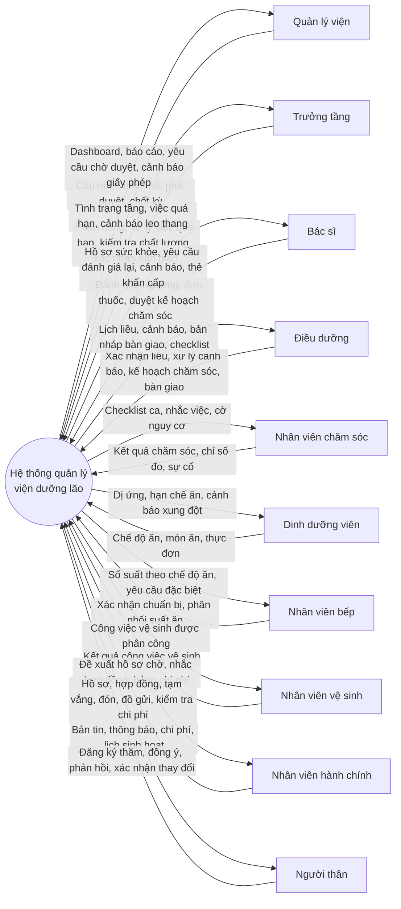

| Actor                | Dữ liệu vào hệ thống                                                                     | Dữ liệu ra từ hệ thống                                                      | Nguồn                   |
| -------------------- | ---------------------------------------------------------------------------------------- | --------------------------------------------------------------------------- | ----------------------- |
| Quản lý viện         | Tham số cấu hình, phê duyệt, chốt kỳ chi phí, cấu hình phân quyền                        | Dashboard, báo cáo, yêu cầu chờ duyệt, cảnh báo giấy phép sắp hết hạn       | 2.3, M11, M14, M15      |
| Trưởng tầng          | Phân công, điều phối, xử lý việc quá hạn, kết quả kiểm tra chất lượng, xác nhận bàn giao | Tình trạng người cao tuổi trong tầng, việc quá hạn, cảnh báo leo thang      | 2.3, 13.3               |
| Bác sĩ               | Đánh giá, ngưỡng cảnh báo, đơn thuốc, đối chiếu thuốc, duyệt kế hoạch chăm sóc           | Hồ sơ sức khỏe, yêu cầu đánh giá lại, cảnh báo, thẻ thông tin khẩn cấp      | 2.3, M01, M06, M07      |
| Điều dưỡng           | Xác nhận liều, xử lý cảnh báo, phiên bản kế hoạch chăm sóc, bàn giao ca                  | Lịch liều, cảnh báo, bản nháp bàn giao, checklist ca                        | 2.3, M04, M05, M07, M09 |
| Nhân viên chăm sóc   | Kết quả công việc chăm sóc, chỉ số đo, sự cố                                             | Checklist ca, nhắc việc quá hạn, cờ nguy cơ                                 | 2.3, M04                |
| Dinh dưỡng viên      | Chế độ ăn, món ăn, thực đơn                                                              | Dị ứng và hạn chế ăn, cảnh báo xung đột, yêu cầu xem lại chế độ ăn          | 2.3, M08                |
| Nhân viên bếp        | Xác nhận chuẩn bị và phân phối suất ăn                                                   | Số suất theo chế độ ăn, yêu cầu đặc biệt, thay đổi phát sinh sau chốt       | 2.3, 12.3               |
| Nhân viên vệ sinh    | Kết quả công việc vệ sinh                                                                | Công việc vệ sinh phòng/khu vực được phân công                              | 2.3, 8.3                |
| Nhân viên hành chính | Hồ sơ, hợp đồng, đặt cọc, tạm vắng, đón, đồ gửi, người thân, kiểm tra chi phí            | Đề xuất hồ sơ chờ, nhắc hợp đồng, bảng chi phí kỳ, file chi phí cho kế toán | 2.3, M02, M10–M12       |
| Người thân           | Đăng ký thăm, bản đồng ý, xác nhận thay đổi, phản hồi                                    | Bản tin, thông báo, chi phí, lịch sinh hoạt                                 | 2.3, M10                |

## 2. Main Business Flows

Ba luồng chính, tương ứng mẫu "End-to-End" và "Self-Service": BF-01 là hành trình lưu trú trọn vòng, BF-02 là vòng ca chăm sóc lặp lại mỗi ngày bên trong BF-01, BF-03 là người thân tự phục vụ qua cổng. Làn "Hệ thống" thể hiện các bước tự động theo quy tắc nghiệp vụ.

### BF-01 – Hành trình lưu trú trọn vòng (End-to-End Resident Journey)

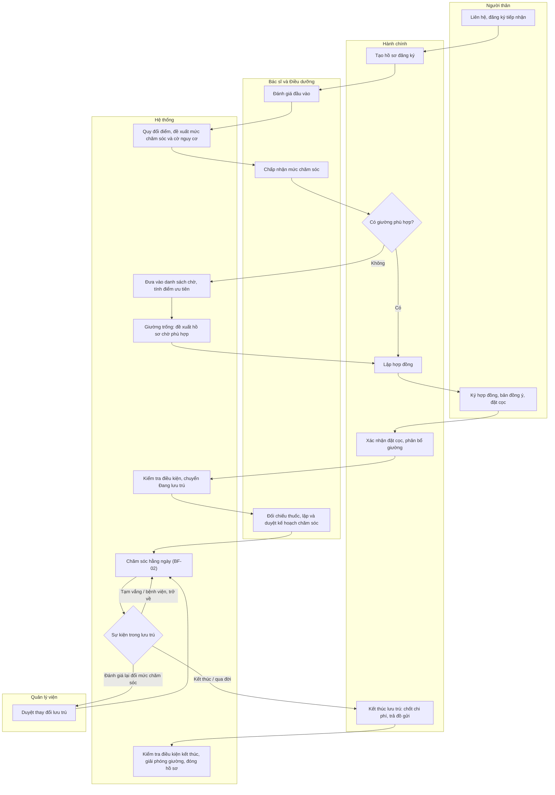

| Bước | Vai trò                | Hoạt động                                                                                     | Tham chiếu               |
| ---- | ---------------------- | --------------------------------------------------------------------------------------------- | ------------------------ |
| 1    | Người thân, Hành chính | Đăng ký, tạo hồ sơ                                                                            | 6.1                      |
| 2    | Bác sĩ, Hệ thống       | Đánh giá bằng thang điểm, hệ thống đề xuất mức chăm sóc; bác sĩ chấp nhận hoặc điều chỉnh     | 5.3, BR-M01-09           |
| 3    | Hành chính, Hệ thống   | Có giường thì lập hợp đồng; không có thì vào danh sách chờ, hệ thống đề xuất khi giường trống | 6.2, BR-M02-01, 02, 10   |
| 4    | Người thân, Hành chính | Ký hợp đồng, bản đồng ý chia sẻ dữ liệu, xác nhận đặt cọc, phân bổ giường                     | 5.1, 6.3, 6.5, BR-M03-01 |
| 5    | Hệ thống               | Kiểm tra điều kiện rồi chuyển Đang lưu trú                                                    | 5.6                      |
| 6    | Bác sĩ, Điều dưỡng     | Đối chiếu thuốc, lập và duyệt kế hoạch chăm sóc                                               | 11.5, BR-M04-19          |
| 7    | Hệ thống, Nhân viên    | Vòng ca hằng ngày (BF-02)                                                                     | M04–M09                  |
| 8    | Hệ thống, Quản lý      | Tạm vắng, nằm viện, đánh giá lại, thay đổi lưu trú có duyệt                                   | 6.6, 6.7, BR-M01-02, 03  |
| 9    | Hành chính, Hệ thống   | Kết thúc lưu trú hoặc qua đời: kiểm tra điều kiện, chốt chi phí, trả đồ, giải phóng giường    | 6.8, 5.6, BR-M11-08      |

### BF-02 – Vòng ca chăm sóc hằng ngày

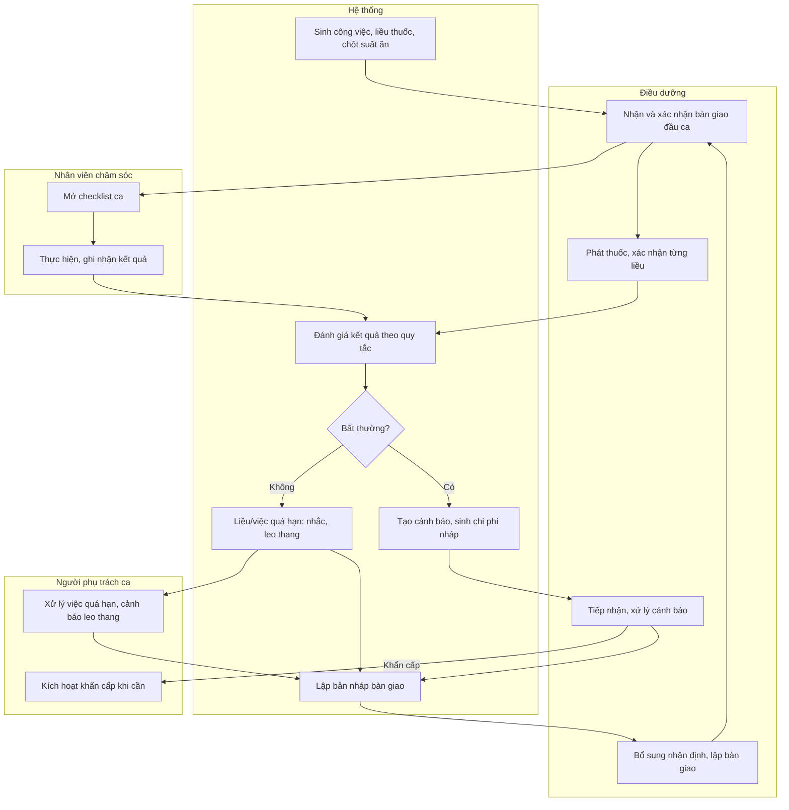

| Bước | Vai trò                        | Hoạt động                                                                 | Tham chiếu                           |
| ---- | ------------------------------ | ------------------------------------------------------------------------- | ------------------------------------ |
| 1    | Hệ thống                       | Sinh công việc, liều thuốc theo ca; chốt suất ăn trước bữa                | BR-M04-01, BR-M07-01, BR-M08-01      |
| 2    | Điều dưỡng                     | Nhận bàn giao đã tổng hợp sẵn, xác nhận; việc tồn vào checklist           | BR-M09-06 → 08                       |
| 3    | Nhân viên chăm sóc             | Mở checklist, thực hiện, ghi nhận kết quả                                 | 8.5, 8.6                             |
| 4    | Điều dưỡng                     | Phát thuốc, xác nhận từng liều trong cửa sổ thời gian                     | BR-M07-02                            |
| 5    | Hệ thống                       | Đánh giá kết quả theo ngưỡng và xu hướng; tạo cảnh báo; sinh chi phí nháp | BR-M04-08 → 10, BR-M05-04, BR-M11-01 |
| 6    | Điều dưỡng, Người phụ trách ca | Xử lý cảnh báo; quá hạn thì leo thang; khẩn cấp thì kích hoạt quy trình   | BR-M05-01, 9.5                       |
| 7    | Hệ thống, Điều dưỡng           | Lập bản nháp bàn giao, bổ sung nhận định, chuyển sang ca sau              | BR-M09-06                            |

### BF-03 – Người thân tự phục vụ (Family Self-Service)

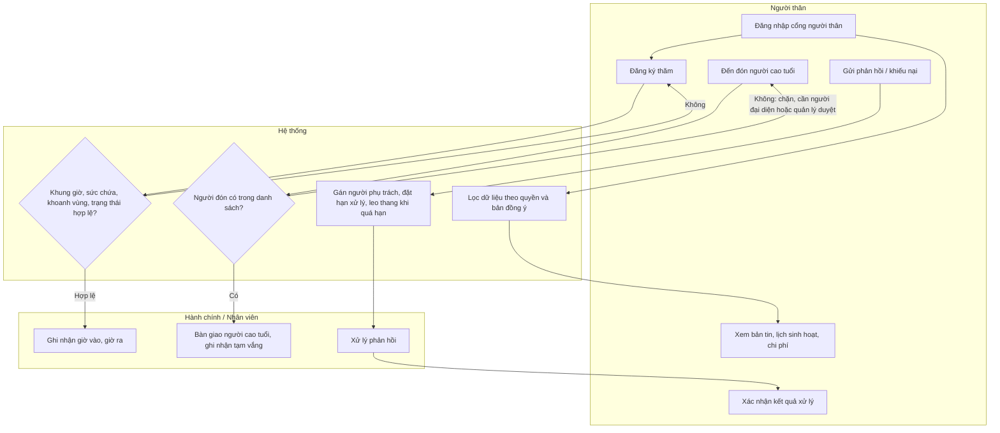

| Bước | Vai trò                         | Hoạt động                                                                                                | Tham chiếu           |
| ---- | ------------------------------- | -------------------------------------------------------------------------------------------------------- | -------------------- |
| 1    | Người thân, Hệ thống            | Xem bản tin, lịch, chi phí; dữ liệu sức khỏe chỉ hiện khi có đồng ý                                      | BR-M10-01, BR-M01-08 |
| 2    | Người thân, Hệ thống            | Đăng ký thăm; tự từ chối khi ngoài khung giờ, hết chỗ, khu khoanh vùng hoặc người cao tuổi đang nằm viện | BR-M10-02            |
| 3    | Người thân, Hành chính          | Đón người cao tuổi; chặn người không có trong danh sách                                                  | 14.3, BR-M10-03      |
| 4    | Người thân, Hệ thống, Nhân viên | Phản hồi có hạn xử lý, leo thang khi quá hạn, người thân xác nhận đóng                                   | 14.7, BR-M10-05      |

## 3. Conceptual Data Model

### 3.1. Entity Relationship Diagram

Đây là mô hình khái niệm: thể hiện thực thể và quan hệ nghiệp vụ, chưa có kiểu dữ liệu, khóa hay bảng kỹ thuật. Mô hình dữ liệu vật lý thuộc giai đoạn thiết kế sau này và phải khớp với mô hình này.

**ERD tổng quan (thực thể cốt lõi)**

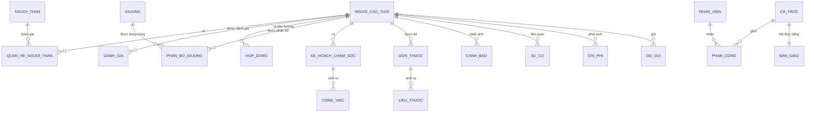

**Miền A – Người cao tuổi, người thân, đánh giá**

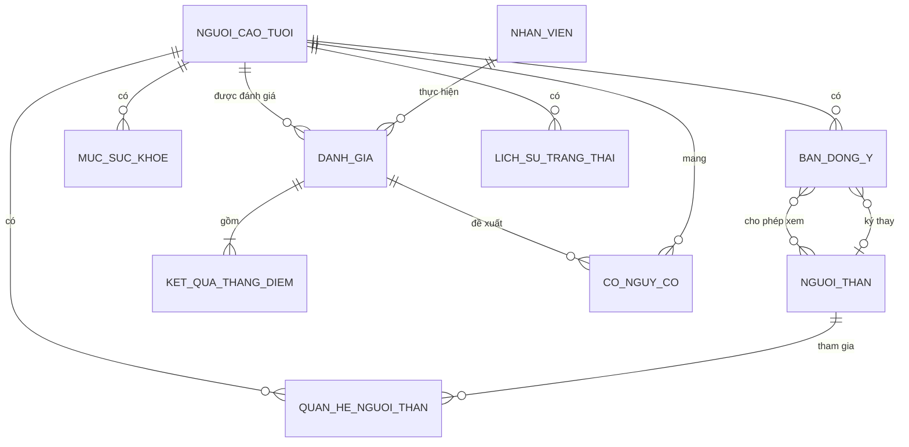

**Miền B – Lưu trú, hợp đồng, phòng giường**

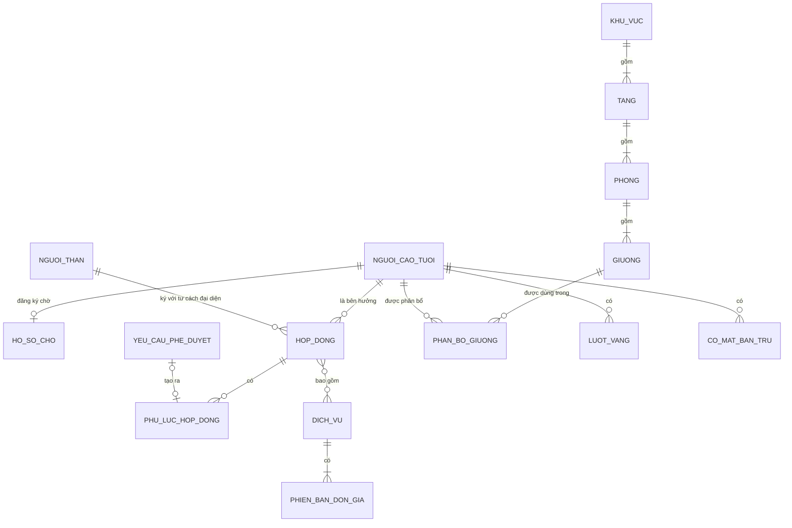

**Miền C – Chăm sóc, thuốc, sức khỏe, sự cố**

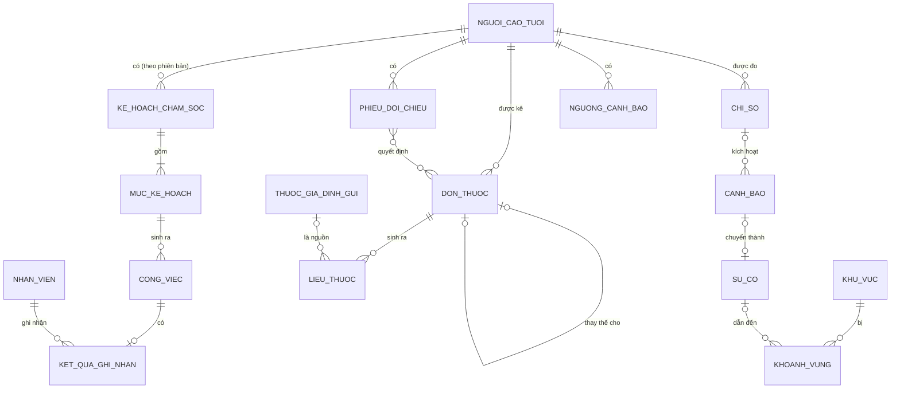

**Miền D – Nhân sự, ca trực, hoạt động**

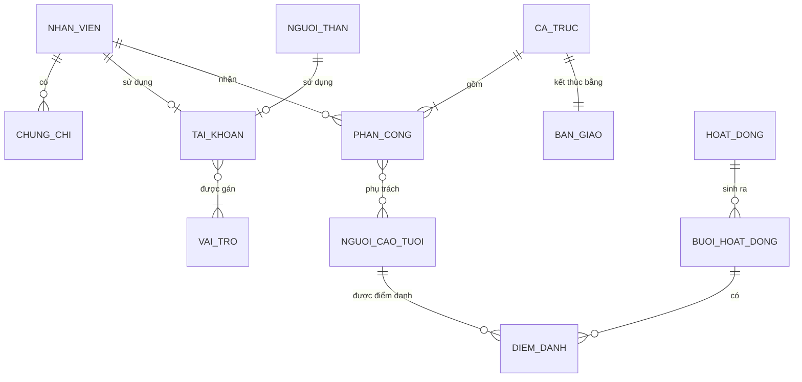

**Miền E – Chi phí, dinh dưỡng, đồ gửi, tương tác người thân**

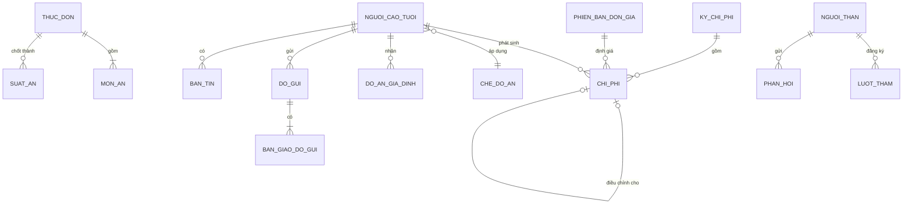

Quan hệ nguồn của CHI_PHI là quan hệ đa hình: mỗi khoản trỏ tới đúng một bản ghi nguồn thuộc CONG_VIEC, LIEU_THUOC, DIEM_DANH, LUOT_VANG, CO_MAT_BAN_TRU hoặc là khoản nhập tay (DBR-15). Các thực thể nền tảng THAM_SO, YEU_CAU_PHE_DUYET, NHAT_KY, DINH_CHINH, THONG_BAO dùng chung cho mọi miền nên không vẽ quan hệ riêng.

### 3.2. Entity Descriptions

Cột Nhóm theo phân loại ở mục 1.5 tab nghiệp vụ: **1** danh mục (được sửa), **2** nghiệp vụ có trạng thái (đổi qua lệnh hoặc phiên bản), **3** ghi nhận (chỉ ghi thêm).

| Thực thể                  | Mô tả                                                     | Thuộc tính chính                                                                                              | Nhóm           | Nguồn           |
| ------------------------- | --------------------------------------------------------- | ------------------------------------------------------------------------------------------------------------- | -------------- | --------------- |
| NGUOI_CAO_TUOI            | Người được chăm sóc tại viện                              | Mã hồ sơ, họ tên, ngày sinh, giới tính, CCCD, ảnh, loại lưu trú, mức chăm sóc, trạng thái                     | 2              | 5.1, 5.5        |
| NGUOI_THAN                | Người thân hoặc người đại diện của người cao tuổi         | Họ tên, số điện thoại, địa chỉ                                                                                | 1              | 14.1            |
| QUAN_HE_NGUOI_THAN        | Liên kết người cao tuổi – người thân kèm vai trò và quyền | Quan hệ, là đại diện, là liên hệ chính, được phép đón, các quyền xem                                          | 2              | 14.1, BR-M10-07 |
| BAN_DONG_Y                | Đồng ý xử lý và chia sẻ dữ liệu                           | Người đồng ý, phạm vi, người thân được xem, thời điểm, bằng chứng, trạng thái                                 | 2              | 5.1, BR-M01-08  |
| MUC_SUC_KHOE              | Một mục dị ứng, bệnh nền hoặc tiền sử                     | Loại, nội dung, mức độ, nguồn, người ghi, trạng thái, lý do loại trừ                                          | 2              | 5.2, BR-M01-07  |
| DANH_GIA                  | Một lần đánh giá đầu vào hoặc đánh giá lại                | Loại, lý do, thời điểm, người thực hiện, mức chăm sóc đề xuất, mức được chấp nhận, lý do khác đề xuất         | 3              | 5.3, 5.4        |
| KET_QUA_THANG_DIEM        | Điểm của một thang trong lần đánh giá                     | Thang (Barthel, Braden, Morse, MMSE), điểm, phân loại                                                         | 3              | 5.3             |
| CO_NGUY_CO                | Cờ nguy cơ đang gắn cho người cao tuổi                    | Loại (ngã, loét, đi lạc), đánh giá gắn cờ, đánh giá gỡ cờ                                                     | 2              | BR-M01-10       |
| LICH_SU_TRANG_THAI        | Mỗi lần chuyển trạng thái                                 | Trạng thái từ, đến, lệnh, thời điểm, người thực hiện, lý do                                                   | 3              | BR-M01-04       |
| HO_SO_CHO                 | Hồ sơ trong danh sách chờ                                 | Ngày đăng ký, loại lưu trú, mức chăm sóc, điểm ưu tiên, trạng thái, hạn giữ chỗ                               | 2              | 6.2, BR-M02-10  |
| HOP_DONG                  | Hợp đồng lưu trú gốc                                      | Số hợp đồng, loại lưu trú, thời hạn, mức chăm sóc, chính sách phí và giữ giường, trạng thái                   | 2              | 6.3             |
| PHU_LUC_HOP_DONG          | Thay đổi đã duyệt gắn với hợp đồng                        | Nội dung thay đổi (trước/sau), ngày hiệu lực, trạng thái áp dụng                                              | 2              | 6.6, BR-M02-09  |
| DICH_VU                   | Dịch vụ viện cung cấp                                     | Tên, đơn vị tính, có trong gói, trạng thái hiệu lực                                                           | 1              | 6.4             |
| PHIEN_BAN_DON_GIA         | Đơn giá của dịch vụ/vật phẩm theo thời gian               | Đơn giá, hiệu lực từ, hiệu lực đến                                                                            | 1              | 6.4             |
| KHU_VUC, TANG, PHONG      | Cơ cấu vị trí                                             | Mã, tên; phòng có loại, mức chăm sóc cho phép, chính sách giới tính, trạng thái cách ly                       | 1              | 7.1             |
| GIUONG                    | Giường trong phòng                                        | Mã, trạng thái, lý do giữ chỗ, hạn giữ chỗ                                                                    | 2              | 7.2             |
| PHAN_BO_GIUONG            | Người cao tuổi dùng giường trong một khoảng thời gian     | Bắt đầu, kết thúc, lý do, người thực hiện                                                                     | 2              | 7.3, BR-M03-07  |
| LUOT_VANG                 | Một lần tạm vắng hoặc nằm viện                            | Loại vắng, rời lúc, dự kiến về, về lúc, người đón, người bàn giao, chính sách áp dụng                         | 2              | 6.7             |
| CO_MAT_BAN_TRU            | Trạng thái có mặt của người bán trú theo ngày             | Ngày, trạng thái, giờ đến, giờ về                                                                             | 2              | 3.4             |
| KE_HOACH_CHAM_SOC         | Phiên bản kế hoạch chăm sóc                               | Số phiên bản, hiệu lực từ, trạng thái, người lập, người duyệt                                                 | 2              | 8.1, BR-M04-19  |
| MUC_KE_HOACH              | Một hoạt động chăm sóc trong kế hoạch                     | Loại công việc, tần suất, khung giờ, mức quan trọng, vai trò thực hiện, có tính phí                           | 2              | 8.1             |
| CONG_VIEC                 | Công việc cụ thể trong một ca                             | Thời điểm dự kiến, khung cho phép, người phụ trách, trạng thái, lý do không thực hiện                         | 2              | 8.3, BR-M04-04  |
| KET_QUA_GHI_NHAN          | Kết quả thực hiện công việc                               | Giá trị kết quả, thời điểm thực hiện, thời điểm ghi, ghi nhận muộn                                            | 3              | 8.6             |
| DON_THUOC                 | Đơn thuốc của người cao tuổi                              | Thuốc, hoạt chất, liều, đường dùng, tần suất, loại (định kỳ/PRN), nguồn thuốc, người kê, cơ sở kê, trạng thái | 2              | 11.1            |
| LIEU_THUOC                | Một liều cụ thể                                           | Thời điểm dự kiến, cửa sổ, trạng thái, thời điểm xác nhận, người xác nhận, phản ứng                           | 3              | 11.2, BR-M07-02 |
| PHIEU_DOI_CHIEU           | Đối chiếu thuốc khi tiếp nhận/trở về                      | Lý do, quyết định từng thuốc, người thực hiện, người xác nhận                                                 | 3              | 11.5            |
| THUOC_GIA_DINH_GUI        | Thuốc gia đình gửi                                        | Tên, hàm lượng, số lượng còn, hạn dùng, có toa, trạng thái                                                    | 2              | 11.4            |
| CHI_SO                    | Một lần đo chỉ số                                         | Loại chỉ số, giá trị, thời điểm, người đo                                                                     | 3              | 10.1            |
| NGUONG_CANH_BAO           | Ngưỡng của một chỉ số                                     | Mức cảnh báo, mức nguy hiểm, hiệu lực, người thiết lập                                                        | 2              | 10.3            |
| CANH_BAO                  | Tín hiệu cần xử lý                                        | Loại, mức độ, nguồn, trạng thái, số lần gộp, người phụ trách, hạn tiếp nhận                                   | 2              | 9.4, BR-M05-01  |
| SU_CO                     | Sự việc đã xảy ra                                         | Loại, mức độ, thời gian, địa điểm, mô tả, xử lý, người phát hiện, đã đối chiếu nguyện vọng                    | 3              | 9.2, 9.5        |
| KHOANH_VUNG               | Khu vực bị khoanh vùng lây nhiễm                          | Khu vực, bắt đầu, kết thúc, người khoanh, người gỡ, danh sách tiếp xúc                                        | 2              | 9.6, BR-M05-11  |
| NHAN_VIEN                 | Nhân viên của viện                                        | Họ tên, chức danh, chuyên môn, trạng thái làm việc                                                            | 1              | 13.1            |
| CHUNG_CHI                 | Giấy phép hành nghề hoặc đào tạo                          | Loại, số, phạm vi, ngày cấp, ngày hết hạn                                                                     | 1              | 13.1, BR-M09-01 |
| TAI_KHOAN, VAI_TRO        | Đăng nhập và vai trò hệ thống                             | Tên đăng nhập, trạng thái; vai trò, quyền                                                                     | 1              | 19.1, 19.2      |
| CA_TRUC                   | Một ca cụ thể                                             | Ngày, giờ bắt đầu, giờ kết thúc, khu vực, người phụ trách ca, trạng thái                                      | 2              | 13.2            |
| PHAN_CONG                 | Nhân viên được giao người cao tuổi/khu vực trong ca       | Vai trò (chính/hỗ trợ), phạm vi                                                                               | 2              | 13.4            |
| BAN_GIAO                  | Bàn giao cuối ca                                          | Nội dung tự tổng hợp, nhận định, người lập, người xác nhận, trạng thái                                        | 3              | 13.5, BR-M09-06 |
| HOAT_DONG, BUOI_HOAT_DONG | Hoạt động và từng buổi cụ thể                             | Loại, mẫu lặp, số lượng tối đa, có phí; ngày giờ buổi                                                         | 1 / 2          | 8.8             |
| DIEM_DANH                 | Điểm danh người tham gia buổi hoạt động                   | Có mặt, mức độ tham gia, tình trạng sau                                                                       | 3              | 8.8             |
| CHE_DO_AN, MON_AN         | Chế độ ăn và món ăn                                       | Tên; thành phần gây dị ứng, chế độ phù hợp                                                                    | 1              | 12.1            |
| THUC_DON                  | Thực đơn tuần                                             | Kỳ, trạng thái                                                                                                | 2              | 12.2, BR-M08-06 |
| SUAT_AN                   | Số suất đã chốt cho một bữa                               | Bữa, chế độ ăn, số lượng, phát sinh sau chốt                                                                  | 3              | BR-M08-01       |
| DO_AN_GIA_DINH            | Đồ ăn gia đình mang vào                                   | Loại, số lượng, kết quả đối chiếu, trạng thái                                                                 | 2              | 12.4            |
| CHI_PHI                   | Một khoản chi phí phát sinh                               | Loại, số lượng, đơn giá, số tiền, nguồn, tham chiếu nguồn, trạng thái, khoản điều chỉnh cho                   | 2 → 3 khi chốt | 15.3            |
| KY_CHI_PHI                | Kỳ chi phí                                                | Từ ngày, đến ngày, trạng thái chốt, người chốt                                                                | 2              | 15.6            |
| DO_GUI, BAN_GIAO_DO_GUI   | Đồ gửi và từng lần bàn giao                               | Vật phẩm, số lượng, vị trí, trạng thái; người giao, người nhận, thời điểm, tình trạng                         | 2 / 3          | 16              |
| LUOT_THAM                 | Một lượt thăm                                             | Người thăm, thời gian đăng ký, giờ vào, giờ ra, trạng thái                                                    | 2              | 14.2            |
| PHAN_HOI                  | Phản hồi, khiếu nại                                       | Nội dung, loại, ưu tiên, hạn, người phụ trách, kết quả, trạng thái                                            | 2              | 14.7            |
| BAN_TIN                   | Bản tin định kỳ gửi người thân                            | Kỳ, nội dung tổng hợp, nhận xét, người duyệt, thời điểm gửi                                                   | 3              | BR-M10-08       |
| THONG_BAO                 | Một thông báo đã gửi                                      | Nguồn, người nhận, kênh, thời điểm gửi, thời điểm xem                                                         | 3              | 17              |
| YEU_CAU_PHE_DUYET         | Yêu cầu phê duyệt dùng chung                              | Loại, nội dung, người yêu cầu, người duyệt, trạng thái                                                        | 2              | 1.5             |
| THAM_SO                   | Tham số cấu hình                                          | Mã CFG, giá trị, kiểu, mô tả                                                                                  | 1              | Phụ lục 25      |
| NHAT_KY, DINH_CHINH       | Nhật ký thay đổi và bản ghi đính chính                    | Đối tượng, hành động, trước/sau, lý do; bản ghi gốc, nội dung sửa                                             | 3              | 19.4, 1.5       |

### 3.3. Data Business Rules

Quy tắc dữ liệu là các ràng buộc luôn đúng trên dữ liệu (tính duy nhất, bội số, bất biến), khác với BR là quy tắc hành vi. Mỗi DBR cần xuất hiện trong spec của feature tương ứng dưới dạng yêu cầu có kịch bản chấp nhận.

| Mã     | Quy tắc                                                                                                                                                       | Thực thể                       | Nguồn             |
| ------ | ------------------------------------------------------------------------------------------------------------------------------------------------------------- | ------------------------------ | ----------------- |
| DBR-01 | Mã hồ sơ người cao tuổi là duy nhất; CCCD là duy nhất nếu có. Mỗi người cao tuổi có đúng một trạng thái hiện tại                                              | NGUOI_CAO_TUOI                 | 5.1, 5.5          |
| DBR-02 | Người cao tuổi đang lưu trú có đúng một người liên hệ chính và ít nhất một người đại diện                                                                     | QUAN_HE_NGUOI_THAN             | 14.1              |
| DBR-03 | Người thân chỉ có quyền xem sức khỏe khi nằm trong phạm vi một bản đồng ý đang hiệu lực                                                                       | BAN_DONG_Y, QUAN_HE_NGUOI_THAN | BR-M01-08         |
| DBR-04 | Mục dị ứng, bệnh nền không bao giờ bị xóa; chỉ chuyển Đã loại trừ kèm lý do và người thực hiện                                                                | MUC_SUC_KHOE                   | BR-M01-07         |
| DBR-05 | Lần đánh giá có mức chăm sóc được chấp nhận khác mức đề xuất thì bắt buộc có lý do                                                                            | DANH_GIA                       | BR-M01-09         |
| DBR-06 | Mỗi người cao tuổi có tối đa một hợp đồng hiệu lực tại một thời điểm; hợp đồng hiệu lực không bị sửa                                                          | HOP_DONG                       | BR-M02-08, 09     |
| DBR-07 | Phụ lục hợp đồng phải gắn với một yêu cầu phê duyệt đã duyệt; ngày hiệu lực không sớm hơn ngày bắt đầu hợp đồng                                               | PHU_LUC_HOP_DONG               | 6.6               |
| DBR-08 | Các phiên bản đơn giá của cùng một dịch vụ không chồng khoảng hiệu lực                                                                                        | PHIEN_BAN_DON_GIA              | 6.4               |
| DBR-09 | Tại một thời điểm, mỗi giường có tối đa một phân bổ đang mở; mỗi người cao tuổi nội trú có tối đa một phân bổ đang mở                                         | PHAN_BO_GIUONG                 | 7.3               |
| DBR-10 | Phân bổ chỉ được tạo khi giường Trống (hoặc đang giữ chỗ cho chính người đó), phòng khớp mức chăm sóc, giới tính và không bị cách ly                          | PHAN_BO_GIUONG, GIUONG, PHONG  | BR-M03-01         |
| DBR-11 | Mỗi người cao tuổi có tối đa một phiên bản kế hoạch chăm sóc hiệu lực tại một ngày                                                                            | KE_HOACH_CHAM_SOC              | BR-M04-19         |
| DBR-12 | Công việc là duy nhất theo (mục kế hoạch, thời điểm dự kiến), để sinh lại không tạo trùng                                                                     | CONG_VIEC                      | BR-M04-01, NFR-04 |
| DBR-13 | Liều thuốc là duy nhất theo (đơn thuốc, thời điểm dự kiến) và chỉ có một lần xác nhận                                                                         | LIEU_THUOC                     | BR-M07-12         |
| DBR-14 | Đơn thuốc hiệu lực không đổi thuốc, liều, tần suất. Đơn thay thế trỏ về đơn cũ, và đơn cũ chuyển Đã ngừng trong cùng giao dịch                                | DON_THUOC                      | 11.1              |
| DBR-15 | Mỗi khoản chi phí có đúng một nguồn: một bản ghi nguồn (công việc, liều thuốc, điểm danh, lượt vắng, có mặt bán trú) hoặc "nhập tay" kèm lý do và người duyệt | CHI_PHI                        | BR-M11-01, 04     |
| DBR-16 | Đơn giá của khoản chi phí là phiên bản hiệu lực tại ngày phát sinh; khoản thuộc gói có số tiền 0                                                              | CHI_PHI                        | BR-M11-02, 03     |
| DBR-17 | Khi kỳ đã chốt, các khoản thuộc kỳ không đổi; sai sót được ghi bằng khoản điều chỉnh mới trỏ về khoản gốc                                                     | KY_CHI_PHI, CHI_PHI            | 15.6              |
| DBR-18 | Cùng một người cao tuổi không có hai cảnh báo cùng loại đang mở; cảnh báo mới được gộp vào cảnh báo cũ                                                        | CANH_BAO                       | BR-M05-02         |
| DBR-19 | Sự cố khẩn cấp không sửa, không xóa; nếu người cao tuổi có nguyện vọng cuối đời thì phải có xác nhận đã đối chiếu                                             | SU_CO                          | BR-M05-08, 13     |
| DBR-20 | Mỗi ca kết thúc có đúng một bàn giao; bàn giao đã xác nhận không sửa được                                                                                     | CA_TRUC, BAN_GIAO              | BR-M09-07, 08     |
| DBR-21 | Phân công không được gán nhân viên có chứng chỉ bắt buộc đã hết hạn; một nhân viên không có hai ca chồng giờ                                                  | PHAN_CONG, CHUNG_CHI           | BR-M09-01, 03     |
| DBR-22 | Mỗi đồ gửi có ít nhất một lần bàn giao (lần tiếp nhận); trạng thái hiện tại xác định theo lần bàn giao gần nhất                                               | DO_GUI, BAN_GIAO_DO_GUI        | 16                |
| DBR-23 | Mọi thay đổi dữ liệu nhóm 2 và 3 có bản ghi nhật ký; mỗi bản đính chính trỏ đúng một bản ghi gốc                                                              | NHAT_KY, DINH_CHINH            | 19.4, 1.5         |
| DBR-24 | Mỗi mã tham số có đúng một giá trị hiện hành; các giá trị cũ được lưu lịch sử                                                                                 | THAM_SO                        | BR-M15-04         |
| DBR-25 | Mọi mốc thời gian theo múi giờ Asia/Ho_Chi_Minh; bản ghi ngoại tuyến lưu cả thời điểm trên thiết bị và thời điểm đồng bộ                                      | Tất cả                         | NFR-09, 8.6       |

## 4. User Requirements

### 4.1. Actors

| Mã    | Actor                | Loại               | Mô tả                                                                                                                | Kênh sử dụng                             |
| ----- | -------------------- | ------------------ | -------------------------------------------------------------------------------------------------------------------- | ---------------------------------------- |
| AC-00 | Nhân viên            | Chính (trừu tượng) | Actor cha của AC-01 → AC-09: đăng nhập, tra cứu hồ sơ trong phạm vi, nhận thông báo, ghi nhận sự cố                  | —                                        |
| AC-01 | Quản lý viện         | Chính              | Cấu hình, phê duyệt, chốt kỳ chi phí, xem báo cáo                                                                    | Web quản trị                             |
| AC-02 | Trưởng tầng          | Chính              | Điều phối tầng, phân công, xử lý việc quá hạn, kiểm tra chất lượng; thường là người phụ trách ca                     | App nhân viên, web                       |
| AC-03 | Bác sĩ               | Chính              | Đánh giá, ngưỡng, đơn thuốc (trong phạm vi giấy phép), duyệt kế hoạch chăm sóc                                       | App nhân viên, web                       |
| AC-04 | Điều dưỡng           | Chính              | Thuốc, cảnh báo, kế hoạch chăm sóc, bàn giao ca                                                                      | App nhân viên                            |
| AC-05 | Nhân viên chăm sóc   | Chính              | Thực hiện và ghi nhận công việc chăm sóc, đo chỉ số                                                                  | App nhân viên                            |
| AC-06 | Dinh dưỡng viên      | Chính              | Chế độ ăn, món ăn, thực đơn                                                                                          | Web                                      |
| AC-07 | Nhân viên bếp        | Chính              | Xem số suất đã chốt và yêu cầu đặc biệt                                                                              | App hoặc màn hình bếp                    |
| AC-08 | Nhân viên vệ sinh    | Chính              | Thực hiện công việc vệ sinh được phân công                                                                           | App nhân viên                            |
| AC-09 | Nhân viên hành chính | Chính              | Tiếp nhận, hợp đồng, tạm vắng, đón, đồ gửi, kiểm tra chi phí                                                         | Web                                      |
| AC-10 | Người thân           | Chính              | Xem thông tin được phép, đăng ký thăm, phản hồi, xác nhận thay đổi                                                   | Cổng người thân (trình duyệt điện thoại) |
| AC-11 | Bộ lập lịch hệ thống | Hệ thống           | Khởi phát các use case theo thời gian: sinh công việc/liều/buổi, kiểm tra quá hạn, leo thang, nhắc hạn, sinh bản tin | —                                        |
| AC-12 | Hệ thống kế toán     | Phụ (bên ngoài)    | Nhận file chi phí đã chốt                                                                                            | File Excel/CSV                           |
| AC-13 | Nhà cung cấp SMS     | Phụ (bên ngoài)    | Gửi tin nhắn thông báo                                                                                               | Cổng SMS                                 |

Người cao tuổi không phải actor vì không trực tiếp dùng hệ thống. Bộ lập lịch (AC-11) được mô hình hóa thành actor để các use case tự động (sinh công việc, leo thang…) xuất hiện rõ trên diagram; đây là phần làm hệ thống khác với CRUD.

### 4.2. Danh sách Use Case

Tên use case là **lệnh nghiệp vụ** (động từ + đối tượng), không gộp thành "Quản lý X" theo kiểu Thêm/Sửa/Xóa. Cột Feature là nhánh Spec Kit tương ứng.

| Mã    | Use case                              | Actor chính                             | Feature  | Quy tắc chính       |
| ----- | ------------------------------------- | --------------------------------------- | -------- | ------------------- |
| UC-01 | Tạo hồ sơ người cao tuổi              | Hành chính                              | 001      | 5.1, DBR-01         |
| UC-02 | Tra cứu hồ sơ                         | Nhân viên                               | 001      | 5.1, BR-M15-01      |
| UC-03 | Ghi nhận bản đồng ý chia sẻ dữ liệu   | Hành chính                              | 001      | 5.1, BR-M01-08      |
| UC-04 | Ghi nhận / loại trừ dị ứng, bệnh nền  | Bác sĩ, Điều dưỡng                      | 001      | BR-M01-07           |
| UC-05 | Đánh giá đầu vào                      | Bác sĩ                                  | 001      | 5.3, BR-M01-09, 10  |
| UC-06 | Đánh giá lại                          | Bác sĩ                                  | 001      | 5.4, BR-M01-03      |
| UC-07 | Tạo yêu cầu đánh giá lại              | Bộ lập lịch                             | 001      | BR-M01-02           |
| UC-08 | Hoàn tất / hủy tiếp nhận              | Hành chính                              | 001, 004 | 5.6, BR-M01-06      |
| UC-09 | Đăng ký tiếp nhận                     | Hành chính                              | 004      | 6.1                 |
| UC-10 | Đề xuất hồ sơ chờ khi có giường trống | Bộ lập lịch, Hành chính                 | 004      | BR-M02-01, 02, 10   |
| UC-11 | Lập hợp đồng lưu trú                  | Hành chính                              | 004      | 6.3, BR-M02-08      |
| UC-12 | Xác nhận đặt cọc                      | Hành chính                              | 004      | 6.5                 |
| UC-13 | Yêu cầu thay đổi lưu trú              | Hành chính, Bác sĩ                      | 004      | 6.6                 |
| UC-14 | Duyệt yêu cầu                         | Quản lý viện                            | 000, 004 | 1.5, BR-M02-04      |
| UC-15 | Cho tạm vắng / ghi nhận trở về        | Hành chính, Trưởng tầng                 | 004      | 6.7, 5.6, BR-M02-06 |
| UC-16 | Chuyển viện                           | Điều dưỡng, Bác sĩ                      | 004, 007 | 5.6, BR-M05-14      |
| UC-17 | Kết thúc lưu trú                      | Hành chính                              | 004      | 6.8, 5.6            |
| UC-18 | Ghi nhận qua đời                      | Bác sĩ                                  | 004      | 6.8                 |
| UC-19 | Cấu hình khu, tầng, phòng, giường     | Quản lý viện                            | 003      | 7.1                 |
| UC-20 | Phân bổ giường                        | Hành chính                              | 003      | BR-M03-01, 02       |
| UC-21 | Chuyển giường                         | Trưởng tầng, Hành chính                 | 003      | BR-M03-04, 07       |
| UC-22 | Lập phiên bản kế hoạch chăm sóc       | Điều dưỡng                              | 005      | 8.1                 |
| UC-23 | Duyệt kế hoạch chăm sóc               | Bác sĩ                                  | 005      | BR-M04-19           |
| UC-24 | Sinh công việc theo ca                | Bộ lập lịch                             | 005      | BR-M04-01 → 04      |
| UC-25 | Xem checklist ca                      | Nhân viên chăm sóc, Điều dưỡng, Vệ sinh | 005      | 8.5                 |
| UC-26 | Ghi nhận thực hiện công việc          | Nhân viên chăm sóc, Điều dưỡng, Vệ sinh | 005      | 8.6, BR-M04-12, 14  |
| UC-27 | Xử lý công việc quá hạn               | Trưởng tầng                             | 005      | BR-M04-05, 06       |
| UC-28 | Điểm danh bán trú đến/về              | Hành chính, Nhân viên chăm sóc          | 005      | 3.4, BR-M04-02      |
| UC-29 | Tổ chức hoạt động và điểm danh        | Trưởng tầng, Nhân viên chăm sóc         | 014      | 8.8, BR-M04-15, 21  |
| UC-30 | Tổ chức hoạt động ngoài viện          | Trưởng tầng                             | 014      | 8.9, BR-M04-16, 17  |
| UC-31 | Kiểm tra chất lượng ngẫu nhiên        | Trưởng tầng                             | 014      | BR-M04-23           |
| UC-32 | Ghi nhận chỉ số sức khỏe              | Nhân viên chăm sóc, Điều dưỡng          | 007      | 10.1, BR-M06-03, 04 |
| UC-33 | Thiết lập ngưỡng cảnh báo             | Bác sĩ                                  | 007      | 10.3, BR-M06-01     |
| UC-34 | Tiếp nhận và xử lý cảnh báo           | Điều dưỡng                              | 007      | 9.4, BR-M05-01, 02  |
| UC-35 | Ghi nhận sự cố                        | Nhân viên                               | 007      | 9.2                 |
| UC-36 | Kích hoạt quy trình khẩn cấp          | Nhân viên                               | 007      | 9.5, BR-M05-06, 13  |
| UC-37 | Khoanh vùng lây nhiễm                 | Bác sĩ                                  | 007      | 9.6, BR-M05-10 → 12 |
| UC-38 | Leo thang cảnh báo quá hạn            | Bộ lập lịch                             | 007      | BR-M05-01           |
| UC-39 | Nhập đơn thuốc / đơn thay thế         | Bác sĩ                                  | 006      | 11.1, BR-M07-05, 06 |
| UC-40 | Ngừng đơn thuốc                       | Bác sĩ                                  | 006      | BR-M07-07           |
| UC-41 | Phát thuốc và xác nhận liều           | Điều dưỡng                              | 006      | BR-M07-02, 12       |
| UC-42 | Dùng thuốc khi cần (PRN)              | Điều dưỡng                              | 006      | BR-M07-04           |
| UC-43 | Đối chiếu thuốc                       | Bác sĩ, Điều dưỡng                      | 006      | 11.5, BR-M07-09     |
| UC-44 | Tiếp nhận thuốc gia đình gửi          | Điều dưỡng                              | 006      | 11.4, BR-M07-10, 11 |
| UC-45 | Gán chế độ ăn / duyệt chế độ bệnh lý  | Dinh dưỡng viên, Bác sĩ                 | 011      | BR-M08-03           |
| UC-46 | Lập và công bố thực đơn               | Dinh dưỡng viên                         | 011      | BR-M08-06 → 08      |
| UC-47 | Xem số suất đã chốt                   | Nhân viên bếp                           | 011      | BR-M08-01           |
| UC-48 | Đối chiếu đồ ăn gia đình              | Điều dưỡng, Dinh dưỡng viên             | 011      | BR-M08-04           |
| UC-49 | Quản lý hồ sơ nhân viên và chứng chỉ  | Quản lý viện                            | 008      | 13.1, BR-M09-05     |
| UC-50 | Lập và công bố lịch ca                | Quản lý viện, Trưởng tầng               | 008, 015 | 13.2, BR-M09-09     |
| UC-51 | Phân công chăm sóc                    | Trưởng tầng                             | 008      | 13.4, BR-M09-01, 02 |
| UC-52 | Lập bàn giao cuối ca                  | Điều dưỡng                              | 008      | BR-M09-06, 07       |
| UC-53 | Xác nhận bàn giao                     | Điều dưỡng, Trưởng tầng                 | 008      | BR-M09-08           |
| UC-54 | Yêu cầu đổi ca                        | Nhân viên                               | 015      | BR-M09-10           |
| UC-55 | Quản lý người thân và quyền           | Hành chính                              | 012      | 14.1, BR-M10-07     |
| UC-56 | Xem thông tin trên cổng               | Người thân                              | 012      | BR-M10-01           |
| UC-57 | Đăng ký thăm                          | Người thân                              | 012      | BR-M10-02           |
| UC-58 | Đón người cao tuổi                    | Hành chính                              | 012      | 14.3, BR-M10-03     |
| UC-59 | Gửi phản hồi / khiếu nại              | Người thân                              | 012      | 14.7, BR-M10-05     |
| UC-60 | Duyệt và gửi bản tin                  | Điều dưỡng                              | 012      | BR-M10-08, 09       |
| UC-61 | Kiểm tra chi phí phát sinh            | Hành chính                              | 010      | 15.6                |
| UC-62 | Duyệt và chốt kỳ chi phí              | Quản lý viện                            | 010      | BR-M11-06           |
| UC-63 | Tạo khoản điều chỉnh                  | Hành chính                              | 010      | BR-M11-05           |
| UC-64 | Xuất dữ liệu cho kế toán              | Hành chính                              | 010      | 23                  |
| UC-65 | Tiếp nhận, bàn giao, trả đồ gửi       | Hành chính                              | 013      | 16, BR-M12-01 → 05  |
| UC-66 | Nhận và xác nhận thông báo            | Nhân viên, Người thân                   | 009      | BR-M13-01, 02       |
| UC-67 | Xem dashboard và báo cáo              | Quản lý viện, Trưởng tầng               | 016      | 18                  |
| UC-68 | Quản lý tài khoản và phân quyền       | Quản lý viện                            | 002      | 19.1, 19.2          |
| UC-69 | Cấu hình tham số                      | Quản lý viện                            | 000      | BR-M15-04           |
| UC-70 | Đăng nhập                             | Nhân viên, Người thân                   | 002      | BR-M15-05           |

### 4.3. Use Case Diagrams

Mermaid không có ký hiệu use case chuẩn UML, nên các diagram dưới đây dùng quy ước: hình chữ nhật là actor, hình viên thuốc là use case, khung ngoài là ranh giới hệ thống. Mũi tên nét đứt `«include»` đi từ use case gốc sang use case được bao gồm; `«extend»` đi từ use case mở rộng về use case gốc. Khi đưa vào báo cáo, có thể vẽ lại bằng PlantUML theo đúng các quan hệ này.

**Tổng quan theo gói chức năng**

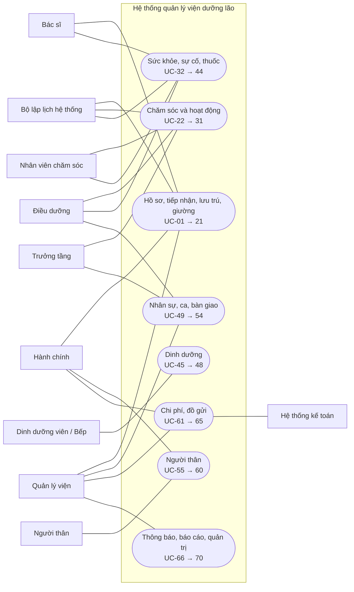

**D1 – Hồ sơ, tiếp nhận và lưu trú**

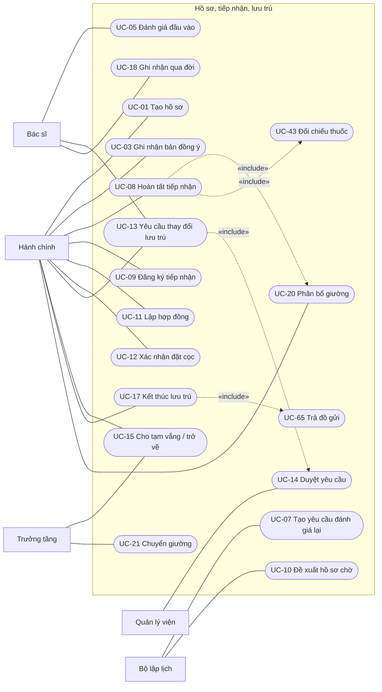

**D2 – Chăm sóc hằng ngày và hoạt động**

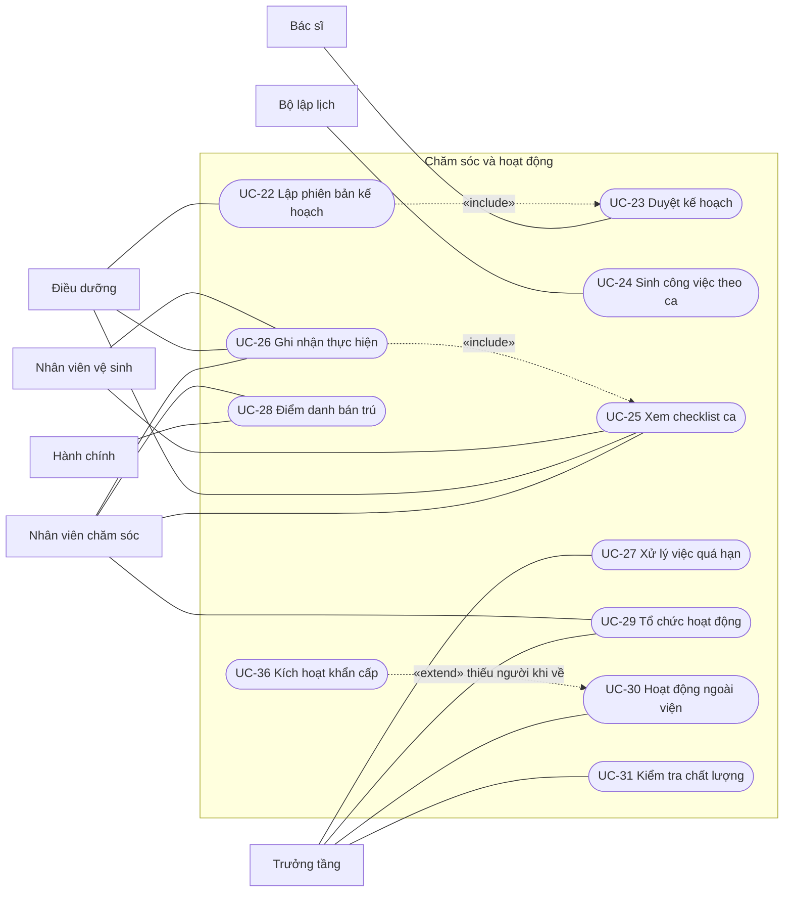

**D3 – Sức khỏe, sự cố và thuốc**

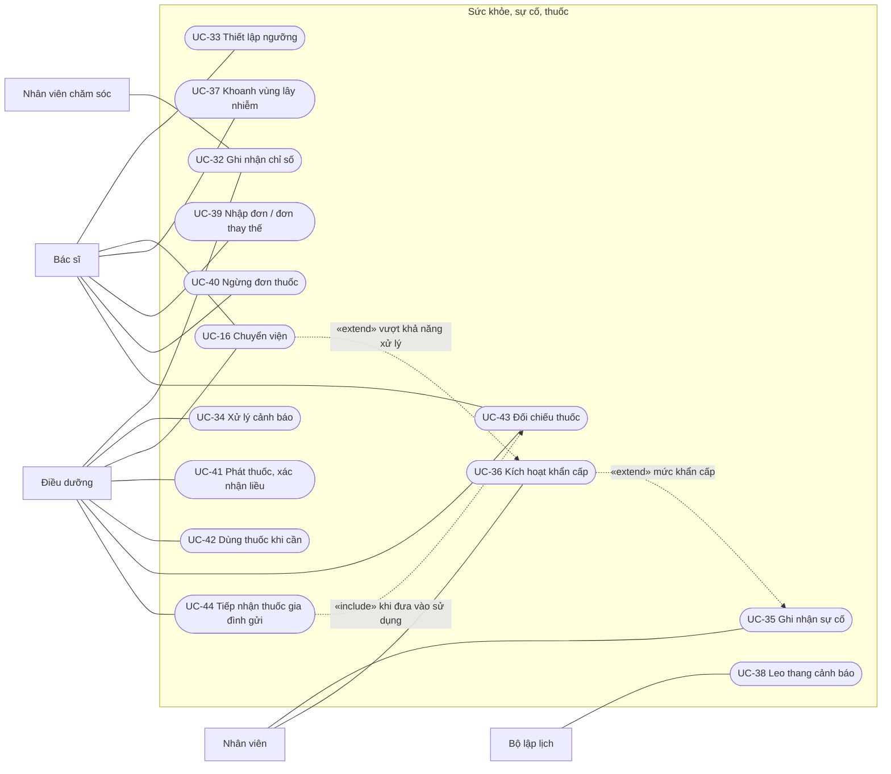

**D4 – Dinh dưỡng, nhân sự, ca và bàn giao**

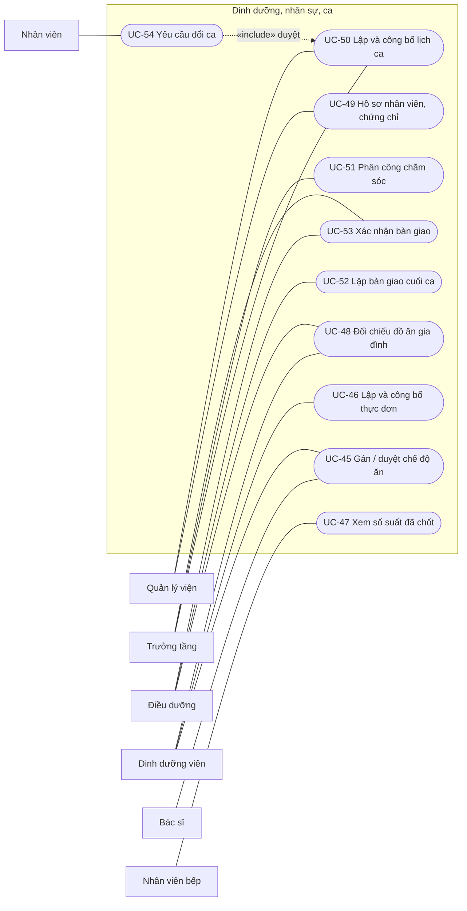

**D5 – Người thân, chi phí, đồ gửi và quản trị**

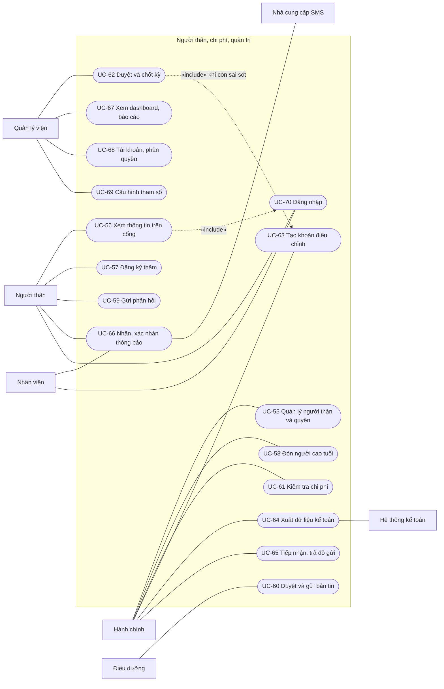

### 4.4. Permission Matrix

Ký hiệu: **C** cấu hình; **T** thực hiện; **D** duyệt; **X** xem; **P** xem trong phạm vi được phân công; **—** không có quyền. Mọi quyền của nhân viên còn bị giới hạn bởi phạm vi dữ liệu và điều kiện pháp lý (BR-M15-01); ma trận này là quyền tối đa của vai trò.

Viết tắt cột: QL Quản lý viện, TT Trưởng tầng, BS Bác sĩ, ĐD Điều dưỡng, CS Nhân viên chăm sóc, DDV Dinh dưỡng viên, Bếp Nhân viên bếp, VS Nhân viên vệ sinh, HC Hành chính, NT Người thân.

| Chức năng                           | Use case          | QL   | TT   | BS   | ĐD  | CS  | DDV | Bếp | VS  | HC  | NT  |
| ----------------------------------- | ----------------- | ---- | ---- | ---- | --- | --- | --- | --- | --- | --- | --- |
| Hồ sơ người cao tuổi                | UC-01, 02         | X    | P    | X    | P   | P   | P   | —   | —   | T   | X   |
| Bản đồng ý chia sẻ dữ liệu          | UC-03             | X    | —    | —    | —   | —   | —   | —   | —   | T   | X   |
| Dị ứng, bệnh nền                    | UC-04             | X    | P    | T    | T   | P   | X   | —   | —   | —   | X¹  |
| Đánh giá, quy đổi mức chăm sóc      | UC-05, 06         | X    | P    | T, D | T   | —   | —   | —   | —   | —   | —   |
| Tiếp nhận, hợp đồng, đặt cọc        | UC-08, 09, 11, 12 | X    | —    | —    | —   | —   | —   | —   | —   | T   | X   |
| Danh sách chờ, điểm ưu tiên         | UC-10             | D    | —    | —    | —   | —   | —   | —   | —   | T   | —   |
| Yêu cầu thay đổi lưu trú            | UC-13, 14         | D    | —    | T    | —   | —   | —   | —   | —   | T   | T²  |
| Tạm vắng, trở về                    | UC-15             | D    | T    | —    | X   | —   | —   | —   | —   | T   | X   |
| Kết thúc lưu trú, qua đời           | UC-17, 18         | D    | —    | T    | —   | —   | —   | —   | —   | T   | X   |
| Cấu hình phòng, giường              | UC-19             | C    | X    | —    | —   | —   | —   | —   | —   | X   | —   |
| Phân bổ, chuyển giường              | UC-20, 21         | X    | T    | —    | —   | —   | —   | —   | —   | T   | —   |
| Kế hoạch chăm sóc                   | UC-22, 23         | X    | X    | D    | T   | P   | —   | —   | —   | —   | —   |
| Checklist, ghi nhận công việc       | UC-25, 26         | X    | T    | —    | T   | T   | —   | —   | T   | —   | —   |
| Xử lý việc quá hạn                  | UC-27             | X    | T    | —    | —   | —   | —   | —   | —   | —   | —   |
| Hoạt động, ngoài viện               | UC-29, 30         | X    | T    | —    | —   | T   | —   | —   | —   | —   | X   |
| Kiểm tra chất lượng                 | UC-31             | X    | T    | —    | —   | —   | —   | —   | —   | —   | —   |
| Chỉ số sức khỏe                     | UC-32             | X    | P    | X    | T   | T   | —   | —   | —   | —   | X¹  |
| Ngưỡng cảnh báo                     | UC-33             | X    | —    | T    | X   | —   | —   | —   | —   | —   | —   |
| Xử lý cảnh báo                      | UC-34             | X    | T    | T    | T   | X   | —   | —   | —   | —   | —   |
| Sự cố, khẩn cấp                     | UC-35, 36         | X    | T    | T    | T   | T   | T   | T   | T   | T   | X¹  |
| Khoanh vùng lây nhiễm               | UC-37             | T    | X    | T    | X   | —   | —   | —   | —   | X   | —   |
| Đơn thuốc                           | UC-39, 40         | X    | —    | T³   | T⁴  | —   | —   | —   | —   | —   | X¹  |
| Phát thuốc, thuốc khi cần           | UC-41, 42         | X    | X    | X    | T   | —   | —   | —   | —   | —   | —   |
| Đối chiếu thuốc, thuốc gia đình gửi | UC-43, 44         | X    | —    | T    | T   | —   | —   | —   | —   | —   | X   |
| Chế độ ăn, thực đơn                 | UC-45, 46         | X    | —    | D    | X   | —   | T   | X   | —   | —   | X   |
| Suất ăn đã chốt                     | UC-47             | X    | —    | —    | —   | —   | X   | X   | —   | —   | —   |
| Hồ sơ nhân viên, chứng chỉ          | UC-49             | T    | X    | —    | —   | —   | —   | —   | —   | —   | —   |
| Lịch ca, phân công                  | UC-50, 51         | T, D | T, D | P    | P   | P   | P   | P   | P   | P   | —   |
| Bàn giao ca                         | UC-52, 53         | X    | T    | X    | T   | X   | —   | —   | —   | —   | —   |
| Yêu cầu đổi ca                      | UC-54             | X    | D    | T    | T   | T   | T   | T   | T   | T   | —   |
| Người thân và quyền                 | UC-55             | D    | —    | —    | —   | —   | —   | —   | —   | T   | T²  |
| Đăng ký thăm, đón                   | UC-57, 58         | X    | X    | —    | —   | —   | —   | —   | —   | T   | T   |
| Phản hồi, khiếu nại                 | UC-59             | D    | T    | —    | T   | —   | —   | —   | —   | T   | T   |
| Bản tin định kỳ                     | UC-60             | X    | X    | —    | T   | —   | —   | —   | —   | —   | X   |
| Chi phí, khoản điều chỉnh           | UC-61, 63         | D    | —    | —    | —   | —   | —   | —   | —   | T   | X   |
| Chốt kỳ, xuất kế toán               | UC-62, 64         | D    | —    | —    | —   | —   | —   | —   | —   | T   | —   |
| Đồ gửi                              | UC-65             | X    | X    | —    | T   | —   | —   | —   | —   | T   | X   |
| Dashboard, báo cáo                  | UC-67             | X    | P    | P    | P   | —   | —   | —   | —   | P   | —   |
| Tài khoản, phân quyền, tham số      | UC-68, 69         | C    | —    | —    | —   | —   | —   | —   | —   | —   | —   |

¹ Chỉ khi có bản đồng ý chia sẻ dữ liệu đang hiệu lực bao gồm người thân đó (BR-M01-08). ² Chỉ người đại diện; thao tác là gửi yêu cầu hoặc xác nhận, không trực tiếp thay đổi. ³ Kê đơn nội bộ chỉ khi cơ sở và bác sĩ có giấy phép còn hiệu lực (BR-M06-05); nếu không, chỉ nhập đơn từ cơ sở bên ngoài. ⁴ Chỉ nhập đơn đã được kê tại cơ sở y tế bên ngoài, bắt buộc có thông tin cơ sở kê (BR-M07-05).
